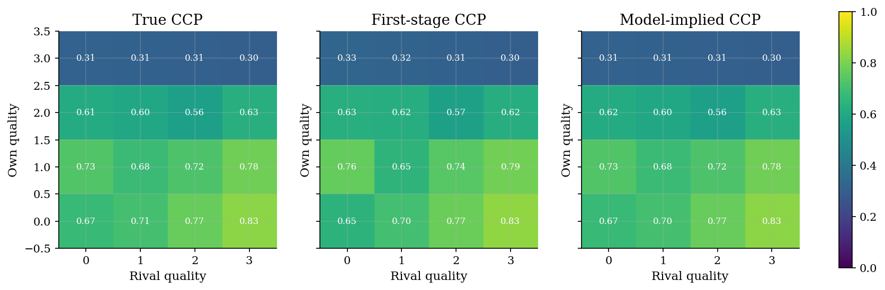
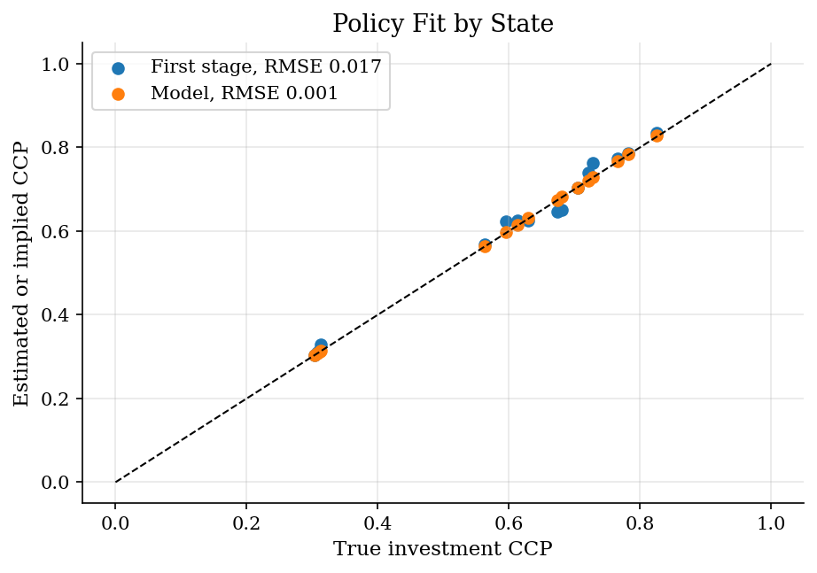
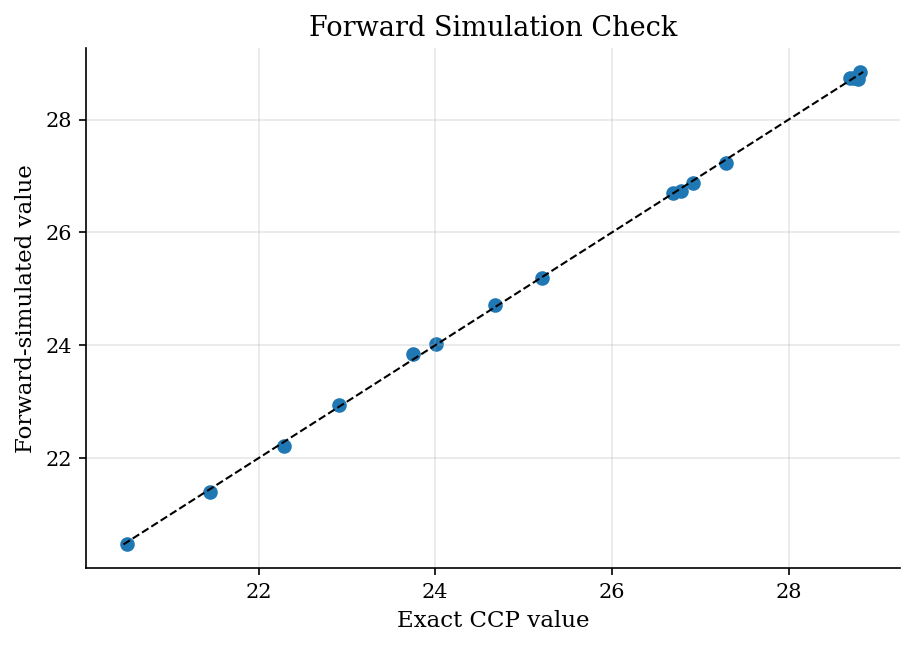

# Quality-Ladder Dynamic Game: Estimating with CCPs

## Overview

Two firms invest to climb a product-quality ladder. A laggard may spend to catch up. A leader may save the investment cost.

The object is the payoff vector: the value of quality, the cost of investment, and the catch-up incentive. The data contain firm qualities and investment choices.

A likelihood needs continuation values because today's investment changes tomorrow's state. The CCP estimator first estimates investment rates by state. It then evaluates values under those policies, instead of solving a new MPE at each trial parameter.

## Equations

The firm-view state is $\omega=(q_i,q_j)$, where $q_i$ is own quality and
$q_j$ is rival quality. Both qualities lie on the four-rung ladder
$\{0,1,2,3\}$. Firm $i$ chooses $a_i\in\{0,1\}$, where one means invest.
Flow payoff is

$$\pi_i(\omega,a_i;\theta) = \theta_q q_i - \theta_c a_i + \theta_g \max\{q_j-q_i,0\} a_i .$$

The gap term raises the investment payoff when the rival leads.

First-stage CCPs estimate the state-specific investment rate
$p(\omega)=\Pr(a_i=1\mid \omega)$. Holding CCPs fixed gives a policy transition
$\hat P$ and expected flow payoff $\bar\pi_\theta(\omega;\hat p)$. The logit
action shock is integrated out. The value under the first-stage policy is

$$W_\theta = \bar\pi_\theta(\hat p) + \beta \hat P W_\theta.$$

Choice-specific values use the rival's first-stage CCP and $W_\theta$:

$$v_\theta(a_i,\omega) = \pi_i(\omega,a_i;\theta) + \beta E_{\hat p_j}\left[W_\theta(\omega')\mid \omega,a_i\right].$$

The second-stage pseudo likelihood scores observed investment choices, where
$d_{it}\in\{0,1\}$ is the observed investment indicator for firm $i$ at period
$t$ and $\Lambda(\cdot)$ is the logistic CDF:

$$\ell(\theta)=\sum_{i,t} d_{it}\log \Lambda[v_\theta(1,\omega_{it})-v_\theta(0,\omega_{it})] +(1-d_{it})\log\{1-\Lambda[v_\theta(1,\omega_{it})-v_\theta(0,\omega_{it})]\}.$$

## Model Setup

| Object | Value | Role |
|--------|-------|------|
| Firms | 2 | Symmetric competitors observed as own-rival state pairs |
| Quality rungs | 0 to 3 | Product-quality ladder used as the dynamic state |
| Discount factor | 0.90 | Weight on future market position |
| True $\theta_q$ | 0.70 | Value of own quality |
| True $\theta_g$ | 0.40 | Catch-up incentive when the rival leads |
| True $\theta_c$ | 1.00 | Investment cost |
| Markets | 1,000 | Independent simulated two-firm markets |
| Periods | 30 | Panel length used for first-stage CCPs |

## Solution Method

The code solves the soft MPE once to create data with known truth.

Estimation then treats the first-stage CCPs as future play. For each candidate payoff vector, it evaluates the value of following those policies. The resulting invest and no-invest values enter a logit likelihood.

```text
Algorithm: CCP forward-value estimation for the quality ladder game
Input: panel of qualities and investment choices, transition law, beta
First stage:
  Estimate p_hat(omega)=Pr(invest | omega) from state frequencies with smoothing
Second stage for each candidate theta:
  Build the transition matrix induced by p_hat for the two firms
  Solve W_theta = expected_flow_theta(p_hat) + beta P_hat W_theta
  Compute invest and no-invest values using W_theta and rival p_hat
  Score the observed investment choices with the logit likelihood
Output: payoff estimates and policy fit
```

The first-stage CCPs describe how rivals move. The second stage changes payoffs while holding those policies fixed. Each likelihood evaluation is a linear policy-evaluation solve, not a new equilibrium solve.

## Results

The heatmaps show the investment pattern. Firms invest more when the rival is ahead. Top-quality firms invest less because current quality already pays. The model-implied CCPs smooth empirical frequencies through the payoff vector.

Rows are own quality and columns are rival quality.



Policy fit matters because the likelihood uses state-level investment probabilities. The model-implied RMSE against truth is **0.001**. The first-stage empirical RMSE is **0.017**.

Known truth makes it possible to separate first-stage sampling error from second-stage structural fit.



Forward values connect observed policies to dynamic payoffs. Exact policy evaluation and Monte Carlo forward simulation target the same values. The simulation RMSE is **0.045** with 1,000 paths per state and a 70-period horizon.

The check compares matrix policy evaluation with simulated paths under the same CCPs.



The estimates match the data-generating payoffs.

**Known-truth parameter recovery**

| Parameter               |   True |   Estimate |    Error |
|:------------------------|-------:|-----------:|---------:|
| Quality value theta_q   |    0.7 |    0.70387 |  0.00387 |
| Gap incentive theta_g   |    0.4 |    0.40502 |  0.00502 |
| Investment cost theta_c |    1   |    0.99885 | -0.00115 |

The synthetic panel comes from one equilibrium solve. Estimation then uses CCPs and forward values.

**Computation and estimator diagnostics**

| Diagnostic                    |           Value |
|:------------------------------|----------------:|
| Truth MPE converged           |      1          |
| Truth MPE iterations          |    591          |
| Second-stage success          |      1          |
| Second-stage iterations       |     72          |
| Second-stage log likelihood   | -37238.2        |
| First-stage policy RMSE       |      0.0170873  |
| Model policy RMSE             |      0.00135434 |
| Forward simulation value RMSE |      0.0450165  |
| Firm-period observations      |  60000          |

## Takeaway

In this quality game, empirical investment rates show where firms try to catch up.

CCP estimation turns those rates into continuation values and a choice likelihood. The second stage recovers payoffs without solving a new MPE for every parameter guess.

## References

- [Aguirregabiria, V. and Mira, P. (2007). Sequential Estimation of Dynamic Discrete Games. *Econometrica*, 75(1), 1-53.](https://doi.org/10.1111/j.1468-0262.2007.00731.x)
- [Bajari, P., Benkard, C. L., and Levin, J. (2007). Estimating Dynamic Models of Imperfect Competition. *Econometrica*, 75(5), 1331-1370.](https://doi.org/10.1111/j.1468-0262.2007.00796.x)
- [Pesendorfer, M. and Schmidt-Dengler, P. (2008). Asymptotic Least Squares Estimators for Dynamic Games. *Review of Economic Studies*, 75(3), 901-928.](https://doi.org/10.1111/j.1467-937X.2008.00496.x)
