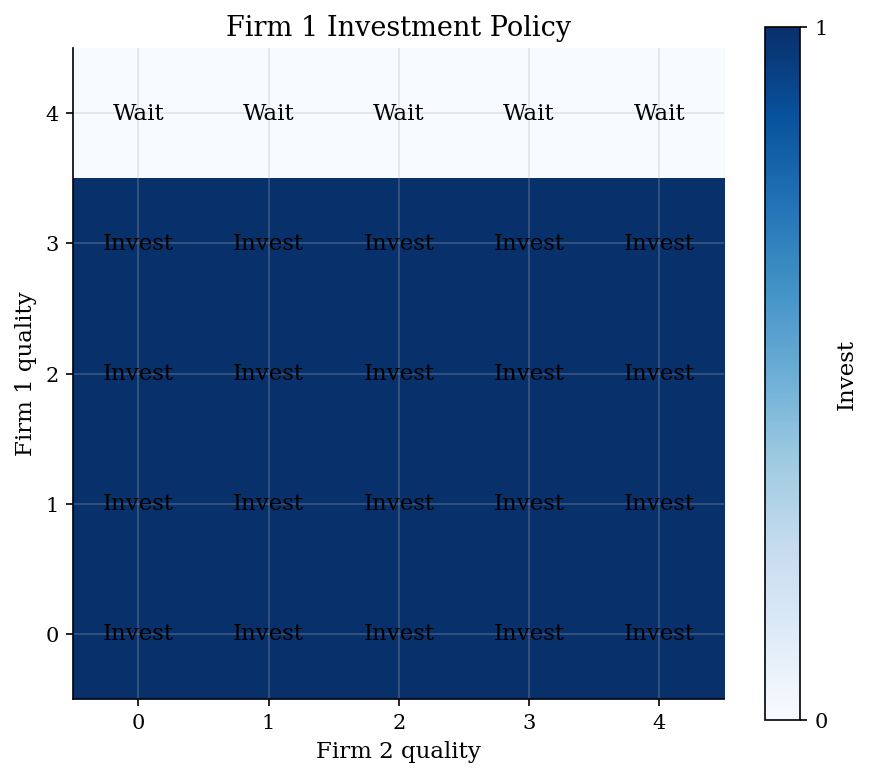
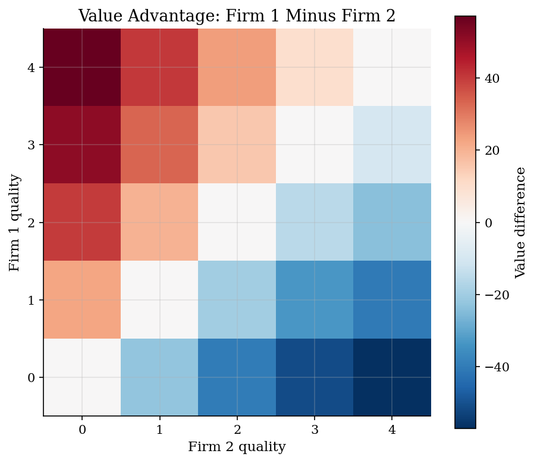
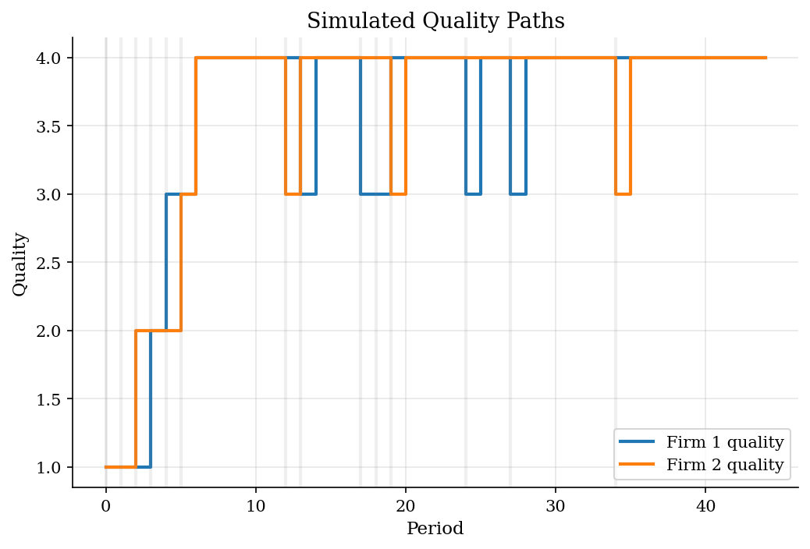

# Quality Investment in Dynamic Oligopoly

> Markov-perfect policies for a quality-ladder rivalry.

## Overview

Two firms sell differentiated products whose quality carries over. A firm can invest today to raise tomorrow's quality, while its rival moves too.

The model is a two-firm Ericson-Pakes quality ladder. The state is the pair of quality levels. The policy maps each state into wait or invest.

The policy needs a fixed point. Today's best response uses tomorrow's value, and tomorrow's value depends on today's equilibrium actions.

## Equations

Let the industry state be the quality pair
$\omega_t=(q_{1t},q_{2t})$, with $q_{it}\in\{0,\ldots,Q\}$.
Each firm chooses $a_{it}\in\{0,1\}$, where $a_{it}=1$ means invest.
Flow profit uses a logit-share reduced form:

$$
\pi_i(q_i,q_j)
= M\frac{\exp(\eta q_i)}
{1+\exp(\eta q_i)+\exp(\eta q_j)}
+\lambda q_i .
$$

Investment raises the chance of moving one rung up the ladder. Waiting avoids
the investment cost but leaves a small depreciation risk:

$$
\Pr(q_i'=\min\{q_i+1,Q\}\mid q_i,a_i=1)=0.62,
\qquad
\Pr(q_i'=\max\{q_i-1,0\}\mid q_i,a_i=0)=0.12 .
$$

Given candidate continuation values $V_i$, each state contains a simultaneous
two-action game. Firm $i$'s payoff from action profile $(a_1,a_2)$ is

$$
G_i(a_i,a_j;\omega,V)
= \pi_i(\omega)-\kappa a_i
+\beta\sum_{\omega'} P(\omega'\mid \omega,a_i,a_j)V_i(\omega').
$$

A pure-strategy Markov-perfect equilibrium is a policy
$a^{\ast}(\omega)=(a_1^{\ast}(\omega),a_2^{\ast}(\omega))$ and values satisfying

$$
G_i(a_i^{\ast},a_j^{\ast};\omega,V)\geq G_i(a_i,a_j^{\ast};\omega,V)
\quad\text{for all }a_i\in\{0,1\},
$$

with $V_i(\omega)=G_i(a_i^{\ast},a_j^{\ast};\omega,V)$ at every state.

## Model Setup

| Primitive | Value | Role |
|-----------|-------|------|
| Firms | 2 | Symmetric oligopolists |
| Quality ladder | $q_i=0,\ldots,4$ | Payoff-relevant industry state |
| Actions | $a_i\in\{0,1\}$ | Wait or invest |
| Discount factor | $\beta=0.90$ | Continuation-value weight |
| Investment cost | $\kappa=2.20$ | Current cost of attempting to improve quality |
| Market size | $M=14$ | Scale of current profits |
| Quality in demand | $\eta=0.75$ | How quality shifts product share |
| Direct quality payoff | $\lambda=0.35$ | Extra payoff from own quality |
| Equilibrium concept | Pure-strategy MPE | Nash equilibrium in each state game |

## Solution Method

The fixed point is over Markov strategies. Start with values for each firm at each quality pair. At one state, those values define a two-by-two game. Payoffs combine current profit, investment cost, and expected continuation value. Solve that state game, update values, and repeat.

```text
Inputs: quality cap Q, discount factor beta, investment cost kappa,
        transition kernel P(q' | q, a), tolerance epsilon
Initialize V_i^0(q_1,q_2)=0 for both firms and all quality pairs.
For n = 0,1,2,...:
  For each state omega=(q_1,q_2):
    Build G_i^n(a_1,a_2; omega) from profit, cost, and continuation value.
    Find pure Nash equilibria of the 2-by-2 state game.
    Select the equilibrium with the largest joint payoff if there is a tie.
    Set T_i V^n(omega) equal to the selected equilibrium payoff.
  Update V_i^{n+1} = lambda T_i V^n + (1-lambda) V_i^n.
  Stop when max_{i,omega} |T_i V^n(omega)-V_i^n(omega)| < epsilon.
Output: MPE policy a_i^{\ast}(omega), values V_i(omega), and deviation gains.
```

After convergence, compute one-step deviation gains. At the reported policy, every gain should be zero.

## Results

Firm 1 invests at every interior quality state. It waits at the top rung because the ladder cap binds.



The diagonal is symmetric. Off-diagonal states show the value of a quality lead. The lead affects current share and continuation value.



The simulation turns the policy into a stochastic industry path. Light vertical lines mark investment periods. Quality leadership persists, but depreciation and catch-up investment create turnover.



Symmetric states have symmetric values. States with a quality lead show a value advantage. Deviation gains are zero at the reported actions.

**Selected state policies, values, and deviation checks**

| State   | Firm 1 policy   | Firm 2 policy   |   Firm 1 value |   Firm 2 value |   Value advantage |   Max deviation gain |
|:--------|:----------------|:----------------|---------------:|---------------:|------------------:|---------------------:|
| (0,0)   | Invest          | Invest          |          60.03 |          60.03 |              0    |                    0 |
| (1,2)   | Invest          | Invest          |          58.87 |          78.59 |            -19.72 |                    0 |
| (2,1)   | Invest          | Invest          |          78.59 |          58.87 |             19.72 |                    0 |
| (4,4)   | Wait            | Wait            |          78.52 |          78.52 |              0    |                    0 |

## Takeaway

The quality-ladder game makes investment rivalry a state-transition problem. The computed policy maps quality states into actions and continuation values. In this calibration, firms invest until the cap binds. Off-diagonal states show why a quality lead is valuable.

## References

- Ericson, R., and Pakes, A. (1995). Markov-Perfect Industry Dynamics. *Review of Economic Studies*, 62(1), 53-82.
- Pakes, A., and McGuire, P. (1994). Computing Markov-Perfect Nash Equilibria. *RAND Journal of Economics*, 25(4), 555-589.
- Lecture 17 Slides 2023: Dynamic games and the Ericson-Pakes framework.
