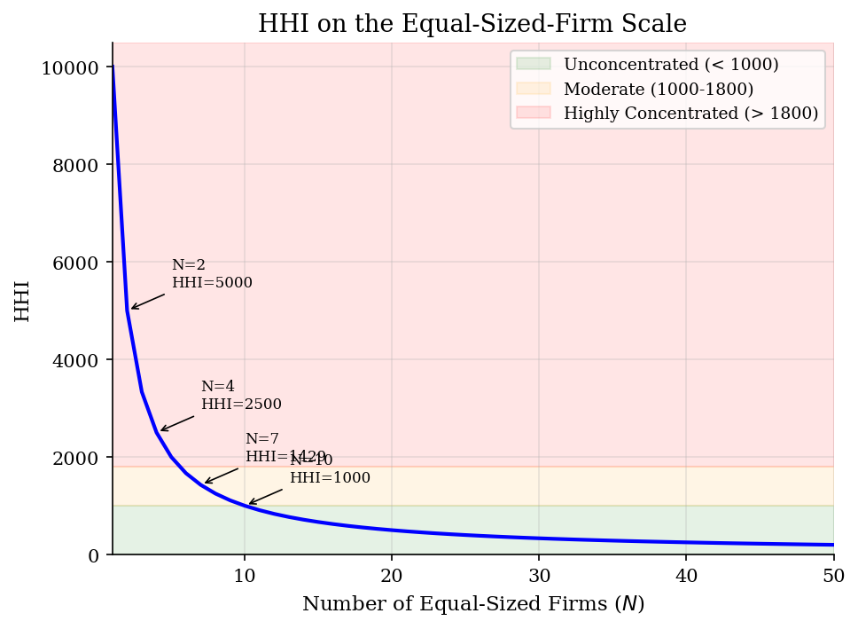
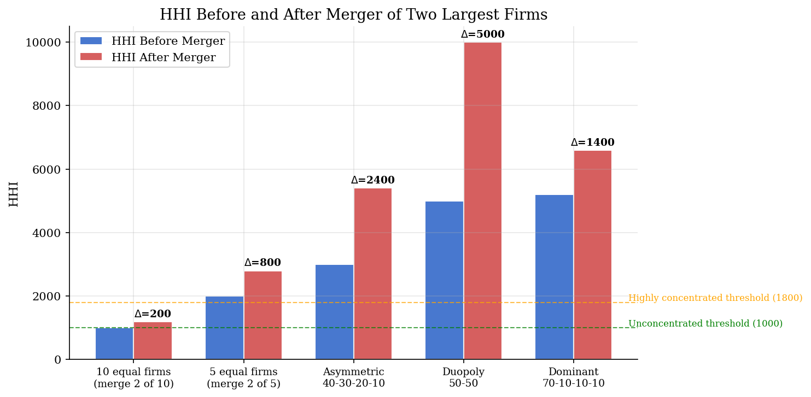

# Market Concentration Screens with HHI

> HHI turns firm shares into a fast antitrust screen. Pricing effects require a demand and ownership model.

## Overview

An antitrust screen often starts with a sales table. Suppose two large firms in a snack market propose to merge. The first question is how concentrated sales control would be after the ownership change.

HHI is the object. It squares firm shares, sums them, and reports concentration on a 0 to 10,000 scale. The effective-firms number turns the same index into a symmetric-firm count.

The computation aggregates product sales to owners, computes HHI, and applies the merger arithmetic. Prices need more structure, so the final example solves a small Bertrand pricing system.

## Equations

Let firms be indexed by $f=1,\ldots,F$, with market shares $s_f$ measured as
fractions that sum to one. The Herfindahl-Hirschman Index is

$$
\text{HHI}=10{,}000\sum_{f=1}^{F}s_f^2.
$$

The associated effective number of equal-sized firms is

$$
N_{\text{eff}}=\frac{1}{\sum_f s_f^2}=\frac{10{,}000}{\text{HHI}}.
$$

An HHI of 2,000 matches five symmetric firms. Actual firm count can differ.

If firms $a$ and $b$ merge while all quantities are held fixed, the arithmetic
change is

$$
\Delta\text{HHI}
=10{,}000[(s_a+s_b)^2-s_a^2-s_b^2]
=20{,}000 s_a s_b.
$$

For product-level data, product $j$ belongs to firm $f(j)$ and sells quantity
$q_j$. The screen first aggregates products to the firm that controls them:

$$
s_f=\frac{\sum_{j:f(j)=f}q_j}{\sum_{\ell}q_{\ell}}.
$$

The small pricing comparison uses linear differentiated-products demand,

$$
q(p)=a+Dp,\qquad D_{jj}=\alpha<0,\quad D_{jk}=\beta\geq 0\ (j\neq k).
$$

Let $\Omega_{jk}=1$ if products $j$ and $k$ are commonly owned. Bertrand-Nash
prices satisfy

$$
q(p)+(\Omega\circ D^\top)(p-c)=0.
$$

The 2023 DOJ/FTC Merger Guidelines treat HHI above 1,800 as highly
concentrated. An HHI increase above 100 points is significant for the structural
presumption. Below 1,000 is unconcentrated. Between 1,000 and 1,800 is
moderately concentrated. Those thresholds describe concentration, not a full
price effect.

## Model Setup

The examples use stylized share vectors. They show how firm count and asymmetry enter the same index.

The pricing comparison uses four products. Initially each product has a separate owner. The merger puts products 1 and 2 under common ownership.

| Object | Value | Role |
|--------|-------|------|
| $F$ | 1 to 100 | Firm counts for the symmetric HHI benchmark |
| $s_f$ | Several share vectors | Firm shares used in the concentration table |
| Products | 4 | Two high-demand products and two lower-demand products |
| $\alpha$ | -1.0 | Own-price slope in linear demand |
| $\beta_{\text{seg}}$ | 0.0 | No cross-price substitution |
| $\beta_{\text{diff}}$ | 0.1 | Positive cross-price substitution |
| Merger | products 1 and 2 | Same ownership change in both demand environments |

## Solution Method

Start from the sales shares that appear in a merger screen. Aggregate ownership and compute the concentration index.

For prices, build the ownership matrix and solve the Bertrand first-order conditions.

```text
Inputs: firm shares s, product quantities q, costs c, demand slopes D, ownership f(j)
Outputs: HHI, effective firm count, delta-HHI, equilibrium prices

1. For each market, compute HHI = 10000 * sum_f s_f^2.
2. Report N_eff = 10000 / HHI to put asymmetric markets on a symmetric scale.
3. For a candidate merger (a,b), compute delta-HHI = 20000 * s_a * s_b.
4. In product data, aggregate q_j to firm shares using the ownership map f(j).
5. Build Omega_jk = 1[f(j) = f(k)].
6. Solve q(p) + (Omega .* D') (p - c) = 0 for Bertrand-Nash prices.
7. Recompute firm shares and HHI under the post-merger ownership map.
```

HHI uses ownership shares and fixed quantities. Price effects appear only after the model adds substitution, costs, and pricing conditions.

## Results

The screen and pricing model answer different questions. In the segmented case, the merged products are independent. Prices and total quantity are unchanged.

HHI still jumps because the two product shares now have one owner. With cross-price substitution, common ownership changes pricing. The merged products become more expensive.

| Demand environment | HHI before | HHI after | $\Delta$HHI | Merged-price change | Total-output change |
|---|---:|---:|---:|---:|---:|
| Segmented ($\beta=0.0$) | 3125 | 5937 | 2812 | 0.00% | 0.00% |
| Differentiated ($\beta=0.1$) | 2600 | 4288 | 1688 | 1.69% | -2.61% |

For symmetric firms, HHI is exactly $10{,}000/N$. Moving from monopoly to five equal firms does most of the index movement: HHI falls from 10,000 to 2,000. The 1,800 threshold corresponds to about 5.6 equal-sized firms.



The merger bars are pure index arithmetic. The same formula, $20{,}000 s_a s_b$, makes a 40-30 merger much larger than a merger of two small firms. That scale helps explain why agencies use HHI before estimating demand.



The effective firm count makes asymmetry visible. A 70-10-10-10 market has four firms, but its HHI of 5,200 is equivalent to fewer than two equal-sized firms. Firm count alone would miss that concentration.

**HHI for Example Market Structures**

| Market Structure                |   N Firms |   Top Share (%) |   HHI |   Effective N | Classification          |
|:--------------------------------|----------:|----------------:|------:|--------------:|:------------------------|
| Perfect competition (100 firms) |       100 |               1 |   100 |        100    | Unconcentrated          |
| 10 equal firms                  |        10 |              10 |  1000 |         10    | Moderately Concentrated |
| 5 equal firms                   |         5 |              20 |  2000 |          5    | Highly Concentrated     |
| Asymmetric (40-30-20-10)        |         4 |              40 |  3000 |          3.33 | Highly Concentrated     |
| Duopoly (50-50)                 |         2 |              50 |  5000 |          2    | Highly Concentrated     |
| Dominant firm (70-10-10-10)     |         4 |              70 |  5200 |          1.92 | Highly Concentrated     |
| Near-monopoly (90-5-5)          |         3 |              90 |  8150 |          1.23 | Highly Concentrated     |
| Monopoly                        |         1 |             100 | 10000 |          1    | Highly Concentrated     |

## Takeaway

HHI is transparent: it converts ownership shares into a concentration number and gives a closed-form delta for mergers. Ownership aggregation can raise HHI even when the demand model implies no price effect. Once products substitute, the same ownership change moves prices through the Bertrand FOC.

## References

- U.S. Department of Justice & Federal Trade Commission (2023). *Merger Guidelines*.
- Tirole, J. (1988). *The Theory of Industrial Organization*. MIT Press, Ch. 5.
