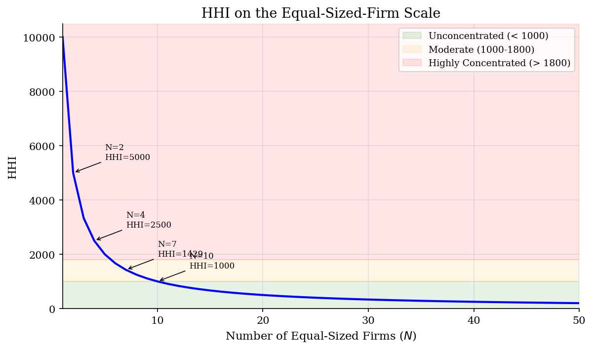
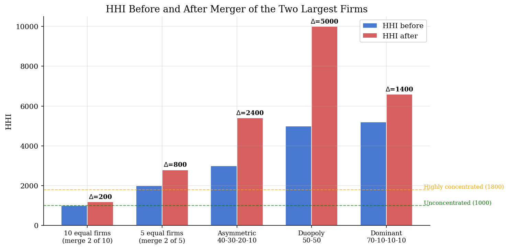
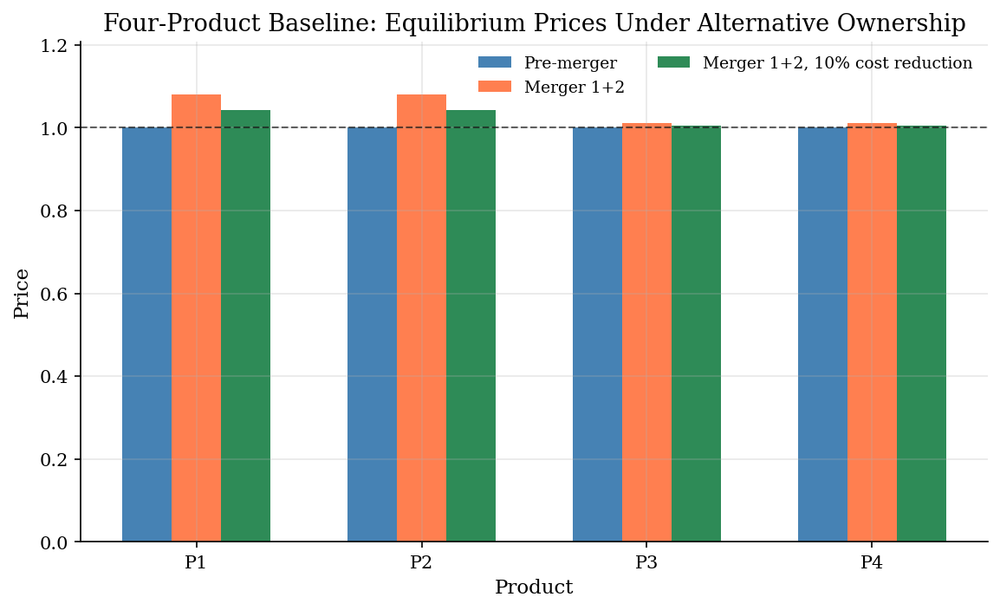
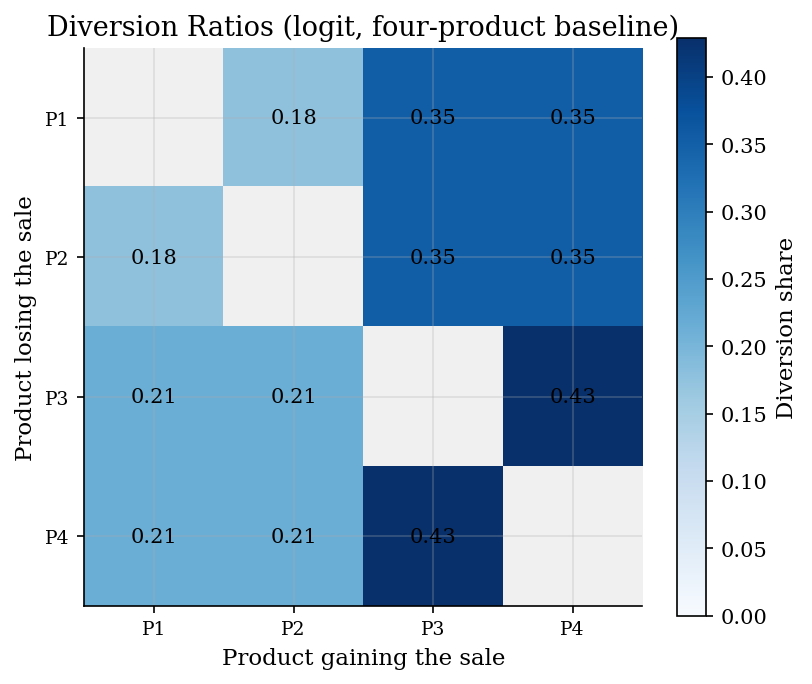

# Merger Pricing: Concentration Screens, Diversion, and Bertrand-Nash Equilibrium

## Overview

A horizontal merger between close substitutes raises three questions in order. How concentrated is the market already? What happens to prices once two products share an owner? Does the price answer survive a different assumption about how customers substitute?

The first question is fast. HHI and delta-HHI come straight off the sales table. They use ownership shares and nothing else.

The second question needs structure. We calibrate logit demand from one observed margin. Then we change the ownership matrix and resolve the Bertrand-Nash pricing FOC for new prices.

The third question is harder. Different demand systems can match the same observed market and still disagree about counterfactual prices. We calibrate three of them. We compute UPP, GUPPI, and CMCR screens at observed prices, solve full post-merger equilibria, and ask how much marginal-cost reduction would offset the price effect.

The same logic threads the three layers. Two competitors come under one owner. The owner now internalizes diversion between them. Whether prices rise, and by how much, depends on substitution to rivals, the outside option, and any cost savings the merger brings.

## Equations

The three layers stack on the same observed market.

### A. Concentration screens

Let firms be indexed by $f=1,\ldots,F$ with market shares $s_f$ summing to one.
The Herfindahl-Hirschman Index is

$$\text{HHI}=10{,}000\sum_{f=1}^{F}s_f^2.$$

The associated effective number of equal-sized firms is

$$N_{\text{eff}}=\frac{1}{\sum_f s_f^2}=\frac{10{,}000}{\text{HHI}}.$$

If firms $a$ and $b$ merge while quantities are held fixed,

$$\Delta\text{HHI}=10{,}000\left[(s_a+s_b)^2-s_a^2-s_b^2\right]=20{,}000\,s_a s_b.$$

Worked example. Take three firms with shares $(0.5, 0.3, 0.2)$. The HHI is
$10{,}000(0.25+0.09+0.04)=3{,}800$. The effective firm count is
$10{,}000/3{,}800\approx 2.63$, well under the three nominal firms. A merger of
firms 1 and 2 raises HHI by $20{,}000\cdot 0.5\cdot 0.3=3{,}000$ to $6{,}800$.
That moves the market well into the highly-concentrated band.

The 2023 DOJ/FTC Merger Guidelines treat HHI above 1,800 as highly concentrated.
A delta-HHI above 100 is significant for the structural presumption.

### B. Bertrand-Nash pricing with multi-product firms

There are $J$ inside products. Product $j$ has price $p_j$, marginal cost $c_j$,
quantity or share $q_j(p)$, and owner $f(j)$. The ownership matrix records
which products belong to the same firm:

$$\Omega_{jk}=\mathbf 1\{f(j)=f(k)\}.$$

Worked example. Take $J=4$ products with pre-merger owners $f^{\text{pre}}=(1,2,3,4)$,
so each product is its own single-product firm:

$$\Omega^{\text{pre}}=\begin{pmatrix}1&0&0&0\\0&1&0&0\\0&0&1&0\\0&0&0&1\end{pmatrix}.$$

Now firm 1 buys firm 2. The post-merger owners are $f^{\text{post}}=(1,1,3,4)$.
Products 1 and 2 share an owner. The off-diagonal entries that link them switch
on:

$$\Omega^{\text{post}}=\begin{pmatrix}1&1&0&0\\1&1&0&0\\0&0&1&0\\0&0&0&1\end{pmatrix}.$$

Those two new ones in the upper-left block are the entire merger as the model
sees it. Every price effect that follows is the consequence of switching them
on.

A multi-product Bertrand firm chooses each price to satisfy

$$0=q_j(p)+\sum_{k=1}^J \Omega_{jk}(p_k-c_k)\frac{\partial q_k(p)}{\partial p_j}, \qquad j=1,\ldots,J.$$

With $\Delta_{kj}(p)=\partial q_k(p)/\partial p_j$, the vector form is

$$q(p)+\underbrace{(\Omega\circ \Delta(p)^\top)}_{\text{within-firm price externality}}(p-c)=0.$$

Here $\circ$ is the element-wise (Hadamard) product. Multiplying by $\Omega$
knocks out cross-firm price externalities. Only co-owned products show up in
any one firm's markup equation. The merger flips entries of $\Omega$ from zero
to one. The FOCs then solve for new prices.

### C. Three demand systems

The same observed market can give very different counterfactual prices once we
change the demand curvature. We calibrate three demand systems. Each one matches
the observed shares and prices by construction. Linear and log-linear demand
carry a full $J\times J$ slope matrix, so they also reproduce the entire
observed margin vector exactly. Logit demand has a single price coefficient
$\alpha$. We pin it down from the average single-product margin condition and
recover marginal costs from the pre-merger FOC, so the logit FOC residual is
zero at calibration while its implied margins track the observed margins only
as closely as one coefficient allows.

Logit shares are

$$s_j^{L}(p)=\frac{\exp(\xi_j+\alpha p_j)}{1+\sum_{\ell=1}^J \exp(\xi_\ell+\alpha p_\ell)}, \qquad \alpha<0,$$

where $\xi_j$ is the mean indirect utility of product $j$ from non-price
characteristics. The closed-form Jacobian is

$$\Delta^{L}_{jk}=\alpha\,s_j(\mathbf 1\{j=k\}-s_k).$$

Opened element by element for $J=4$ this reads

$$\Delta^{L}=\alpha\begin{pmatrix}s_1(1-s_1)&-s_1 s_2&-s_1 s_3&-s_1 s_4\\-s_1 s_2&s_2(1-s_2)&-s_2 s_3&-s_2 s_4\\-s_1 s_3&-s_2 s_3&s_3(1-s_3)&-s_3 s_4\\-s_1 s_4&-s_2 s_4&-s_3 s_4&s_4(1-s_4)\end{pmatrix}.$$

The diagonal carries the own-price effect. Off-diagonals carry cross-price
effects. The whole matrix scales with $\alpha$.

Linear demand is

$$q_j^{A}(p)=a_j-\sum_{k=1}^J B_{jk}p_k, \qquad \Delta^{A}=-B,$$

so $\Delta^{A}$ does not depend on $p$. Here $a_j$ is the demand intercept and
$B_{jk}$ is the price-response matrix.

Log-linear demand is

$$\log q_j^{E}(p)=a_j^E+\sum_{k=1}^J E_{jk}\log p_k, \qquad \Delta^{E}_{jk}=q_j\,E_{jk}/p_k,$$

so the elasticities $E_{jk}$ are constant and the slopes scale with quantities
and inverse prices.

### D. Diversion ratios and screening metrics

The local diversion ratio from product $j$ to product $k$ is

$$D_{j\to k}=-\frac{\partial q_k(p)/\partial p_j}{\partial q_j(p)/\partial p_j}, \qquad j\neq k.$$

Under simple logit it collapses to $D_{j\to k}=s_k/(1-s_j)$ and depends only on
shares and the outside option.

For products that become newly co-owned after the merger,

$$\text{UPP}_j=\sum_{k:\Omega^{\text{post}}_{jk}=1,\ \Omega^{\text{pre}}_{jk}=0} D_{j\to k}(p_k-c_k),$$

with

$$\text{GUPPI}_j=\frac{\text{UPP}_j}{p_j}, \qquad \text{CMCR}_j=\frac{\text{UPP}_j}{c_j}.$$

GUPPI is a first-order screen evaluated at observed prices. It says how much
upward pricing pressure the merger generates locally. CMCR reports the
marginal-cost reduction that would offset that pressure at those same prices.
Neither metric clears the market. The simulation in Method 3 does. It solves
the full pricing system under post-merger ownership.

## Model Setup

Two market setups run in sequence. The first is a small four-product market. We calibrate logit demand from one observed margin. The second is a six-product market. We calibrate three demand systems against the full margin vector.

**Four-product baseline (Part B).**

| Object | Value | Role |
|--------|-------|------|
| Inside products | 4 | Four single-product firms before the merger |
| Inside shares | [0.15, 0.15, 0.30, 0.30] | Observed product shares |
| Outside share | 0.10 | No-purchase option |
| Prices | [1.00, 1.00, 1.00, 1.00] | Pre-merger prices |
| Margin (product 1) | 0.50 | Pins down the logit price coefficient |
| $\alpha$ | -2.3529 | Calibrated price sensitivity |
| Marginal costs | [0.50, 0.50, 0.39, 0.39] | Recovered from the pre-merger FOCs |
| Scenarios | merger 1+2; merger 1+2 with 10% cost reduction | Ownership and cost experiments |

**Six-product extended (Part C).**

| Parameter | Value | Description |
|-----------|-------|-------------|
| Products $J$ | 6 | 3 firms, 2 products each |
| Shares | [0.12, 0.10, 0.15, 0.13, 0.08, 0.07] | Pre-merger inside shares |
| Prices | [1.00, 1.20, 0.90, 1.10, 1.30, 1.40] | Pre-merger prices |
| Margins | [0.40, 0.35, 0.45, 0.40, 0.30, 0.28] | Price-cost margins by product |
| Outside share | 0.35 | Outside option in the logit demand system |
| $\alpha$ (logit) | -2.7556 | Calibrated price coefficient |
| Linear cross-slope ratio | 0.10 | Cross-slope relative to geometric mean own-slope |
| Log-linear cross elasticity | 0.15 | Maintained symmetric cross-price elasticity |
| Merger | Firm 1 buys Firm 2 | Products 1-4 move under common ownership |
| Benchmark | Post-merger Bertrand-Nash FOC | Equilibrium used to judge first-order screens |

## Solution Method

Three methods run in sequence. Each one answers a question the previous method cannot reach. The defining formulas all live in the Equations section. Here we reuse the same symbols inside the pseudocode.

### Method 1: HHI concentration screens

HHI squares the ownership shares. The largest firm dominates the index. Two small firms barely move it. So the merger increment cares only about the two merging shares, not about anyone else. There is nothing to iterate. The cost is linear in the firm count and the answer is exact.

```text
Inputs:  firm shares s = (s_1, ..., s_F), candidate merger pair (a, b)
Outputs: HHI, N_eff, delta-HHI, structural classification

1. HHI       = 10000 * sum_{f=1..F} s_f^2
2. N_eff     = 10000 / HHI
3. delta-HHI = 20000 * s_a * s_b
4. classify HHI:  < 1000        -> Unconcentrated
                  1000 to 1800  -> Moderate
                  > 1800        -> Highly Concentrated
```

The screen says nothing about prices. Two products that share an owner but do not substitute can move HHI without moving prices at all. Method 2 closes that gap.

### Method 2: Four-product Bertrand-Nash baseline (logit, single margin)

One product's margin is the whole calibration. The single-product FOC for product 1 pins down the price coefficient. The other marginal costs come from inverting the multi-product FOC at observed prices. Post-merger prices come from a Newton-type root finder on the FOC under the new ownership matrix. Convergence is locally quadratic when the warm-start sits close to the solution.

```text
Inputs:  shares s, prices p, margin m_1 on product 1, owners f^pre, f^post
Outputs: alpha, xi, mc, post-merger prices p^post and shares s^post

1. c_1   = p_1 * (1 - m_1)
2. alpha = -1 / [(1 - s_1) * (p_1 - c_1)]                  # single-product FOC
3. xi_j  = log(s_j / s_0) - alpha * p_j,    s_0 = 1 - sum_j s_j
4. mc    = p + (Omega^pre .* Delta(p)^T)^{-1} s            # multi-product FOC inversion
5. build Omega^post from f^post
6. solve  s(p) + (Omega^post .* Delta(p)^T) (p - mc) = 0   # fsolve, warm-start p^0 = 1.1 * p
7. (optional)  mc' = mc with merging-product entries scaled by (1 - eps); resolve
```

The root finder can fail when the warm-start is too far from the equilibrium or when the Jacobian is ill-conditioned. The implementation reports the FOC residual after each solve. A residual near machine precision confirms that the reported prices clear the system.

### Method 3: Six-product extension with three demand systems

Now we run the same pricing FOC across three demand systems. Each one matches the same observed shares and prices by construction; linear and log-linear demand also match the full observed margin vector, while logit matches margins only as closely as one price coefficient allows. Any disagreement on counterfactual prices is therefore curvature, not data. UPP, GUPPI, and CMCR are local screens evaluated at observed prices. The post-merger FOC adds rival reactions and pass-through. The efficiency frontier sweeps a cost-reduction grid and re-solves at each step, warm-starting each solve from the previous one. That keeps the path monotone and the iteration count low.

```text
Inputs:  shares s, prices p, margins m, owners f^pre, f^post
Outputs: per-system screens, post-merger prices, welfare, efficiency frontier

1. for each demand system d in {L (logit), A (linear), E (log-linear)}:
     a. fit theta_d so that q_d(p; theta_d) = s
     b. mc_d   = p + (Omega^pre .* Delta_d(p)^T)^{-1} q_d(p)         # FOC inversion
     c. D_d[j, k] = -Delta_d[k, j] / Delta_d[j, j],   j != k         # diversion
     d. for each j newly co-owned:
          UPP_j   = sum_{k newly co-owned} D_d[j, k] * (p_k - mc_d,k)
          GUPPI_j = UPP_j / p_j,    CMCR_j = UPP_j / mc_d,j
     e. solve  q_d(p^post) + (Omega^post .* Delta_d(p^post)^T)
                              * (p^post - mc_d) = 0                 # fsolve
     f. dCS_d = CS_d(p^post) - CS_d(p),    dPS_d = PS_d(p^post) - PS_d(p)

2. for eps in {0, 0.005, ..., 0.6}:
     mc_eff      = mc_d with merging-product entries scaled by (1 - eps)
     p^post(eps) = solve post-merger FOC with mc_d replaced by mc_eff
                   (warm-start from previous eps)
     record  avg_dp(eps) = mean over j in {1..4} of (p^post_j(eps) - p_j) / p_j

3. eps* = first zero of avg_dp(eps)         # break-even cost reduction
```

Log-linear demand can drive prices negative during root-finder iterations. We solve in log-price space to keep prices positive at every step. Linear demand can return negative quantities at extreme prices, so we clip at a small positive value. Both safeguards leave the equilibrium unchanged where the unmodified solver also converges.

FOC residuals after calibration: four-product baseline 5.6e-17; six-product extended (logit 2.8e-17, linear 2.8e-17, log-linear 2.8e-17). All calibrations reproduce the observed pricing conditions to numerical precision.

## Results

### Part 1: Concentration screens

A sales table tells us how concentrated ownership already is. It also tells us how much a candidate merger would shift the index. The HHI-vs-firms curve below puts symmetric and asymmetric markets on the same scale. The delta-HHI bars show how merger arithmetic depends on the absolute size of the merging shares.

For symmetric firms, HHI is exactly $10{,}000/N$. Most of the index movement happens between monopoly and five equal firms. The highly-concentrated threshold of 1,800 lines up with about 5.6 equal-sized firms.



The merger bars are pure index arithmetic. The same formula, $20{,}000\,s_a s_b$, makes a 40-30 merger far larger than a merger of two small firms. That scale is why agencies reach for HHI before estimating demand.



The effective firm count exposes asymmetry. A 70-10-10-10 market has four firms. Its HHI of 5,200 is equivalent to fewer than two equal-sized firms.

**HHI for example market structures**

| Market Structure                |   N Firms |   Top Share (%) |   HHI |   Effective N | Classification          |
|:--------------------------------|----------:|----------------:|------:|--------------:|:------------------------|
| Perfect competition (100 firms) |       100 |               1 |   100 |        100    | Unconcentrated          |
| 10 equal firms                  |        10 |              10 |  1000 |         10    | Moderately Concentrated |
| 5 equal firms                   |         5 |              20 |  2000 |          5    | Highly Concentrated     |
| Asymmetric (40-30-20-10)        |         4 |              40 |  3000 |          3.33 | Highly Concentrated     |
| Duopoly (50-50)                 |         2 |              50 |  5000 |          2    | Highly Concentrated     |
| Dominant firm (70-10-10-10)     |         4 |              70 |  5200 |          1.92 | Highly Concentrated     |
| Near-monopoly (90-5-5)          |         3 |              90 |  8150 |          1.23 | Highly Concentrated     |
| Monopoly                        |         1 |             100 | 10000 |          1    | Highly Concentrated     |

### Part 2: Four-product baseline

Concentration says nothing about prices. We need a calibrated demand system to talk about counterfactual prices. The simplest useful case is logit demand on a four-product market with one observed margin. The merger puts products 1 and 2 under one owner. Products 3 and 4 stay outside the deal.

Once products 1 and 2 share an owner, that owner raises both prices. A lost sale to the partner product is no longer fully lost. The 10% cost cut mutes the price increase but does not erase it. Products 3 and 4 also rise as rivals best-respond.



Each row is the product losing a marginal sale. Each column is the product that absorbs it. Under logit, larger-share products absorb more diverted sales from every other product. The merger changes pricing through this matrix.



Average prices and inside share by scenario. The FOC residual confirms the reported prices solve the post-merger pricing equations. The 10% cost cut pulls prices below the unconstrained merger but leaves them above the pre-merger level.

**Four-product baseline scenarios**

| Scenario                       |   Avg Price |   Price Change (%) |   Inside Share |   Outside Share |   FOC Residual |
|:-------------------------------|------------:|-------------------:|---------------:|----------------:|---------------:|
| Pre-merger                     |      1      |               0    |         0.9    |          0.1    |        5.6e-17 |
| Merger 1+2                     |      1.0456 |               4.56 |         0.8928 |          0.1072 |        4.4e-14 |
| Merger 1+2, 10% cost reduction |      1.0241 |               2.41 |         0.8962 |          0.1038 |        2.2e-14 |

### Part 3: Six-product extension

Now we run the same merger logic on a market with six products and three demand systems. Each system matches the same observed shares and prices; linear and log-linear also match the full margin vector, and logit matches margins as closely as one price coefficient allows. So any differences below come from demand curvature, not from data. Firm 1 buys Firm 2. Products 1 through 4 move under common ownership.

Logit and log-linear demand give double-digit average price increases on the merging products. Linear demand is much more muted under this cross-slope calibration. The same calibration anchors each system. The gap between them is curvature, not data.


The welfare bars separate consumer surplus, producer surplus, and their sum. Consumers lose under every demand system. Producer gains do not offset consumer losses here. The total welfare effect is negative across the board.


GUPPI uses observed margins and diversion. It is computed before any counterfactual is solved. The left panel treats the solved price increase as the benchmark. The gap between the screen and the equilibrium reflects pass-through, demand curvature, and rival price responses.


The efficiency curve lowers marginal costs on products 1-4. Each point re-solves the post-merger pricing problem. The marker on the zero line is the break-even cost cut. Below the line, efficiencies reverse the average price increase. Above the line, the merger still raises prices.


The table puts local screens and solved counterfactuals side by side. Average price increases come from the post-merger FOC solution. GUPPI and CMCR are local screens at observed prices. Break-even efficiencies come from repeated FOC solves over a cost-reduction grid.

**Six-product merger price effects and screens**

| Demand Model   |   Avg Actual Price Inc. (%) |   Max Price Change (%) |   Avg GUPPI Screen (%) |   Screen Gap (pp) |   Avg CMCR Screen (%) |   Break-even Eff. (%) |   Delta CS |   Delta PS |   Delta W |   Post FOC Residual |
|:---------------|----------------------------:|-----------------------:|-----------------------:|------------------:|----------------------:|----------------------:|-----------:|-----------:|----------:|--------------------:|
| Logit          |                       12.79 |                  15.31 |                  13.29 |             -0.51 |                 25.37 |                 43.96 |    -0.0616 |     0.0234 |   -0.0382 |             3.4e-10 |
| Linear         |                        5.13 |                   5.59 |                   7.27 |             -2.15 |                 12.15 |                 16.66 |    -0.0272 |     0.0078 |   -0.0193 |             5.6e-17 |
| Log-linear     |                       10.27 |                  13.57 |                   4.56 |              5.7  |                  7.61 |                  9.29 |    -0.0489 |     0.0065 |   -0.0425 |             3e-12   |

## Takeaway

Three tools answer three different questions about the same merger. Concentration screens are arithmetic. They triage candidate mergers straight from a sales table. A calibrated four-product Bertrand model turns one observed margin into a post-merger price prediction. The six-product extension shows that the same observed market admits different counterfactuals once you change the demand system.

UPP, GUPPI, and CMCR are local screens at observed prices. They correlate with the solved equilibrium but do not match it. The gap comes from pass-through, rival reactions, and demand curvature. The efficiency frontier traces the marginal-cost cut that would offset the price effect under each demand system. The cut is large under logit and log-linear demand. It is small under linear demand in this calibration.

An antitrust review that uses all three layers stays honest. A high delta-HHI does not pin down a price effect. A single demand system does not pin down robustness. Stacking the layers makes both the screen and its limits visible.

## References

- Werden, G. and Froeb, L. (1994). "The Effects of Mergers in Differentiated Products Industries: Logit Demand and Merger Policy." *Journal of Law, Economics, & Organization*, 10(2).
- Farrell, J. and Shapiro, C. (2010). "Antitrust Evaluation of Horizontal Mergers: An Economic Alternative to Market Definition." *The B.E. Journal of Theoretical Economics*, 10(1).
- Berry, S. (1994). "Estimating Discrete-Choice Models of Product Differentiation." *RAND Journal of Economics*, 25(2).
- U.S. Department of Justice and Federal Trade Commission (2023). *Merger Guidelines*.
- Tirole, J. (1988). *The Theory of Industrial Organization*. MIT Press, Ch. 5.
