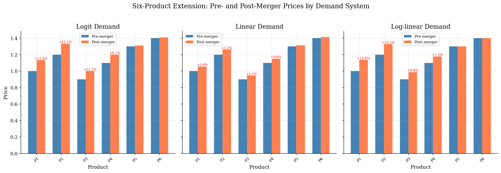
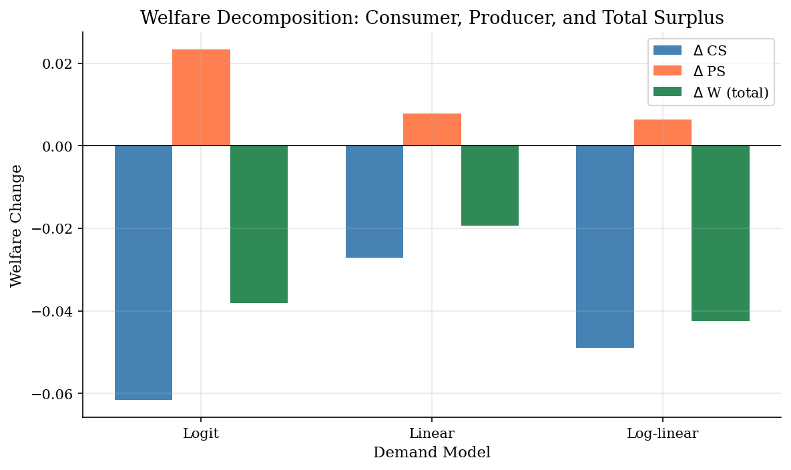
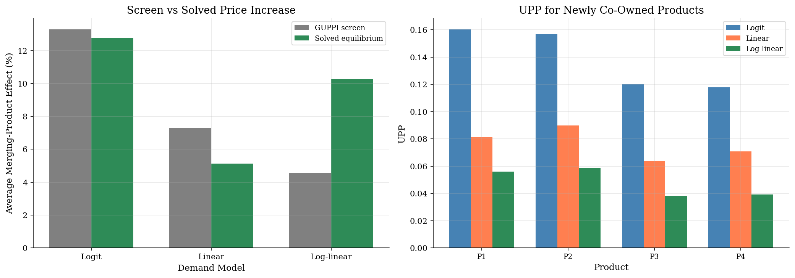
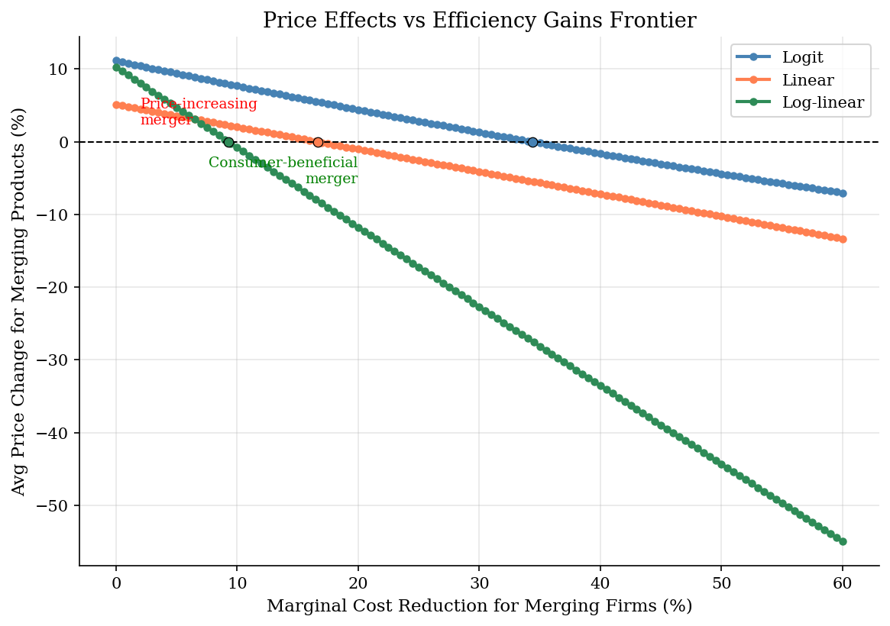

# Merger Pricing in Differentiated-Products Markets

## Overview

A merger between close substitutes changes pricing incentives even when marginal costs stay fixed. Before the merger, Firm 1 loses diverted customers to Firm 2. After the merger, some diverted sales remain inside the combined firm.

The object is substitution. Shares, prices, and margins describe the observed market. They do not reveal how demand moves when one product raises price.

The computation calibrates logit, linear, and log-linear demand to one six-product market. It changes ownership and solves the post-merger Bertrand-Nash pricing conditions. GUPPI and CMCR remain local screens at observed prices.

## Equations

The target object is the counterfactual price vector after ownership changes.
There are $J$ inside products. Product $j$ has price $p_j$, marginal cost
$c_j$, quantity or share $q_j(p)$, and owner $f(j)$. The ownership matrix is

$$\Omega_{jk}=\mathbf 1\{f(j)=f(k)\}.$$

For a multi-product Bertrand firm, the pricing equation is

$$0=q_j(p)+\sum_{k=1}^J \Omega_{jk}(p_k-c_k)\frac{\partial q_k(p)}{\partial p_j}, \qquad j=1,\ldots,J .$$

With $\Delta_{kj}(p)=\partial q_k(p)/\partial p_j$, the vector equation is

$$q(p)+(\Omega\circ \Delta(p)') (p-c)=0.$$

Here $\circ$ denotes the Hadamard (element-wise) product.

The three demand systems are calibrated to the same observed market:

$$s_j^{L}(p)= \frac{\exp(\xi_j+\alpha p_j)} {1+\sum_{\ell=1}^J \exp(\xi_\ell+\alpha p_\ell)}, \qquad \alpha<0,$$

Here $\xi_j$ is the mean indirect utility of product $j$ from non-price characteristics.

$$q_j^{A}(p)=a_j-\sum_{k=1}^J B_{jk}p_k,$$

Here $a_j$ is the demand intercept and $B_{jk}$ is the price-response matrix for product $j$.

and

$$\log q_j^{E}(p)=a_j^E+\sum_{k=1}^J E_{jk}\log p_k .$$

Here $a_j^E$ is the log-linear demand intercept and $E_{jk}$ is the price-elasticity matrix.

The local diversion ratio from product $j$ to product $k$ is

$$D_{j\to k}= -\frac{\partial q_k(p)/\partial p_j} {\partial q_j(p)/\partial p_j}, \qquad j\neq k.$$

For products that become newly co-owned after the merger,

$$UPP_j=\sum_{k:\Omega^{post}_{jk}=1,\ \Omega^{pre}_{jk}=0} D_{j\to k}(p_k-c_k),$$

with

$$GUPPI_j=\frac{UPP_j}{p_j}, \qquad CMCR_j=\frac{UPP_j}{c_j}.$$

GUPPI is a first-order screen for upward pricing pressure. CMCR reports the
product-level marginal-cost reduction that would offset that pressure at the
observed price vector. The simulation then solves the full pricing system under
post-merger ownership.

## Model Setup

| Parameter | Value | Description |
|-----------|-------|-------------|
| Products $J$ | 6 | 3 firms, 2 products each |
| Shares | [0.12, 0.10, 0.15, 0.13, 0.08, 0.07] | Pre-merger inside shares |
| Prices | [1.00, 1.20, 0.90, 1.10, 1.30, 1.40] | Pre-merger prices |
| Margins | [0.40, 0.35, 0.45, 0.40, 0.30, 0.28] | Price-cost margins |
| Outside share | 0.35 | Outside option in the logit demand system |
| $\alpha$ (logit) | -3.1611 | Calibrated price coefficient |
| Linear cross-slope ratio | 0.10 | Cross-slope relative to geometric mean own-slope |
| Log-linear cross elasticity | 0.15 | Maintained symmetric cross-price elasticity |
| Merger | Firm 1 buys Firm 2 | Products 1-4 move under common ownership |
| Benchmark | Post-merger Bertrand-Nash FOC | Equilibrium used to judge first-order screens |

## Solution Method

Calibration makes each demand system pass through the observed market. Simulation keeps those demand primitives fixed. It changes ownership and searches for a new Bertrand-Nash price vector.

```text
Algorithm: calibrated merger simulation
Input: observed shares q, prices p, margins m, pre- and post-merger owners f(j)
Output: screening metrics, post-merger prices, and welfare changes
Build Omega_pre and Omega_post from owner labels
for each demand system d in {logit, linear, log-linear}:
    choose demand parameters so q_d(p_obs) matches observed shares
    recover marginal costs c_d from the pre-merger pricing FOC
    evaluate Delta_d(p_obs) and diversion ratios D_d
    compute UPP, GUPPI, and CMCR for newly co-owned products
    solve q_d(p) + (Omega_post .* Delta_d(p)') (p - c_d) = 0
    compare solved price changes with the first-order screens
    compute changes in consumer surplus, producer surplus, and total surplus
for a grid of merger efficiencies:
    reduce costs on the merging products, re-solve the post-merger FOC,
    and interpolate the cost reduction where average merged-product prices stop rising
```

The residual check confirms that each calibration reproduces the observed pricing conditions (logit 1.4e-17, linear 2.8e-17, log-linear 2.8e-17). The results below compare first-order screens with the solved post-merger equilibrium.

## Results

Products 1-4 move inside the same portfolio after the merger. The merged firm internalizes diversion among them. Logit and log-linear demand give double-digit average increases. Linear demand is more muted under this cross-slope calibration.



The welfare bars separate consumer surplus, producer surplus, and their sum. Consumers lose in every demand system. Producer gains do not offset consumer losses here.



GUPPI uses observed margins and diversion before counterfactual prices are solved. The left panel treats the solved price increase as the benchmark. The gap reflects pass-through, demand curvature, and rival price responses.



The efficiency curve lowers marginal costs for products 1-4. Each point re-solves the post-merger pricing problem. Zero markers approximate the break-even cost reduction. Below zero, efficiencies reverse the average price increase.



The table puts local screens and solved counterfactuals side by side. Average price increases come from the post-merger FOC solution. GUPPI and CMCR are local screens. Break-even efficiencies come from repeated FOC solves over cost reductions.

**Merger Price Effects and Screens**

| Demand Model   |   Avg Actual Price Inc. (%) |   Max Price Change (%) |   Avg GUPPI Screen (%) |   Screen Gap (pp) |   Avg CMCR Screen (%) |   Break-even Eff. (%) |   Delta CS |   Delta PS |   Delta W |   Post FOC Residual |
|:---------------|----------------------------:|-----------------------:|-----------------------:|------------------:|----------------------:|----------------------:|-----------:|-----------:|----------:|--------------------:|
| Logit          |                       11.15 |                  13.34 |                  11.59 |             -0.44 |                 19.76 |                 34.38 |    -0.0537 |     0.0204 |   -0.0333 |             2.4e-10 |
| Linear         |                        5.13 |                   5.59 |                   7.27 |             -2.15 |                 12.15 |                 16.66 |    -0.0272 |     0.0078 |   -0.0193 |             5.6e-17 |
| Log-linear     |                       10.27 |                  13.57 |                   4.56 |              5.7  |                  7.61 |                  9.29 |    -0.0489 |     0.0065 |   -0.0425 |             3e-12   |

## Takeaway

Merger simulation turns a change in control into an equilibrium price calculation. The ownership matrix is easy to change. The economic content sits in substitution and pass-through. Different calibrated demand systems can give different counterfactuals in the same observed market.

UPP, GUPPI, and CMCR are useful triage tools. They point to products with strong internalized diversion at observed prices. The FOC solve adds rival reactions, demand curvature, and efficiency claims.

Here all three systems raise prices and lower consumer surplus.

## References

- Werden, G. and Froeb, L. (1994). "The Effects of Mergers in Differentiated Products Industries: Logit Demand and Merger Policy." *Journal of Law, Economics, & Organization*, 10(2).
- Farrell, J. and Shapiro, C. (2010). "Antitrust Evaluation of Horizontal Mergers: An Economic Alternative to Market Definition." *The B.E. Journal of Theoretical Economics*, 10(1).
