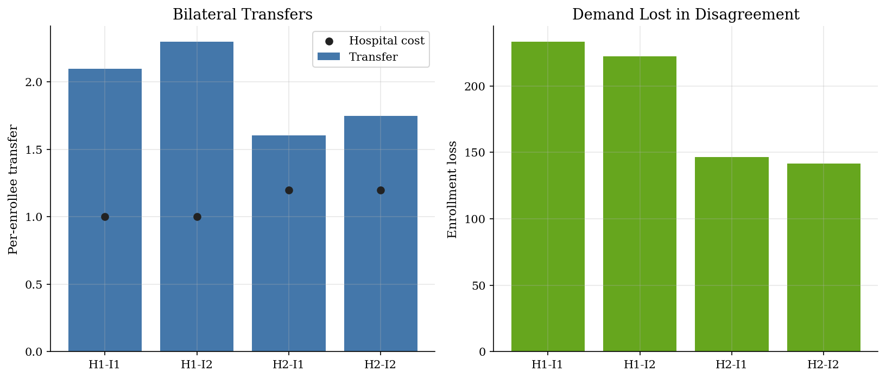
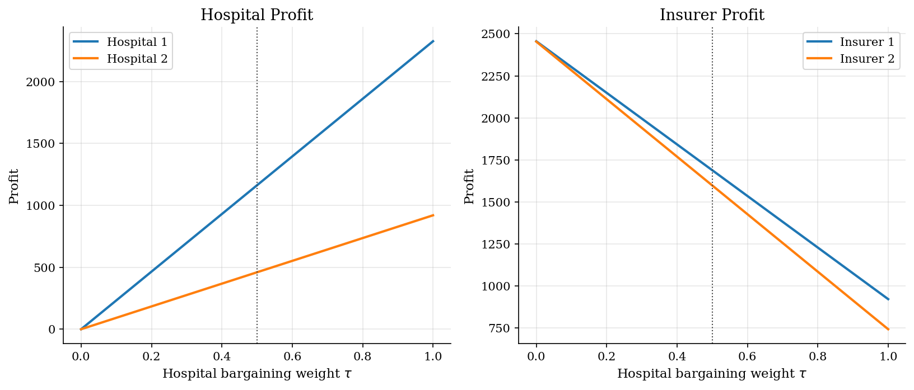
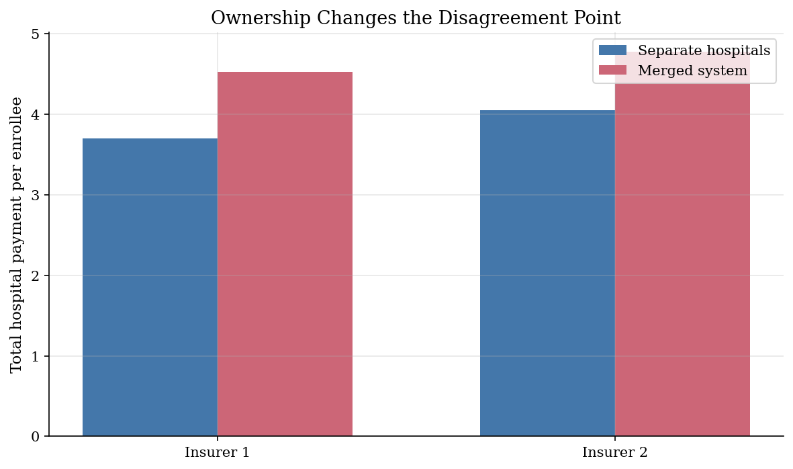

# Hospital-Insurer Network Bargaining with Nash-in-Nash

## Overview

Health insurers sell hospital networks. A plan loses value when it drops a high-quality hospital. It loses more when it drops the whole system.

The object is a per-enrollee hospital transfer. The transfer depends on the enrollment an insurer would lose if a contract failed.

The computation enumerates each disagreement network. It recomputes logit demand, converts lost enrollment into surplus, and applies the Nash-in-Nash split.

## Equations

Let $d$ index insurers and $h$ index hospitals. Insurer $d$ has network $G_d$.
In the full agreement network $G$, each insurer carries both hospitals.

Demand is a logit over insurers and an outside option:

$$
q_d(G) =
M \frac{\exp(v_d(G_d) / \sigma_\varepsilon)}
{1 + \sum_{\ell=1}^{D} \exp(v_\ell(G_\ell) / \sigma_\varepsilon)} .
$$

Here $D$ is the number of insurers. The deterministic utility of an insurer is

$$
v_d(G_d) = Q(G_d) - P_d,
$$

where $P_d$ is the premium. The network value is

$$
Q(\emptyset)=0,\qquad
Q(G_d)=\max_{h \in G_d} a_h + \eta(|G_d|-1)
\quad\text{when }G_d\neq\emptyset .
$$

Here $a_h$ is hospital quality. The term $\eta$ is the value of a second
in-network hospital.

Let $m_d=P_d-c_d^D$ be the insurer margin before hospital transfers. If link
$(h,d)$ fails, the disagreement network is $G^{-hd}$.

The gross incremental value of hospital $h$ to insurer $d$ is

$$
\Delta_{hd}=m_d\left[q_d(G)-q_d(G^{-hd})\right].
$$

The bilateral surplus net of hospital cost $c_h^H$ is

$$
S_{hd}=\Delta_{hd}-c_h^H q_d(G).
$$

The Nash bargain over the per-enrollee hospital transfer $w_{hd}$ solves

$$
\max_{w_{hd}}
\left[(w_{hd}-c_h^H)q_d(G)\right]^\tau
\times
\left[\Delta_{hd}-w_{hd}q_d(G)\right]^{1-\tau},
$$

so the transfer is

$$
w_{hd}=c_h^H + \tau \frac{S_{hd}}{q_d(G)}
      =(1-\tau)c_h^H+\tau\frac{\Delta_{hd}}{q_d(G)} .
$$

For a merged hospital system $H$, the relevant disagreement removes all system
hospitals from insurer $d$. With $C_H=\sum_h c_h^H$,

$$
W_{Hd}=C_H+\tau\frac{
m_d[q_d(G)-q_d(G^{-Hd})]-C_Hq_d(G)
}{q_d(G)}
$$

is the system-level per-enrollee transfer.

## Model Setup

| Object | Value | Role |
|---|---:|---|
| Hospitals | 2 | Upstream negotiators |
| Insurers | 2 | Downstream plans selling to consumers |
| Market size $M$ | 1000 | Potential enrollees |
| Bargaining weight $\tau$ | 0.50 | Hospital share of bilateral surplus |
| Hospital qualities $a_h$ | 20.0, 18.0 | Network utility shifters |
| Hospital costs $c_h^H$ | 1.0, 1.2 | Cost per enrolled member |
| Insurer premiums $P_d$ | 8.0, 8.5 | Fixed downstream prices |
| Insurer costs $c_d^D$ | 1.0, 1.0 | Non-hospital marginal costs |
| Second-hospital value $\eta$ | 3.0 | Extra network value beyond the best hospital |
| Logit scale $\sigma_\varepsilon$ | 5.0 | Controls substitution across insurers |

## Solution Method

Enumeration gives each outside option. The code first computes full-network demand. It then removes one hospital-insurer link, holds other links fixed, and recomputes demand. A closed-form Nash split turns lost downstream margin into a per-enrollee transfer. Under system ownership, the disagreement removes both hospitals from the insurer network.

```text
Algorithm: Nash-in-Nash transfers in a hospital-insurer network
Input: full networks G, premiums P, costs c^D and c^H, demand q(.), weight tau
Output: bilateral transfers w_hd and merged-system transfers W_Hd
Compute full-agreement demand q_d(G) for every insurer d
for each hospital h and insurer d:
    form G^{-hd} by removing hospital h only from insurer d
    compute disagreement demand q_d(G^{-hd})
    Delta_hd = (P_d - c_d^D) * [q_d(G) - q_d(G^{-hd})]
    S_hd = Delta_hd - c_h^H * q_d(G)
    w_hd = c_h^H + tau * S_hd / q_d(G)
for each insurer d under hospital-system ownership:
    form G^{-Hd} by removing the whole hospital system from insurer d
    compute the system surplus using the same demand object
    W_Hd = system cost + tau * system surplus / q_d(G)
```

## Results

Bilateral transfers measure enrollment lost when one link breaks. Dropping Hospital 1 hurts more because it has higher network value. Insurer 2 pays more because its higher premium creates a larger downstream margin.

The left panel reports per-enrollee transfers and hospital costs. The right panel reports lost enrollment in each disagreement network.



Changing $\tau$ holds demand fixed and changes only the surplus split. Hospital profit rises with the bargaining weight. Insurer profit falls because more network value is paid upstream.

The vertical line marks the baseline calibration. The exercise does not recompute demand for each $\tau$.



The merger comparison replaces two separate transfers with one system payment. Either hospital alone keeps a network viable. Losing the merged system leaves no in-network hospital, so the system transfer is higher.

A merged system bargains over one total transfer. It does not bargain over two independent hospital prices.



The table reports the quantities used in each Nash bargain. Gross value equals downstream margin times lost enrollment. Surplus subtracts hospital cost.

**Bilateral Bargaining Diagnostics**

| Pair                   |   Full demand |   Disagreement demand |   Demand loss |   Gross value / enrollee |   Surplus / enrollee |   Hospital cost |   Transfer |
|:-----------------------|--------------:|----------------------:|--------------:|-------------------------:|---------------------:|----------------:|-----------:|
| Hospital 1 - Insurer 1 |         511.6 |                 278.2 |         233.4 |                    3.194 |                2.194 |             1   |      2.097 |
| Hospital 1 - Insurer 2 |         462.9 |                 240.7 |         222.2 |                    3.6   |                2.6   |             1   |      2.3   |
| Hospital 2 - Insurer 1 |         511.6 |                 365   |         146.6 |                    2.005 |                0.805 |             1.2 |      1.603 |
| Hospital 2 - Insurer 2 |         462.9 |                 321.1 |         141.8 |                    2.297 |                1.097 |             1.2 |      1.749 |

The merged-system rows use a different disagreement event. The insurer loses both hospitals at once.

**Ownership Counterfactual**

| Insurer   |   Full demand |   Demand without system |   Separate hospital transfers |   Merged system transfer |   Change (%) |
|:----------|--------------:|------------------------:|------------------------------:|-------------------------:|-------------:|
| Insurer 1 |         511.6 |                    10.4 |                         3.7   |                    4.529 |         22.4 |
| Insurer 2 |         462.9 |                     8.6 |                         4.048 |                    4.78  |         18.1 |

## Takeaway

Nash-in-Nash turns each contract into a counterfactual network problem. The key object is what the insurer loses if a specific agreement fails. Hospital quality, substitution across insurers, and ownership determine that outside option.

## References

- Horn, H. and Wolinsky, A. (1988). "Bilateral Monopolies and Incentives for Merger." *RAND Journal of Economics*, 19(3).
- Crawford, G. and Yurukoglu, A. (2012). "The Welfare Effects of Bundling in Multichannel Television Markets." *American Economic Review*, 102(2).
- Ho, K. and Lee, R. (2017). "Insurer Competition in Health Care Markets." *Econometrica*, 85(2).
