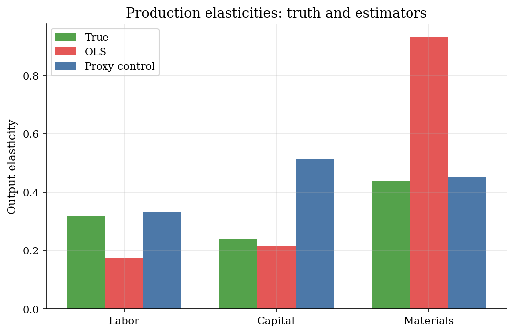
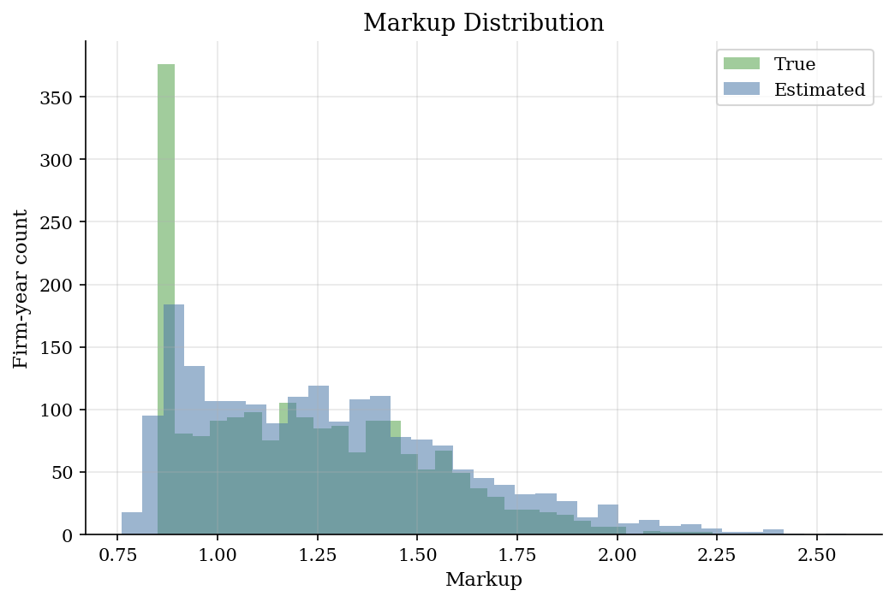
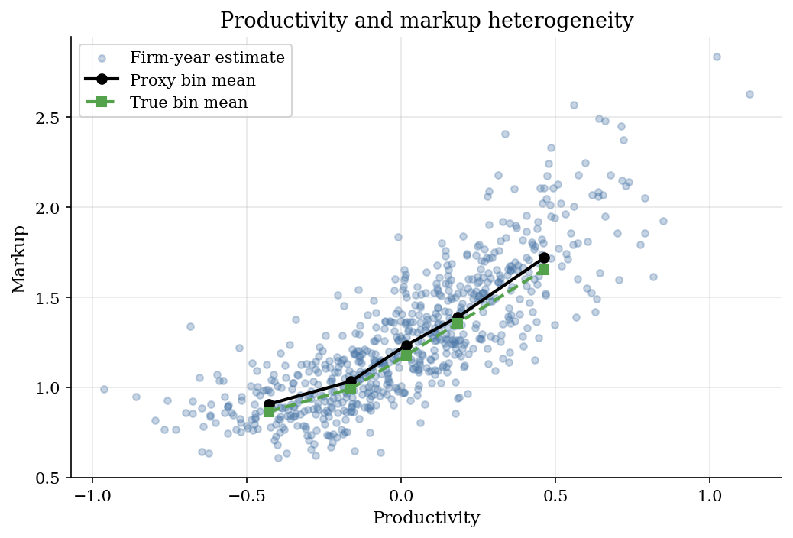

# Production Elasticities and Firm Markups

> Recover firm-year markups from a corrected materials elasticity and materials shares.

## Overview

Plant panels often record output, labor, capital, materials, and input spending. They usually do not record marginal cost.

The object is the firm-year markup. This tutorial recovers it from a materials output elasticity and a materials revenue share.

Inputs respond to productivity before output is observed. The computation uses an investment proxy to correct the materials elasticity before forming markups.

## Equations

Let $i$ index firms and $t$ index years. Output, labor, capital, and materials
are logs. They are denoted by $y_{it}$, $l_{it}$, $k_{it}$, and $m_{it}$. The
plant technology is Cobb-Douglas:

$$
y_{it}
= \beta_l l_{it}+\beta_k k_{it}+\beta_m m_{it}
+\omega_{it}+\varepsilon_{it}.
$$

The firm observes productivity $\omega_{it}$ before choosing flexible inputs.
This timing makes $l_{it}$ and $m_{it}$ correlated with $\omega_{it}$. Naive
OLS therefore has a nonzero input-error covariance.

The proxy variable is investment $I_{it}$. In the synthetic data, investment
follows a monotone policy:

$$
I_{it}=h(k_{it},\omega_{it})+\nu_{it},
\qquad \frac{\partial h(k,\omega)}{\partial \omega}>0.
$$

The control-function estimator uses this monotonicity to form a productivity
control $\tilde \omega_{it}=h^{-1}(k_{it},I_{it})$. It estimates

$$
y_{it}
= \beta_l l_{it}+\beta_k k_{it}+\beta_m m_{it}
+\rho \tilde\omega_{it}+u_{it}.
$$

Markup recovery uses materials as the variable input. For Cobb-Douglas
production, the materials elasticity is $\theta^m=\beta_m$. Let

$$
\alpha^m_{it}
= \frac{\text{materials expenditure}_{it}}{\text{revenue}_{it}}
$$

be the materials revenue share. Cost minimization implies the gross markup

$$
\mu_{it}=\frac{\theta^m}{\alpha^m_{it}}.
$$

## Model Setup

| Object | Value | Role in the exercise |
|--------|-------|----------------------|
| Firm-year panel | 320 firms, 6 years | Lets input choices respond to persistent productivity |
| Technology | Cobb-Douglas in labor, capital, materials | Gives known output elasticities for the benchmark |
| True elasticities | $\beta_l=0.32$, $\beta_k=0.24$, $\beta_m=0.44$ | Ground truth for the coefficient comparison |
| Productivity | Persistent AR(1), observed by firms | Source of simultaneity in flexible inputs |
| Proxy variable | Investment, monotone in productivity conditional on capital | Control for the unobserved productivity state |
| Markup measure | $\theta^m / \alpha^m_{it}$ | Maps the materials elasticity into firm-year markups |

## Solution Method

The calculation first estimates the materials elasticity while controlling for productivity. It then divides that elasticity by each firm-year materials share. The proxy-control regression uses the synthetic investment schedule to form the productivity control.

```text
Algorithm: proxy-control markup measurement
Input: panel {y_it, l_it, k_it, m_it, I_it, alpha^m_it}, proxy policy h, true benchmark mu_it
Output: production elasticities and firm-year markup estimates
1. Estimate the naive production regression:
       y_it = b_l l_it + b_k k_it + b_m m_it + residual_it
   and record the OLS materials elasticity b_m^OLS.
2. Use monotonic investment to build a productivity control:
       omega_tilde_it = h^{-1}(k_it, I_it).
3. Re-estimate production with the control included:
       y_it = b_l l_it + b_k k_it + b_m m_it + rho omega_tilde_it + u_it.
   The controlled b_m is the markup-relevant elasticity theta_hat^m.
4. For every firm-year, compute
       mu_hat_it = theta_hat^m / alpha^m_it.
5. Compare theta_hat^m and mu_hat_it with the simulated truth, and aggregate
   markups by productivity quintile to inspect heterogeneity.
```

The inverted proxy control is the numerical step. The final markup calculation is a firm-year division.

## Results

The production-function step drives the markup calculation. OLS overstates the flexible-input elasticities because high-productivity firms choose more inputs. The proxy-control estimate corrects for the omitted productivity state. It moves the materials elasticity close to its true value.



The coefficient bias passes through the markup formula. The OLS-implied distribution sits too far to the right because the materials elasticity is inflated. The proxy-control markups stay much closer to the truth.



The simulated truth lets us check the markup gradient. More productive firms have lower materials shares in this design. True markups rise with productivity. The recovered quintile means trace that gradient.



The coefficient table is read through the markup formula. Materials is the main row because $\theta^m$ is divided by the materials revenue share.

**Production function estimates**

| Input     |   True elasticity |   OLS |   Proxy-control |   OLS bias |   Proxy bias |
|:----------|------------------:|------:|----------------:|-----------:|-------------:|
| Labor     |              0.32 | 0.452 |           0.333 |      0.132 |        0.013 |
| Capital   |              0.24 | 0.492 |           0.245 |      0.252 |        0.005 |
| Materials |              0.44 | 0.771 |           0.46  |      0.331 |        0.02  |

The quintile table makes the ground-truth comparison explicit. OLS-based markups are too high in every productivity cell. The proxy-control markups keep the right ordering and a much smaller level error.

**Markup moments by productivity quintile**

| productivity_quintile   |   mean_productivity |   true_markup |   ols_markup |   proxy_markup |   proxy_bias |
|:------------------------|--------------------:|--------------:|-------------:|---------------:|-------------:|
| Q1                      |              -0.45  |         0.865 |        1.513 |          0.901 |        0.036 |
| Q2                      |              -0.162 |         1.005 |        1.76  |          1.048 |        0.043 |
| Q3                      |               0.015 |         1.18  |        2.088 |          1.244 |        0.064 |
| Q4                      |               0.195 |         1.365 |        2.4   |          1.43  |        0.065 |
| Q5                      |               0.469 |         1.647 |        2.901 |          1.728 |        0.081 |

## Takeaway

The markup estimate is only as credible as the production elasticity and the materials share behind it. In this controlled panel, correcting for productivity greatly reduces markup error.

## References

- Olley, S., and Pakes, A. (1996). The Dynamics of Productivity in the Telecommunications Equipment Industry. *Econometrica*, 64(6), 1263-1297.
- Levinsohn, J., and Petrin, A. (2003). Estimating Production Functions Using Inputs to Control for Unobservables. *Review of Economic Studies*, 70(2), 317-341.
- De Loecker, J., and Warzynski, F. (2012). Markups and Firm-Level Export Status. *American Economic Review*, 102(6), 2437-2471.
- Lectures 10-12 Slides 2023: Production functions, proxy methods, and markups.
