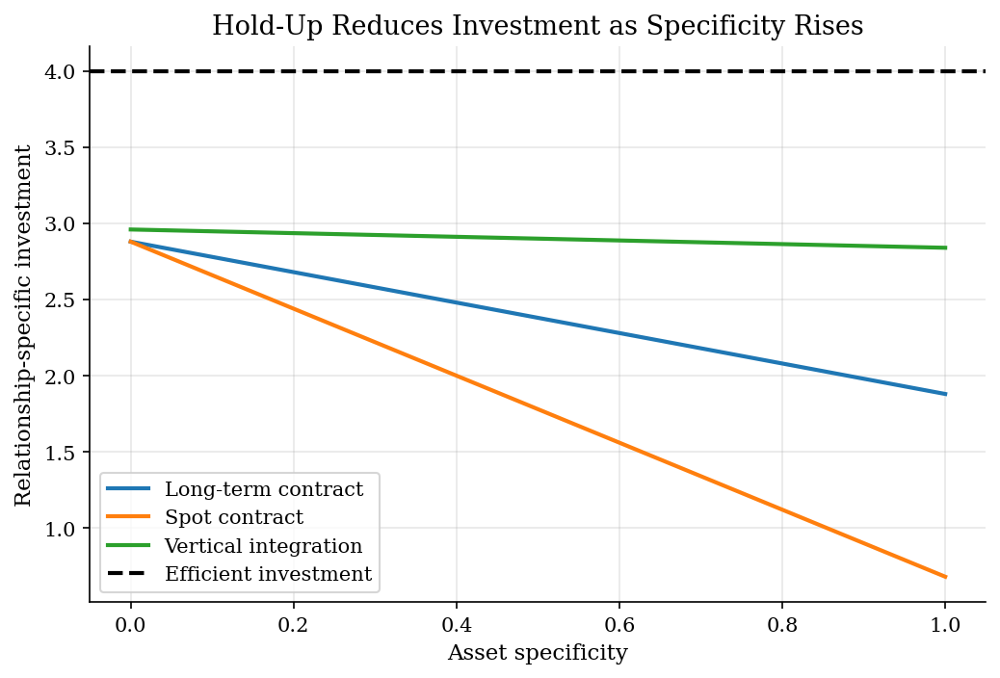
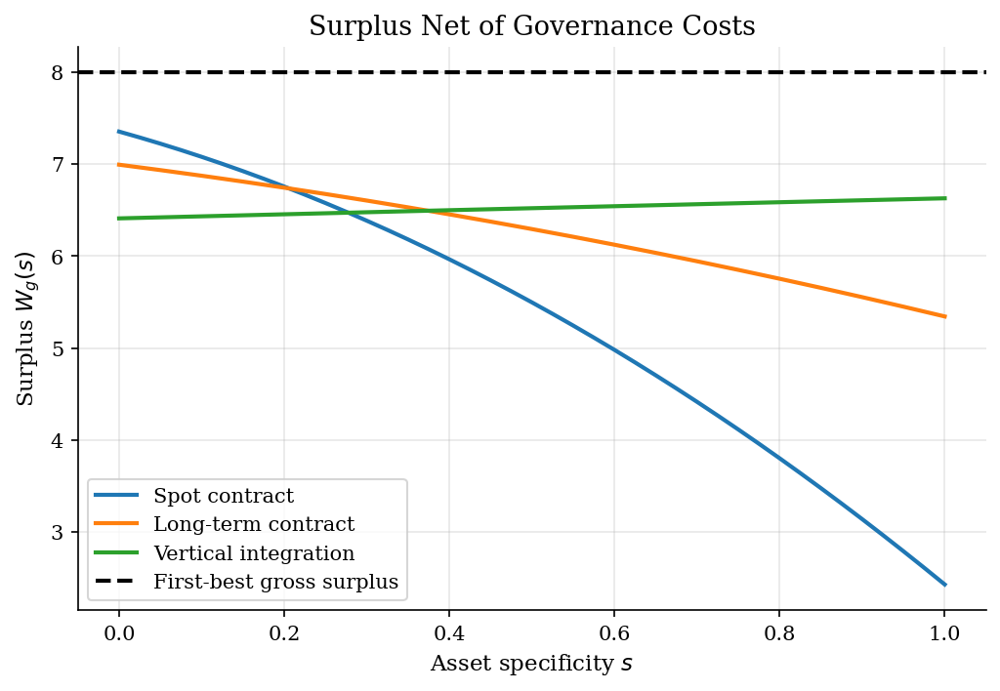
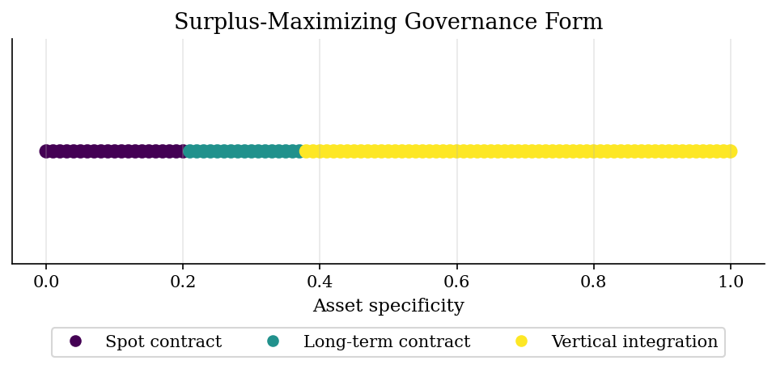

# Theory of the Firm: Incomplete Contracts and Hold-Up

> Asset specificity, relationship-specific investment, and the vertical integration boundary.

## Overview

A firm boundary question is usually a contracting question before it is an organizational chart question. Suppose a supplier can make an investment that is valuable mainly inside one buyer-seller relationship. If the investment is hard to describe in a court-enforceable contract, the supplier expects some of the return to be bargained away after the sunk cost has been paid. The hold-up problem is then not that trade fails mechanically; it is that the investment made before trade is too small.

The tutorial uses one state variable, asset specificity $s\in[0,1]$, to make that tradeoff explicit. Spot exchange is cheap but offers weak protection when $s$ is high. A long-term contract protects more of the investment return, at a drafting and monitoring cost. Vertical integration gives stronger residual control rights, but hierarchy itself is costly. The exercise asks where each governance form maximizes total surplus.

This is the firm-boundary counterpart to the downstream-pricing examples in [vertical relationships](../vertical-relationships/) and [Bertrand pricing with logit demand](../bertrand-logit-demand/): here the object is not a price equilibrium, but the allocation of control rights before relationship-specific investment is sunk.

## Equations

Let $s$ denote asset specificity and let $g\in\mathcal G$ index governance
regimes: spot exchange, a long-term contract, and vertical integration.
Relationship-specific investment $x$ creates gross value
$$V(x) = \theta x - \frac{1}{2}x^2$$

so the first-best investment, before contracting frictions, is
$$x^{\ast} = \theta$$

Under regime $g$, the investor internalizes only share $b_g(s)$ of the marginal
return. The private first-order condition is
$$b_g(s)\theta - x = 0,$$
which gives the regime-specific investment rule
$$x_g(s) = b_g(s)\theta$$

Total surplus nets out the governance cost $F_g(s)$:
$$W_g(s) = \theta x_g(s) - \frac{1}{2}x_g(s)^2 - F_g(s)$$

The selected governance form is
$$g^{\ast}(s)=\arg\max_{g\in\mathcal G} W_g(s).$$

The first-best surplus line used in the figures is
$$W^{\ast}=\frac{1}{2}\theta^2,$$
which is a benchmark, not an attainable governance regime once hold-up and
governance costs are present.

## Model Setup

The calibration is deliberately stylized. It is not estimating a boundary of the firm from data; it is making the Williamson/Grossman-Hart-Moore comparative static visible with transparent primitives.

| Object | Interpretation |
|--------|----------------|
| $s\in[0,1]$ | Asset specificity, with higher $s$ meaning weaker redeployability outside the relationship |
| $\theta=4$ | Marginal productivity scale, so the first-best investment is $x^{\ast}=4$ |
| $b_g(s)$ | Share of the marginal investment return captured by the investor under governance $g$ |
| $F_g(s)$ | Drafting, monitoring, bureaucracy, and adaptation cost under governance $g$ |
| Spot contract | Low fixed governance cost, but incentives fall sharply as specificity rises |
| Long-term contract | More protection against hold-up, with moderate contracting cost |
| Vertical integration | Stronger residual control rights, with higher internal governance cost |

## Solution Method

The computation is a regime comparison on a grid for $s$. There is no dynamic programming or equilibrium fixed point here; the useful discipline is to keep private investment incentives separate from total surplus. Integration can raise $x_g(s)$ and still fail to maximize $W_g(s)$ if its governance cost is too high.

```text
Inputs: specificity grid S, regimes G, productivity theta,
        incentive schedules b_g(s), governance costs F_g(s)

First-best benchmark:
    x_star = theta
    W_star = 0.5 * theta^2

For each s in S:
    For each governance regime g in G:
        x_g(s) = b_g(s) * theta
        W_g(s) = theta * x_g(s) - 0.5 * x_g(s)^2 - F_g(s)
    Choose g_star(s) = argmax_g W_g(s)

Outputs: investment schedules, surplus schedules, and governance regions
```

In this calibration the approximate surplus-maximizing regions are: Spot contract for $s\lesssim 0.21$; Long-term contract for $0.21\lesssim s\lesssim 0.37$; Vertical integration for $s\gtrsim 0.37$. The switch points are not parameters of the model; they are the outcome of comparing the incentive gains from stronger control rights with the resource costs of writing contracts or running hierarchy.

## Results

The dashed line is the first-best investment $x^{\ast}=\theta$. Spot exchange loses investment incentives as specificity rises because the investor expects more ex-post bargaining. Integration keeps investment close to the benchmark, but the next figure shows why that alone does not settle the firm-boundary question.



The surplus ranking changes because each governance form moves two objects at once: investment incentives and governance cost. Spot contracts are best when assets are easy to redeploy. Vertical integration becomes attractive only after the hold-up cost of market exchange dominates the internal cost of hierarchy.



The governance regions summarize the same comparison without the surplus levels. The middle interval is useful: a long-term contract can dominate both spot exchange and integration when it protects enough investment without bringing the full internal governance cost.



The table keeps the accounting transparent at three values of $s$. At low specificity, cheap market exchange wins despite underinvestment. At medium and high specificity in this calibration, integration's incentive effect is large enough to offset its governance cost.

**Governance comparison at low, medium, and high asset specificity**

|   Specificity | Regime               |   Incentive share |   Investment |   Surplus | Efficiency ratio   | Chosen regime   |
|--------------:|:---------------------|------------------:|-------------:|----------:|:-------------------|:----------------|
|           0   | Spot contract        |              0.72 |         2.88 |      7.35 | 91.9%              | yes             |
|           0   | Long-term contract   |              0.72 |         2.88 |      6.99 | 87.4%              |                 |
|           0   | Vertical integration |              0.74 |         2.96 |      6.41 | 80.1%              |                 |
|           0.5 | Spot contract        |              0.44 |         1.78 |      5.5  | 68.7%              |                 |
|           0.5 | Long-term contract   |              0.59 |         2.38 |      6.29 | 78.7%              |                 |
|           0.5 | Vertical integration |              0.72 |         2.9  |      6.52 | 81.5%              | yes             |
|           1   | Spot contract        |              0.17 |         0.68 |      2.43 | 30.4%              |                 |
|           1   | Long-term contract   |              0.47 |         1.88 |      5.34 | 66.8%              |                 |
|           1   | Vertical integration |              0.71 |         2.84 |      6.63 | 82.8%              | yes             |

## Takeaway

The firm boundary is not a generic preference for hierarchy. Integration is valuable when noncontractible, relationship-specific investment is important enough that stronger control rights pay for themselves. When assets are easy to redeploy, market exchange can dominate because it avoids the internal costs of hierarchy. Between those cases, a long-term contract can be the surplus-maximizing compromise.

## References

- Williamson, O. (1975). *Markets and Hierarchies*. Free Press.
- Grossman, S., and Hart, O. (1986). The Costs and Benefits of Ownership. *Journal of Political Economy*, 94(4), 691-719.
- Hart, O., and Moore, J. (1990). Property Rights and the Nature of the Firm. *Journal of Political Economy*, 98(6), 1119-1158.
- Lecture 6 Slides 2023: Theory of the Firm and incomplete contracts.
