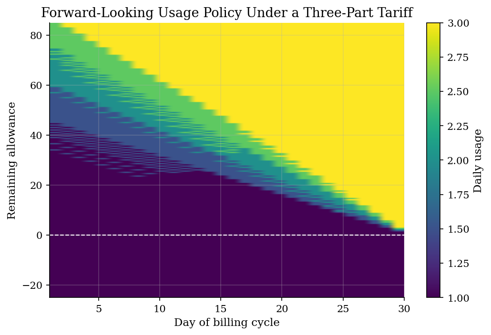
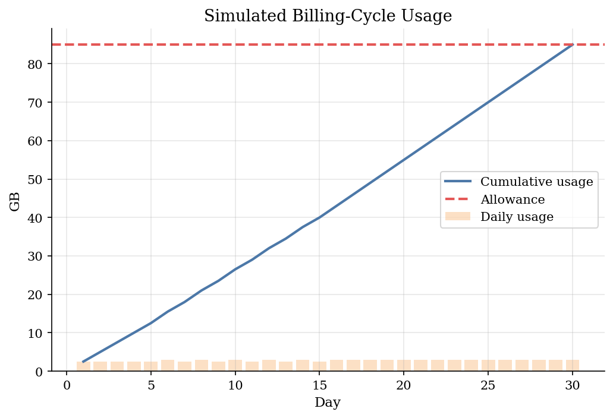
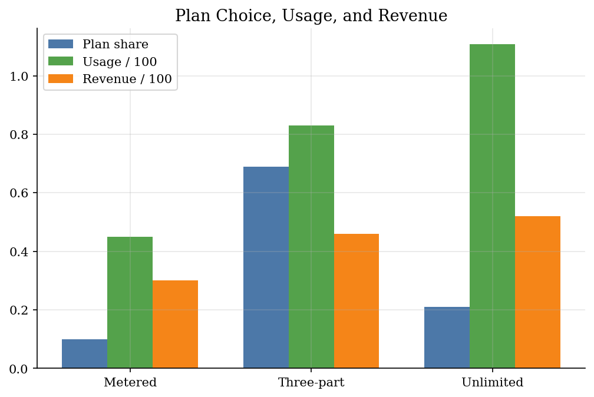

# Three-Part Tariffs and Forward-Looking Broadband Demand

> Usage allowances, overage prices, and dynamic consumption within a billing cycle.

## Overview

Usage-based broadband pricing is a three-part tariff: a fixed monthly fee, an included allowance, and an overage price for usage above the cap. Consumers are forward-looking within the billing cycle because using data today changes the remaining allowance tomorrow.

The tutorial solves a finite-horizon dynamic program for daily usage. It then lets heterogeneous consumers choose among metered, three-part, and unlimited plans.

## Equations

Daily utility from usage $c_t$ is:
$$u(c_t;h) = h\log(1+c_t) - \frac{\psi}{2}c_t^2$$

Cumulative usage evolves as:
$$C_t = C_{t-1} + c_t$$

The dynamic value under plan $k$ is:
$$V_{kt}(C_{t-1}) = \max_{c_t} u(c_t;h) - p_k^{over}\Delta O_t + V_{k,t+1}(C_t)$$

where $\Delta O_t$ is the incremental overage usage created by today's consumption.

## Model Setup

| Plan | Fixed fee | Allowance | Overage price | Speed |
|------|-----------|-----------|---------------|-------|
| Metered | 16 | 25 GB | 0.70 | 80 Mbps |
| Three-part | 46 | 85 GB | 1.60 | 200 Mbps |
| Unlimited | 52 | uncapped | 0.00 | 320 Mbps |

## Solution Method

Backward induction solves the monthly usage problem for each plan and consumer type. The state is cumulative usage so far in the billing cycle. The policy function shows how much to consume today as a function of the remaining allowance and days left.

## Results

Near the allowance, consumers conserve usage early in the cycle because today's usage raises the chance of overage payments later. The constraint relaxes near the end of the month.


*Daily usage policy by day and remaining allowance*

The consumer manages usage around the allowance. Overage risk creates intertemporal substitution even though daily tastes are constant.


*Cumulative and daily usage under the three-part plan*

Heterogeneous consumers sort across contracts. Low-usage types prefer metered plans, middle types value the allowance, and high-usage types value unlimited access.


*Plan shares, average usage, and average revenue*

**Plan-choice summary across consumer types**

| Plan       |   Share |   Average usage |   Average revenue |   Average consumer value |
|:-----------|--------:|----------------:|------------------:|-------------------------:|
| Metered    |    0.1  |          45     |                30 |                   52.384 |
| Three-part |    0.69 |          82.971 |                46 |                   99.233 |
| Unlimited  |    0.21 |         110.714 |                52 |                  163.701 |

## Takeaway

The allowance makes demand dynamic. A consumer far below the cap treats usage as almost free, while a consumer near the cap faces the shadow value of preserving allowance for later. Three-part tariffs therefore affect both plan choice and within-month usage timing.

## Reproduce

```bash
python run.py
```

## References

- Nevo, A., Turner, J., and Williams, J. (2016). Usage-Based Pricing and Demand for Residential Broadband. *Econometrica*, 84(2), 411-443.
- Lecture 18 Slides 2023: Three-part tariffs and forward-looking broadband demand.
