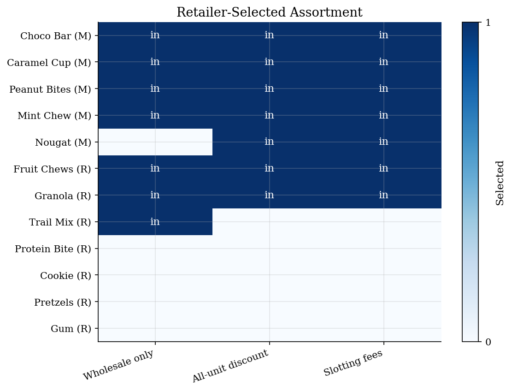
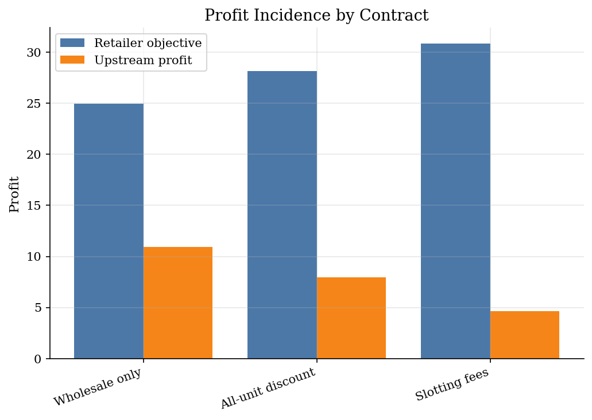
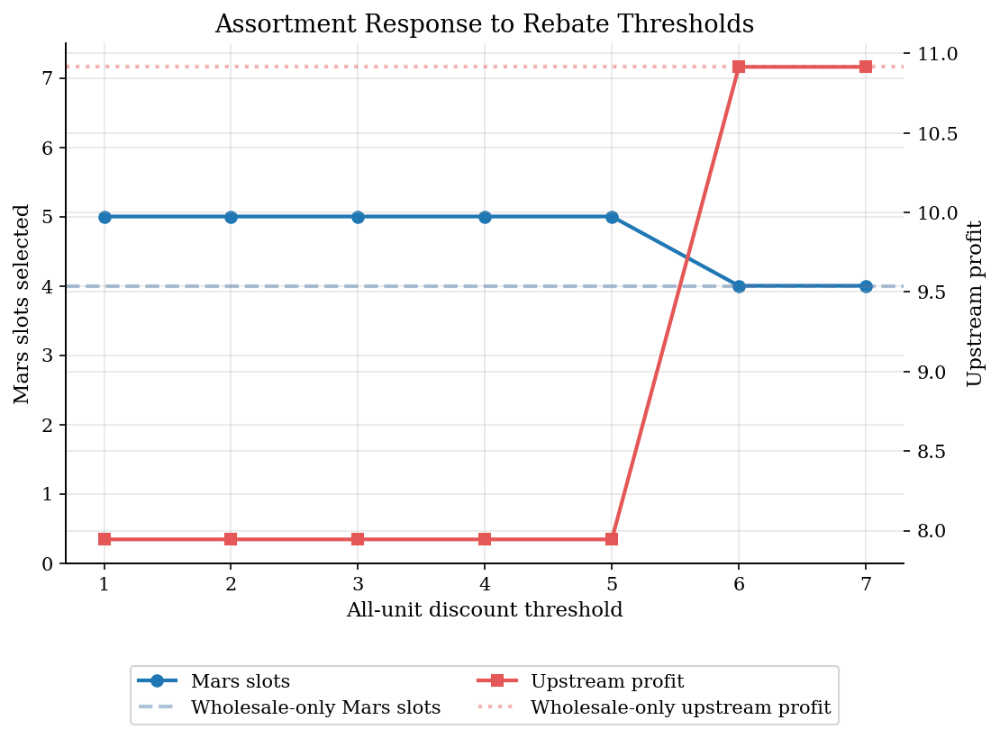

# Vertical Contracts and Vending Assortments

> All-unit discounts, slotting fees, and assortment choice in a capacity-constrained vending channel.

## Overview

Vertical-contract evidence often starts with availability, not only with prices. A vending operator has a small number of slots, the upstream firms want their products inside the machine, and contract terms decide how attractive each slot is to the downstream firm.

This tutorial keeps the demand side deliberately small. Each product has linear retail demand and a wholesale cost. The economic action is the retailer's assortment choice: seven products must be selected from a larger catalog. The benchmark in [Vertical Relationships and Double Marginalization](../vertical-relationships/) shows how wholesale margins distort retail prices; here the same vertical logic is pushed into product availability through rebates and slotting fees.

## Equations

Let $\mathcal J$ be the product catalog and let $K$ be the number of vending
slots. Product $j$ has demand intercept $a_j$, marginal cost $c_j$, and
manufacturer label $m(j)$. Retail demand is separable:
$$
q_j(p_j)=\max\{a_j-bp_j,0\}.
$$

Given wholesale price $w_j$, the retailer sets the product price by
$$
p_j^{*}(w_j)
=\arg\max_{p_j\geq w_j} (p_j-w_j)q_j(p_j).
$$
For an interior product, this gives
$$
p_j^{*}(w_j)=\frac{a_j+bw_j}{2b}.
$$

Contract $C$ maps an assortment $A$ into a wholesale price
$w_j^C(A)$ and a fixed transfer $F_j^C(A)$ paid by the upstream side to the
retailer. The retailer chooses
$$
A_C^{*}
=\arg\max_{A\subset\mathcal J:\ |A|=K}
\sum_{j\in A}\left[(p_j^{*}-w_j^C(A))q_j(p_j^{*})+F_j^C(A)\right].
$$

The upstream-profit diagnostic is
$$
\Pi_C^U(A)=
\sum_{j\in A}\left[(w_j^C(A)-c_j)q_j(p_j^{*})-F_j^C(A)\right].
$$

In the all-unit discount case, the retailer pays a lower wholesale price on
Mars products only if the selected assortment contains at least $\tau$ Mars
products:
$$
w_j^C(A)=c_j+\mu-d\,\mathbf 1\{m(j)=\text{Mars}\}\mathbf 1\{M(A)\geq\tau\},
\quad
M(A)=\sum_{j\in A}\mathbf 1\{m(j)=\text{Mars}\}.
$$
Slotting fees instead leave wholesale margins unchanged and work through
$F_j^C(A)$.

## Model Setup

The primitives are chosen so the finite assortment problem can be solved exactly. The retailer optimizes its own payoff; upstream profit is reported only to show which side bears the cost of the contract.

| Object | Value |
|--------|-------|
| Products | 12 candy and snack alternatives |
| Machine capacity | 7 slots |
| Demand | Product-specific intercepts with common slope $b=4$ |
| Wholesale-only contract | Per-unit margin $\mu=0.42$, no fixed transfers |
| All-unit discount | Mars margin falls by $d=0.18$ once the shelf target is met |
| Slotting-fee contract | Fixed payments of 1.10 for Mars products and 0.35 for rival products |

## Solution Method

The key computational object is the retailer's exact finite-choice optimum. There
are only $\binom{12}{7}=792$ feasible assortments, so the script evaluates every
candidate rather than using a local search heuristic. The plotted choices are
therefore the finite-catalog optimum, not a simulation approximation.

```text
Inputs: product catalog J, capacity K, contract C, rebate threshold tau
Output: optimal assortment A*_C and payoff diagnostics

for each feasible assortment A with |A| = K:
    count Mars products M(A)
    for each product j in A:
        set wholesale price w_j^C(A)
        set fixed transfer F_j^C(A)
        solve the retail pricing first-order condition for p_j*(w_j)
        compute q_j, retailer payoff, and upstream payoff
    add product-level payoffs to get Pi^D_C(A) and Pi^U_C(A)

choose A*_C in argmax_A Pi^D_C(A)
repeat over rebate thresholds tau to see where the all-unit discount binds
```

This is intentionally closer to an empirical counterfactual than to an abstract
combinatorics exercise: the contract changes the retailer's objective, and the
retailer responds by reallocating scarce shelf space.

## Results

The first figure reads the assortment problem directly. Wholesale-only pricing leaves the retailer with four Mars products. The rebate and slotting-fee contracts both move one more scarce slot toward Mars, even though retail prices are still chosen product by product.



The second figure separates the retailer's objective from total upstream profit. Slotting fees raise the retailer's payoff mechanically because they are transfers into the downstream objective. Upstream profit falls in this calibration, which is the cost of buying placement.



The threshold exercise shows why rebate design is not monotone. A low target gives away margin on products the retailer would have stocked anyway. A high target may not move the assortment. The useful region is where the threshold changes the exact assortment optimum relative to the wholesale-only benchmark.



The table collects the same objects behind the figures. Average retail prices move little compared with the change in availability, which is the point of using an assortment model for these contracts.

**Contract outcomes**

| Contract          |   Retailer objective |   Retailer variable profit |   Upstream profit |   Fixed fees |   Average price |   Total quantity |   Mars slots |
|:------------------|---------------------:|---------------------------:|------------------:|-------------:|----------------:|-----------------:|-------------:|
| Wholesale only    |                24.93 |                      24.93 |             10.92 |          0   |            1.91 |            25.99 |            4 |
| All-unit discount |                28.15 |                      28.15 |              7.94 |          0   |            1.82 |            27.59 |            5 |
| Slotting fees     |                30.87 |                      24.67 |              4.63 |          6.2 |            1.88 |            25.79 |            5 |

## Takeaway

A vertical contract can matter even when the observed retail-price effect is small. All-unit discounts and slotting fees change the downstream firm's objective over scarce product slots, so the main empirical object is often the joint distribution of prices, availability, and transfers rather than prices alone.

## References

- Conlon, C., and Mortimer, J. (2021). JPE article on vertical contracts in vending-machine markets.
- Hristakeva, S. (2022). JPE article on vertical contracts and product selection in retail markets.
- Lecture 9 Slides 2023: Vertical contracts, vending assortments, and slotting fees.
