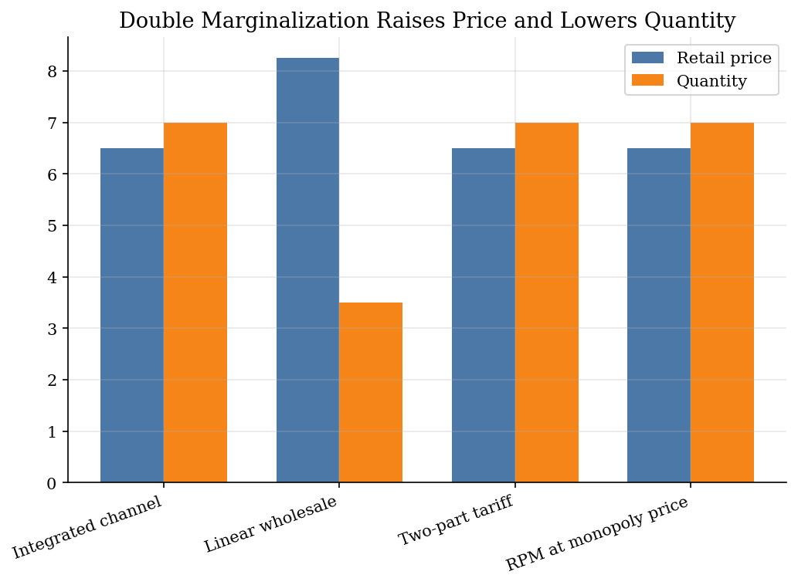
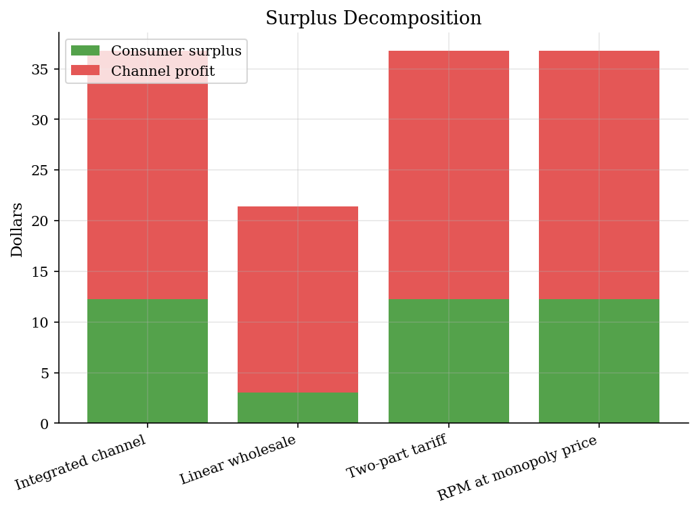
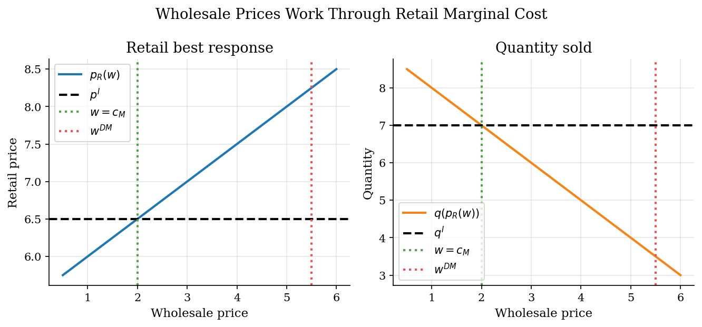

# Vertical Relationships and Double Marginalization

> How marginal wholesale prices distort a separated retail channel.

## Overview

The economic issue is not that a manufacturer and a retailer disagree about the monopoly price. They would both like the channel to sell the joint-profit-maximizing quantity. The problem is the instrument. With a linear wholesale price, the upstream margin becomes part of the retailer's marginal cost, so the downstream firm adds another margin on top of it. The channel then under-sells relative to an integrated firm.

Demand is simple so the contract logic stays visible. A two-part tariff uses a low per-unit wholesale price to restore the downstream pricing incentive, then uses a fixed fee to move profit upstream. Resale price maintenance instead controls the retail price directly. These mechanisms are the pricing counterpart to the firm-boundary problem in [theory of the firm](../theory-of-the-firm/) and a simpler precursor to the assortment contracts in [vertical contracts](../vertical-contracts/).

## Equations

Let demand be summarized by the linear quantity rule
$$q(p)=a-bp,\qquad p\leq \bar p\equiv a/b,$$
where $p$ is the retail price, $a$ is market size, $b$ is the demand slope, and
$\bar p$ is the choke price. The upstream marginal cost is $c_M$ and the
retailer's own marginal selling cost is $c_R$.

The integrated channel chooses $p$ to maximize
$$\Pi^I(p)=(p-c_M-c_R)q(p),$$
so the joint-profit price is
$$p^I=\frac{\bar p+c_M+c_R}{2}.$$

Under a linear wholesale contract, the manufacturer sets a per-unit wholesale
price $w$ and the retailer solves
$$\max_p\ (p-w-c_R)q(p).$$
The retailer's best response is
$$p_R(w)=\frac{\bar p+w+c_R}{2}.$$

The manufacturer anticipates that response and solves
$$\max_w\ (w-c_M)q(p_R(w)),$$
which gives
$$w^{DM}=\frac{\bar p-c_R+c_M}{2}.$$
Because $w^{DM}>c_M$, the retailer prices as if marginal cost is higher than
the true channel cost.

A two-part tariff replaces the high marginal wholesale price with
$$w^{TPT}=c_M$$
and lets the fixed fee
$$F=(p^I-c_M-c_R)q(p^I)$$
transfer the retailer's operating profit upstream. Resale price maintenance
sets the retail price at $p^I$ directly; in this calibration the wholesale price
can then be chosen so the downstream participation constraint binds.

## Model Setup

The calibration is small enough to solve analytically. All dollar amounts below are in the same arbitrary unit, and the integrated channel is a benchmark rather than an observed ownership structure.

| Parameter | Value | Description |
|-----------|-------|-------------|
| $a$ | 20.0 | Demand intercept |
| $b$ | 2.0 | Demand slope |
| $\bar p=a/b$ | 10.0 | Choke price |
| $c_M$ | 2.0 | Manufacturer marginal cost |
| $c_R$ | 1.0 | Retail service cost |
| Contracts | 4 | Integrated benchmark, linear wholesale, two-part tariff, resale price maintenance |

## Solution Method

The solution is backward induction with closed-form first-order conditions. The computation is mainly accounting: evaluate each contract using the same demand curve, then compare price, quantity, channel profit, and consumer surplus to the integrated benchmark.

```text
Inputs: demand q(p)=a-bp, costs c_M and c_R, contract set K

Integrated benchmark:
    p_I = (a/b + c_M + c_R) / 2
    q_I = q(p_I)

Linear wholesale contract:
    For any wholesale price w:
        retailer best response p_R(w) = (a/b + w + c_R) / 2
    Manufacturer chooses w_DM to maximize (w-c_M) q(p_R(w))
    Evaluate p_R(w_DM), q(p_R(w_DM)), and surplus

Counterfactual contracts:
    Two-part tariff: set w=c_M, p=p_I, and fixed fee F=(p_I-c_M-c_R)q_I
    Resale price maintenance: set p=p_I and choose w so retailer profit is zero

Outputs: contract outcomes and pass-through curve p_R(w)
```

The integrated solution is the analytic ground truth for the channel's joint-profit problem. The figures use that benchmark to mark what is lost under the separated linear contract and what the alternative contracts restore.

## Results

The separated linear contract is the outlier. The wholesale price $5.50$ makes the retailer behave as if its marginal cost is well above the true channel cost, so price rises and quantity falls. The two-part tariff and the resale-price-maintenance counterfactual both put the retail price back on the integrated-channel line.



The transfer between upstream and downstream firms is not the welfare loss. The loss comes from the smaller quantity sold under the linear wholesale contract. Once the marginal wholesale price is neutralized, consumer surplus and channel profit both return to the integrated benchmark in this simple single-product environment.



The pass-through exercise varies only the per-unit wholesale price. Moving from $w=c_M$ to $w^{DM}$ traces the double-marginalization mechanism: the retailer's best response price rises mechanically with perceived marginal cost, and the quantity gap opens relative to the integrated benchmark.



The table separates efficiency from incidence. Channel profit and consumer surplus describe the real allocation. Manufacturer and retailer profits show how each contract allocates that profit; for the integrated benchmark the internal split is just a transfer convention.

**Contract outcomes**

| Contract                 |   Retail price |   Wholesale price |   Fixed fee |   Quantity |   Channel profit |   Consumer surplus |   Total surplus |   Manufacturer profit |   Retailer profit |
|:-------------------------|---------------:|------------------:|------------:|-----------:|-----------------:|-------------------:|----------------:|----------------------:|------------------:|
| Integrated benchmark     |           6.5  |               2   |         0   |        7   |            24.5  |              12.25 |           36.75 |                  0    |             24.5  |
| Linear wholesale         |           8.25 |               5.5 |         0   |        3.5 |            18.38 |               3.06 |           21.44 |                 12.25 |              6.12 |
| Two-part tariff          |           6.5  |               2   |        24.5 |        7   |            24.5  |              12.25 |           36.75 |                 24.5  |              0    |
| Resale price maintenance |           6.5  |               5.5 |         0   |        7   |            24.5  |              12.25 |           36.75 |                 24.5  |              0    |

## Takeaway

Distinguish marginal incentives from transfers. A high wholesale price changes the downstream pricing first-order condition, so it creates a real quantity distortion. A fixed fee moves profit without changing the retailer's marginal cost. Nonlinear pricing can therefore remove double marginalization while still letting the upstream firm extract the channel's profit.

## References

- Tirole, J. (1988). *The Theory of Industrial Organization*. MIT Press.
- Asker, J. (2016). Diagnosing Foreclosure Due to Exclusive Dealing. *Journal of Industrial Economics*, 64(3), 375-410.
- Lecture 7 Slides 2023: Vertical relationships, double marginalization, and restraints.
