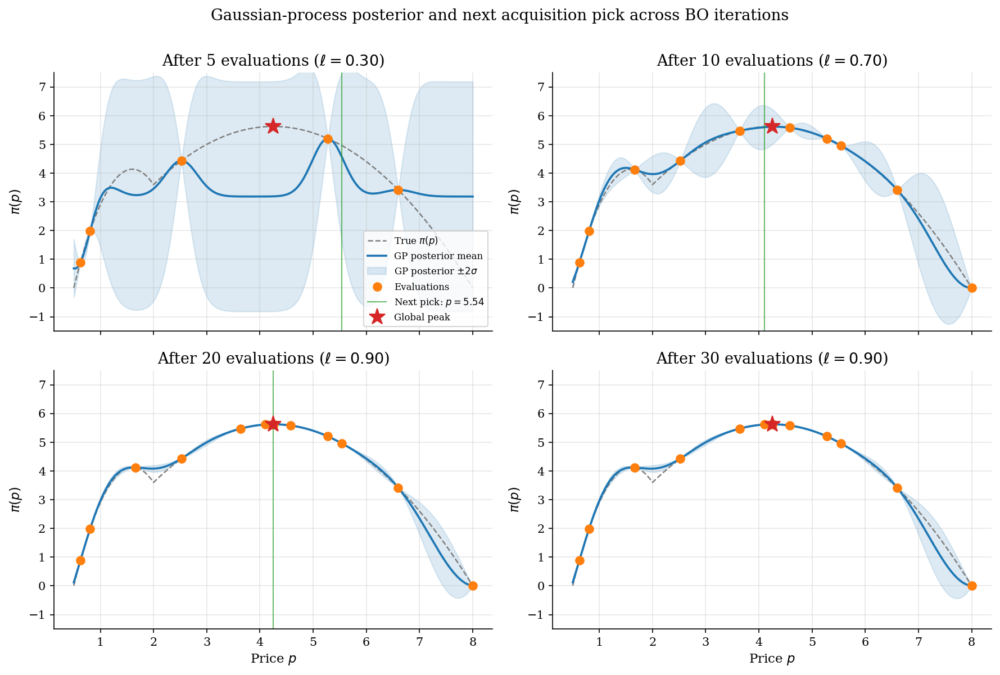
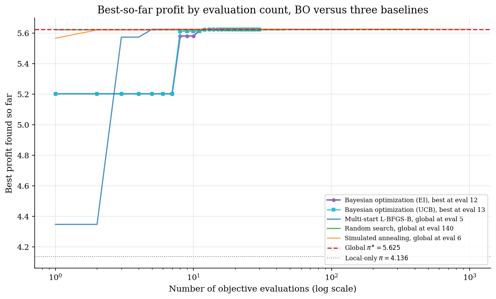

# Bayesian Optimization with a Gaussian-Process Surrogate

## Overview

Many structural objectives are expensive. A particle-filtered likelihood, a simulated-method-of-moments criterion, or a nested fixed-point estimator can take seconds to minutes per evaluation. Multi-start L-BFGS-B and simulated annealing recover the global optimum on such surfaces, but they pay hundreds to thousands of evaluations to do so.

Bayesian optimization is a sample-efficient alternative for that regime. It places a probabilistic prior on the unknown objective and updates that prior to a posterior conditional on the evaluations collected so far. It then chooses the next evaluation by maximizing an acquisition function that trades off exploration of uncertain regions against exploitation of high-mean regions. The same Bayesian update machinery powers the conjugate Beta-Binomial example in `computational-methods/metropolis-hastings/`; here it acts on an unknown function rather than a scalar probability. On problems with a few tens of dimensions and expensive black-box evaluations, this loop typically finds the global optimum in tens of evaluations rather than thousands.

Bayesian optimization is the gradient-free member of a family. When the objective is differentiable and the goal is to sample its posterior rather than maximize it, Hamiltonian Monte Carlo in `computational-methods/hamiltonian-monte-carlo/` is the gradient-based analogue. Both methods share the same motivation, sample efficiency under expensive evaluations, and the same probabilistic framing, but they apply at opposite ends of the gradient-availability spectrum.

The objective here is the same two-segment monopoly profit used in `numerical-methods/global-search-multistart/`. It is cheap to evaluate, which makes it a poor production target for Bayesian optimization. It is a good teaching target. The two local peaks are well separated, the global is known analytically, and the head-to-head budget is directly comparable to multi-start, random search, and simulated annealing on the same problem.

## Equations

A monopolist faces a population of consumers split between two segments.
Segment $L$ has linear demand with intercept $A_L > 0$ and slope $b_L > 0$.
Segment $H$ has linear demand with intercept $A_H > 0$ and slope $b_H > 0$.

$$D_L(p) = \max\lbrace 0,\, A_L - b_L\, p \rbrace,
\qquad
D_H(p) = \max\lbrace 0,\, A_H - b_H\, p \rbrace.$$

With low-segment share $\lambda \in (0, 1)$ and constant marginal cost $c \ge 0$, the mixture profit is

$$\pi(p) = (p - c) \left[\lambda\, D_L(p) + (1 - \lambda)\, D_H(p)\right].$$

The objective is piecewise quadratic in $p$ with a strict local maximum at the both-segments peak $p_L^{\ast}$ and a global maximum at the high-only peak $p_H^{\ast}$.
On the calibration used here, $p_L^{\ast} \approx 1.603$ with $\pi \approx 4.14$, and $p_H^{\ast} = 4.25$ with $\pi \approx 5.625$.

Bayesian optimization treats $\pi$ as an unknown function on a bracket $\mathcal{X} = [p_{\mathrm{lo}}, p_{\mathrm{hi}}]$.
It places a probabilistic prior on $\pi$, updates that prior to a posterior conditional on the evaluations collected so far, and selects the next evaluation by maximizing an acquisition function on the posterior.
This is the same Bayesian update that produces a Beta posterior from a Beta-Binomial conjugate model in `computational-methods/metropolis-hastings/`; here the prior is over an unknown function rather than a scalar probability, and conjugacy is replaced by the closed form for conditioning a joint Gaussian.

### Method 1: Gaussian-process surrogate

A Gaussian process $\mathcal{GP}(m, k)$ is a distribution over functions $f : \mathcal{X} \to \mathbb{R}$ such that for any finite set of inputs $X = (x_1, \ldots, x_n) \in \mathcal{X}^n$ the vector of function values $f(X) = (f(x_1), \ldots, f(x_n)) \in \mathbb{R}^n$ is jointly Gaussian with mean $m(X) = (m(x_1), \ldots, m(x_n))$ and covariance matrix $K(X, X) \in \mathbb{R}^{n \times n}$ with entries $K_{ij} = k(x_i, x_j)$.
The process is fully specified by its mean function $m : \mathcal{X} \to \mathbb{R}$ and its covariance kernel $k : \mathcal{X} \times \mathcal{X} \to \mathbb{R}$.
We use a zero-mean prior, $f \sim \mathcal{GP}(0, k)$, with the squared-exponential kernel

$$k(x, x') = \sigma_f^2 \exp\left(-\tfrac{(x - x')^2}{2\, \ell^2}\right).$$

Here $\sigma_f > 0$ is the prior signal standard deviation and $\ell > 0$ is the length scale, which controls how quickly the kernel decays with distance.
A small $\ell$ gives a wiggly prior; a large $\ell$ gives a smooth prior.

Suppose we have observed evaluations $y_i = f(x_i) + \varepsilon_i$ for $i = 1, \ldots, n$, where the observation noise $\varepsilon_i \sim \mathcal{N}(0, \sigma_n^2)$ is independent and $\sigma_n > 0$ is the noise standard deviation.
Stack the targets into $y = (y_1, \ldots, y_n)^{\top} \in \mathbb{R}^n$.
Because the joint distribution of $(y, f(x_{\ast}))$ at any new input $x_{\ast} \in \mathcal{X}$ is Gaussian by construction, the conditional distribution $f(x_{\ast}) \mid (X, y)$ is also Gaussian, with closed-form posterior mean $\mu(x_{\ast})$ and variance $\sigma^2(x_{\ast})$:

$$\mu(x_{\ast}) = \underbrace{k(x_{\ast}, X)}_{\text{similarity to training inputs}} \underbrace{\left[K(X, X) + \sigma_n^2 I\right]^{-1} y}_{\text{noise-corrected training residual}},$$

$$\sigma^2(x_{\ast}) = \underbrace{k(x_{\ast}, x_{\ast})}_{\text{prior variance at } x_{\ast}} - \underbrace{k(x_{\ast}, X) \left[K(X, X) + \sigma_n^2 I\right]^{-1} k(X, x_{\ast})}_{\text{variance explained by the data}}.$$

The vector $k(x_{\ast}, X) \in \mathbb{R}^n$ collects the kernel values $(k(x_{\ast}, x_1), \ldots, k(x_{\ast}, x_n))$ and $I$ is the $n \times n$ identity matrix.
Read the posterior mean as a kernel-weighted regression: the row vector $k(x_{\ast}, X)$ gives the similarity of the candidate to each evaluated point, and the precision-weighted residual $[K + \sigma_n^2 I]^{-1} y$ tells the formula how to combine those similarities.
Read the posterior variance as "prior variance minus what the data already explain", which is the GP analogue of the Bayesian shrinkage identity $\mathrm{Var}(\theta) = \mathrm{Var}(\mathbb{E}[\theta \mid D]) + \mathbb{E}[\mathrm{Var}(\theta \mid D)]$.
The subtracted term cannot exceed the prior, so the posterior variance is always nonnegative and shrinks toward zero as the candidate moves close to an evaluated point.
The variance collapsing at evaluated points is what makes Expected Improvement avoid re-querying the same input, and it is the reason posterior variance is the right signal for "where would another evaluation be informative".

### Method 2: Expected Improvement acquisition

Let $f^{\ast} = \max_{i \le n} y_i$ denote the best observed value so far.
Expected Improvement scores a candidate $x \in \mathcal{X}$ by the expected positive gain over $f^{\ast}$, with expectation taken under the GP posterior at $x$:

$$\mathrm{EI}(x) = \mathbb{E}\left[\max\lbrace f(x) - f^{\ast} - \xi,\, 0 \rbrace \mid X, y \right].$$

The parameter $\xi \ge 0$ is an exploration tilt, in units of the objective: it requires a posterior improvement of at least $\xi$ before contributing to the score.
Since $f(x) \mid X, y \sim \mathcal{N}(\mu(x), \sigma^2(x))$, the expectation is a truncated-Gaussian integral with the closed form

$$\mathrm{EI}(x) = \underbrace{(\mu(x) - f^{\ast} - \xi)\, \Phi(z)}_{\text{exploitation: bet on posterior mean}} + \underbrace{\sigma(x)\, \phi(z)}_{\text{exploration: bet on posterior spread}},
\qquad
z = \frac{\mu(x) - f^{\ast} - \xi}{\sigma(x)},$$

valid whenever $\sigma(x) > 0$.
Here $\Phi$ and $\phi$ denote the cumulative distribution function and probability density function of the standard normal distribution $\mathcal{N}(0, 1)$.
The split into exploitation plus exploration is why Expected Improvement works without a hand-tuned trade-off.
The first term is large where the posterior mean already exceeds the best observation, so it pulls the search toward known promising regions.
The second term is large where the posterior standard deviation is high, which only happens away from evaluated points, so it pulls the search toward unexplored regions.
Expected Improvement vanishes at evaluated points because $\sigma(x_i) = 0$ there, so the loop never re-evaluates the same input.
The Bayesian-optimization loop alternates between fitting the GP and maximizing $\mathrm{EI}$ to pick the next evaluation, repeating until the evaluation budget is exhausted.

## Model Setup

| Symbol | Value | Role |
|--------|-------|------|
| $A_L$, $b_L$ | 10.0, 5.0 | Low-valuation linear demand |
| $A_H$, $b_H$ | 8.0, 1.0 | High-valuation linear demand |
| $c$ | 0.5 | Marginal cost |
| $\lambda$ | 0.6 | Share of low-valuation consumers |
| Search bracket | $[0.501,\, 8.0]$ | Outer bounds for every method |
| Low peak | $p_L^{\ast} = 1.6029$, $\pi = 4.1360$ | Local maximum |
| High peak | $p_H^{\ast} = 4.2500$, $\pi = 5.6250$ | Global maximum |
| Initial design | 5 uniform draws, seed 0 | Seed observations for the GP |
| BO iterations | 25 | Acquisition-driven evaluations |
| Total BO budget | 30 | Per acquisition rule |
| Kernel signal std $\sigma_f$ | 2.00 | Squared-exponential kernel |
| Kernel noise std $\sigma_n$ | 1e-03 | Almost-deterministic profit |
| Length-scale grid | $[0.30,\, 2.50]$, 12 points | Tuned by log marginal likelihood |
| EI exploration $\xi$ | 0.00 | Posterior-improvement tilt |

## Solution Method

Bayesian optimization is a single loop. Fit a Gaussian-process surrogate to the evaluations collected so far, maximize an acquisition function on the surrogate to pick the next point, evaluate the true objective there, and repeat. The three components below define each part of the loop.

### Method 1: Gaussian-process surrogate

The Gaussian process places a prior on the unknown profit function. After $n$ evaluations $(X, y)$ the posterior at any candidate price $x_{\ast}$ is Gaussian with closed-form mean and variance. The closed form requires one Cholesky factor of the $n \times n$ kernel matrix, so the cost is $O(n^3)$ in evaluations and $O(n^2)$ per prediction. For budgets of tens to hundreds of evaluations this is negligible.

```text
Algorithm: GP posterior at candidates X_star
Input : training inputs X, targets y, kernel k, noise sigma_n
Output: posterior mean mu(X_star), posterior std sigma(X_star)
  K   = k(X, X) + sigma_n^2 * I
  L   = cholesky(K)
  a   = solve(L^T, solve(L, y - mean(y)))
  k_s = k(X, X_star)
  mu        = mean(y) + k_s^T @ a
  v         = solve(L, k_s)
  variance  = k(X_star, X_star) - sum(v^2, axis=0)
```

The length scale $\ell$ is the key hyperparameter. A small $\ell$ produces a wiggly surrogate that fits each observation tightly but extrapolates poorly. A large $\ell$ produces a smooth surrogate that may miss narrow basins. We refit $\ell$ at each step by maximizing the log marginal likelihood over a coarse grid. This is the cleanest empirical-Bayes choice and avoids the optimizer-inside-optimizer problem of joint hyperparameter and acquisition maximization.

### Method 2: Expected Improvement acquisition

Expected Improvement is the canonical Bayesian-optimization acquisition. It is the expected value, under the GP posterior, of the gain over the best evaluation seen so far. It collapses to zero at evaluated points because their posterior variance is zero, which prevents the loop from re-evaluating the same input. It rewards both posterior mean and posterior standard deviation, so the trade-off between exploitation and exploration is automatic.

```text
Algorithm: One step of Bayesian optimization with Expected Improvement
Input : evaluated inputs X, targets y, kernel hyperparameters, candidate grid X_star
Output: next evaluation x_new
  fit GP on (X, y)
  predict (mu, sigma) on X_star
  f_best = max(y)
  z   = (mu - f_best - xi) / sigma
  EI  = (mu - f_best - xi) * Phi(z) + sigma * phi(z)
  x_new = X_star[argmax(EI)]
```

Expected Improvement fails when the posterior is badly miscalibrated. If the length scale is too large the surrogate underestimates the local curvature near a peak and Expected Improvement under-explores. If the length scale is too small the surrogate over-credits noise and Expected Improvement over-explores. The diagnostic is to plot the posterior mean and the one-sigma band against the true objective at the snapshot iterations, which we do below.

The full Bayesian-optimization loop is the surrogate, the acquisition, and a small initial design glued together. The initial design is needed because the GP needs a few observations before its posterior is informative; five uniform draws is enough on this problem.

```text
Algorithm: Bayesian optimization with Expected Improvement
Input : objective f, bounds, kernel, initial size n0, total budget T
Output: argmax of evaluated points
  draw n0 uniform points X = (x_1, ..., x_n0) from bounds, evaluate y = f(X)
  for t = n0 + 1, ..., T:
      refit GP hyperparameters by log marginal likelihood maximization
      predict (mu, sigma) on a dense candidate grid
      x_t = argmax of EI(x) on the grid
      y_t = f(x_t)
      X, y <- append (x_t, y_t)
  return (x_k, y_k) with k = argmax of y
```

Bayesian optimization is not magic. It pays for sample efficiency with stronger assumptions on the objective and with model fitting in the inner loop. When evaluations are cheap, simulated annealing or multi-start L-BFGS-B is faster end to end. When evaluations are expensive, the inner-loop cost is dominated by a single objective call and Bayesian optimization wins by orders of magnitude.

## Results

The profit surface is reproduced from `numerical-methods/global-search-multistart/`. It has a local peak at $p_L^{\ast} = 1.603$ with profit $\pi = 4.136$. Above the kink at $p_L^{\max} = 2.00$ only the high-valuation segment is active. The high-only regime has its own peak at $p_H^{\ast} = 4.25$ with profit $\pi = 5.625$, which is the global maximum on this calibration.


The four panels show the Gaussian-process posterior at 5, 10, 20, and 30 evaluations. With 5 uniform draws the posterior mean is flat between observations and the uncertainty band is wide. Expected Improvement immediately probes regions of high mean and high variance, which on this surface means evaluating points near the high-price peak. By iteration 20 the posterior mean tracks the true profit closely in both basins, and by iteration 30 Expected Improvement has localized around $p_H^{\ast} = 4.25$ with very small posterior variance.



The convergence plot is the head-to-head against the same three baselines as `numerical-methods/global-search-multistart/`. Bayesian optimization with Expected Improvement finds the global at evaluation 12 and converges sharply within its budget of 30 evaluations. The baselines also recover the global on this seed, but they spend much larger budgets to do so. Random search needs 140 draws before luck delivers an above-global point, and runs through all 500 draws because it has no stopping rule. Multi-start L-BFGS-B happens to seed its first start in the high basin and converges there in 5 L-BFGS-B calls. Over 50 starts it still spends 312 L-BFGS-B calls in total. Simulated annealing also locates the global early in this run but burns roughly 1007 evaluations on its cooling schedule. The right comparison is total budget, not first discovery: Bayesian optimization uses 30 evaluations end to end, multi-start uses 312, random search uses 500, and simulated annealing uses about 1007.



The comparison table is normalized on the same objective and bracket. All four methods recover the global peak. The Bayesian-optimization budget is two orders of magnitude smaller than simulated annealing and one order smaller than random search or multi-start.

**Method comparison at $\lambda = 0.6$, $c = 0.5$, segment intercepts $(10, 8)$**

| Method                     | Setting                         |   Estimated optimum |   Profit |   Function evaluations |   Evaluations to global |
|:---------------------------|:--------------------------------|--------------------:|---------:|-----------------------:|------------------------:|
| Bayesian optimization (EI) | 5 initial + 25 EI steps, seed 0 |              4.2505 |    5.625 |                     30 |                      12 |
| Multi-start L-BFGS-B       | 50 starts, seed 2               |              4.25   |    5.625 |                    312 |                       5 |
| Random search              | 500 draws, seed 1               |              4.2532 |    5.625 |                    500 |                     140 |
| Simulated annealing        | max iterations 500, seed 3      |              4.25   |    5.625 |                   1007 |                       6 |

The iteration log records every Bayesian-optimization evaluation with Expected Improvement. The first 5 rows are the initial uniform design. The remaining 25 rows are EI-chosen evaluations. The best-so-far column converges to the global peak well before the 30-evaluation budget is exhausted.

**Per-iteration log of the EI-driven Bayesian-optimization run**

|   Iteration | Phase     |   Price evaluated |   Profit observed |   Best profit so far |
|------------:|:----------|------------------:|------------------:|---------------------:|
|           1 | initial   |            5.2776 |            5.2026 |               5.2026 |
|           2 | initial   |            2.5241 |            4.4335 |               5.2026 |
|           3 | initial   |            0.8083 |            1.9889 |               5.2026 |
|           4 | initial   |            0.6249 |            0.884  |               5.2026 |
|           5 | initial   |            6.5997 |            3.4165 |               5.2026 |
|           6 | EI-guided |            5.5403 |            4.959  |               5.2026 |
|           7 | EI-guided |            1.6633 |            4.1236 |               5.2026 |
|           8 | EI-guided |            4.5805 |            5.5813 |               5.5813 |
|           9 | EI-guided |            3.6356 |            5.474  |               5.5813 |
|          10 | EI-guided |            8      |            0      |               5.5813 |
|          11 | EI-guided |            4.1005 |            5.6161 |               5.6161 |
|          12 | EI-guided |            4.258  |            5.625  |               5.625  |
|          13 | EI-guided |            4.2505 |            5.625  |               5.625  |
|          14 | EI-guided |            4.2505 |            5.625  |               5.625  |
|          15 | EI-guided |            4.2505 |            5.625  |               5.625  |
|          16 | EI-guided |            4.2505 |            5.625  |               5.625  |
|          17 | EI-guided |            4.2505 |            5.625  |               5.625  |
|          18 | EI-guided |            4.2505 |            5.625  |               5.625  |
|          19 | EI-guided |            4.2505 |            5.625  |               5.625  |
|          20 | EI-guided |            4.2505 |            5.625  |               5.625  |
|          21 | EI-guided |            4.2505 |            5.625  |               5.625  |
|          22 | EI-guided |            4.2505 |            5.625  |               5.625  |
|          23 | EI-guided |            4.2505 |            5.625  |               5.625  |
|          24 | EI-guided |            4.2505 |            5.625  |               5.625  |
|          25 | EI-guided |            4.2505 |            5.625  |               5.625  |
|          26 | EI-guided |            4.2505 |            5.625  |               5.625  |
|          27 | EI-guided |            4.2505 |            5.625  |               5.625  |
|          28 | EI-guided |            4.2505 |            5.625  |               5.625  |
|          29 | EI-guided |            4.2505 |            5.625  |               5.625  |
|          30 | EI-guided |            4.2505 |            5.625  |               5.625  |

## Takeaway

Bayesian optimization is the right tool when evaluations are expensive. On the two-segment monopoly profit it recovers the global peak in roughly thirty evaluations, where simulated annealing needs over a thousand and random search several hundred. Sample efficiency is the entire pitch.

Bayesian optimization is the wrong tool when evaluations are cheap. The Gaussian-process posterior costs $O(n^3)$ in evaluations because of the kernel-matrix Cholesky factor. On a problem where one evaluation takes milliseconds, multi-start L-BFGS-B or simulated annealing dominates Bayesian optimization on wall-clock time even though it uses far more evaluations.

Bayesian optimization is fragile in high dimensions and on non-stationary surfaces. The squared-exponential kernel assumes a single length scale across the whole input space. Many structural objectives have one length scale near a flat plateau and a much shorter one near a sharp peak. Beyond about twenty dimensions the curse of dimensionality erodes the sample-efficiency gain, and the right tool is usually a structured surrogate or a trust-region method.

The Bayesian framing of the surrogate matters. Each acquisition decision is a tractable inference on the posterior of the unknown profit. The same framing returns in `computational-methods/metropolis-hastings/` for posterior sampling of structural parameters, and the natural use case for Bayesian optimization in structural work is the outer search over a small set of parameters whose likelihood is itself estimated by an expensive inner routine.

## References

- Mockus, J., Tiesis, V., and Zilinskas, A. (1978). The application of Bayesian methods for seeking the extremum. In *Towards Global Optimization*, vol. 2, North-Holland, 117-129.
- Jones, D. R., Schonlau, M., and Welch, W. J. (1998). *Efficient Global Optimization of Expensive Black-Box Functions*. Journal of Global Optimization, 13, 455-492.
- Snoek, J., Larochelle, H., and Adams, R. P. (2012). *Practical Bayesian Optimization of Machine Learning Algorithms*. NIPS.
- Srinivas, N., Krause, A., Kakade, S., and Seeger, M. (2010). *Gaussian Process Optimization in the Bandit Setting: No Regret and Experimental Design*. ICML.
- Frazier, P. I. (2018). *A Tutorial on Bayesian Optimization*. arXiv:1807.02811.
- Rasmussen, C. E. and Williams, C. K. I. (2006). *Gaussian Processes for Machine Learning*. MIT Press, Ch. 2 and 5.
- **See also.** The same two-segment monopoly profit is optimized by single-start and multi-start L-BFGS-B, random search, Nelder-Mead, and simulated annealing in `numerical-methods/global-search-multistart/`. That tutorial documents the reporting discipline for global search; the present one documents a sample-efficient alternative for expensive evaluations. The Bayesian update behind the Gaussian-process posterior is the same one used in conjugate form in `computational-methods/metropolis-hastings/`, and the gradient-based sampling analogue for expensive *differentiable* posteriors is `computational-methods/hamiltonian-monte-carlo/`. Together the four tutorials cover the global-search, surrogate-optimization, posterior-sampling, and gradient-sampling corners of expensive-objective inference.
