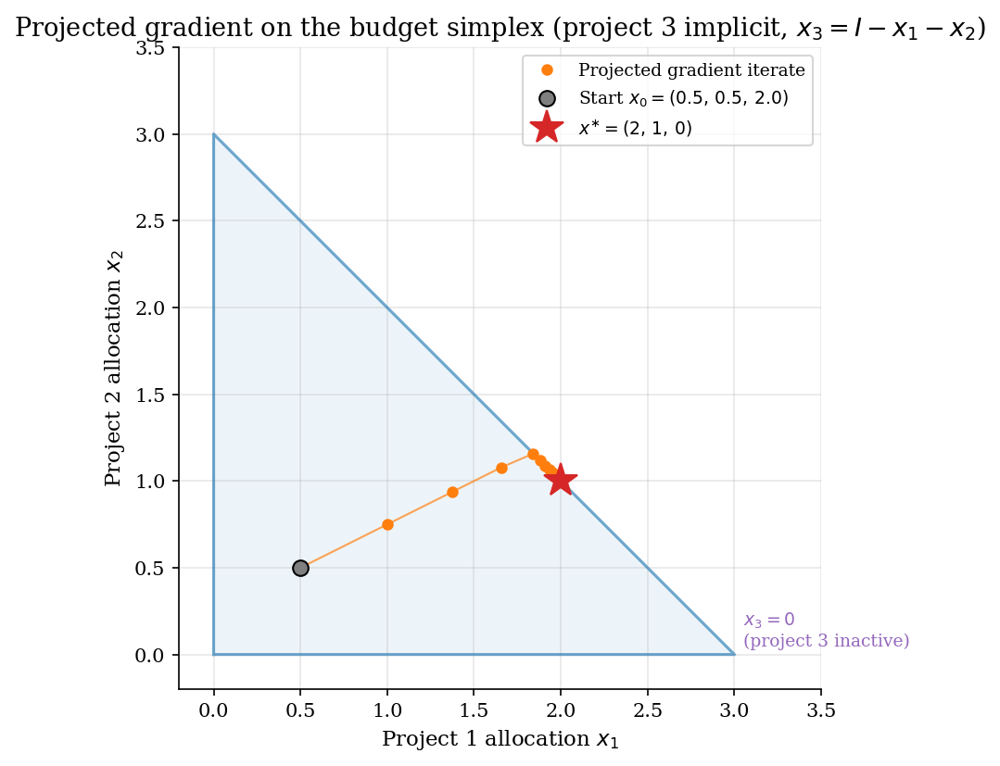
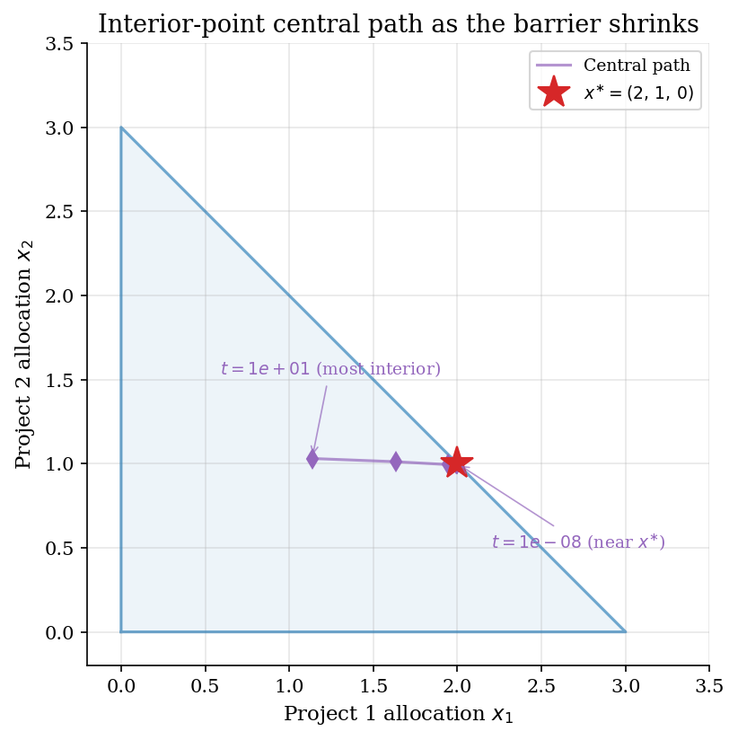
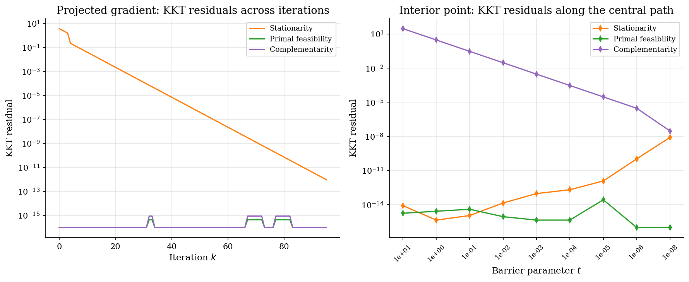
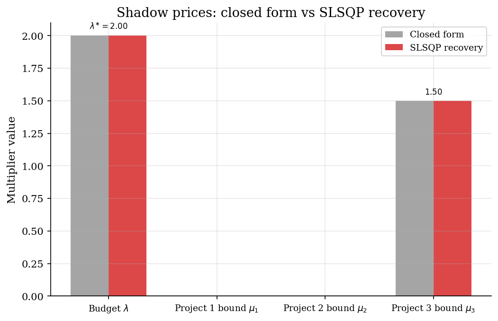

# Constrained Optimization and KKT Conditions

## Overview

A planner has a fixed budget and three projects to fund. Each project has diminishing returns. Allocations cannot be negative. The question is how the planner should split the budget when one of the projects is too weak to fund at all.

This tutorial compares three methods that solve the constrained problem. Before the methods we show a baseline that ignores the non-negativity bounds. The baseline returns a negative allocation, which is the failure mode that motivates the rest of the tutorial.

The three methods are projected gradient, an interior-point log barrier, and SLSQP. All three return the correct allocation. They differ in how they keep iterates feasible and in how they recover the Lagrange multipliers.

The main lesson is that the value of the objective is not enough to judge a constrained answer. What matters is the set of Karush-Kuhn-Tucker conditions: stationarity, primal feasibility, dual feasibility, and complementary slackness. The Lagrange multipliers on binding constraints are the shadow prices that the economist actually wants to read.

## Equations

The planner picks an allocation vector $x \in \mathbb{R}^3$.
Each entry $x_j$ is the budget share assigned to project $j$.
Utility is quadratic in $x$.

$$u(x) = a^\top x - \tfrac{1}{2}\, x^\top B x.$$

$a \in \mathbb{R}^3$ is the vector of marginal returns at zero allocation.
$B$ is a symmetric positive-definite matrix.
A positive-definite $B$ makes $u$ strictly concave, so the constrained maximum is unique.
The diagonal entries of $B$ measure each project's curvature.

Two constraints bind the choice.
The first is a budget cap on total spending.
The second is a separate non-negativity bound on each project.

$$\sum_{j=1}^{3} x_j \leq I,
\qquad x_j \geq 0,\quad j = 1, 2, 3.$$

The Lagrangian builds in both constraints.
$\lambda$ is the multiplier on the budget cap.
$\mu = (\mu_1, \mu_2, \mu_3)$ are the multipliers on the three non-negativity bounds.

$$\mathcal{L}(x, \lambda, \mu) = a^\top x - \tfrac{1}{2}\, x^\top B x - \lambda \left(\sum_j x_j - I \right) + \mu^\top x.$$

A Karush-Kuhn-Tucker (KKT) point is the constrained optimum.
The KKT conditions split into four blocks.
Each block has a clean economic reading.

The first block is stationarity.
It equates the gradient of utility with the shadow-price vector.

$$a - B x - \lambda\, \mathbf{1} + \mu = 0.$$

The second block is primal feasibility.
It is just the constraint set written out again.

$$\sum_j x_j \leq I,
\qquad x_j \geq 0.$$

The third block is dual feasibility.
It says every shadow price is non-negative.

$$\lambda \geq 0,
\qquad \mu_j \geq 0.$$

The fourth block is complementary slackness.
It says either a constraint binds or its multiplier is zero, never both.

$$\lambda \left(I - \sum_j x_j \right) = 0,
\qquad \mu_j\, x_j = 0.$$

The baseline calibration is $a = (4, 3, 0.5)$, $B = I_3$, and $I = 3$.
The unconstrained maximum is $a$ itself.
Its sum is $7.5$, which exceeds the budget of $3$.
The budget therefore binds at the constrained optimum.
A second active-set check shows that project 3 also hits its non-negativity bound.
With those two constraints active, the closed form is direct.

$$x^{\ast} = (2,\, 1,\, 0),
\qquad
\lambda^{\ast} = 2,
\qquad
\mu^{\ast} = (0,\, 0,\, 1.5).$$

The non-zero multiplier $\mu_3^{\ast} = 1.5$ is the shadow price of the non-negativity bound on project 3.
It is the utility a vanishingly small relaxation of $x_3 \geq 0$ would buy.

The baseline failure follows when an analyst keeps only the budget equality and drops the non-negativity bounds.
The Lagrangian is then linear in $x$ and $\lambda$.

$$x = a - \lambda\, \mathbf{1},
\qquad
\lambda = \frac{\sum_j a_j - I}{n}.$$

At the calibration this gives $\lambda = 1.5$ and $x = (2.5, 1.5, -1)$.
Project 3 receives a negative allocation, which has no economic meaning.

Method 1 takes a gradient step on $u$ and then projects the result onto the simplex $\Delta_I = \lbrace x : x \geq 0,\, \sum_j x_j = I \rbrace$.

$$x_{k+1} = \Pi_{\Delta_I}\left(x_k + \alpha\, (a - B x_k)\right).$$

$\alpha$ is the step size and $\Pi_{\Delta_I}$ is Euclidean projection onto the simplex.
The step size must satisfy $\alpha \leq 1/L$ where $L$ is the operator norm of $B$.
With $B = I_3$ the bound is $\alpha \leq 1$.

Method 2 replaces the non-negativity inequalities with a log-barrier penalty controlled by a parameter $t > 0$.

$$\min_x\, -u(x) - t \sum_j \log x_j
\qquad \text{subject to} \quad \sum_j x_j = I.$$

The barrier penalises iterates that approach the boundary $x_j = 0$.
As $t$ shrinks the optimum of the smoothed problem traces a central path.
The path converges to the true optimum $x^{\ast}$ in the limit $t \to 0$.

The first-order condition for the barrier subproblem is one equation per project plus the budget equality.

$$a_j - x_j - \lambda + \frac{t}{x_j} = 0,
\qquad \sum_j x_j = I.$$

For diagonal $B = I_3$ each project's component solves a quadratic in $x_j$.

$$x_j(\lambda;\, t) = \frac{(a_j - \lambda) + \sqrt{(a_j - \lambda)^2 + 4 t}}{2}.$$

The budget multiplier $\lambda$ is then the unique scalar that makes $\sum_j x_j(\lambda;\, t)$ equal $I$.
A single one-dimensional root finder solves for it.
The duality gap of the barrier problem is exactly $n \cdot t$, which is the per-project complementarity slack along the central path.

Method 3 calls SLSQP through `scipy.optimize.minimize`.
SLSQP linearises the constraints around the current iterate and solves a small quadratic-programming (QP) subproblem at each step.
The QP uses a BFGS approximation of the Hessian of the Lagrangian.
The QP solution becomes the search direction.
A line search along that direction picks the next iterate.
Multipliers are recovered after the fact from the stationarity equation by averaging $a_j - (B x)_j$ over the active set and solving for the bound multipliers on the inactive set.

## Model Setup

| Symbol | Value | Role |
|--------|-------|------|
| $a$ | $(4.0,\, 3.0,\, 0.5)$ | Marginal returns at zero allocation |
| $B$ | $I_3$ | Curvature of utility, diagonal positive definite |
| $I$ | 3.0 | Total budget |
| $n$ | 3 | Number of projects |
| $x^{\ast}$ | $(2.0,\, 1.0,\, 0.0)$ | Closed-form optimal allocation |
| $\lambda^{\ast}$ | 2.0 | Closed-form budget shadow price |
| $\mu^{\ast}$ | $(0.0,\, 0.0,\, 1.5)$ | Closed-form bound multipliers |
| $u^{\ast}$ | 8.5000 | Utility at the closed-form optimum |
| Step $\alpha$ | 0.25 | Projected gradient step size |
| Barrier sequence | $10$ down to $10^{-8}$ | Decreasing log-barrier parameters |
| Tolerance $\eta$ | 1e-12 | Stopping rule on iterate change |

## Solution Method

Three methods solve the constrained allocation problem. Before them comes a baseline that ignores the non-negativity bounds. The baseline returns the wrong answer and shows why the bounds matter.

### Baseline failure: Lagrangian on the budget alone

An analyst could write the Lagrangian for the budget only and solve it. This is fast and gives a closed form. It is also wrong whenever a non-negativity bound binds at the true optimum. Dropping a constraint that binds means dropping a piece of complementary slackness, so a wrong-sign answer becomes possible. The baseline is included here only to make the failure mode concrete.

```text
Algorithm: Lagrangian on the budget alone (baseline failure)
Input : a, B, I, project count n
Output: x_hat, lambda_hat
  lambda_hat <- (sum(a) - I) / n           # closed form, only valid when B = I
  x_hat      <- a - lambda_hat * ones(n)   # negative entries possible
```

At the baseline calibration the answer is $x = (2.5, 1.5, -1)$. Project 3 receives a negative allocation. Stationarity is satisfied for the smaller problem the analyst wrote down. Primal feasibility is the part that breaks. Reading off the utility value of this answer gives a number that exceeds the true optimum, which is the easiest way to publish a wrong result.

### Method 1: Projected gradient on the simplex

Projected gradient walks the iterate uphill in utility, then snaps it back to the feasible simplex. Each step has two pieces. The gradient piece is $y = x_k + \alpha\, (a - B x_k)$, which moves in the direction of steepest utility increase. The projection piece is $\Pi_{\Delta_I}(y)$, which finds the closest point in the budget simplex to $y$ in Euclidean distance. The composition keeps every iterate feasible, including non-negativity.

The simplex projection is closed form. Sort the components of $y$ in descending order. Find the largest index $\rho$ for which a running average is positive. Subtract a single scalar shift from $y$ and clip negatives to zero. The whole projection costs one sort plus a linear scan over $\rho$.

Convergence is linear in the gap to the optimum. The contraction rate is roughly $1 - \alpha\, \mu / L$, with $\mu$ the smallest eigenvalue of $B$ and $L$ the largest. On the calibration $B = I_3$ the eigenvalues coincide and the rate is $1 - \alpha$. The method needs only a gradient and the projection routine, which makes it the easiest constrained method to implement from scratch.

```text
Algorithm: Projected gradient on the budget simplex
Input : a, B, I, step alpha, tolerance eta, interior start x_0
Output: x_k
  for k = 0, 1, ... :
      grad     <- a - B x_k
      y        <- x_k + alpha * grad
      x_{k+1}  <- project_simplex(y, I)
      stop when ||x_{k+1} - x_k|| < eta

  project_simplex(y, I):
      sort y in descending order to get u_1 >= u_2 >= ... >= u_n
      cumsum_i <- u_1 + u_2 + ... + u_i
      rho      <- largest i with u_i - (cumsum_i - I) / i > 0
      theta    <- (cumsum_rho - I) / rho
      return max(y - theta, 0) componentwise
```

Projected gradient does not fail on this calibration. Its weak spot is the step size. A step larger than $1/L$ pushes the iterate so far that the projection wastes the work. A step well below $1/L$ slows convergence with no benefit. When the gradient is unavailable a finite-difference approximation works but adds noise that the linear convergence rate does not absorb well.

### Method 2: Interior-point log barrier

The log barrier replaces each hard non-negativity bound with a smooth penalty. The penalised objective is $-u(x) - t \sum_j \log x_j$, minimised subject to the budget equality. The penalty pushes iterates away from the boundary $x_j = 0$ because $\log x_j$ heads to $-\infty$ there. As the barrier parameter $t$ shrinks the penalty weakens and the optimum approaches the boundary.

Geometrically the optima of the smoothed problems trace a curve called the central path. The path starts deep in the interior at large $t$ and ends at $x^{\ast}$ as $t \to 0$. The duality gap along the path is exactly $n \cdot t$, which is the per-project complementarity slack. Choosing a geometrically decreasing schedule for $t$ gives geometric convergence to the constrained optimum.

Each subproblem in $t$ has a closed form when $B$ is diagonal. The first-order condition for project $j$ is a quadratic in $x_j$ given the budget multiplier $\lambda$. Solving it gives $x_j(\lambda; t)$ as an explicit function. The budget multiplier itself is then a single scalar root of $\sum_j x_j(\lambda; t) = I$, found by Brent's method on a wide bracket.

```text
Algorithm: Interior-point log barrier
Input : a, B, I, decreasing barrier sequence t_1 > t_2 > ... > t_K
Output: x_K close to the constrained optimum
  x_0 <- strictly interior feasible point
  for k = 1, ..., K :
      define x_j(lambda; t_k) = ((a_j - lambda) + sqrt((a_j - lambda)^2 + 4 t_k)) / 2
      solve sum_j x_j(lambda; t_k) = I for lambda using brentq
      x_k <- (x_1(lambda; t_k), ..., x_n(lambda; t_k))
```

The barrier needs a strictly interior starting point. A start with any $x_j = 0$ makes the log infinite, so it cannot be evaluated. The barrier schedule itself matters too. Shrinking $t$ too fast makes the budget multiplier jump and the root finder fails. A common choice is $t_{k+1} = t_k / 10$ once a few steps have stabilised the multiplier.

### Method 3: SLSQP via scipy.optimize.minimize

SLSQP stands for Sequential Least-SQuares Programming. It is a quasi-Newton method designed for constrained problems with smooth equalities and inequalities. At each iterate it linearises the constraints and forms a small quadratic-programming subproblem with a BFGS Hessian approximation of the Lagrangian. Solving that subproblem gives a search direction. A line search along the direction picks the next iterate.

The QP at iterate $x_k$ has the form: minimise a quadratic in the step $d$ subject to linear constraints in $d$. The quadratic coefficients come from the BFGS approximation of the Lagrangian Hessian, which is updated from gradient differences across iterations. The constraints are linearisations of the original equality and inequality constraints. An active-set routine inside the QP solver decides which inequalities bind. Convergence near a non-degenerate optimum is locally quadratic.

SLSQP is the practical default for small problems that mix equality and inequality constraints. It accepts analytical or finite-difference Jacobians, returns an iteration count, and converges in just a handful of QP solves on a problem this size.

```text
Algorithm: SLSQP via scipy.optimize.minimize
Input : objective f, gradient grad_f, equality g, bounds, x_0
Output: x_hat, iteration count, convergence flag
  scipy hands the problem to a Fortran SLSQP routine
  for each iterate x_k :
      build a QP in the step d:
          minimise (1/2) d^T H_k d + grad_f(x_k)^T d
          subject to grad_g(x_k)^T d + g(x_k) = 0
                     bounds on x_k + d
      solve the QP by an active-set method to get d_k
      do a line search along d_k to pick the next x_k
      update H_k by BFGS using the gradient difference
  recover lambda from the active-set stationarity equation
  recover mu by complementary slackness on inactive bounds
```

SLSQP is sensitive to the analytical Jacobian of the constraints. A wrong Jacobian silently mis-converges with no diagnostic. The default scaling can also struggle on problems where some constraints have much larger residuals than others. The remedy is either to rescale the constraints by hand or to switch to a method that does it internally, such as `scipy.optimize.minimize` with `method='trust-constr'`.

## Results

The feasible region is the budget triangle. Each vertex puts the entire budget on one project. The closed-form optimum sits on the hypotenuse where the project-3 bound is active. Projected gradient starts at $x_0 = (0.5,\, 0.5,\, 2.0)$, where project 3 is heavily over-funded. The first projection lands on the budget hyperplane and subsequent steps slide along it toward $x^{\ast}$. The run converges in **95** iterations and every iterate is feasible.



The barrier path enters the feasible region from the centre and bends toward $x^{\ast}$ as $t$ decreases. Each diamond is the optimum of the barrier subproblem at one $t$. The path stays strictly interior at every $t > 0$ and reaches the boundary only in the limit. After 9 barrier values the iterate lies within 8.90e-09 of the closed form in Euclidean distance.



Each method drives different KKT residuals to zero in different orders. Projected gradient has primal feasibility at machine precision from the first iterate because the projection enforces it. Stationarity falls steadily as the iterate approaches the active-set boundary. Complementarity tracks the gap on the bound that should bind.

The interior-point method reduces all three residuals together as the barrier shrinks. Complementarity is bounded above by $n\, t$ along the central path. Reaching machine-precision feasibility takes about a dozen barrier values.



The budget multiplier is positive because the budget binds. The bound multipliers on projects 1 and 2 are zero because those projects receive strictly positive allocation. The bound multiplier on project 3 is positive because the non-negativity constraint binds. SLSQP recovers the same multipliers as the closed form to several digits.



The table collects the baseline failure and the three constrained methods alongside the closed form. The budget-only baseline maximises utility while ignoring the bound and reports a higher number than the feasible optimum. All three real methods reach the closed-form allocation. The infeasible baseline shows in one row that an objective value alone is not a verdict.

**Solution comparison at $a = (4, 3, 0.5)$, $B = I_3$, $I = 3$**

| Method                                    |   Project 1 |   Project 2 |   Project 3 |   Total spend |   Utility | Iterations       | Feasible?   |
|:------------------------------------------|------------:|------------:|------------:|--------------:|----------:|:-----------------|:------------|
| Baseline failure: Lagrangian, budget only |         2.5 |         1.5 |          -1 |             3 |      9.25 | 1 (closed form)  | no, x_3 < 0 |
| Method 1: Projected gradient              |         2   |         1   |           0 |             3 |      8.5  | 95               | yes         |
| Method 2: Interior-point log barrier      |         2   |         1   |           0 |             3 |      8.5  | 9 barrier values | yes         |
| Method 3: SLSQP                           |         2   |         1   |           0 |             3 |      8.5  | 2                | yes         |
| Closed form                               |         2   |         1   |           0 |             3 |      8.5  | n/a              | yes         |

The KKT diagnostic table separates four kinds of error. Stationarity is small for every method including the baseline because each method satisfies the first-order conditions of the problem it actually solved. Primal feasibility flags the baseline immediately. Complementarity hits machine precision once the active set is recovered correctly.

**KKT residuals and active set recovered by each method**

| Method                                    |   Stationarity error |   Feasibility error |   Dual feasibility error |   Complementarity error | Active constraints recovered   |
|:------------------------------------------|---------------------:|--------------------:|-------------------------:|------------------------:|:-------------------------------|
| Baseline failure: Lagrangian, budget only |             0        |                   1 |                        0 |                0        | budget only (mis-recovered)    |
| Method 1: Projected gradient              |             9.56e-13 |                   0 |                        0 |                0        | budget; project 3 bound        |
| Method 2: Interior-point log barrier      |             3.54e-09 |                   0 |                        0 |                1e-08    | budget; project 3 bound        |
| Method 3: SLSQP                           |             4.44e-16 |                   0 |                        0 |                9.99e-16 | budget; project 3 bound        |

The shadow-price table lists the binding and slack constraints with their multipliers and economic meaning. Two constraints bind at the optimum. The budget multiplier $\lambda^{\ast} = 2$ is the marginal utility of an extra unit of budget. The project-3 bound multiplier $\mu_3^{\ast} = 1.5$ is the utility cost of zero allocation, equal to the gap between the unconstrained marginal return $a_3 = 0.5$ and the budget shadow price.

**Closed-form shadow prices and constraint status at the optimum**

| Constraint                   |   Multiplier | Status   | Economic interpretation                                    |
|:-----------------------------|-------------:|:---------|:-----------------------------------------------------------|
| Budget $\sum_j x_j \leq I$   |          2   | binding  | Utility gain from one extra unit of budget                 |
| Project 1 bound $x_1 \geq 0$ |          0   | slack    | Project 1 receives interior allocation; bound has no value |
| Project 2 bound $x_2 \geq 0$ |          0   | slack    | Project 2 receives interior allocation; bound has no value |
| Project 3 bound $x_3 \geq 0$ |          1.5 | binding  | Utility loss avoided by holding project 3 at zero          |

## Takeaway

A high objective value is not enough to declare a constrained problem solved. The budget-only Lagrangian beats the true optimum on utility but assigns a negative allocation to one project. Primal feasibility catches the failure. Stationarity does not.

Projected gradient is the simplest method that always returns a feasible answer. Each iterate is a budget-respecting allocation with non-negative entries. Convergence is linear and depends on the conditioning of $B$ and on the step size. The simplex projection is closed form and cheap.

The interior-point log barrier replaces the bounds with a smooth penalty. Iterates trace a central path that stays strictly interior until the barrier parameter shrinks to zero. The duality gap along the path is exactly $n \cdot t$, which makes the convergence diagnostic obvious. The method extends cleanly to many-project problems with many bounds.

SLSQP is the practical default for small problems that mix equalities and inequalities. It builds a quadratic-programming subproblem at each iterate and refines a BFGS Hessian as it goes. Convergence is locally quadratic and Lagrange multipliers can be recovered from stationarity afterwards.

Shadow prices are the economic part of the answer. The binding budget multiplier $\lambda^{\ast}$ is the marginal utility of one extra unit of budget. The binding bound multiplier $\mu_3^{\ast}$ is the utility loss avoided by holding project 3 at zero. It equals the wedge between project 3's return $a_3$ and the budget shadow price $\lambda^{\ast}$.

## References

- Boyd, S. and Vandenberghe, L. (2004). *Convex Optimization*. Cambridge University Press, Ch. 5 and 11.
- Nocedal, J. and Wright, S. J. (2006). *Numerical Optimization*. Springer, 2nd edition, Ch. 12, 17, 19.
- Bertsekas, D. P. (1999). *Nonlinear Programming*. Athena Scientific, 2nd edition, Ch. 2-3.
- Wang, W. and Carreira-Perpinan, M. A. (2013). *Projection onto the probability simplex: An efficient algorithm with a simple proof, and an application*. arXiv:1309.1541.
