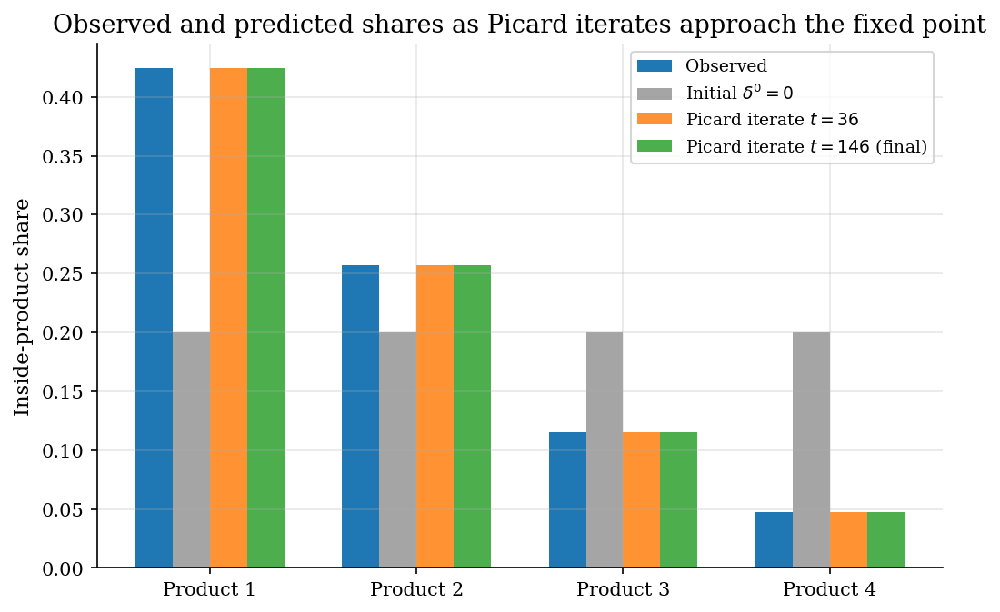
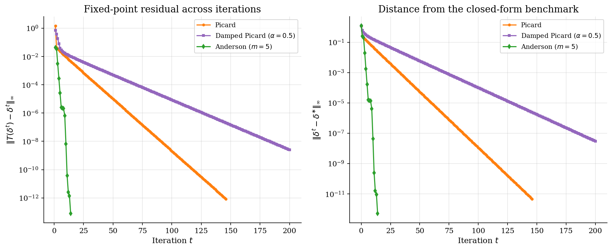
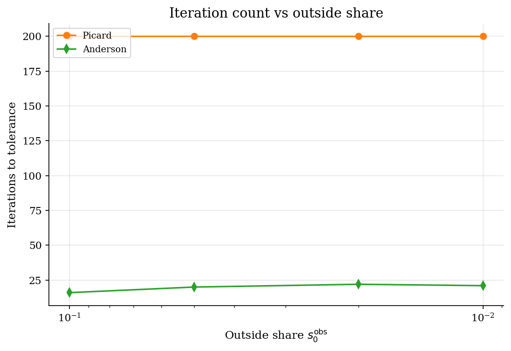
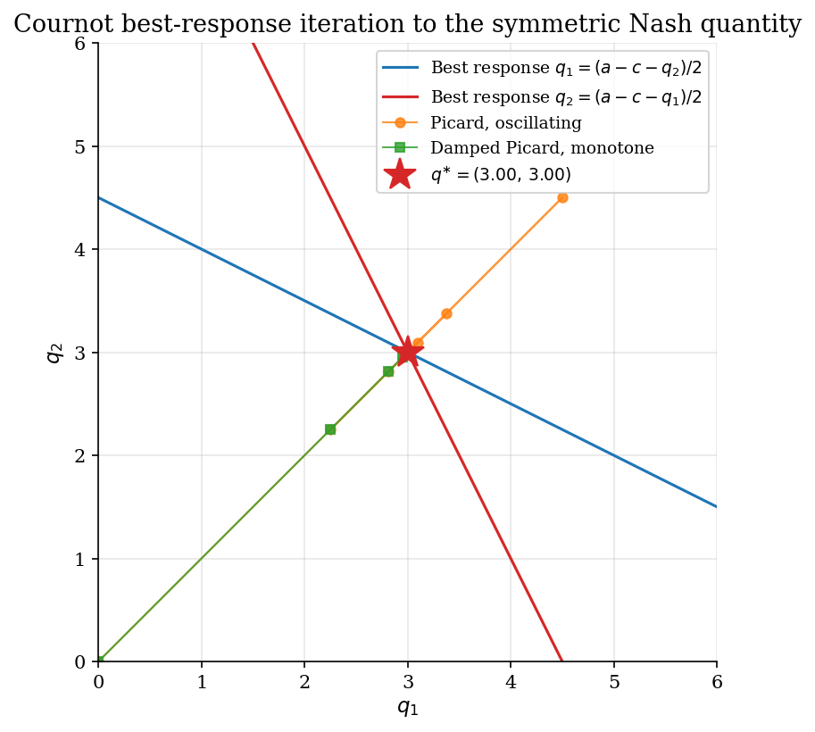

# Fixed-Point Iteration and Acceleration

## Overview

A fixed-point problem asks for a vector $x$ satisfying $x = T(x)$ for a given map $T$. This is a functional equation, and the question is how to solve it numerically when $T$ is a contraction. The tutorial compares three iterative methods designed for exactly this problem.

One concrete instance serves as the test bed. Observed market shares are inverted to recover the mean utilities that generated them under a plain-logit choice model, an instance that admits a closed-form benchmark and so makes every method's accuracy verifiable. Three fixed-point methods are compared on this instance: vanilla Picard iteration, a damped variant, and Anderson acceleration with five-step memory.

The lesson is about iteration speed and reliability. Vanilla iteration always converges under contraction but can be slow. Anderson is often dramatically faster but can extrapolate unstably without a residual safeguard. A small Cournot best-response example at the end applies the same methods to a static game, where the fixed point is a Nash equilibrium.

## Equations

The general problem is to find $x \in \mathbb{R}^d$ satisfying $x = T(x)$ for a given map $T : \mathbb{R}^d \to \mathbb{R}^d$.
A fixed point exists and is unique whenever $T$ is a contraction in some norm.
The methods below iteratively construct a sequence $\{x^t\}$ that converges to the fixed point $x^{\ast}$.

### The test instance

The test instance for benchmarking is plain-logit share inversion.
A representative consumer chooses among $J$ inside products and one outside option indexed by $0$.
Each inside product $j$ delivers a mean utility $\delta_j$ and an idiosyncratic Type-1 extreme-value taste shock; the outside option is normalised to mean utility zero.
Choice probabilities give the predicted market shares as functions of the mean-utility vector $\delta = (\delta_1, \ldots, \delta_J)$.

$$s_j(\delta) = \frac{\exp(\delta_j)}{1 + \sum_{k=1}^{J} \exp(\delta_k)},
\qquad
s_0(\delta) = \frac{1}{1 + \sum_{k=1}^{J} \exp(\delta_k)}.$$

Observed shares $s_j^{\mathrm{obs}}$ are given.
The unknown is the mean-utility vector $\delta^{\ast}$ that generates them.
For plain logit the inversion has a closed form, which serves as the benchmark for every iterative method below.

$$\delta_j^{\ast} = \log s_j^{\mathrm{obs}} - \log s_0^{\mathrm{obs}}.$$

The fixed-point map for this instance adds the log-share residual to the current guess.

$$T_j(\delta) = \delta_j + \log s_j^{\mathrm{obs}} - \log s_j(\delta),
\qquad
\delta^{\ast} \text{ solves } T(\delta^{\ast}) = \delta^{\ast}.$$

A guess that under-predicts the share of product $j$ pushes $\delta_j$ up; a guess that over-predicts pushes it down.

The next three subsections describe one method at a time.

### Method 1: Picard iteration

Picard iteration applies the fixed-point map directly at every step.

$$\delta^{t+1} = T(\delta^t).$$

Convergence is linear with rate equal to the contraction modulus of $T$.
For the test instance this rate is bounded below one and convergence is monotone.

### Method 2: Damped Picard

Damped Picard mixes the current iterate with the Picard image using a damping factor $\alpha \in (0, 1]$.

$$\delta^{t+1} = (1 - \alpha)\, \delta^t + \alpha\, T(\delta^t)
= \delta^t + \alpha \left[\log s^{\mathrm{obs}} - \log s(\delta^t)\right].$$

A smaller $\alpha$ stabilises iteration when the underlying map oscillates near the boundary of contractiveness, at the cost of slower asymptotic convergence.

### Method 3: Anderson acceleration

Anderson acceleration with memory $m$ uses the last $m + 1$ iterates and residuals to extrapolate a better step than Picard.
Define the residual $f_t = g_t - \delta^t$ with $g_t = T(\delta^t)$, the residual differences $\Delta f_t^{(i)} = f_t - f_{t-i}$, and the analogous $\Delta g_t^{(i)}$.
Stack the differences as columns of $F_t \in \mathbb{R}^{J \times m_t}$ and $G_t \in \mathbb{R}^{J \times m_t}$, where $m_t = \min(m, t)$ is the effective memory at step $t$.

The least-squares step solves for combination weights.

$$\gamma_t = \arg\min_\gamma \lVert f_t - F_t\, \gamma \rVert_2.$$

The next iterate combines the most recent fixed-point image with a residual-history correction.

$$\delta^{t+1} = g_t - G_t\, \gamma_t.$$

Anderson reduces to Picard when $m = 0$.
For $m \geq 1$ it can be quadratically faster on contractions, at the cost of solving a small least-squares problem each step.
A safeguard monitors the residual after each Anderson step; if it grows by more than a factor of two over the previous step, the algorithm reverts to one damped-Picard step before resuming Anderson.

### A second test instance: Cournot best response

The Cournot mini extension uses the same machinery on a duopoly best-response system.
Two firms set quantities $q_1, q_2$ to maximise profit on linear inverse demand $P(Q) = a - Q$ with $Q = q_1 + q_2$ and constant marginal cost $c$.

$$\mathrm{BR}_i(q_{-i}) = \frac{a - c - q_{-i}}{2},
\qquad
q^{\ast} = \frac{a - c}{3}\, \text{ for both firms.}$$

The fixed-point map is $T(q_1, q_2) = (\mathrm{BR}_1(q_2), \mathrm{BR}_2(q_1))$.
Vanilla Picard on this map oscillates around $q^{\ast}$ with damping factor $1/2$, and damped Picard with $\alpha = 1/2$ removes the oscillation.

## Model Setup

| Symbol | Value | Role |
|--------|-------|------|
| $J$ | 4 | Number of inside products |
| $\delta^{\ast}$ | $(1.0,\, 0.5,\, -0.3,\, -1.2)$ | True mean utilities used to generate $s^{\mathrm{obs}}$ |
| $s_0^{\mathrm{obs}}$ | 0.1560 | Outside option share |
| Inside shares $s^{\mathrm{obs}}$ | $(0.4241,\, 0.2573,\, 0.1156,\, 0.0470)$ | Observed market shares |
| Damping factor $\alpha$ | 0.5 | Used by damped Picard |
| Anderson memory $m$ | 5 | Length of residual history |
| Tolerance $\eta$ | 1e-12 | Sup-norm stopping rule on $T(\delta) - \delta$ |
| Cournot demand intercept $a$ | 10.0 | Linear inverse-demand parameter |
| Cournot marginal cost $c$ | 1.0 | Symmetric across firms |
| Cournot symmetric Nash $q^{\ast}$ | 3.0000 | Closed-form duopoly equilibrium quantity |

## Solution Method

All three methods solve the same fixed-point equation. They differ in how aggressively they extrapolate from past iterates.

### Method 1: Picard iteration

Picard applies the fixed-point map directly at every step. The economic intuition is a tatonnement adjustment in log shares: each step pushes mean utilities up where the model under-predicts the observed share and down where it over-predicts. Convergence is linear with rate equal to the contraction modulus. For plain logit the modulus is bounded by one and convergence is monotone. Doubling iterations halves the residual once contraction kicks in.

```text
Algorithm: Picard iteration
Input : initial delta_0; tolerance eta
Output: delta_T satisfying ||T(delta_T) - delta_T|| < eta
  for t = 0, 1, ... :
      delta_{t+1} <- T(delta_t)
      stop when ||delta_{t+1} - delta_t||_inf < eta
```

Picard fails only if the map fails to be a contraction. For plain logit it always works. When the contraction modulus approaches one, convergence becomes prohibitively slow.

### Method 2: Damped Picard

Damped Picard mixes the current iterate with the Picard image using a damping factor $\alpha \in (0, 1]$. The economic intuition is a partial-adjustment rule: the iterate moves only part way toward the contraction step. Damping does not change the fixed point. It changes the contraction modulus, which can stabilise iteration when the underlying map oscillates near the boundary of contractiveness. On a smooth contraction damping slows asymptotic convergence.

```text
Algorithm: Damped Picard
Input : initial delta_0; damping alpha; tolerance eta
Output: delta_T
  for t = 0, 1, ... :
      delta_{t+1} <- (1 - alpha) * delta_t + alpha * T(delta_t)
      stop when ||delta_{t+1} - delta_t||_inf < eta
```

Damped Picard does not introduce new failure modes. Choosing $\alpha$ too small wastes iterations on a contraction that does not need stabilising.

### Method 3: Anderson acceleration

Anderson acceleration uses the last $m + 1$ residuals to extrapolate a better step than plain Picard. Geometrically the method fits an affine model to the residual history and chooses the next iterate to make the model's residual zero. On contractions Anderson is locally faster than linear and often quadratically so. The cost per step is one least-squares solve in dimension $m$. The benefit is most visible when the contraction modulus is close to one.

```text
Algorithm: Anderson acceleration with memory m
Input : initial delta_0; memory m; tolerance eta; safeguard factor c
Output: delta_T
  store delta_0 and g_0 = T(delta_0)
  for t = 1, 2, ... :
      m_t <- min(m, t)
      build difference matrices F and G from the last m_t residuals
      solve gamma <- argmin_g ||(g_t - delta_t) - F g||
      delta_candidate <- g_t - G gamma
      if ||T(delta_candidate) - delta_candidate|| > c * ||g_t - delta_t||:
          delta_{t+1} <- 0.5 * delta_t + 0.5 * g_t        # damped fallback
      else:
          delta_{t+1} <- delta_candidate
      g_{t+1} <- T(delta_{t+1})
      stop when ||g_{t+1} - delta_{t+1}||_inf < eta
```

Anderson can extrapolate unstably when the residual history is nearly collinear or when the safeguard threshold is too loose. The safeguard reverts to damped Picard for one step, after which Anderson resumes with a refreshed history. Without the safeguard, an extrapolated step can overshoot and grow the residual.

## Results

At the trivial start $\delta^0 = 0$, every inside product is predicted to take the same share. The first Picard step closes most of the gap to the observed shares. By iterate 36 the predictions are visually indistinguishable from the observed bars. At convergence the residual is at machine precision and the recovered $\delta$ matches the closed form to 4.57e-12.



Picard reaches tolerance in **146** iterations on this calibration. Damped Picard at $\alpha = 0.5$ takes **200** iterations because the damping slows asymptotic convergence on a problem that is already well behaved. Anderson at $m = 5$ converges in **14** iterations, faster than Picard by roughly a factor of 10.4.

Both panels show the same story on log scale. Anderson sits below Picard for almost every iteration. The damped variant is parallel to Picard with a slight vertical offset.



The stress test sweeps the outside share from a benign 0.5 down to 0.01. A small outside share pushes mean utilities out to large values where the contraction modulus approaches one. Picard iteration counts grow steeply on the small-$s_0$ end. Anderson stays much flatter because the residual history compensates for the slow contraction. The safeguard reverts to damped Picard whenever an Anderson step doubles the residual.



The Cournot example replaces the Berry contraction with a best-response map. Vanilla Picard from $(0, 0)$ overshoots to $(4.5, 4.5)$ on the first step and oscillates around the symmetric Nash quantity $q^{\ast} = 3.00$ with damping factor $1/2$. Damped Picard with $\alpha = 1/2$ removes the oscillation and converges monotonically. The same fixed-point machinery covers structural demand inversion and static-game best-response dynamics.



The table compares the three methods on the same calibration and the same starting point. Anderson cuts the iteration count to a small fraction of Picard. Final residuals and distances to the closed form are at machine precision for all three methods.

**Method comparison on the baseline four-product calibration**

| Method           | Setting                          |   Iterations |   Final residual |   Distance to closed form | Status    |
|:-----------------|:---------------------------------|-------------:|-----------------:|--------------------------:|:----------|
| Picard           | no damping                       |          146 |         8.44e-13 |                  4.57e-12 | converged |
| Damped Picard    | damping alpha = 0.5              |          200 |         2.51e-09 |                  2.97e-08 | converged |
| Anderson (m = 5) | memory 5 with residual safeguard |           14 |         7.95e-14 |                  5.08e-13 | converged |

The stress test makes the contraction harder by shrinking the outside share, which pushes mean utilities out to large values where the contraction modulus approaches one. Picard slows down sharply once the outside share falls below five percent. Anderson stays competitive across the range, which is the regime where acceleration matters most: a fixed-point map repeatedly solved inside an outer optimisation pays the iteration count many times over.

**Iteration count and final residual as the outside share shrinks**

|   Outside share |   Picard iterations |   Picard residual |   Anderson iterations |   Anderson residual |
|----------------:|--------------------:|------------------:|----------------------:|--------------------:|
|            0.1  |                 200 |          3.92e-11 |                    16 |            9.6e-14  |
|            0.05 |                 200 |          1.38e-06 |                    20 |            4.11e-15 |
|            0.02 |                 200 |          0.000328 |                    22 |            1.33e-15 |
|            0.01 |                 200 |          0.00147  |                    21 |            1.47e-13 |

On the Cournot game vanilla Picard converges in 44 steps despite the oscillation. Damped Picard takes 22 steps with monotone improvement. The closed-form symmetric Nash quantity is $q^{\ast} = 3.0000$ for both firms.

**Cournot best-response iteration to the symmetric Nash equilibrium**

| Method         |   Quantity firm 1 |   Quantity firm 2 |   Iterations |   Final residual |
|:---------------|------------------:|------------------:|-------------:|-----------------:|
| Vanilla Picard |                 3 |                 3 |           44 |         5.12e-13 |
| Damped Picard  |                 3 |                 3 |           22 |         5.12e-13 |

## Takeaway

Picard iteration is the simplest reliable fixed-point method. On a contraction it converges monotonically and predictably. Its weakness is speed when the contraction modulus approaches one.

Damped Picard trades asymptotic speed for stability. It is the right default when the iterates oscillate or the modulus is uncertain. On a smooth contraction like the test instance here, damping is unnecessary and slows things down.

Anderson acceleration is dramatically faster than Picard on contractions but needs a safeguard. The least-squares step can extrapolate unstably when the residual history is nearly collinear. A simple residual-monotonicity check that reverts to damped Picard when an Anderson step doubles the residual recovers stability with very little overhead.

The methods are not specific to demand inversion. Any problem of the form $x = T(x)$ with a contractive $T$ admits the same three-method ladder: Picard, damped Picard, Anderson. What changes between problems is the map, not the iteration.

## References

- Berry, S. (1994). *Estimating Discrete-Choice Models of Product Differentiation*. RAND Journal of Economics 25(2), 242-262.
- Berry, S., Levinsohn, J., and Pakes, A. (1995). *Automobile Prices in Market Equilibrium*. Econometrica 63(4), 841-890.
- Anderson, D. G. (1965). *Iterative Procedures for Nonlinear Integral Equations*. Journal of the ACM 12(4), 547-560.
- Walker, H. F. and Ni, P. (2011). *Anderson Acceleration for Fixed-Point Iterations*. SIAM Journal on Numerical Analysis 49(4), 1715-1735.
- Reynaerts, J., Varadhan, R., and Nash, J. C. (2012). *Enhancing the Convergence Properties of the BLP Estimator*. (working paper).
