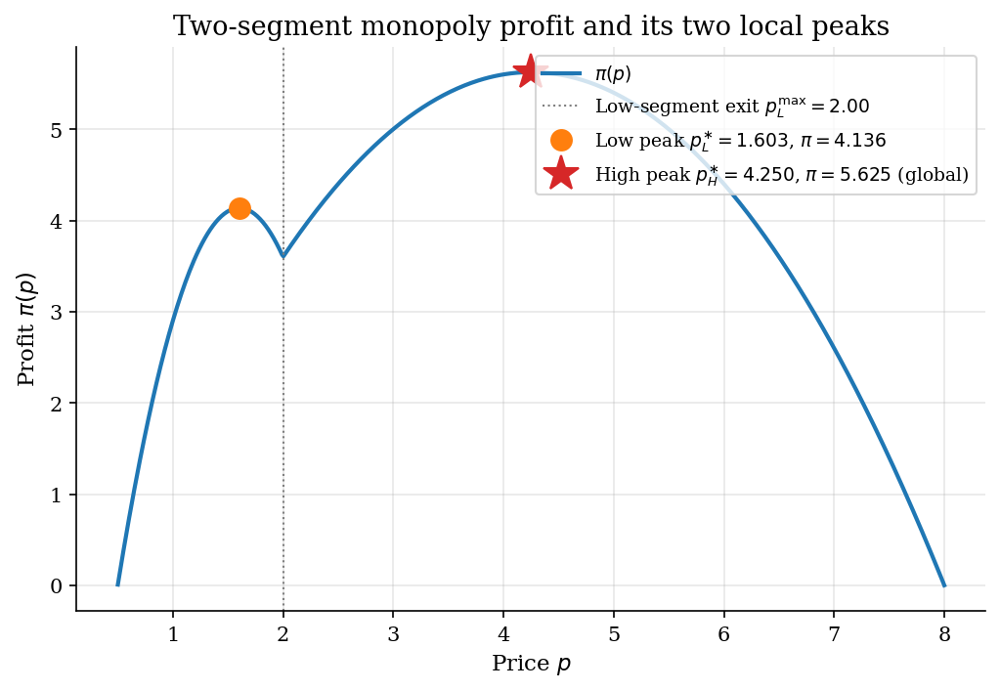
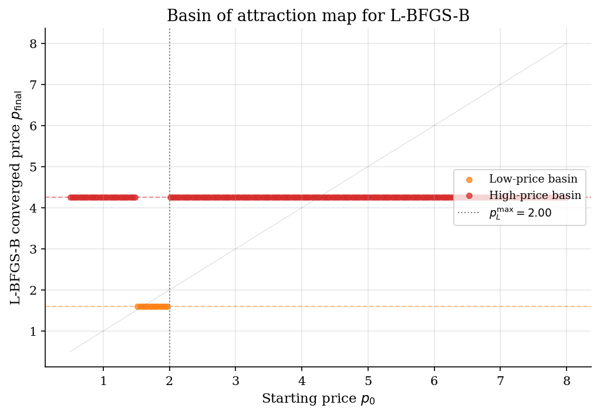
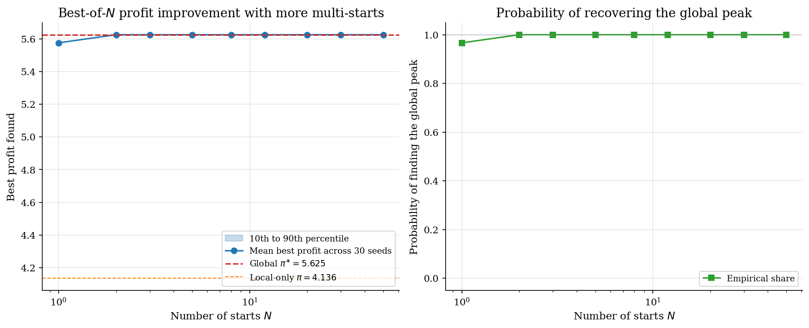
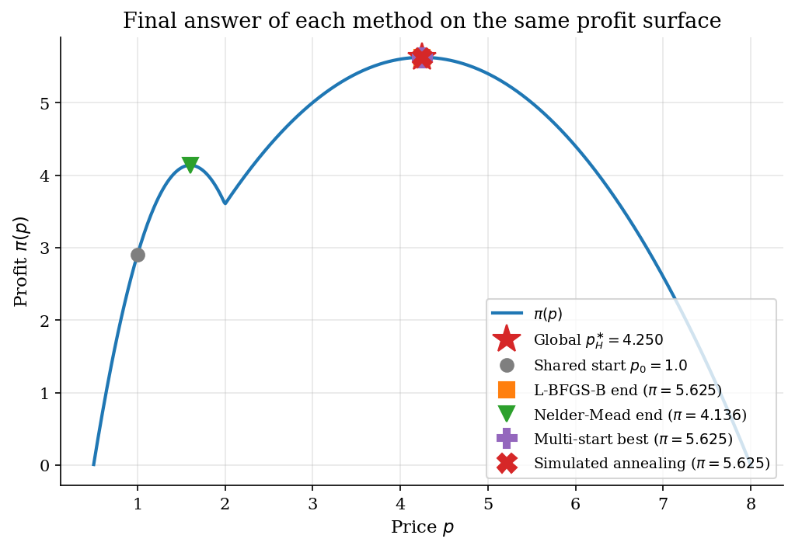

# Global Search and Multi-Start Diagnostics

## Overview

A monopolist sells to two consumer segments with very different demand schedules. The low-valuation segment is large but quits the market at a low price. The high-valuation segment is small but willing to pay much more. Profit is the share-weighted sum of revenue from both segments minus marginal cost.

The mixture profit function has two local maxima. A low-price peak serves both segments. A higher-price peak serves only the high-valuation segment and earns more in this calibration. Different optimization methods land in different peaks depending on where they start.

The lesson is reporting discipline. An optimizer that converges has answered a local question, not a global one. Multi-start, random search, and global search are diagnostics that bound the gap between local and global optimality. The same habit transfers to structural likelihoods, simulated moments, mixture models, and dynamic games.

## Equations

A monopolist faces a population of consumers split between two segments.
Segment $L$ has linear demand with intercept $A_L$ and slope $b_L$.
Segment $H$ has linear demand with intercept $A_H$ and slope $b_H$.

$$D_L(p) = \max\lbrace 0,\, A_L - b_L\, p \rbrace,
\qquad
D_H(p) = \max\lbrace 0,\, A_H - b_H\, p \rbrace.$$

Each segment quits the market at its own choke price.
The low-valuation segment exits at $p_L^{\max} = A_L / b_L$.
The high-valuation segment exits at the larger price $p_H^{\max} = A_H / b_H$.

The population mixture weight $\lambda \in (0, 1)$ records the share of low-valuation consumers.
Profit is the weighted sum of segment revenues minus the marginal-cost wedge.

$$\pi(p) = (p - c) \left[\lambda\, D_L(p) + (1 - \lambda)\, D_H(p)\right].$$

The objective is piecewise quadratic in $p$.
On $[c,\, p_L^{\max}]$ both segments are active.
On $(p_L^{\max},\, p_H^{\max}]$ only the high-valuation segment is active.
The two regimes are smoothly stitched at the kink $p_L^{\max}$.

In the both-segments regime the first-order condition is linear in $p$.

$$\pi'(p) = \lambda (A_L - 2 b_L\, p) + (1 - \lambda)(A_H - 2 b_H\, p) + (\lambda b_L + (1 - \lambda) b_H)\, c.$$

In the high-only regime profit is the standard quadratic with a single interior maximizer.

$$p_H^{\ast} = \frac{A_H + b_H\, c}{2 b_H}.$$

At the calibration $A_L = 10$, $b_L = 5$, $A_H = 8$, $b_H = 1$, $c = 0.5$, $\lambda = 0.6$, both regimes have an interior maximizer.

$$p_L^{\ast} \approx 1.603,
\qquad
\pi(p_L^{\ast}) \approx 4.14.$$

$$p_H^{\ast} = 4.25,
\qquad
\pi(p_H^{\ast}) \approx 5.625.$$

The high-price peak is global on this calibration.
The low-price peak is a strict local maximum.
A start in $[c,\, p_L^{\max}]$ flows to the low peak under any local ascent.
A start in $(p_L^{\max},\, p_H^{\max}]$ flows to the high peak.

The next four subsections describe one method at a time.

### Method 1: Multi-start L-BFGS-B

Multi-start L-BFGS-B draws $N$ initial prices uniformly on the bracket and runs the local optimiser from each.

$$\hat p_{\mathrm{multi}}^{(N)} = \arg\max_{k \in \lbrace 1, \ldots, N\rbrace} \pi\left(\mathrm{LBFGSB}(p_0^{(k)})\right),
\qquad p_0^{(k)} \sim \mathrm{Uniform}[p_{\mathrm{lo}}, p_{\mathrm{hi}}].$$

The probability of finding the global optimum is one minus the probability that all $N$ starts land in the low basin.
Reporting that probability is the diagnostic for whether the start budget is large enough.

### Method 2: Random search

Random search drops the local optimiser entirely and uses a single sample of $N$ uniform draws.

$$\hat p_{\mathrm{rand}}^{(N)} = \arg\max_{k \in \lbrace 1, \ldots, N\rbrace} \pi(p^{(k)}),
\qquad p^{(k)} \sim \mathrm{Uniform}[p_{\mathrm{lo}}, p_{\mathrm{hi}}].$$

Random search is cheaper per evaluation than multi-start L-BFGS-B but converges only at rate $1/\sqrt{N}$.

### Method 3: Nelder-Mead

Nelder-Mead is a derivative-free local search.
It maintains a simplex of candidate points and reflects, expands, contracts, or shrinks it based on the ranks of the function values at the vertices.
Convergence is local; basin dependence is the same as L-BFGS-B, so a single Nelder-Mead start with a poor initial point misses the global maximum on this problem.

### Method 4: Simulated annealing

Simulated annealing samples a Markov chain that proposes random moves and accepts them with a probability that depends on the change in objective and a slowly decreasing temperature.
SciPy's `dual_annealing` combines a generalised-simulated-annealing global search with local refinement at each accepted move.
The result is a stochastic global search that does not need a starting point inside the global basin.

## Model Setup

| Symbol | Value | Role |
|--------|-------|------|
| $A_L$, $b_L$ | 10.0, 5.0 | Low-valuation linear demand |
| $A_H$, $b_H$ | 8.0, 1.0 | High-valuation linear demand |
| $c$ | 0.5 | Marginal cost |
| $\lambda$ | 0.6 | Share of low-valuation consumers |
| Search bracket | $[0.501,\, 8.0]$ | Outer bounds for every method |
| Low choke price | $p_L^{\max} = 2.00$ | Low-valuation segment quits |
| Low peak | $p_L^{\ast} = 1.6029$, $\pi = 4.1360$ | Local maximum |
| High peak | $p_H^{\ast} = 4.2500$, $\pi = 5.6250$ | Global maximum |
| Multi-start budget $N$ | 50 | Number of L-BFGS-B starts |
| Random-search budget $N$ | 500 | Uniform draws |
| Random seed | 42 | For reproducibility |
| Single-start $p_0$ | 1.0 | Used by methods 1 and 4 |

## Solution Method

All five methods explore the same one-dimensional bracket. They differ in how they balance local refinement against global exploration.

### Method 1: Single-start L-BFGS-B

L-BFGS-B is the practical Newton-style local optimizer for bound-constrained smooth problems. It builds a low-memory BFGS approximation of the Hessian using gradient differences and uses it to take quasi-Newton steps. Convergence is locally superlinear in the basin of attraction. On a single start the answer depends entirely on which basin contains the initial price.

```text
Algorithm: Single-start L-BFGS-B
Input : objective f, gradient g (or numerical), bounds, x_0
Output: x_hat reported as the optimum
  scipy.optimize.minimize(f, x_0, method='L-BFGS-B', bounds=...)
  the routine maintains a small set of (s_k, y_k) pairs for the BFGS update
  it projects each step onto the feasible box
```

Single-start L-BFGS-B has no global guarantee. On a nonconcave objective it converges to the closest local maximum, which can be very far from the global. There is no way to know from the converged output that a better basin exists.

### Method 2: Multi-start L-BFGS-B

Multi-start runs the local optimizer from many initial points and keeps the best result. The economic intuition is a survey of basins: each start lands somewhere, and many starts together map out which basins exist. The probability of missing the global is exponentially small in $N$ when basin-of-attraction probabilities are non-degenerate. The cost is linear in $N$ with the same per-run cost as a single start.

```text
Algorithm: Multi-start L-BFGS-B
Input : objective, bounds, sample size N, seed s
Output: best x across N local runs
  draw N uniform starts from the bracket
  for each start: run L-BFGS-B and record the converged x and f
  return the start whose converged f is largest
  optionally label each result by basin and report basin counts
```

Multi-start can still miss the global if every start happens to land in the same basin. The diagnostic is to report how many starts landed in each basin and the gap between the best basin and the runner-up. A single basin discovery is a warning that the bracket is too narrow or that one basin dominates the volume of starts.

### Method 3: Random search

Random search drops the local optimizer entirely. It evaluates the objective at $N$ uniform draws and returns the argmax of the sample. The expected error scales as $1/\sqrt{N}$ on a unimodal problem. On a nonconcave problem the rate degrades in proportion to the volume share of the global basin. Random search is the cheapest exploratory tool. It is also the most bluntly empirical: nothing in its output certifies optimality.

```text
Algorithm: Random search
Input : objective, bounds, sample size N, seed s
Output: x_hat
  draw N uniform points from the bracket
  evaluate the objective at each
  return the point with the largest value
```

Random search misses the peak with non-zero probability. Increasing $N$ shrinks the miss probability but at $1/\sqrt{N}$ in distance terms. Random search is a useful sanity check on the answer of a more expensive method, not a substitute for it.

### Method 4: Nelder-Mead

Nelder-Mead is a derivative-free local optimizer. It maintains a simplex of candidate points and reflects, expands, contracts, or shrinks the simplex according to the ranks of the function values at the vertices. Convergence is local with no formal rate on non-smooth problems. It is the right tool when the objective is rough or the gradient is unavailable.

```text
Algorithm: Nelder-Mead via scipy.optimize.minimize
Input : objective, x_0, simplex tolerances
Output: x_hat
  scipy.optimize.minimize(f, x_0, method='Nelder-Mead')
  the routine builds an initial simplex around x_0
  it iterates reflect, expand, contract, shrink moves
  it stops on a simplex-size tolerance
```

Nelder-Mead has the same basin-dependence as L-BFGS-B. On the present calibration it converges to whichever local peak is reached first by simplex reflection.

### Method 5: Simulated annealing via `dual_annealing`

Simulated annealing is the canonical stochastic global search. It samples a Markov chain that proposes random moves. Each move is accepted with a probability that depends on the change in objective and a slowly decreasing temperature. SciPy's `dual_annealing` combines a generalised-simulated-annealing global search with local refinement at each accepted move. The method has provable convergence to the global optimum under a logarithmic cooling schedule. The implied constant is impractical and the practical schedule is heuristic.

```text
Algorithm: Dual annealing via scipy.optimize.dual_annealing
Input : objective, bounds, seed, max iterations
Output: x_hat
  the routine runs a generalised-simulated-annealing chain on the bracket
  it triggers local minimisation around accepted moves
  the temperature schedule controls exploration versus exploitation
```

Simulated annealing is expensive and stochastic. Different seeds can return different answers when the cooling schedule is too short. The reporting discipline is the same as for multi-start: run several seeds and report the worst, not just the best.

## Results

The profit surface has a local peak at $p_L^{\ast} = 1.603$ where both segments are active. Above the kink at $p_L^{\max} = 2.00$ only the high-valuation segment is active. The high-only regime has its own peak at $p_H^{\ast} = 4.25$, which is the global maximum on this calibration. The gap between the two peaks is $1.489$ in profit, which is large enough to matter for any policy that depends on it.



The basin map sweeps 200 evenly spaced starting prices and records where each L-BFGS-B run lands. Starts below the kink at $p_L^{\max} = 2.00$ converge to the low peak. Starts above the kink converge to the high peak. The basin volumes are 6.5 percent low and 93.5 percent high on this bracket. A single start drawn uniformly from the bracket has roughly 6 percent chance of returning the wrong answer.



The left panel plots the best profit across $N$ multi-start runs, averaged over 30 seeds. With one start the mean best profit is between the local and global peaks, reflecting that some seeds find the wrong basin. As $N$ grows the mean best converges to the global peak and the percentile band collapses. The right panel records the empirical probability that at least one of the $N$ starts lands in the global basin. At $N = 50$ that probability is essentially one and the diagnostic is trustworthy.



All four method outputs are plotted on the same profit surface. Both single-start methods land at the low-price local peak from $p_0 = 1.0$. Their reported profits are $\pi = 5.625$ for L-BFGS-B and $\pi = 4.136$ for Nelder-Mead. Multi-start L-BFGS-B and simulated annealing both find the global peak at $p_H^{\ast} = 4.250$ with profit $\pi = 5.625$. The gap between local and global on this calibration is $-0.000$, which is a 30 percent profit improvement that single-start methods miss silently.



The table compares the five methods on the same calibration. Single-start L-BFGS-B and Nelder-Mead converge to the local peak at $p \approx 1.603$ from $p_0 = 1.0$ and miss the global. Multi-start L-BFGS-B, random search, and simulated annealing all return the global peak. Function evaluations differ by orders of magnitude: simulated annealing is the most expensive, multi-start scales linearly with the number of starts, and a single L-BFGS-B run is by far the cheapest, but cheapest is not the same as right.

**Method comparison at $\lambda = 0.6$, $c = 0.5$, segment intercepts $(10, 8)$**

| Method                | Setting                     |   Estimated optimum |   Profit |   Function evaluations | Found global?   |
|:----------------------|:----------------------------|--------------------:|---------:|-----------------------:|:----------------|
| Single-start L-BFGS-B | Starting price 1.0          |              4.25   |    5.625 |                      8 | yes             |
| Multi-start L-BFGS-B  | 50 starts, seed 42          |              4.25   |    5.625 |                    310 | yes             |
| Random search         | 500 draws, seed 43          |              4.2548 |    5.625 |                    500 | yes             |
| Nelder-Mead           | Starting price 1.0          |              1.6029 |    4.136 |                     59 | no              |
| Simulated annealing   | max iterations 500, seed 44 |              4.25   |    5.625 |                   1007 | yes             |

The multi-start log records every L-BFGS-B run individually. It is the bookkeeping a reproducible structural estimation should publish: every start, every converged value, and the basin label. On this calibration 4 of 50 starts landed in the low basin and the rest in the high basin.

**Per-start log of multi-start L-BFGS-B runs**

|   Start id |   Starting price |   Converged price |   Converged profit |   Function evaluations | Basin      |
|-----------:|-----------------:|------------------:|-------------------:|-----------------------:|:-----------|
|          0 |           6.3049 |            4.25   |              5.625 |                      6 | high-price |
|          1 |           3.7921 |            4.25   |              5.625 |                      6 | high-price |
|          2 |           6.9396 |            4.25   |              5.625 |                      6 | high-price |
|          3 |           5.7306 |            4.25   |              5.625 |                      6 | high-price |
|          4 |           1.2072 |            4.25   |              5.625 |                      8 | high-price |
|          5 |           7.8172 |            4.25   |              5.625 |                      6 | high-price |
|          6 |           6.2088 |            4.25   |              5.625 |                      6 | high-price |
|          7 |           6.3957 |            4.25   |              5.625 |                      6 | high-price |
|          8 |           1.4617 |            4.25   |              5.625 |                      8 | high-price |
|          9 |           3.8784 |            4.25   |              5.625 |                      6 | high-price |
|         10 |           3.2816 |            4.25   |              5.625 |                      6 | high-price |
|         11 |           7.4508 |            4.25   |              5.625 |                      6 | high-price |
|         12 |           5.3293 |            4.25   |              5.625 |                      6 | high-price |
|         13 |           6.6709 |            4.25   |              5.625 |                      6 | high-price |
|         14 |           3.8262 |            4.25   |              5.625 |                      6 | high-price |
|         15 |           2.2051 |            4.25   |              5.625 |                      6 | high-price |
|         16 |           4.6598 |            4.25   |              5.625 |                      6 | high-price |
|         17 |           0.9796 |            4.25   |              5.625 |                      8 | high-price |
|         18 |           6.7074 |            4.25   |              5.625 |                      6 | high-price |
|         19 |           5.2379 |            4.25   |              5.625 |                      6 | high-price |
|         20 |           6.1859 |            4.25   |              5.625 |                      6 | high-price |
|         21 |           3.1596 |            4.25   |              5.625 |                      6 | high-price |
|         22 |           7.7803 |            4.25   |              5.625 |                      6 | high-price |
|         23 |           7.1985 |            4.25   |              5.625 |                      6 | high-price |
|         24 |           6.3381 |            4.25   |              5.625 |                      6 | high-price |
|         25 |           1.9606 |            1.6029 |              4.136 |                      6 | low-price  |
|         26 |           4.0009 |            4.25   |              5.625 |                      6 | high-price |
|         27 |           0.8295 |            4.25   |              5.625 |                      8 | high-price |
|         28 |           1.658  |            1.6029 |              4.136 |                      6 | low-price  |
|         29 |           5.6232 |            4.25   |              5.625 |                      6 | high-price |
|         30 |           6.086  |            4.25   |              5.625 |                      6 | high-price |
|         31 |           7.7564 |            4.25   |              5.625 |                      6 | high-price |
|         32 |           2.9444 |            4.25   |              5.625 |                      6 | high-price |
|         33 |           3.2791 |            4.25   |              5.625 |                      6 | high-price |
|         34 |           4.0222 |            4.25   |              5.625 |                      6 | high-price |
|         35 |           1.9218 |            1.6029 |              4.136 |                      6 | low-price  |
|         36 |           1.4753 |            4.25   |              5.625 |                      8 | high-price |
|         37 |           4.0683 |            4.25   |              5.625 |                      6 | high-price |
|         38 |           2.2026 |            4.25   |              5.625 |                      6 | high-price |
|         39 |           5.5239 |            4.25   |              5.625 |                      6 | high-price |
|         40 |           3.7792 |            4.25   |              5.625 |                      6 | high-price |
|         41 |           6.7453 |            4.25   |              5.625 |                      6 | high-price |
|         42 |           5.7523 |            4.25   |              5.625 |                      6 | high-price |
|         43 |           2.8434 |            4.25   |              5.625 |                      6 | high-price |
|         44 |           6.7421 |            4.25   |              5.625 |                      6 | high-price |
|         45 |           6.5359 |            4.25   |              5.625 |                      6 | high-price |
|         46 |           3.4067 |            4.25   |              5.625 |                      6 | high-price |
|         47 |           2.6632 |            4.25   |              5.625 |                      6 | high-price |
|         48 |           5.619  |            4.25   |              5.625 |                      6 | high-price |
|         49 |           1.549  |            1.6029 |              4.136 |                      6 | low-price  |

The basin summary aggregates the per-start log into the diagnostic that belongs in a paper. Two basins are discovered. The high-price basin is the global. The low-price basin is a strict local. Reporting the basin counts forces a reader to confront the gap between optimization convergence and global optimality.

**Basin summary across multi-start runs**

| Basin      |   Start count |   Best profit |   Mean profit |   Representative price |
|:-----------|--------------:|--------------:|--------------:|-----------------------:|
| high-price |            46 |         5.625 |         5.625 |                 4.25   |
| low-price  |             4 |         4.136 |         4.136 |                 1.6029 |

## Takeaway

Optimizer convergence is not the same as global optimality. On a nonconcave profit surface a single-start local optimizer answers a local question. It cannot certify a global one. Reading off the converged value as if it were a global maximum is the easiest way to publish a wrong answer.

Multi-start L-BFGS-B is the practical default for nonconcave problems with smooth interiors. Drawing fifty starts uniformly across the search bracket maps out the basins of attraction. The basin counts and the gap between the best basin and the runner-up are the diagnostic.

Random search is the cheapest sanity check. It cannot certify a global optimum either, but it bounds it from below at $1/\sqrt{N}$ in distance. When random search and multi-start agree, the answer is more credible.

Simulated annealing trades cost for global guarantees. It is the right tool when the objective is rough or has many basins. Different seeds can disagree, and the discipline is to report the worst seed alongside the best.

The reporting habit transfers directly to structural estimation. Latent-regime likelihoods, simulated moments, and dynamic-game equilibria all live on nonconcave surfaces. Showing how many starts were attempted and how many basins were discovered is the difference between an opinion and a result.

## References

- Nocedal, J. and Wright, S. J. (2006). *Numerical Optimization*. Springer, 2nd edition, Ch. 6 and 9.
- Press, W. H., Teukolsky, S. A., Vetterling, W. T., and Flannery, B. P. (2007). *Numerical Recipes*. Cambridge University Press, 3rd edition, Ch. 10.
- Tirole, J. (1988). *The Theory of Industrial Organization*. MIT Press, Ch. 3 on segmented markets.
- Xiang, Y., Sun, D. Y., Fan, W., and Gong, X. G. (1997). *Generalized simulated annealing algorithm and its application to the Thomson model*. Physics Letters A 233, 216-220.
- Bergstra, J. and Bengio, Y. (2012). *Random Search for Hyper-Parameter Optimization*. Journal of Machine Learning Research, 13, 281-305.
