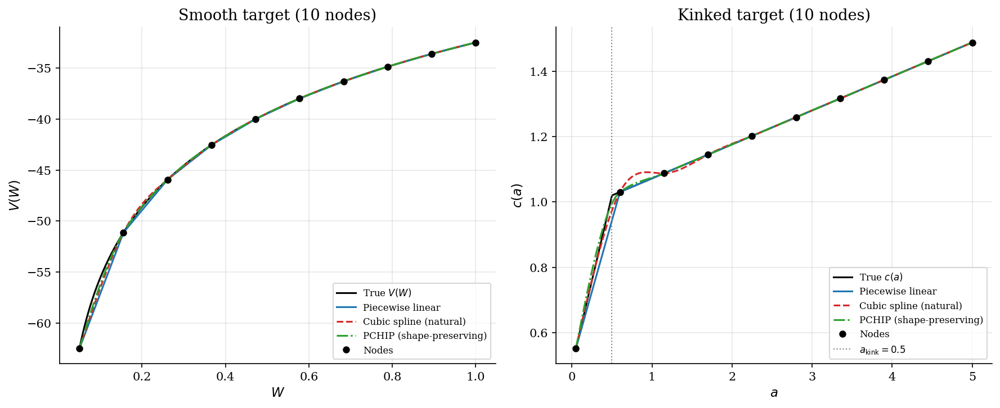
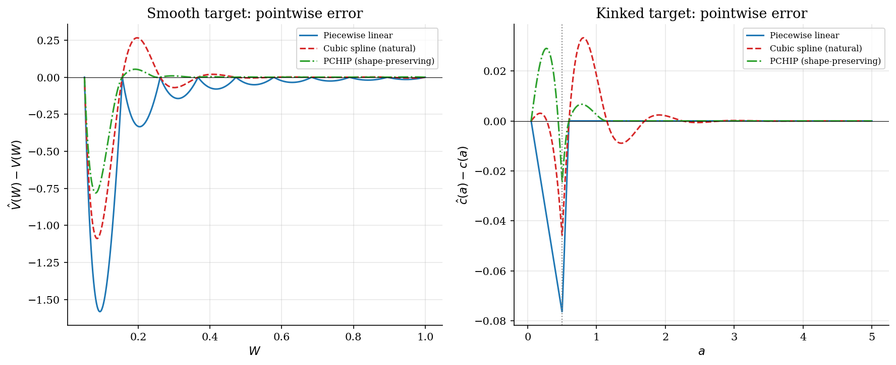
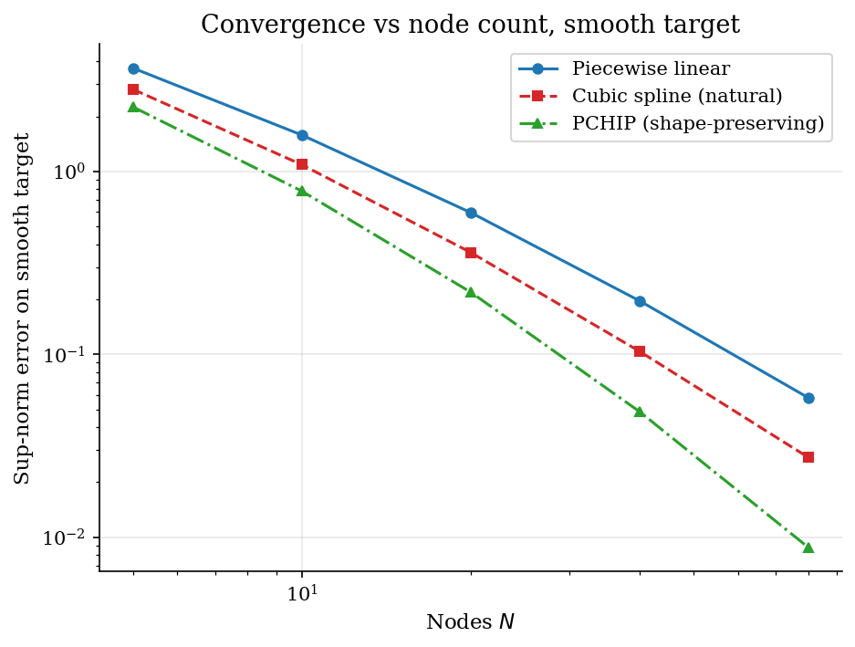

# Off-Grid Function Approximation by Interpolation

## Overview

Value function iteration stores $V$ at a finite grid and reads it off-grid every step. Three classical interpolators are the workhorses: piecewise linear, natural cubic spline, and PCHIP (piecewise cubic Hermite interpolating polynomial).

This tutorial fits each one to two targets. The first target is the closed-form cake-eating value function $V(W)$ - smooth and monotone. The second is a stylized consumption policy with a borrowing-constraint kink: the level is continuous but the slope drops sharply at $a_{\text{kink}}$.

Cubic splines shine on the smooth target. They ring on the kinked one. Linear interpolation and PCHIP do not.

## Equations

The first target is the closed-form log-utility cake-eating value
function

$$V(W) = \frac{\log((1-\beta) W)}{1-\beta} + \frac{\beta \log \beta}{(1-\beta)^2}.$$

The second target is a stylized consumption policy with a borrowing
constraint at $a_{\text{kink}}$:

$$c(a) =
\begin{cases}
(1 + r)\, a + y, & a \leq a_{\text{kink}} \\
c(a_{\text{kink}}) + (1 + r)\, \mathrm{MPC}\, (a - a_{\text{kink}}), & a > a_{\text{kink}}.
\end{cases}$$

Below the kink the agent is constrained and consumes everything; above
the kink they save with marginal propensity to consume $\mathrm{MPC} < 1$.
The function is continuous in level but the slope drops from $(1 + r)$
to $(1 + r)\,\mathrm{MPC}$ at $a_{\text{kink}}$.

Piecewise linear interpolation between adjacent nodes
$x_i \le x \le x_{i+1}$ is

$$\hat{f}(x) = \frac{x_{i+1} - x}{x_{i+1} - x_i}\, f(x_i) + \frac{x - x_i}{x_{i+1} - x_i}\, f(x_{i+1}).$$

Natural cubic spline fits a piecewise cubic with $\hat{f}, \hat{f}',
\hat{f}''$ continuous everywhere and $\hat{f}''(x_0) = \hat{f}''(x_N) =
0$. The coefficients solve a tridiagonal linear system for the second
derivatives at interior nodes.

PCHIP fits a piecewise cubic Hermite polynomial whose endpoint slopes
are chosen by a monotonicity-preserving rule (Fritsch-Carlson 1980).
The result is $C^1$ and never overshoots a monotone target; it loses
the $C^2$ smoothness of the cubic spline.

## Model Setup

| Symbol | Value | Role |
|--------|-------|------|
| $\beta$ | 0.9 | Discount factor in the cake-eating target |
| Smooth domain $[W_{\min}, W_{\max}]$ | $[0.05,\, 1.0]$ | Wealth range for the smooth target |
| Kinked domain $[a_{\min}, a_{\max}]$ | $[0.05,\, 5.0]$ | Asset range for the kinked target |
| $a_{\text{kink}}$ | 0.5 | Borrowing-constraint kink in the policy |
| $r$ | 0.04 | Interest rate in the consumption policy |
| $y$ | 0.5 | Endowment (income) in the consumption policy |
| Display node count $N$ | 10 | Nodes per fit in the target-vs-fit figure |
| Convergence sweep | [np.int64(5), np.int64(10), np.int64(20), np.int64(40), np.int64(80)] | Node counts for the smooth-target sup-norm sweep |

## Solution Method

Each method takes nodes $(x_i, y_i)$ and returns a function on $[x_0, x_N]$.

**Piecewise linear.** Connect adjacent nodes with straight segments. The convex-combination formula evaluates the segment containing the query point.

```text
Algorithm: Piecewise linear
Input : nodes (x_i, y_i); query x in [x_i, x_{i+1}]
Output: y_hat
  h_i   <- x_{i+1} - x_i
  w     <- (x - x_i) / h_i
  y_hat <- (1 - w) y_i + w y_{i+1}
```

**Natural cubic spline.** Fit a piecewise cubic with $C^2$ continuity and zero second derivatives at the endpoints.

```text
Algorithm: Natural cubic spline
Input : nodes (x_i, y_i)
Output: spline S(x)
  build tridiagonal system in y''_1, ..., y''_{N-1}
  with natural BC y''_0 = y''_N = 0
  solve once for the second-derivative values
  on [x_i, x_{i+1}], evaluate the cubic from
    y_i, y_{i+1}, y''_i, y''_{i+1}
```

**PCHIP (shape-preserving).** Fit a piecewise cubic Hermite polynomial whose endpoint slopes are chosen by the Fritsch-Carlson rule so the result preserves monotonicity.

```text
Algorithm: PCHIP
Input : nodes (x_i, y_i)
Output: H(x)
  m_i <- (y_{i+1} - y_i) / (x_{i+1} - x_i)   # secant slopes
  pick endpoint slopes d_i by Fritsch-Carlson rule
    so that monotonicity of {y_i} is preserved
  on [x_i, x_{i+1}], evaluate Hermite cubic from
    y_i, y_{i+1}, d_i, d_{i+1}
```

The linear branch reuses `lib.interpolate.linear_interp`. The cubic and PCHIP branches use `scipy.interpolate.CubicSpline` (`bc_type='natural'`) and `scipy.interpolate.PchipInterpolator`.

## Results

At 10 nodes the three methods agree closely on the smooth value function.

On the kinked policy the cubic spline rings near $a_{\text{kink}}$: $C^2$ smoothness forces it to oscillate around the slope discontinuity.

Piecewise linear and PCHIP track the kink without overshoot, at the cost of a corner where the slope changes.



On the smooth target all three errors concentrate near $W = 0$, where curvature is largest. Cubic is uniformly smallest.

On the kinked target the cubic-spline error oscillates above and below zero around $a_{\text{kink}}$ (sup-error **4.57e-02**).

PCHIP eliminates the ringing at the same node count (sup-error **2.90e-02**).

Piecewise linear under-shoots in the same interval (sup-error **7.63e-02**) but stays monotone.



On the smooth target, doubling $N$ improves linear error roughly four-fold (slope $-2$).

Cubic and PCHIP drop at roughly slope $-4$.

On a kinked target this advantage disappears, and PCHIP becomes the right default because it preserves shape.



At a fixed budget of 10 nodes the table summarises sup-norm and L2 errors for each method on both targets. Cubic spline is the lowest-error choice on the smooth target; PCHIP is the lowest-error choice on the kinked one.

**Sup-norm and L2 errors at $N = 10$ nodes for each method on the smooth and kinked targets**

| Method                   |   Smooth sup-error |   Smooth L2 error |   Kinked sup-error |   Kinked L2 error |
|:-------------------------|-------------------:|------------------:|-------------------:|------------------:|
| Piecewise linear         |              1.58  |             0.395 |             0.0763 |           0.0147  |
| Cubic spline (natural)   |              1.09  |             0.258 |             0.0457 |           0.00993 |
| PCHIP (shape-preserving) |              0.781 |             0.171 |             0.029  |           0.00649 |

## Takeaway

Piecewise linear is the safe default for value functions with borrowing constraints. It preserves shape, never overshoots, and requires no setup. Natural cubic spline gives the best convergence on smooth functions but rings near kinks and can violate monotonicity. PCHIP is the right middle ground for monotone-but-non-smooth policies. It beats linear on accuracy and cubic on shape preservation at the same node count.

`lib.interpolate.linear_interp` is what the existing tutorials use today. Promoting cubic and PCHIP wrappers to `lib/interpolate.py` is worth doing once a second tutorial needs them.

## References

- Mukoyama, T. (2021). *Basic Numerical Methods*. ECON 606 lecture slides, Georgetown University.
- Fritsch, F. N. and Carlson, R. E. (1980). *Monotone Piecewise Cubic Interpolation*. SIAM Journal on Numerical Analysis 17(2), 238-246.
- Press, W. H., Teukolsky, S. A., Vetterling, W. T., and Flannery, B. P. (2007). *Numerical Recipes*. Cambridge University Press, 3rd edition, Ch. 3.
- Judd, K. L. (1998). *Numerical Methods in Economics*. MIT Press, Ch. 6.
