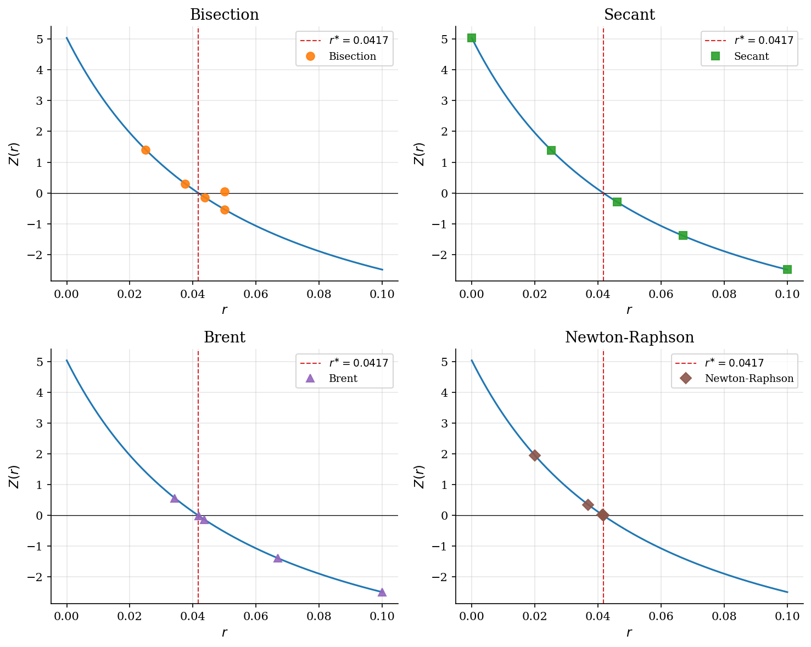
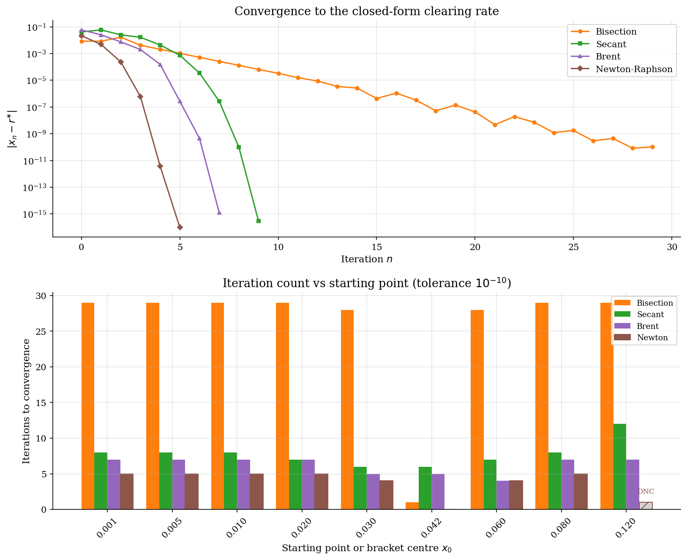

# Scalar Root Finding for Equilibrium Rates

## Overview

A representative-firm economy with Cobb-Douglas production has a closed-form clearing rate $r^{\ast} = 1/\beta - 1$. The market-clearing condition is one scalar equation in $r$.

Bisection halves a sign-change bracket. Secant fits a chord through the last two iterates. Brent combines bisection's bracket with inverse quadratic interpolation when the fast step stays inside. Newton-Raphson uses the analytic derivative.

These are the four solvers behind $\mathrm{scipy.optimize.brentq}$ and the equilibrium clearings in Aiyagari and Huggett.

## Equations

Aggregate capital demand from the firm-side first-order condition is

$$K_d(r) = \left( \frac{\alpha}{r + \delta} \right)^{\frac{1}{1 - \alpha}}.$$

Target supply is $K^{\ast} \equiv K_d(r^{\ast})$ at $r^{\ast} = 1/\beta - 1$.
Excess demand is then

$$Z(r) = K_d(r) - K^{\ast}, \qquad Z(r^{\ast}) = 0.$$

The derivative used by Newton is

$$Z'(r) = -\frac{1}{1 - \alpha} \frac{K_d(r)}{r + \delta} < 0.$$

Bisection halves a sign-change bracket:

$$m_n = \frac{a_n + b_n}{2}, \qquad b_{n+1} - a_{n+1} = \frac{1}{2}(b_n - a_n).$$

Secant fits a chord through the last two iterates:

$$x_{n+1} = x_n - Z(x_n) \frac{x_n - x_{n-1}}{Z(x_n) - Z(x_{n-1})}.$$

Newton-Raphson follows the tangent:

$$x_{n+1} = x_n - \frac{Z(x_n)}{Z'(x_n)}.$$

Brent's method tries inverse quadratic interpolation through the last
three ordinates, falls back to secant when ordinates coincide, and
falls back to bisection when the proposed step would leave the bracket
or fails to halve the previous step. The bracket invariant is
maintained at every iteration.

## Model Setup

| Symbol | Value | Role |
|--------|-------|------|
| $\alpha$ | 0.36 | Capital share in Cobb-Douglas production |
| $\beta$ | 0.96 | Discount factor |
| $\delta$ | 0.08 | Depreciation rate |
| $r^{\ast}$ | 0.041667 | Closed-form clearing rate $1/\beta - 1$ |
| $K^{\ast}$ | 5.4468 | Target aggregate capital at $r^{\ast}$ |
| Bracket $[a_0, b_0]$ | $[1e-06,\, 0.1]$ | Sign-change bracket for bisection and Brent |
| Secant seeds | $[1e-06,\, 0.1]$ | Two starting points for secant |
| Newton start $x_0$ | 0.02 | Starting iterate for Newton-Raphson |
| Tolerance $\varepsilon$ | 1e-10 | Stopping rule on residual and bracket width |

## Solution Method

All four methods solve the same scalar equation $Z(r) = 0$. They differ in what they need (bracket, two seeds, derivative) and how fast they converge.

**Bisection.** Halve a sign-change bracket until its width is below tolerance.

```text
Algorithm: Bisection
Input : a, b with Z(a) Z(b) < 0; tolerance eps
Output: r_n
  fa <- Z(a)
  for n = 1, 2, ... :
      m  <- (a + b) / 2
      fm <- Z(m)
      if fa * fm < 0: b <- m
      else          : a <- m; fa <- fm
      stop when |fm| < eps or (b - a) / 2 < eps
```

**Secant.** Step along the chord through the last two iterates.

```text
Algorithm: Secant
Input : x_0, x_1; tolerance eps
Output: x_n
  f0 <- Z(x_0); f1 <- Z(x_1)
  for n = 2, 3, ... :
      x_n  <- x_1 - f1 (x_1 - x_0) / (f1 - f0)
      fn   <- Z(x_n)
      stop when |fn| < eps
      shift: x_0 <- x_1, f0 <- f1; x_1 <- x_n, f1 <- fn
```

**Brent.** Try inverse quadratic interpolation through the last three iterates. Fall back to secant when ordinates coincide, and to bisection when the proposed step would leave the bracket.

```text
Algorithm: Brent-Dekker
Input : a, b with Z(a) Z(b) < 0; tolerance eps
Output: r_n
  for n = 1, 2, ... :
      try inverse quadratic interpolation -> candidate s
      if s leaves [a, b] or fails half-step rule:
          s <- (a + b) / 2     # bisect
      fs <- Z(s)
      update bracket so it still contains the root
      stop when |fs| < eps or (b - a) < eps
```

**Newton-Raphson.** Step along the tangent at the current iterate.

```text
Algorithm: Newton-Raphson
Input : x_0; tolerance eps; Z, Z'
Output: x_n
  for n = 0, 1, ... :
      x_{n+1} <- x_n - Z(x_n) / Z'(x_n)
      stop when |Z(x_n)| < eps
```

On the same calibration, bisection takes **29 iterations**, secant takes **9**, Brent takes **7**, and Newton from $x_0 = 0.02$ takes **5**. The hand-coded Brent root matches $\mathrm{scipy.optimize.brentq}$ to **0.00e+00**.

## Results

Each trajectory subplot plots $Z(r)$ with the first four iterates of one method on top.

Bisection moves to the midpoint, then halves the bracket each step.

Secant draws chords through the last two iterates and accelerates near the root.

Brent looks like secant but cuts to a bisection step whenever the fast extrapolation would leave the bracket.

Newton uses the tangent slope, so its iterates can leap further than the bracketed methods can.



On a log axis the convergence rates are easy to read. Bisection halves its error each step. Secant accelerates once the iterates settle near the root. Newton drops off a cliff after the first quadratic step. Brent matches the late-stage speed of secant or inverse quadratic interpolation.

The sensitivity panel changes the starting point or bracket centre. Bisection and Brent stay flat: bracket halving is independent of where the bracket sits. Secant and Newton counts depend on the start. **1 of 9** Newton starts step outside the feasible range and diverge (hatched bars marked DNC).



All four methods reach the closed-form root within tolerance. Brent and Newton finish in roughly an order of magnitude fewer iterations than bisection.

**Bisection, secant, Brent, and Newton-Raphson on the stylized bond market**

| Method         | Inputs              |   Iterations |   Final residual |   Error in r | Convergence rate     |
|:---------------|:--------------------|-------------:|-----------------:|-------------:|:---------------------|
| Bisection      | sign-change bracket |           29 |         7.23e-09 |     1.03e-10 | linear (1/2)         |
| Secant         | two starting points |            9 |         2.04e-14 |     2.91e-16 | superlinear (~1.618) |
| Brent          | sign-change bracket |            7 |         9.06e-14 |     1.28e-15 | superlinear          |
| Newton-Raphson | x_0 and Z'          |            5 |         8.88e-16 |     6.94e-18 | quadratic            |

## Takeaway

Brent's method is the right default for production equilibrium solves. It inherits bisection's bracket invariant and adds superlinear speed via inverse quadratic interpolation when the bracket is preserved.

Bisection is the safe fallback when no derivative is available. Secant is a no-derivative alternative to Newton with similar fragility from far-off seeds. Newton is fastest near a simple root but needs a derivative and a starting point inside the basin of attraction.

$\mathrm{scipy.optimize.brentq}$ is the production default for exactly these reasons.

## References

- Mukoyama, T. (2021). *Basic Numerical Methods*. ECON 606 lecture slides, Georgetown University.
- Brent, R. P. (1973). *Algorithms for Minimization without Derivatives*. Prentice-Hall, Ch. 4.
- Press, W. H., Teukolsky, S. A., Vetterling, W. T., and Flannery, B. P. (2007). *Numerical Recipes*. Cambridge University Press, 3rd edition, Ch. 9.
- Judd, K. L. (1998). *Numerical Methods in Economics*. MIT Press, Ch. 5.
