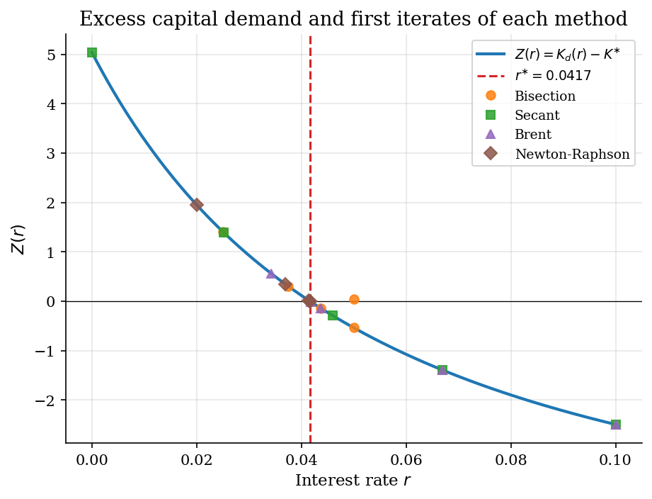
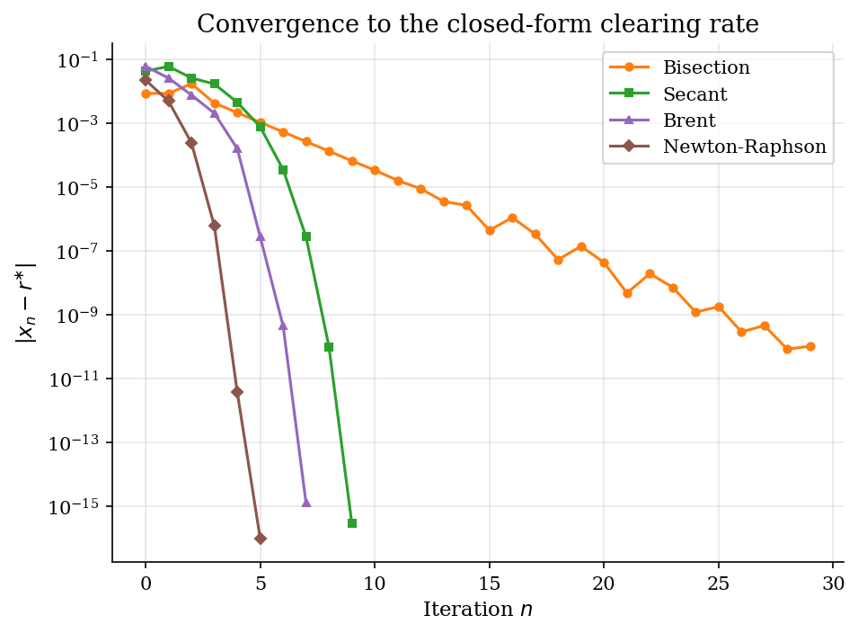
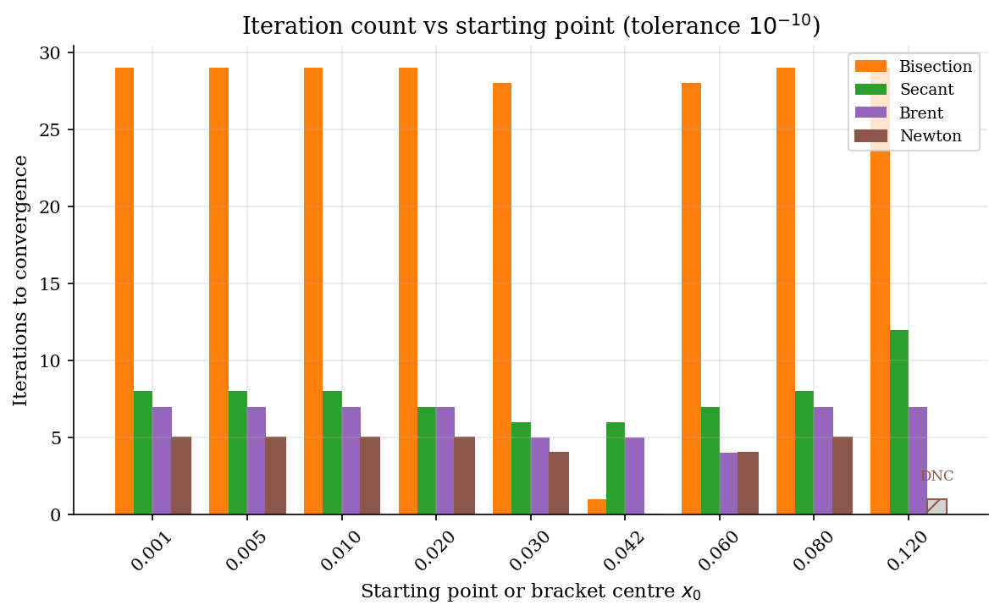

# Scalar Root Finding for Equilibrium Rates

> Bisection, secant, Brent, and Newton-Raphson recover the rate that clears a stylized bond market with a closed-form root.

## Overview

A representative-firm economy with Cobb-Douglas production and a target aggregate capital stock has a closed-form clearing rate $r^{\ast} = 1/\beta - 1$. The market-clearing condition is a scalar equation in $r$, and the four basic root finders all solve the same problem.

Bisection halves a sign-change bracket. Secant fits a line through the last two iterates. Brent's method combines bisection's bracket invariant with inverse quadratic interpolation when accepting the fast step preserves the bracket. Newton-Raphson uses the analytic derivative for quadratic local convergence.

These are the four solvers a first-year PhD student needs when Aiyagari- or Huggett-style equilibrium code stops converging. $\mathrm{scipy.optimize.brentq}$ is the production default for exactly this reason.

## Equations

Aggregate capital demand from the firm-side first-order condition is

$$K_d(r) = \left( \frac{\alpha}{r + \delta} \right)^{\frac{1}{1 - \alpha}}.$$

Setting target aggregate supply at the deterministic clearing rate
$r^{\ast} = 1/\beta - 1$ gives $K^{\ast} \equiv K_d(r^{\ast})$. Excess
demand is

$$Z(r) = K_d(r) - K^{\ast},
\qquad Z(r^{\ast}) = 0,
\qquad r^{\ast} = \tfrac{1}{\beta} - 1.$$

The derivative used by Newton is

$$Z'(r) = -\frac{1}{1 - \alpha}\, \frac{K_d(r)}{r + \delta} < 0.$$

The four iterations are

$$\text{Bisection: } m_n = \tfrac{a_n + b_n}{2}, \quad
\text{keep the half with the sign change}.$$

$$\text{Secant: } x_{n+1} = x_n - Z(x_n)\, \frac{x_n - x_{n-1}}{Z(x_n) - Z(x_{n-1})}.$$

$$\text{Newton-Raphson: } x_{n+1} = x_n - \frac{Z(x_n)}{Z'(x_n)}.$$

Brent's method is a hybrid: it tries inverse quadratic interpolation
through the last three ordinates, falls back to secant when ordinates
coincide, and falls back to bisection when the proposed step would leave
the bracket or fails to halve the previous step length. The bracket
invariant is maintained at every iteration.

## Model Setup

| Symbol | Value | Role |
|--------|-------|------|
| $\alpha$ | 0.36 | Capital share in Cobb-Douglas production |
| $\beta$ | 0.96 | Discount factor |
| $\delta$ | 0.08 | Depreciation rate |
| $r^{\ast}$ | 0.041667 | Closed-form clearing rate $1/\beta - 1$ |
| $K^{\ast}$ | 5.4468 | Target aggregate capital at $r^{\ast}$ |
| Bracket $[a_0, b_0]$ | $[1e-06,\, 0.1]$ | Sign-change bracket for bisection and Brent |
| Secant seeds | $[1e-06,\, 0.1]$ | Two starting points for the secant iteration |
| Newton start $x_0$ | 0.02 | Starting iterate for Newton-Raphson |
| Tolerance $\varepsilon$ | 1e-10 | Stopping rule on residual and bracket width |

## Solution Method

All four methods solve the same scalar equation $Z(r) = 0$. They differ in what they need (bracket, two seeds, derivative) and how fast they converge.

```text
Bisection           | Secant                      | Brent                              | Newton-Raphson
Inputs: a, b, eps   | Inputs: x_0, x_1, eps       | Inputs: a, b, eps                  | Inputs: x_0, eps, Z, Z'
fa <- Z(a)          | f0 <- Z(x_0); f1 <- Z(x_1)  | (use IQI when 3 distinct values,   | for n = 0, 1, ... :
fb <- Z(b)          | for n = 2, 3, ... :         |  else secant; fall back to bisect  |     x_{n+1} <- x_n - Z(x_n)/Z'(x_n)
for n = 1, 2, ... : |     dx <- (x_1 - x_0)       |  if step leaves bracket or fails   |     stop when |Z(x_n)| < eps
    m <- (a+b)/2    |     dn <- f1 - f0           |  half-step progress test)          |
    fm <- Z(m)      |     x_2 <- x_1 - f1 dx/dn   | maintain sign-change bracket each  |
    if fa fm < 0:   |     stop when |f(x_2)| < eps|  iteration                         |
        b, fb<-m,fm |     shift x_0 <- x_1        |                                    |
    else:           |             x_1 <- x_2      |                                    |
        a, fa<-m,fm |                             |                                    |
    stop on tol     |                             |                                    |
```

Starting from the bracket $[1e-06,\, 0.1]$, bisection takes **29 iterations**, secant takes **9**, and Brent takes **7**. Newton from $x_0 = 0.02$ takes **5 iterations**. The hand-coded Brent root matches $\mathrm{scipy.optimize.brentq}$ to **0.00e+00**.

## Results

Excess demand $Z(r)$ is monotone decreasing and crosses zero at $r^{\ast} = 0.0417$. The first 4 iterates of each method, plotted at $(x_n, Z(x_n))$, sit on the curve and march toward the root from different directions: bisection from the midpoint, secant along the chord, Brent mostly via the chord but occasionally bisecting, and Newton along the tangent.



On a log axis the convergence rates are easy to read off. Bisection halves its error each step (a straight line with slope $\log_{10}(1/2)$). Secant accelerates once the iterates settle near the root. Newton drops off a cliff after the first quadratic step. Brent inherits the bracket safety of bisection and the late-stage speed of secant or inverse quadratic interpolation, hitting the tolerance in only a handful of iterations.



Bracketed methods (bisection, Brent) are insensitive to where the bracket is centred: the bisection counts are flat and Brent's stays in single digits. Secant and Newton iteration counts depend on the start; **1 of 9** Newton starts step outside the feasible range and diverge (hatched bars marked DNC). Brent is the right production default precisely because it matches secant's late-stage speed without losing bisection's bracket invariant.



The table summarises the four solves on the same calibration. All four reach the closed-form root within tolerance; Brent and Newton do so in roughly an order of magnitude fewer iterations than bisection.

**Bisection, secant, Brent, and Newton-Raphson on the stylized bond market**

| Method         | Inputs              |   Iterations |   Final residual |   Error in r | Convergence rate     |
|:---------------|:--------------------|-------------:|-----------------:|-------------:|:---------------------|
| Bisection      | sign-change bracket |           29 |         7.23e-09 |     1.03e-10 | linear (1/2)         |
| Secant         | two starting points |            9 |         2.04e-14 |     2.91e-16 | superlinear (~1.618) |
| Brent          | sign-change bracket |            7 |         9.06e-14 |     1.28e-15 | superlinear          |
| Newton-Raphson | x_0 and Z'          |            5 |         8.88e-16 |     6.94e-18 | quadratic            |

## Takeaway

Brent's method is the right default for production equilibrium solves: it inherits bisection's bracket invariant and adds superlinear speed via inverse quadratic interpolation when the bracket is preserved. Bisection is the safe fallback when the derivative is unavailable. Secant is a no-derivative alternative to Newton with similar fragility from far-off seeds. Newton is fastest near a simple root but needs a derivative and a starting point inside the basin of attraction. This is the trade-off behind $\mathrm{scipy.optimize.brentq}$ in Aiyagari- and Huggett-style equilibrium clearings later in the catalog.

## References

- Mukoyama, T. (2021). *Basic Numerical Methods*. ECON 606 lecture slides, Georgetown University.
- Brent, R. P. (1973). *Algorithms for Minimization without Derivatives*. Prentice-Hall, Ch. 4.
- Press, W. H., Teukolsky, S. A., Vetterling, W. T., and Flannery, B. P. (2007). *Numerical Recipes*. Cambridge University Press, 3rd edition, Ch. 9.
- Judd, K. L. (1998). *Numerical Methods in Economics*. MIT Press, Ch. 5.
