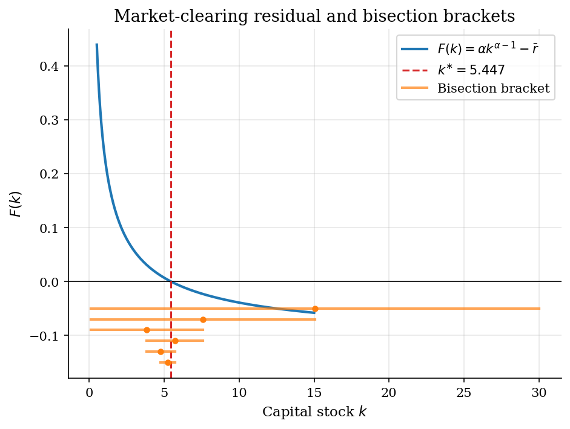

# Scalar Root Finding for Market Clearing

> Bisection and Newton-Raphson find the steady-state capital stock that clears a Cobb-Douglas capital market.

## Overview

A representative-firm economy reaches a steady state when the net marginal product of capital equals the rate of time preference plus depreciation. With Cobb-Douglas production that condition is a scalar equation in $k$.

The unknown is the steady-state capital stock $k^{\ast}$. The equation has a closed form, so any solver can be checked directly. This is the cleanest setup for comparing two basic root finders.

Bisection halves a sign-change bracket. Newton-Raphson extrapolates the tangent line at the current iterate. The first is globally safe and slow; the second is locally fast and depends on the starting point.

## Equations

The capital market clears when the marginal product of capital nets out
the user cost:

$$F'(k^{\ast}) = \tfrac{1}{\beta} - 1 + \delta.$$

For Cobb-Douglas technology $f(k) = k^{\alpha}$ this is the scalar equation

$$F(k) = \alpha\, k^{\alpha - 1} - \bar{r} = 0,
\qquad \bar{r} \equiv \tfrac{1}{\beta} - 1 + \delta.$$

The closed-form root is

$$k^{\ast} = \left( \frac{\alpha}{\bar{r}} \right)^{\frac{1}{1 - \alpha}}.$$

Bisection halves a sign-change bracket $[a, b]$ around the root:

$$m_n = \tfrac{a_n + b_n}{2},
\qquad \mathrm{sign}\, F(a_{n+1}) \neq \mathrm{sign}\, F(b_{n+1}),
\qquad b_{n+1} - a_{n+1} = \tfrac{1}{2}(b_n - a_n).$$

Newton-Raphson follows the tangent line at the current iterate:

$$x_{n+1} = x_n - \frac{F(x_n)}{F'(x_n)}.$$

Near a simple root, the bracket of bisection contracts at a linear rate of
$\tfrac{1}{2}$ per step, while the Newton residual squares each step.

## Model Setup

| Symbol | Value | Role |
|--------|-------|------|
| $\alpha$ | 0.36 | Capital share in Cobb-Douglas production |
| $\beta$ | 0.96 | Discount factor |
| $\delta$ | 0.08 | Depreciation rate |
| $\bar{r}$ | 0.1217 | User cost $1/\beta - 1 + \delta$ |
| $k^{\ast}$ | 5.4468 | Closed-form steady-state capital |
| Bracket $[a_0, b_0]$ | $[0.1,\, 30.0]$ | Initial sign-change bracket for bisection |
| Newton start $x_0$ | 1.0 | Starting iterate for Newton-Raphson |
| Tolerance $\varepsilon$ | 1e-10 | Stopping rule on the residual and the bracket width |

## Solution Method

Both methods solve the same scalar equation $F(k) = 0$. Bisection needs only a sign-change bracket; Newton-Raphson needs the derivative and a single starting point.

```text
Bisection                       | Newton-Raphson
Input: a, b with F(a)F(b) < 0   | Input: x_0, tolerance eps
       tolerance eps            |        F, F'
for n = 1, 2, ... :             | for n = 0, 1, ... :
    m <- (a + b) / 2            |     x_{n+1} <- x_n - F(x_n) / F'(x_n)
    fm <- F(m)                  |     stop when |F(x_n)| < eps
    if |fm| < eps: stop         |
    if F(a) * fm < 0: b <- m    |
    else            : a <- m    |
    stop when (b - a) < eps     |
```

Starting from the bracket $[0.1,\, 30.0]$, bisection converges in **31 iterations** with residual $|F(k)|$ = **8.19e-11**. Starting from $x_0 = 1.0$, Newton-Raphson converges in **7 iterations** with residual $|F(k)|$ = **0.00e+00**.

## Results

The residual $F(k)$ is monotone and crosses zero exactly once at $k^{\ast} = 5.447$. The first six bisection brackets, drawn below the curve, halve in width each iteration while keeping the sign change.



Both methods reach the closed-form root, but at different rates. Bisection halves its error each step and needs **31 iterations** to hit the tolerance. Newton-Raphson squares its residual once near the root and needs only **7 iterations** from the same problem. The Newton curve drops off a cliff once the iterate enters the basin of quadratic convergence.


Bisection iteration counts are flat across starting points: each step halves the bracket regardless of where it is centred. Newton iteration counts climb when the start is far below $k^{\ast}$, where the tangent step is small relative to the gap, and collapse near the root, where quadratic convergence kicks in. From **2 of 9** starting points above $k^{\ast}$, the Newton step overshoots into $k < 0$ where the Cobb-Douglas residual is undefined and the iteration diverges (hatched bars marked DNC).


The table summarises the two solves on the same calibration. Both land within machine tolerance of the closed-form root.

**Bisection vs Newton-Raphson on the steady-state capital market**

| Method         | Start       |   Iterations |   Final residual |   Error in k | Convergence rate   |
|:---------------|:------------|-------------:|-----------------:|-------------:|:-------------------|
| Bisection      | [0.1, 30.0] |           31 |         8.19e-11 |     5.73e-09 | linear (1/2)       |
| Newton-Raphson | x_0 = 1.0   |            7 |         0        |     0        | quadratic          |

## Takeaway

Bisection is the safe default when only a sign-change bracket is available: it halves the error every step and never leaves the bracket. Newton-Raphson is much faster once the iterate is near a simple root, because the tangent extrapolation squares the residual each step. The trade-off shows up at large $x_0$, where the Newton step here overshoots into $k < 0$ and the Cobb-Douglas residual becomes undefined. Aiyagari- and Huggett-style interest-rate solves later in the catalog use bisection on $r$ for exactly this reason.

## References

- Mukoyama, T. (2021). *Basic Numerical Methods*. ECON 606 lecture slides, Georgetown University.
- Press, W. H., Teukolsky, S. A., Vetterling, W. T., and Flannery, B. P. (2007). *Numerical Recipes*. Cambridge University Press, 3rd edition, Ch. 9.
- Judd, K. L. (1998). *Numerical Methods in Economics*. MIT Press, Ch. 5.
