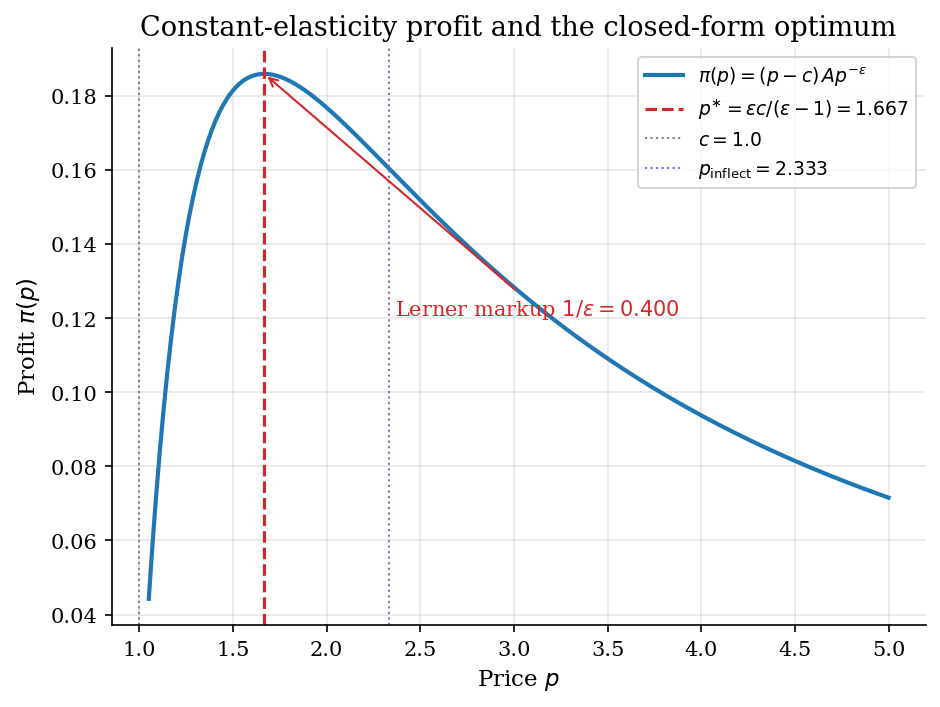
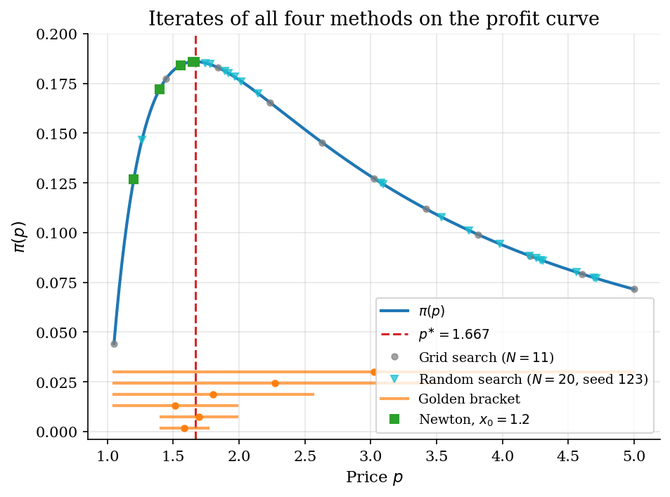
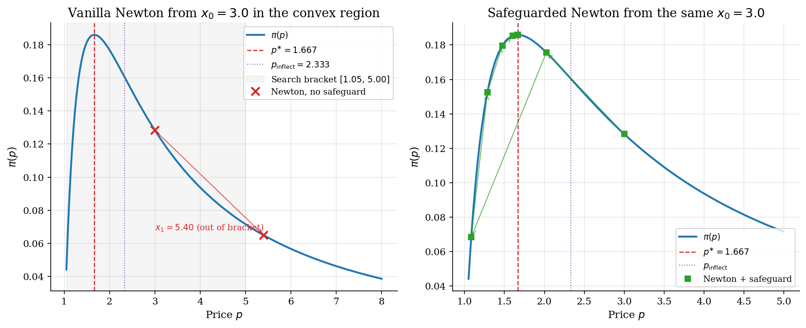
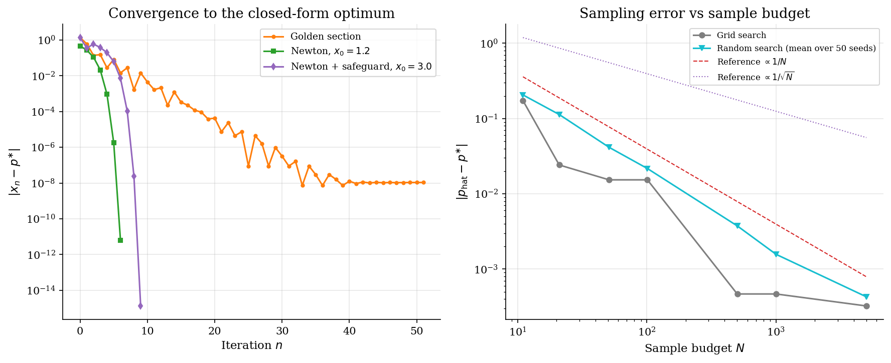

# Scalar Optimization for Monopoly Pricing

## Overview

A monopolist with constant marginal cost faces a constant-elasticity demand. Pricing is one-dimensional. The profit-maximizing price has a closed form. The closed-form price and the Lerner markup pin down what every numerical method should agree on.

This tutorial compares four paradigms for one-dimensional optimization on the same profit curve. The four paradigms are deterministic sampling on a uniform mesh, stochastic sampling by uniform draws, derivative-free contraction of a unimodal bracket, and derivative-based local extrapolation. Each paradigm is the canonical entry point to a wider family used elsewhere in the catalog.

The lesson is that solving the first-order condition is not automatically safer than maximizing the objective. A starting price in the convex region of profit produces a Newton step that points away from the maximum. Adding a bracket safeguard recovers convergence at negligible cost.

## Equations

The general problem is to maximise a scalar profit function $\pi : [p_{\mathrm{lo}}, p_{\mathrm{hi}}] \to \mathbb{R}$ on a bounded interval.
The methods below differ in what they evaluate (the function, its derivative, both) and in how they update the candidate optimum.

### The test instance

The test instance is monopoly pricing under constant-elasticity demand.
Three constants pin down the demand curve: $A$ is a scale parameter that absorbs market size, $\epsilon$ is the demand elasticity (with $\epsilon > 1$ required for the optimum to exist), and $c$ is the constant marginal cost.

$$D(p) = A\, p^{-\epsilon}.$$

Profit is the price-cost margin times the quantity sold.

$$\pi(p) = (p - c)\, D(p) = A\, (p - c)\, p^{-\epsilon}.$$

The first-order condition $\pi'(p) = 0$ has a closed-form root that pins down what every method should return.

$$\pi'(p) = A\, p^{-(\epsilon + 1)} \left[(1 - \epsilon)\, p + \epsilon\, c\right],
\qquad
p^{\ast} = \frac{\epsilon}{\epsilon - 1}\, c.$$

Rearranging the optimum gives the Lerner price-cost margin.

$$\frac{p^{\ast} - c}{p^{\ast}} = \frac{1}{\epsilon}.$$

At the baseline calibration $\epsilon = 2.5$ and $c = 1$ the closed form gives $p^{\ast} = 5/3 \approx 1.667$ and Lerner markup $1/2.5 = 0.4$.

The second derivative is needed by Newton and to identify the inflection point of $\pi$.

$$\pi''(p) = -A\, \epsilon\, p^{-(\epsilon + 2)} \left[(1 - \epsilon)\, p + (\epsilon + 1)\, c\right],
\qquad
p_{\mathrm{inflect}} = \frac{\epsilon + 1}{\epsilon - 1}\, c.$$

Profit is concave on $(0, p_{\mathrm{inflect}})$ and convex on $(p_{\mathrm{inflect}}, \infty)$, with the optimum strictly inside the concave region ($p^{\ast} < p_{\mathrm{inflect}}$).

The next four subsections describe one method at a time.

### Method 1: Grid search

Grid search covers the bracket with a uniform mesh of $N$ nodes and returns the argmax over the mesh.

$$\hat p_{\mathrm{grid}} = \arg\max_{i \in \lbrace 1, \ldots, N\rbrace} \pi(p_i),
\qquad p_i = p_{\mathrm{lo}} + \frac{(i - 1)\,(p_{\mathrm{hi}} - p_{\mathrm{lo}})}{N - 1}.$$

The distance from the nearest mesh point to $p^{\ast}$ is at most half the spacing, so the error scales as $1/N$.

### Method 2: Random search

Random search draws $N$ prices uniformly on the bracket and returns the argmax of the sampled profits.

$$\hat p_{\mathrm{rand}} = \arg\max_{i \in \lbrace 1, \ldots, N\rbrace} \pi(p_i),
\qquad p_i \stackrel{\mathrm{iid}}{\sim} \mathrm{Uniform}[p_{\mathrm{lo}}, p_{\mathrm{hi}}].$$

The expected error scales as $1/N$ in one dimension, the same order as the grid but with stochastic noise on each draw.

### Method 3: Golden-section search

Golden-section search contracts a unimodal bracket $[a_n, b_n]$ using the golden ratio.
Two interior probes split the bracket so that one is reused after each shrink.

$$\phi = \frac{\sqrt{5} - 1}{2} \approx 0.618,
\qquad
p_n = b_n - \phi\, (b_n - a_n),
\qquad
q_n = a_n + \phi\, (b_n - a_n).$$

Here $p_n$ and $q_n$ are the left and right probe prices at iteration $n$, distinct from the price control $p$.
The bracket shrinks by a constant factor $\phi$ each step, giving linear convergence.

### Method 4: Newton on the FOC

Newton follows the tangent of $\pi'$ at the current iterate.

$$x_{n+1} = x_n - \frac{\pi'(x_n)}{\pi''(x_n)}.$$

Newton is equivalent to maximising a parabolic surrogate that matches $\pi$ in value, slope, and curvature at $x_n$.
The surrogate is concave only when $\pi''(x_n)$ is negative, which holds only when $x_n$ lies below $p_{\mathrm{inflect}}$.
A start in the convex region drives the iterates away from $p^{\ast}$.

## Model Setup

| Symbol | Value | Role |
|--------|-------|------|
| $A$ | 1.0 | Demand scale |
| $\epsilon$ | 2.5 | Demand elasticity, $\epsilon > 1$ |
| $c$ | 1.0 | Constant marginal cost |
| $p^{\ast}$ | 1.6667 | Closed-form optimum $\epsilon c / (\epsilon - 1)$ |
| $1/\epsilon$ | 0.4000 | Lerner markup |
| $p_{\mathrm{inflect}}$ | 2.3333 | Inflection point of $\pi$ |
| Bracket $[p_{\mathrm{lo}}, p_{\mathrm{hi}}]$ | $[1.05,\, 5.00]$ | Search interval for grid, random, golden section |
| Sample budget $N$ at headline run | 1001 | Used for grid and random search comparison row |
| Random seed | 42 | Seed for the headline random-search run |
| Replications across $N$ | 50 | Used to average random-search error in the convergence figure |
| Newton good start $x_0$ | 1.2 | Start below $p^{\ast}$ in the concave region |
| Newton bad start $x_0$ | 3.0 | Start above $p_{\mathrm{inflect}}$ in the convex region |
| Tolerance $\eta$ | 1e-10 | Stopping rule on bracket width and on $\pi'$ |

## Solution Method

All four methods solve the same maximization on the bounded interval. They differ in what they evaluate and in how they update.

### Method 1: Grid search

Grid search covers the bracket with a uniform mesh of $N$ nodes. It returns the argmax over the mesh. The distance from the closest mesh point to $p^{\ast}$ is at most half the spacing. The error therefore scales as $1/N$. Doubling $N$ halves the error.

```text
Algorithm: Grid search
Input : bracket [p_lo, p_hi]; grid size N
Output: p_hat
  build N equally spaced prices p_1 < ... < p_N on [p_lo, p_hi]
  i_best <- argmax over i of pi(p_i)
  p_hat  <- p_{i_best}
```

Grid search has no failure mode in one dimension. Its limitation is dimensional. Reaching $10^{-10}$ accuracy needs about $N \sim 4 \times 10^{10}$ nodes. The cost grows as $N^d$ in $d$ dimensions.

### Method 2: Random search

Random search replaces the deterministic mesh with $N$ uniform draws on the bracket. The expected distance from the closest draw to $p^{\ast}$ scales as $1/\sqrt{N}$. That is slower than grid search in one dimension. The strength of random search is dimensional. The $1/\sqrt{N}$ rate is independent of how many price dimensions one adds.

```text
Algorithm: Random search
Input : bracket [p_lo, p_hi]; sample budget N; seed s
Output: p_hat
  rng <- random number generator seeded by s
  draw N prices p_1, ..., p_N independently from Uniform[p_lo, p_hi]
  i_best <- argmax over i of pi(p_i)
  p_hat  <- p_{i_best}
```

Random search misses with non-zero probability. A single run can leave a wide gap to $p^{\ast}$. The standard discipline is to repeat across seeds and report the worst run. Averaging across seeds at each $N$ recovers the smooth $1/\sqrt{N}$ rate.

### Method 3: Golden-section search

Golden-section search contracts a unimodal bracket without using derivatives. Two interior probes split the bracket so that one of them is reused after each shrink. That halves the function-evaluation budget compared to bisection. The bracket width shrinks by the golden ratio every iteration. Linear convergence in the bracket width follows directly. Reaching $10^{-10}$ accuracy needs about 50 iterations regardless of where $p^{\ast}$ sits inside the initial bracket.

```text
Algorithm: Golden-section search
Input : a, b with pi unimodal on [a, b]; tolerance eta
Output: p_n
  phi <- (sqrt(5) - 1) / 2
  p   <- b - phi (b - a)
  q   <- a + phi (b - a)
  for n = 1, 2, ... :
      if pi(p) > pi(q): b <- q
      else            : a <- p
      recompute p, q
      stop when (b - a) < eta
```

Golden section assumes unimodality. A profit curve with two peaks would mislead the bracket-shrink rule. Constant-elasticity profit is single-peaked. The unimodality assumption holds here.

### Method 4: Newton on the FOC

Newton fits a parabolic surrogate to $\pi$ at the current iterate. The iterate jumps to the argmax of the surrogate. The fit matches the value, slope, and curvature of $\pi$ at $x_n$. Quadratic convergence follows from a Taylor expansion around $p^{\ast}$ whenever the start lies in the basin of attraction. Each iteration roughly doubles the number of correct digits. A handful of steps suffices for ten-decimal accuracy.

```text
Algorithm: Newton on FOC, with optional bracket safeguard
Input : x_0; tolerance eta; pi', pi''; bracket [p_lo, p_hi]
Output: x_n
  for n = 0, 1, ... :
      if safeguard and pi''(x_n) >= 0:
          if pi'(x_n) > 0: x_{n+1} <- (p_hi + x_n) / 2
          else           : x_{n+1} <- (p_lo + x_n) / 2
      else:
          x_{n+1} <- x_n - pi'(x_n) / pi''(x_n)
          if safeguard and x_{n+1} not in (p_lo, p_hi):
              x_{n+1} <- clip(x_{n+1}, p_lo, p_hi)
      stop when |pi'(x_n)| < eta
```

Newton fails when the start sits in the convex region above the inflection point. The second derivative flips sign there. The parabolic surrogate becomes a minimum. The step points away from $p^{\ast}$. The bracket safeguard handles this in two ways. When the curvature is non-negative it takes a bisection step in the direction of profit ascent. When the Newton step exits the bracket it clips the iterate to the interior. The two rules together turn the failure mode into a delayed convergence rather than divergence.

## Results

At baseline the closed-form price is $p^{\ast} = 1.667$ and the Lerner markup is $1/\epsilon = 0.400$. Profit is concave below $p_{\mathrm{inflect}} = 2.333$ and convex above it. The maximum sits in the concave region. An iterate that lands above the inflection point misreads the local curvature.



Grid search on $N = 11$ points pins $p^{\ast}$ to the nearest node. Random search on $N = 20$ uniform draws scatters across the bracket. Golden section contracts the bracket $[1.05,\, 5.00]$ at the fixed factor $\phi$ each step. Newton from $x_0 = 1.2$ enters the basin of attraction directly and reaches the tolerance in a handful of steps.



At $x_0 = 3.0$ the FOC residual is $\pi'(x_0) = -4.277e-02$. The curvature is $\pi''(x_0) = 1.782e-02$, positive because the start lies in the convex region. The vanilla Newton step is positive and lands at $x_1 = 5.400$. That iterate exits the search bracket immediately, and the run is flagged **diverged** after one iteration.

The bracket safeguard recovers convergence from the same $x_0 = 3.0$. It first takes a bisection step in the direction of profit ascent because $\pi''(x_0) \geq 0$. Once back in the concave region the standard quadratic Newton convergence kicks in. Safeguarded Newton converges in **9 iterations** with residual **2.97e-16**.



Golden section contracts at a constant factor every step. Newton from $x_0 = 1.2$ shows the quadratic regime once inside the basin. The safeguarded run from $x_0 = 3.0$ spends its first iteration on the bisection-uphill step. It then enters the same quadratic regime once back in the concave region.

Grid-search error scales as $1/N$ in the right panel. Random-search error scales as $1/\sqrt{N}$ on average across seeds. Grid is faster than random in one dimension. The gap closes and reverses as the dimension grows.

Reaching $10^{-3}$ accuracy needs roughly $N \sim 4000$ grid evaluations. Golden section achieves the same accuracy in about a dozen iterations.



The table collects the six headline runs at the baseline calibration $(\epsilon, c) = (2.5, 1.0)$. Iterations are sample evaluations for grid and random, bracket halvings for golden section, and Newton steps for the last three rows. The Newton failure from the bad start and its recovery under the safeguard sit in the same view as the closed-form benchmark.

**Method comparison on the baseline calibration ($\epsilon = 2.5$, $c = 1.0$)**

| Method                            | Setting                    |   Estimated optimum |   Absolute error |   Iterations | Status    |
|:----------------------------------|:---------------------------|--------------------:|-----------------:|-------------:|:----------|
| Grid search                       | 1001 grid nodes            |              1.6662 |         0.000467 |         1001 | converged |
| Random search                     | 1001 random draws, seed 42 |              1.664  |         0.00267  |         1001 | converged |
| Golden section                    | Bracket from 1.05 to 5.00  |              1.6667 |         1.08e-08 |           51 | converged |
| Newton (good start)               | Starting price 1.20        |              1.6667 |         6.43e-12 |            6 | converged |
| Newton (bad start)                | Starting price 3.00        |              5.4    |         3.73     |            1 | diverged  |
| Newton with safeguard (bad start) | Starting price 3.00        |              1.6667 |         1.33e-15 |            9 | converged |

Across $\epsilon$, the Lerner identity $1/\epsilon$ pins down the price-cost margin. The closed-form $p^{\ast}$ moves smoothly as the demand becomes more or less elastic. Golden section recovers the closed form to tolerance in every row.

**Closed-form benchmarks across demand elasticities and golden-section recovery**

|   Elasticity |   Closed-form price |   Lerner markup |   Profit at the optimum |   Golden-section error |
|-------------:|--------------------:|----------------:|------------------------:|-----------------------:|
|          1.5 |              3      |          0.6667 |                  0.3849 |               3.26e-08 |
|          2   |              2      |          0.5    |                  0.25   |               1.29e-08 |
|          2.5 |              1.6667 |          0.4    |                  0.1859 |               1.08e-08 |
|          3   |              1.5    |          0.3333 |                  0.1481 |               7.35e-09 |
|          5   |              1.25   |          0.2    |                  0.0819 |               2.56e-09 |
|         10   |              1.1111 |          0.1    |                  0.0387 |               1.99e-09 |

The vanilla-Newton sweep across nine starting points makes the basin of attraction visible. Starts below $p_{\mathrm{inflect}} = 2.333$ converge in a handful of steps. Starts above the inflection point land in the convex region. The first Newton step from those starts exits the search bracket. **3 of 9** starts diverge, all of them above $p_{\mathrm{inflect}}$.

**Vanilla-Newton iteration count and status across starting points**

|   Starting price |   Iterations | Status    | Above inflection point   |
|-----------------:|-------------:|:----------|:-------------------------|
|             1.05 |            7 | converged | no                       |
|             1.2  |            6 | converged | no                       |
|             1.4  |            5 | converged | no                       |
|             1.6  |            4 | converged | no                       |
|             1.8  |            5 | converged | no                       |
|             2    |            7 | converged | no                       |
|             2.5  |            1 | diverged  | yes                      |
|             3.5  |            1 | diverged  | yes                      |
|             4.5  |            1 | diverged  | yes                      |

## Takeaway

Grid search bounds the answer with a discretization error that scales as $1/N$. It is the cheapest method to reason about and the slowest to high accuracy.

Random search trades the deterministic mesh for stochastic error that scales as $1/\sqrt{N}$. It is slower than grid in one dimension. Its rate is dimension-free. That property is why it dominates in higher dimensions.

Golden section is the practical default in one dimension when the objective is unimodal. It contracts at a fixed factor regardless of where $p^{\ast}$ sits inside the bracket.

Newton on the FOC is the fastest method when the start is in the concave region. A start above the inflection point flips the sign of $\pi''$ and the vanilla step moves away from the maximum. The bracket safeguard reverts to a bisection-uphill step in the convex region and clips Newton steps that would exit the search interval. Adding the safeguard recovers convergence at negligible cost.

The closed-form Lerner markup $1/\epsilon$ is the benchmark every method should agree on.

## References

- Tirole, J. (1988). *The Theory of Industrial Organization*. MIT Press, Ch. 1.
- Press, W. H., Teukolsky, S. A., Vetterling, W. T., and Flannery, B. P. (2007). *Numerical Recipes*. Cambridge University Press, 3rd edition, Ch. 10.
- Judd, K. L. (1998). *Numerical Methods in Economics*. MIT Press, Ch. 4.
- Nocedal, J. and Wright, S. J. (2006). *Numerical Optimization*. Springer, 2nd edition, Ch. 3.
- Bergstra, J. and Bengio, Y. (2012). *Random Search for Hyper-Parameter Optimization*. Journal of Machine Learning Research, 13, 281-305.
