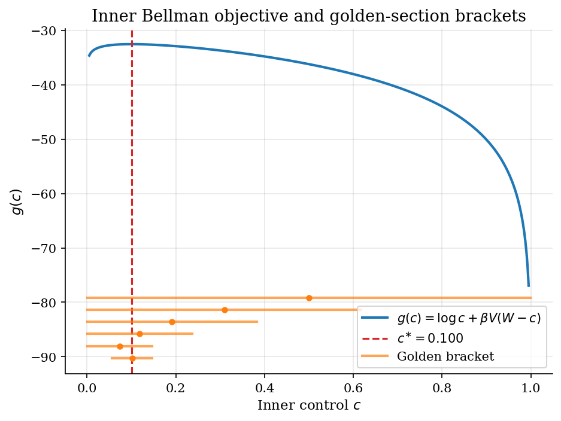
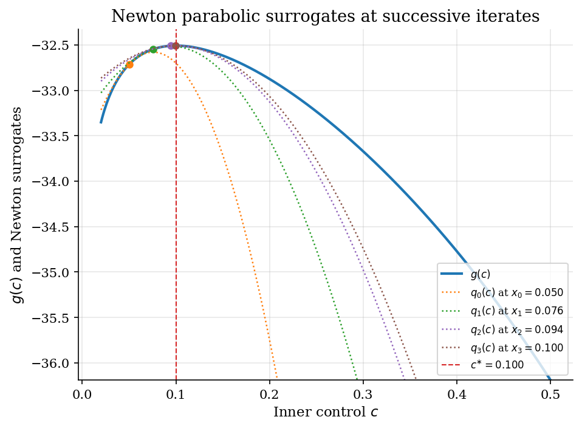
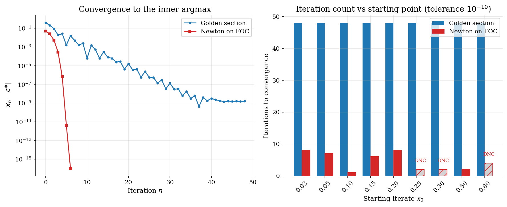

# One-Dimensional Optimization for Bellman Inner Steps

> Golden section search and Newton-on-FOC find the per-state cake-eating maximum, with a log-utility closed-form check.

## Overview

Every infinite-horizon Bellman update has the same inner step: at each state, choose a control that maximizes flow utility plus a discounted continuation value. In the cake-eating problem with wealth $W$, the inner step is

$$\max_{c \in [0, W]} u(c) + \beta\, V(W - c).$$

Under log utility the closed-form inner optimum is $c^{\ast} = (1 - \beta) W$, which lets two basic 1D optimizers be compared directly.

Golden section search contracts a bracket $[a, b]$ around the maximum by reusing one interior point each step. Newton on the first-order condition extrapolates a quadratic surrogate at the current iterate. The first needs only unimodality and is globally safe; the second is locally fast and depends on the starting point.

## Equations

Let $u(c) = \log c$ and let $V$ be the closed-form cake-eating value
function

$$V(W) = \frac{\log((1-\beta) W)}{1-\beta} + \frac{\beta \log \beta}{(1-\beta)^2}.$$

The inner Bellman objective is

$$g(c) = \log c + \beta\, V(W - c),$$

with derivatives

$$g'(c) = \frac{1}{c} - \frac{\beta}{1 - \beta}\, \frac{1}{W - c},
\qquad
g''(c) = -\frac{1}{c^2} - \frac{\beta}{1 - \beta}\, \frac{1}{(W - c)^2} < 0.$$

The objective is strictly concave on $(0, W)$, so the maximum is unique.
Setting $g'(c) = 0$ gives the closed-form policy

$$c^{\ast} = (1 - \beta) W.$$

Golden section search shrinks a bracket $[a, b]$ around the maximum using
$\phi = (\sqrt{5} - 1)/2 \approx 0.618$:

$$c_n = b_n - \phi (b_n - a_n),
\qquad d_n = a_n + \phi (b_n - a_n).$$

The next bracket keeps whichever endpoint is closer to the larger of
$g(c_n)$ and $g(d_n)$, contracting the width by a factor $\phi$ each step.

Newton on the FOC follows the tangent of $g'$ at the current iterate:

$$x_{n+1} = x_n - \frac{g'(x_n)}{g''(x_n)}.$$

Equivalently, Newton maximizes a parabolic surrogate
$q_n(c) = g(x_n) + g'(x_n)(c - x_n) + \tfrac{1}{2} g''(x_n)(c - x_n)^2$.

## Model Setup

| Symbol | Value | Role |
|--------|-------|------|
| $\beta$ | 0.9 | Discount factor; closed-form inner share is $1 - \beta$ |
| $W$ | 1.0 | Wealth at the inner state being optimized |
| $c^{\ast}$ | 0.1000 | Closed-form inner argmax $(1 - \beta) W$ |
| Bracket $[a_0, b_0]$ | $[1e-03,\, 0.9990]$ | Initial unimodal bracket for golden section |
| Newton start $x_0$ | 0.05 | Starting iterate for Newton-on-FOC |
| Tolerance $\varepsilon$ | 1e-10 | Stopping rule on bracket width and on $g'(x_n)$ |

## Solution Method

Golden section search keeps the larger of two interior points and the side of the bracket containing it; one $g$ evaluation is reused each iteration. Newton-on-FOC steps along the parabolic surrogate of $g$ and only needs $g'$ and $g''$.

```text
Golden section search           | Newton on FOC
Input: a, b with g unimodal     | Input: x_0, tolerance eps
       tolerance eps            |        g', g''
phi <- (sqrt(5) - 1) / 2        | for n = 0, 1, ... :
c <- b - phi (b - a)            |     x_{n+1} <- x_n - g'(x_n) / g''(x_n)
d <- a + phi (b - a)            |     stop when |g'(x_n)| < eps
for n = 1, 2, ... :             |
    if g(c) > g(d): b <- d      |
    else          : a <- c      |
    recompute c, d              |
    stop when (b - a) < eps     |
```

Starting from the bracket $[1e-03,\, 0.9990]$, golden section converges in **48 iterations** with FOC residual $|g'(c)| =$ **1.77e-07**. Starting from $x_0 = 0.05$, Newton converges in **6 iterations** with FOC residual $|g'(c)| =$ **0.00e+00**.

## Results

The inner objective $g(c)$ is strictly concave on $(0, W)$ and peaks at $c^{\ast} = 0.100$. The first six golden-section brackets, drawn below the curve, contract by a factor $\phi \approx 0.618$ each step while keeping the maximum inside.



Each Newton iterate $x_n$ defines a parabolic surrogate $q_n(c)$ that matches $g$ in value, slope, and curvature. Newton replaces $g$ with $q_n$ and jumps to its argmax. Starting from $x_0 = 0.05$, the successive parabolas track the curve and the iterates converge to $c^{\ast}$.



Both methods reach $c^{\ast}$, but golden section needs **48 bracket halvings** while Newton needs only **6 steps** from the same calibration. The right panel shows the trade-off: golden-section iteration counts are flat across starting points (the bracket is the same), but Newton iteration counts depend on $x_0$, and **3 of 9** starts overshoot outside $(0, W)$ and diverge (hatched bars marked DNC).



The table summarises both solves on the same calibration. Both land within the chosen tolerance of the closed-form inner argmax.

**Golden section vs Newton-on-FOC on the cake-eating inner step**

| Method         | Start          |   Iterations |   Final residual |   Error in c | Convergence rate   |
|:---------------|:---------------|-------------:|-----------------:|-------------:|:-------------------|
| Golden section | [1e-03, 0.999] |           48 |         1.77e-07 |     1.59e-09 | linear (phi)       |
| Newton on FOC  | x_0 = 0.05     |            6 |         0        |     0        | quadratic          |

## Takeaway

Golden section is the safe default for a one-state Bellman inner step because it only needs unimodality and a bracket: it contracts at a fixed factor regardless of where the optimum sits. Newton on the FOC is much faster when $g'$ and $g''$ are available and $x_0$ is inside the basin of attraction, but a far-off start makes the parabolic extrapolation overshoot outside the feasible interval. Cake-eating and consumption-savings VFI later in the catalog use the golden-section flavour for this reason; smooth optimum problems with cheap derivatives can graduate to Newton.

## References

- Mukoyama, T. (2021). *Basic Numerical Methods*. ECON 606 lecture slides, Georgetown University.
- Press, W. H., Teukolsky, S. A., Vetterling, W. T., and Flannery, B. P. (2007). *Numerical Recipes*. Cambridge University Press, 3rd edition, Ch. 10.
- Judd, K. L. (1998). *Numerical Methods in Economics*. MIT Press, Ch. 4.
