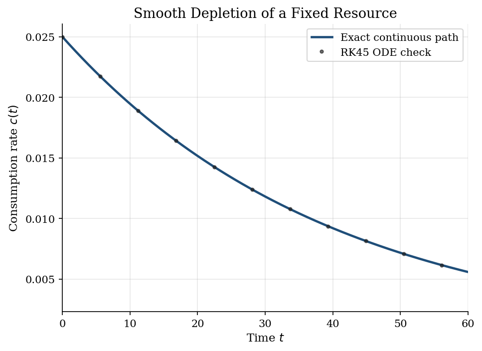
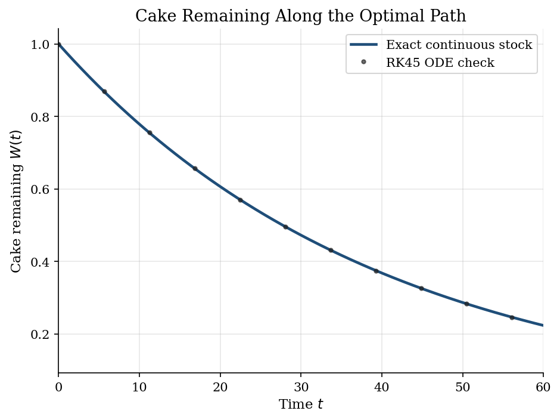
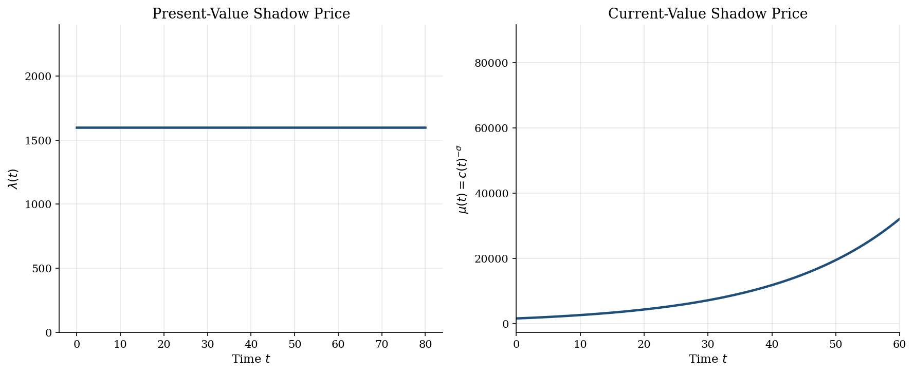

# Fixed-Resource Consumption and Pontryagin Shadow Prices

> A finite-resource consumption problem in continuous time, solved by costate equations.

## Overview

A planner owns a fixed stock $W_0$ of a consumption good. Consuming more today leaves less for every future date.

The object is a continuous-time consumption path $c(t)$ and remaining stock $W(t)$. CRRA utility rewards smoothing, so the path should decline gradually.

The computation turns an infinite-horizon control problem into paths that can be evaluated and checked. Pontryagin's maximum principle supplies the costate equation and the shadow price.

## Equations

For $\sigma > 0$ and $\sigma \neq 1$, flow utility is
$$u(c)=\frac{c^{1-\sigma}}{1-\sigma}, \qquad u'(c)=c^{-\sigma},$$
and the planner solves
$$\max_{\{c(t)\}_{t\geq 0}} \int_0^\infty e^{-\rho t} u(c(t)) \, dt$$

subject to
$$\dot{W}(t)=-c(t), \qquad W(0)=W_0, \qquad c(t)\geq 0, \qquad W(t)\geq 0.$$

The present-value Hamiltonian is
$$\mathcal{H}(c,W,\lambda,t)=e^{-\rho t}u(c)-\lambda c.$$

The first-order condition and costate equation are
$$e^{-\rho t}c(t)^{-\sigma}=\lambda(t), \qquad
\dot{\lambda}(t)=-\frac{\partial \mathcal{H}}{\partial W}=0.$$

Because $W$ has no direct payoff, the present-value costate is constant.
Differentiating the first-order condition gives
$$\frac{\dot c(t)}{c(t)}=-\frac{\rho}{\sigma}.$$

The no-waste condition $\int_0^\infty c(t)\,dt=W_0$ pins down the initial
consumption rate and therefore the full path:
$$c(t)=\frac{\rho}{\sigma}W_0 e^{-\rho t/\sigma}, \qquad
W(t)=W_0 e^{-\rho t/\sigma}.$$

The current-value shadow price is
$$\mu(t)=e^{\rho t}\lambda=c(t)^{-\sigma},$$
so $\dot{\mu}(t)/\mu(t)=\rho$. Current-value scarcity rises even though the
present-value costate is flat.

## Model Setup

| Parameter | Value | Description |
|-----------|-------|-------------|
| $\rho$    | 0.05 | Continuous discount rate |
| $\sigma$  | 2.0 | Relative risk aversion; IES $=1/\sigma$ |
| $W_0$     | 1.0 | Initial resource stock |
| $T$       | 80.0 | Plotting horizon; the economic problem has an infinite horizon |
| Evaluation points | 500 | Time points for exact paths and ODE checks |

## Solution Method

Pontryagin's principle attaches a price to one extra unit of stock. The planner equates discounted marginal utility with that price at each instant. Because $W$ has no direct payoff, the present-value price does not drift. Discounting and curvature then set the decline in consumption.

```text
Inputs: rho, sigma, W0, evaluation grid {t_m}
1. Write the present-value Hamiltonian H = exp(-rho t) u(c) - lambda c.
2. Use the FOC exp(-rho t) c(t)^(-sigma) = lambda(t).
3. Use the costate equation lambda_dot(t) = -H_W = 0.
4. Differentiate the FOC to obtain c_dot(t) / c(t) = -rho / sigma.
5. Use integral_0^infinity c(t) dt = W0 to set c(0) = (rho / sigma) W0.
6. Evaluate c(t), W(t), and mu(t) = c(t)^(-sigma) on {t_m}.
Output: consumption, remaining stock, and shadow-price paths.
```

The numerical check integrates two ODEs from the implied initial consumption rate. It then compares the ODE solution with the closed-form path.

**Verification:** Max absolute error in $W(t)$: 2.64e-11, in $c(t)$: 6.61e-13.

## Results

Consumption starts at $(\rho/\sigma)W_0$ and falls at the constant proportional rate $\rho/\sigma$.

The ODE markers sit on the closed-form path. The costate equations and ODE system imply the same allocation.



The stock is depleted only asymptotically. With CRRA utility and an infinite horizon, the planner preserves future consumption because marginal utility rises near zero.



The present-value costate is flat because the resource stock has no direct payoff term. The current-value shadow price rises at rate $\rho$. Later consumption is scarce in utility terms.



The exact solution benchmarks the ODE path. The errors come from solver tolerances.

**Selected Checks Against the Continuous-Time Path**

|   t |   c(t) exact |   c(t) RK45 |   c error |   W(t) exact |   W(t) RK45 |   W error |
|----:|-------------:|------------:|----------:|-------------:|------------:|----------:|
|   0 |     0.025    |    0.025    |   0       |     1        |    1        |   0       |
|   5 |     0.021991 |    0.021991 |   1.8e-13 |     0.879628 |    0.879628 |   7.2e-12 |
|  10 |     0.019421 |    0.019421 |   1.1e-13 |     0.776852 |    0.776852 |   4.3e-12 |
|  20 |     0.015148 |    0.015148 |   2.5e-13 |     0.605923 |    0.605923 |   1e-11   |
|  30 |     0.011768 |    0.011768 |   2e-13   |     0.470713 |    0.470713 |   7.8e-12 |
|  50 |     0.007159 |    0.007159 |   3.3e-14 |     0.286361 |    0.286361 |   1.3e-12 |

## Takeaway

The costate is the intertemporal price of the remaining resource. Here the present-value price is constant. Optimal consumption declines at rate $\rho/\sigma$ and keeps discounted marginal utility equal across dates.

Higher impatience raises the depletion rate. Higher risk aversion slows it through the smoothing motive.

## References

- Acemoglu, D. (2009). *Introduction to Modern Economic Growth*. Princeton University Press, Ch. 7.
- Kamien, M. and Schwartz, N. (2012). *Dynamic Optimization*. Dover, 2nd edition.
- Chiang, A. (1992). *Elements of Dynamic Optimization*. Waveland Press.
