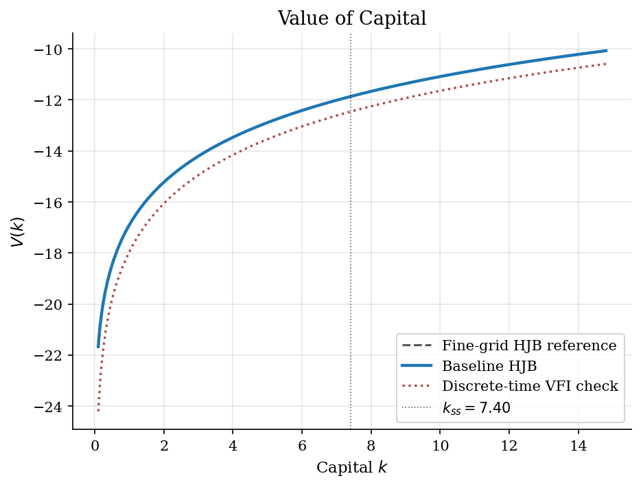
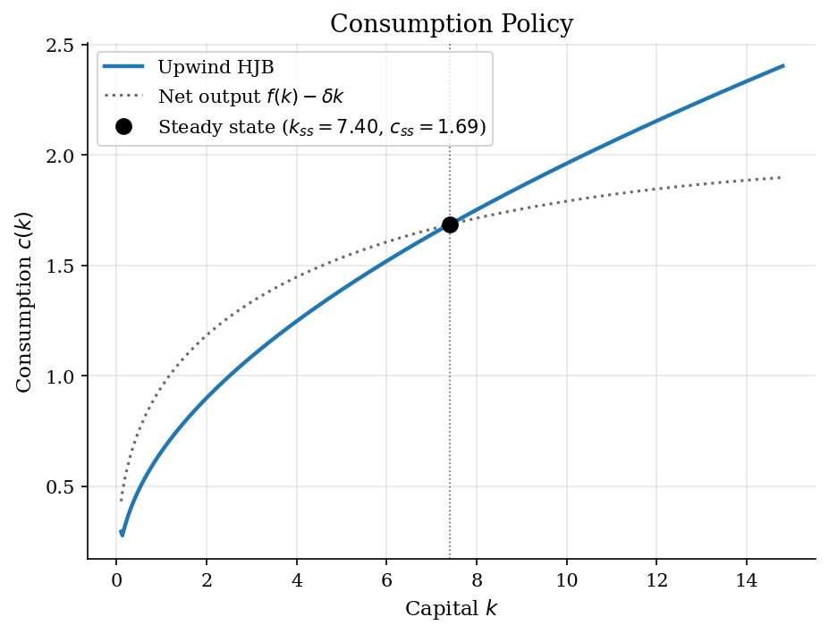
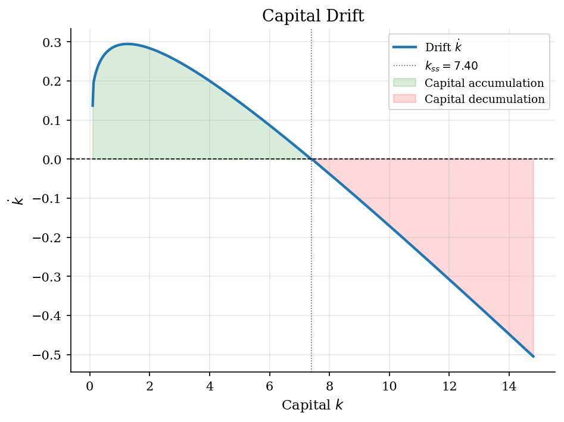
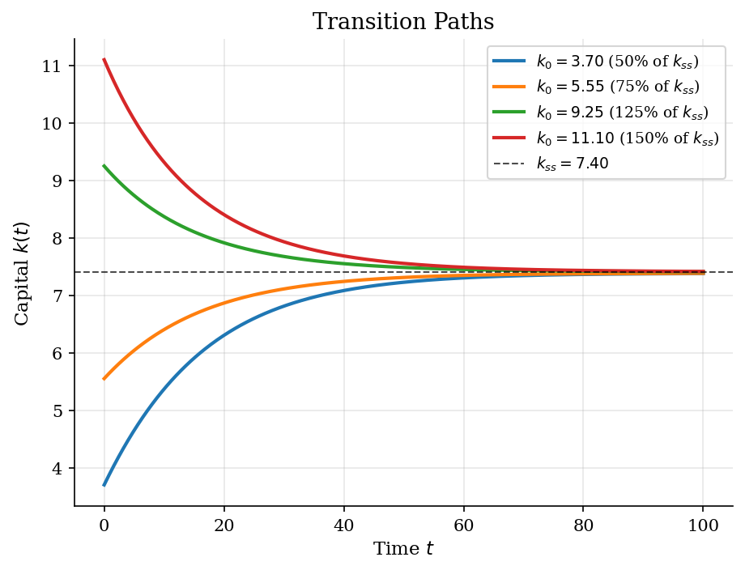

# Ramsey Capital Accumulation by HJB Upwinding

## Overview

A Ramsey planner inherits aggregate capital $k$. Output can be consumed today or invested for future production. Scarce capital raises investment value. Abundant capital makes current consumption cheaper.

The object is the consumption policy $c(k)$ and the capital drift $\dot{k}$. Together they describe how the economy returns to its steady state.

The HJB gives the value of starting from each capital stock. Its derivative is the shadow value that pins down consumption. A finite-difference scheme is needed because the nonlinear HJB has no closed-form policy on the grid. Upwinding chooses the derivative side using the policy-implied drift.

## Equations

The planner solves

$$
\max_{\lbrace c(t)\rbrace_{t \geq 0}}
\int_0^\infty e^{-\rho t}\, u(c(t))\,dt
\quad\text{s.t.}\quad
\dot{k}(t)=f(k(t))-\delta\, k(t)-c(t),
\quad k(0) \text{ given},
$$

with $f(k)=A\, k^\alpha$ and $u(c)=c^{1-\sigma}/(1-\sigma)$ for $\sigma \ne 1$.
The parameter $\rho$ is the continuous-time discount rate, $\delta$ the
depreciation rate, $\alpha$ the capital share, and $A$ the level of TFP.

### From discrete-time Bellman to HJB

The HJB is the $\Delta t \to 0$ limit of a discrete-time Bellman equation.
Write the value of starting with capital $k$ as $V(k)$ and split the planning
horizon into a small interval $[0, \Delta t]$ and the rest. The planner picks
consumption $c$ over the small interval, collects the discounted flow of
utility, and inherits the value at the end:

$$
V(k) = \max_{c \geq 0}\,
\lbrace u(c)\,\Delta t + e^{-\rho\,\Delta t}\, V(k + \dot k\,\Delta t)\rbrace + o(\Delta t),
\qquad \dot k = f(k) - \delta\, k - c .
$$

Expand $e^{-\rho \Delta t} = 1 - \rho\,\Delta t + o(\Delta t)$ and
$V(k + \dot k\,\Delta t) = V(k) + V'(k)\,\dot k\,\Delta t + o(\Delta t)$.
Subtract $V(k)$, divide by $\Delta t$, and let $\Delta t \to 0$. The constant
term $V(k)$ on both sides cancels, the $\rho\,\Delta t \cdot V'\,\dot k$
cross-product is $o(\Delta t)$, and what remains is the **Hamilton-Jacobi-Bellman
equation**

$$
\rho\, V(k) = \max_{c>0}\,
\lbrace
\underbrace{u(c)}_{\text{flow utility}} \, + \,
\underbrace{V'(k)\,(f(k) - \delta\, k - c)}_{\text{shadow value} \, \times \, \text{drift}}
\rbrace .
$$

Reading the equation: the discounted holding cost $\rho V$ is paid out of two
revenue streams. The first is current utility from consumption. The second is
the marginal value $V'(k)$ of capital times the rate at which capital
accumulates. The marginal value $V'(k)$ is the **shadow price** of one extra
unit of capital, the same object that the costate $\mu$ would carry in a
Pontryagin formulation.

### First-order condition and the optimal policy

The maximand depends on $c$ through $u(c) - V'(k)\,c$. The first-order condition
for an interior optimum is therefore

$$
u'(c^{\ast}(k)) = V'(k) ,
$$

which equates the marginal utility of consumption to the marginal value of
capital. With CRRA utility $u'(c) = c^{-\sigma}$, the FOC inverts in closed form
to

$$
c^{\ast}(k) = (V'(k))^{-1/\sigma} .
$$

Substituting back, the implied drift of capital is

$$
s(k) \equiv \dot k = f(k) - \delta\, k - c^{\ast}(k),
$$

and the HJB collapses to a single nonlinear ordinary differential equation for
$V$:

$$
\rho\, V(k) = u(c^{\ast}(k)) + V'(k)\, s(k) .
$$

Two structural features matter for the numerical scheme. The drift $s(k)$ can
be positive (capital accumulates) or negative (capital decumulates), and the
sign of the drift varies across the state space. Both sides of $V'(k)$ must
therefore be available to the solver, and the solver must pick the
correct side at each grid point.

### Upwind finite-difference discretisation

Place a grid $k_1 < k_2 < \cdots < k_N$ with uniform spacing $\Delta k$. Two
natural one-sided derivatives at interior point $i$ are the forward and
backward differences

$$
D^{+}_i V = \frac{V_{i+1} - V_i}{\Delta k},
\qquad
D^{-}_i V = \frac{V_i - V_{i-1}}{\Delta k} .
$$

A central difference $(V_{i+1} - V_{i-1})/(2\,\Delta k)$ would use both sides
with equal weight. That choice is unstable for first-order PDEs of this form
because information flows in the direction of the drift: the value at $k_i$ is
affected by the value at the point the system is moving toward, not the point
behind it. Mixing in information from the wrong side produces oscillating,
non-monotone iterates.

The **upwind** rule picks the side whose drift points away from $k_i$:

$$
D_i V =
\begin{cases}
D^{+}_i V & \text{if } s_i > 0 \text{ (forward, into the right neighbour)},\\
D^{-}_i V & \text{if } s_i < 0 \text{ (backward, into the left neighbour)},\\
(f(k_i) - \delta\, k_i)^{-\sigma} & \text{if } s_i = 0
\text{ (steady-state marginal utility)} .
\end{cases}
$$

The sign of $s_i$ depends on the consumption derived from the upwind
derivative, which in turn depends on the side picked. The standard resolution
computes both candidate drifts, $s^{+}_i = f(k_i) - \delta\, k_i - (D^{+}_i
V)^{-1/\sigma}$ and $s^{-}_i$ analogously, and uses $D^{+}$ when $s^{+}_i > 0$,
$D^{-}$ when $s^{-}_i < 0$, and the zero-drift consumption $c^{0}_i = f(k_i) -
\delta\, k_i$ otherwise. This is the rule encoded above and used in the
algorithm below.

### Boundary conditions

The grid endpoints need special handling because they have only one neighbour.
At $k_1$ (the left boundary) the backward difference is undefined, so the
solver always uses the forward difference; at $k_N$ (the right boundary) the
forward difference is undefined, so the solver always uses the backward
difference. These choices are reflexive: capital cannot drift out of the grid,
so the upwind rule that would pick the missing side is replaced by its only
available alternative.

### Steady state

The Ramsey steady state has $s(k_{ss}) = 0$ and the modified golden rule

$$
f'(k_{ss}) = \rho + \delta ,
$$

derived by differentiating $\rho V = u(c) + V'(k)\,(f - \delta k - c)$ at the
steady state where the envelope $V'(k_{ss}) = u'(c_{ss})$ holds and the drift
vanishes. Plugging the Cobb-Douglas marginal product gives the closed form

$$
k_{ss} = \left(\frac{\alpha\, A}{\rho + \delta}\right)^{1/(1-\alpha)},
$$

with steady-state consumption $c_{ss} = f(k_{ss}) - \delta\, k_{ss}$.

## Model Setup

The calibration uses one aggregate capital state, Cobb-Douglas production, CRRA utility, and no shocks. The grid spans low and high capital around the Ramsey steady state.

| Parameter | Value | Description |
|-----------|-------|-------------|
| $\rho$   | 0.05 | Discount rate |
| $\sigma$ | 2.0 | CRRA coefficient |
| $\alpha$ | 0.36 | Capital share |
| $\delta$ | 0.05 | Depreciation rate |
| $A$       | 1.0 | TFP |
| Baseline HJB grid | 500 points | $k \in [0.1, 14.80]$ |
| $k_{ss}$ | 7.3998 | Steady-state capital |
| $c_{ss}$ | 1.6855 | Steady-state consumption |
| $y_{ss}$ | 2.0555 | Steady-state output |

## Solution Method

The HJB is solved by an implicit upwind finite-difference scheme. The loop alternates two ingredients: at the current $V$ it forms the upwind derivative and the implied policy, and then it advances $V$ by one implicit step of a pseudo-time iteration whose fixed point is the HJB itself. Both ingredients deserve attention because they are the two reasons the scheme is robust.

### The upwind step

At each grid point the solver computes the forward slope $D^{+}_i V$ and the backward slope $D^{-}_i V$, derives the consumption that each slope implies via $c = (D V)^{-1/\sigma}$, and computes the implied drift $s = f(k) - \delta\, k - c$. The drift sign chooses which slope the algorithm keeps. When neither one-sided drift has the expected sign the grid point sits at a local steady state and the consumption is set to net output $f(k_i) - \delta\, k_i$, which is the policy that holds capital fixed.

### The implicit step

An explicit pseudo-time update $V^{n+1} = V^n + \Delta\,(u(c^n) + G^n V^n - \rho V^n)$ is unstable for moderately large $\Delta$ because the upwind generator $G^n$ has eigenvalues with arbitrarily large negative real part (the leaving rate at a point with steep drift can be very large). The implicit version replaces $G^n V^n$ with $G^n V^{n+1}$ and rearranges to

$$
[(1/\Delta + \rho)\, \mathbf{I} - G^n]\, V^{n+1} = u(c^n) + V^n / \Delta .
$$

The matrix on the left is strictly diagonally dominant with positive diagonal because $G^n$ has zero row sums and non-positive diagonal (it is the generator of a sub-Markov process), so the linear system is unconditionally invertible regardless of $\Delta$. Taking $\Delta \to \infty$ recovers a Newton step on $\rho V - u(c) - G V = 0$ with the policy frozen, which is the deepest reason the algorithm converges in a handful of iterations.

The pseudo-time step $\Delta = 1000$ used here is numerical, not economic. It is chosen large enough to be effectively infinite relative to the discount-rate scale $1/\rho = 20$ and the leaving-rate scale $|G^n|$ on the grid.

```text
Algorithm: implicit upwind HJB iteration
Inputs: grid {k_i}, primitives (rho, sigma, alpha, delta, A),
        pseudo-time step Delta, tolerance eps
Initialise V^0_i = u(f(k_i)) / rho                # myopic guess
For n = 0, 1, ... until ||V^{n+1} - V^n||_infinity < eps:
    1. Form forward and backward slopes D^+ V^n_i and D^- V^n_i.
    2. Use the FOC to compute candidate consumption:
       c^+_i = (D^+ V^n_i)^(-1/sigma), c^-_i = (D^- V^n_i)^(-1/sigma).
    3. Compute candidate drifts s^+_i = f(k_i) - delta k_i - c^+_i
       and s^-_i = f(k_i) - delta k_i - c^-_i.
    4. Choose the upwind derivative D_i V^n using the sign of the drift;
       at s_i = 0 use the steady-state marginal utility.
       At i = 1 use D^+; at i = N use D^- (boundary forcing).
    5. Set c^n_i = (D_i V^n)^(-1/sigma) and build the tridiagonal
       generator G^n from the positive and negative drift parts:
       sub-diagonal -s^-_i / dk, super-diagonal s^+_i / dk,
       diagonal -(s^+_i / dk - s^-_i / dk).
    6. Solve the implicit linear system
       [(1/Delta + rho) I - G^n] V^{n+1} = u(c^n) + V^n / Delta
       by sparse LU on a tridiagonal matrix.
Output: value V, consumption policy c(k), drift s(k) = dot{k}
```

**Failure modes.** Three traps catch naive implementations. First, central differences for $V'(k)$ produce oscillating, non-monotone value functions and a policy with phantom kinks. Second, an explicit pseudo-time update with $\Delta$ chosen by analogy with a model period (say $\Delta = 1$) is unstable on fine grids because the upwind transition rate $|s|/\Delta k$ can exceed $2/\Delta$. Third, omitting the boundary forcing at $k_1$ and $k_N$ either tries to read off-grid neighbours or lets the upwind rule pick a side that would push capital out of the grid. The implicit upwind scheme used here side-steps all three.

The HJB converged in **16 iterations** with final sup-norm change $5.34e-07$. Solving the same calibration on a 6000-point reference grid would change $k_{ss}$ by roughly the local grid spacing $\Delta k \approx 2.5e-3$.

## Results

The value function is increasing and concave. Extra capital raises future consumption, but diminishing marginal product lowers the marginal gain.



The consumption rule comes from marginal value. Below the steady state, consumption stays below net output, so capital rises. Above it, consumption exceeds net output, so capital falls.



The drift $s(k)=\dot{k}$ drives transitions and selects the upwind derivative. Positive drift points to capital accumulation. Negative drift points to decumulation. The zero crossing is the Ramsey steady state.



The policy-implied law of motion sends each initial capital stock toward $k_{ss}$. Low-capital economies invest because marginal product is high. High-capital economies consume more than net output and move down.



The closed-form steady state checks the finite-difference solution. The grid locates zero drift within one step.

**Steady-State Values and HJB Diagnostics**

| Variable                              | Analytical   |   Baseline HJB |
|:--------------------------------------|:-------------|---------------:|
| $k_{ss}$ (capital)                    | 7.3998       |       7.4057   |
| $c_{ss}$ (consumption)                | 1.6855       |       1.6858   |
| $y_{ss}$ (output)                     | 2.0555       |       2.0561   |
| $i_{ss} = \delta k_{ss}$ (investment) | 0.3700       |       0.3703   |
| $i/y$ (saving rate)                   | 0.1800       |       0.1801   |
| $f'(k_{ss})$ (MPK)                    | 0.1000       |       0.0999   |
| HJB iterations                        | --           |      16        |
| HJB residual                          | --           |       5.34e-07 |

## Takeaway

The computed policy follows the Ramsey Euler logic. Investment is high when capital has high marginal product. Consumption rises once capital is abundant. The path converges to $f'(k)=\rho+\delta$.

The HJB turns this logic into a value derivative. Upwinding uses the direction of capital movement to choose the derivative. After that choice, the update is a sparse linear solve.

## References

- Achdou, Y., Han, J., Lasry, J.-M., Lions, P.-L., and Moll, B. (2022). "Income and Wealth Distribution in Macroeconomics: A Continuous-Time Approach." *Review of Economic Studies*, 89(1), 45-86.
- Moll, B. (2022). "Lecture notes on continuous-time methods in macroeconomics." https://benjaminmoll.com/lectures/
- Barro, R. and Sala-i-Martin, X. (2004). *Economic Growth*. MIT Press, 2nd edition.
- **See also.** The same Ramsey model is solved by phase-plane eigenanalysis with backward integration in [`optimal-control/phase-diagrams/`](../../optimal-control/phase-diagrams/) and by saddle-path forward shooting in [`optimal-control/ramsey-growth/`](../../optimal-control/ramsey-growth/).
