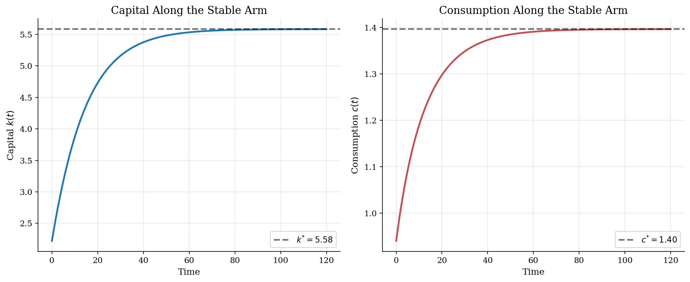

# Ramsey Phase Diagrams and Saddle Paths

> How nullclines and the stable arm discipline consumption in continuous-time growth.

## Overview

In the Ramsey-Cass-Koopmans model, the planner chooses the whole consumption path, but the phase diagram reduces the economic discipline to a simple question: for a given capital stock, which initial consumption level keeps the economy feasible and satisfies the transversality condition?

The state-control pair is $(k,c)$. The two nullclines show where capital or consumption stops moving; their intersection is the steady state. That is not enough to determine the optimum, because most nearby paths move away from the steady state. The missing object is the stable arm: the one-dimensional set of initial $(k,c)$ pairs that converges to the saddle-point steady state.

This tutorial is the geometric companion to the neighboring [HJB growth](../hjb-growth/) and [Ramsey shooting](../ramsey-growth/) examples. Here the method is deliberately visual: read the economic forces from the phase plane, then use the local eigenvector and ODE integration to trace the stable arm.

## Equations

The planner solves

$$
\max_{\{c(t)\}_{t \geq 0}}
\int_0^\infty e^{-\rho t}\frac{c(t)^{1-\sigma}}{1-\sigma}\,dt
\quad\text{s.t.}\quad
\dot{k}(t)=Ak(t)^\alpha-\delta k(t)-c(t).
$$

The Euler equation and the resource law form the two-dimensional system

$$
\dot{k}=f(k)-\delta k-c,
\qquad
\frac{\dot{c}}{c}=\frac{f'(k)-\delta-\rho}{\sigma},
\qquad
f(k)=Ak^\alpha .
$$

The capital nullcline is

$$
\dot{k}=0
\quad\Longleftrightarrow\quad
c=f(k)-\delta k .
$$

The consumption nullcline is

$$
\dot{c}=0
\quad\Longleftrightarrow\quad
f'(k)=\rho+\delta
\quad\Longleftrightarrow\quad
k=k^{\ast}
=\left(\frac{\alpha A}{\rho+\delta}\right)^{1/(1-\alpha)} .
$$

Steady-state consumption is $c^{\ast}=f(k^{\ast})-\delta k^{\ast}$. The golden-rule
capital stock satisfies $f'(k_{GR})=\delta$, so with $\rho>0$ the Ramsey steady
state lies to the left of the golden rule. The boundary condition selecting the
planner's path is the transversality condition

$$
\lim_{t\to\infty} e^{-\rho t}u'(c(t))k(t)=0 .
$$

## Model Setup

The calibration keeps the economy deterministic so that every movement in the diagram has a direct interpretation. Capital is the state, consumption is the control, and output is Cobb-Douglas.

| Parameter | Value | Description |
|-----------|-------|-------------|
| $\alpha$ | 0.30 | Capital share |
| $\delta$ | 0.05 | Depreciation rate |
| $\rho$ | 0.04 | Continuous-time discount rate |
| $\sigma$ | 2.0 | CRRA coefficient and inverse EIS |
| $A$ | 1.0 | Total factor productivity |
| $k^{\ast}$ | 5.5843 | Ramsey steady-state capital |
| $c^{\ast}$ | 1.3961 | Ramsey steady-state consumption |
| $k_{GR}$ | 12.9314 | Golden-rule capital |
| $c_{GR}$ | 1.5087 | Golden-rule sustainable consumption |

## Solution Method

The computation starts where the economics is sharpest: at the steady state. The Jacobian of $(\dot{k},\dot{c})$ at $(k^{\ast},c^{\ast})$ is

$$
J=
\begin{bmatrix}
f'(k^{\ast})-\delta & -1 \\
c^{\ast}f''(k^{\ast})/\sigma & 0
\end{bmatrix}.
$$

Its eigenvalues are $\lambda_s=-0.0710$ and $\lambda_u=0.1110$, so the steady state is a saddle. The stable eigenvector has local slope $dc/dk=0.1110$. That line is a first-order approximation. To get a nonlinear reference for the plotted stable arm, the code integrates the full Ramsey system backward from two nearby points on the stable eigenvector.

```text
Algorithm: nonlinear stable arm in the Ramsey phase plane
Inputs: primitives (alpha, delta, rho, sigma, A), bounds for plotted k and c
1. Compute (k*, c*) from f'(k*) = rho + delta and c* = f(k*) - delta k*.
2. Form the Jacobian J of F(k,c) = (dot{k}, dot{c}) at (k*, c*).
3. Let lambda_s < 0 and v_s = (1, m_s) be the stable eigenpair.
4. Start just below and just above the steady state along v_s.
5. Integrate d(k,c)/d tau = -F(k,c) away from the steady state.
6. Stop when the path leaves the economically relevant plotting region.
7. Sort the two branches by k and use them as the stable-arm reference.
Output: nullclines, local linear arm, nonlinear stable arm, and forward paths.
```

The backward integration is only a way to draw the stable arm. Forward in economic time, points on that arm converge to the steady state; nearby points above or below it violate the boundary condition.

## Results

The phase plane separates two jobs that are often blurred together. The blue curve and red line give sign information: below net output, capital accumulates; left of $k^{\ast}$, consumption grows because the marginal product is high. The black curve is stronger than a direction field. It is the stable arm, so for each capital stock on the plotted branch it gives the initial consumption level consistent with convergence and the transversality condition. The dashed line shows why linearization is useful near the steady state but not a global solution; over $k \in [0.5k^{\ast},1.5k^{\ast}]$ its largest consumption gap from the nonlinear reference is 0.050.


Starting below steady-state capital, the selected path keeps consumption low enough for investment to be high. As capital approaches $k^{\ast}$, the marginal product falls, investment slows, and consumption rises toward $c^{\ast}$. The local stable eigenvalue implies a half-life of about $\ln(2)/|\lambda_s|=9.8$ time units near the steady state; the early part of the transition is nonlinear.



Holding initial capital fixed makes the saddle-path logic explicit. A higher initial consumption choice starts above the stable arm and runs capital down. A lower choice starts below it and accumulates too much capital relative to the present-value boundary condition. The planner's choice is not simply the direction indicated by the nullclines; it is the one initial consumption level that puts the economy on the stable arm.


The table keeps the main numbers auditable. The Ramsey steady state has $r^{\ast}=\rho$, while the golden-rule point has more capital because it ignores impatience. The eigenvalue pair verifies the saddle classification. The last row is a compact check on how far the nonlinear stable arm moves away from the local linear approximation over the central part of the graph.

**Steady-State and Stable-Arm Diagnostics**

| Quantity                    |   Value | Description                                    |
|:----------------------------|--------:|:-----------------------------------------------|
| $k^{\ast}$                     |  5.5843 | Ramsey steady-state capital                    |
| $c^{\ast}$                     |  1.3961 | Ramsey steady-state consumption                |
| $y^{\ast}$                     |  1.6753 | Steady-state output                            |
| $r^{\ast}=f'(k^{\ast})-\delta$    |  0.04   | Net return equals rho in steady state          |
| $k_{GR}$                    | 12.9314 | Capital that maximizes sustainable consumption |
| $c_{GR}$                    |  1.5087 | Maximum sustainable consumption                |
| $\lambda_s$                 | -0.071  | Stable eigenvalue                              |
| $\lambda_u$                 |  0.111  | Unstable eigenvalue                            |
| $dc/dk$ on local stable arm |  0.111  | Consumption slope of the linearized stable arm |
| Max nonlinear-linear gap    |  0.05   | Largest c gap on k in [0.5 k*, 1.5 k*]         |

## Takeaway

The phase diagram is an economic selection device. Nullclines say which way capital and consumption move, but they do not choose the optimal initial consumption level. The transversality condition does that by selecting the stable arm. Linearization gives the local slope and convergence speed; backward integration of the nonlinear ODE shows how the selected path bends away from the steady state. That same selection problem reappears in shooting algorithms and in HJB methods, but the phase plane makes the economics visible before the solver takes over.

## References

- Ramsey, F. (1928). "A Mathematical Theory of Saving." *Economic Journal*, 38(152).
- Barro, R. and Sala-i-Martin, X. (2004). *Economic Growth*. MIT Press, 2nd edition, Ch. 2.
- Acemoglu, D. (2009). *Introduction to Modern Economic Growth*. Princeton University Press, Ch. 8.
