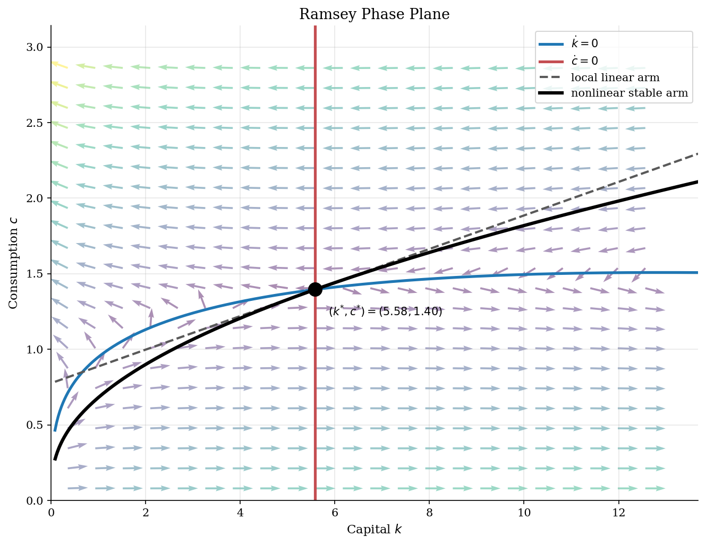
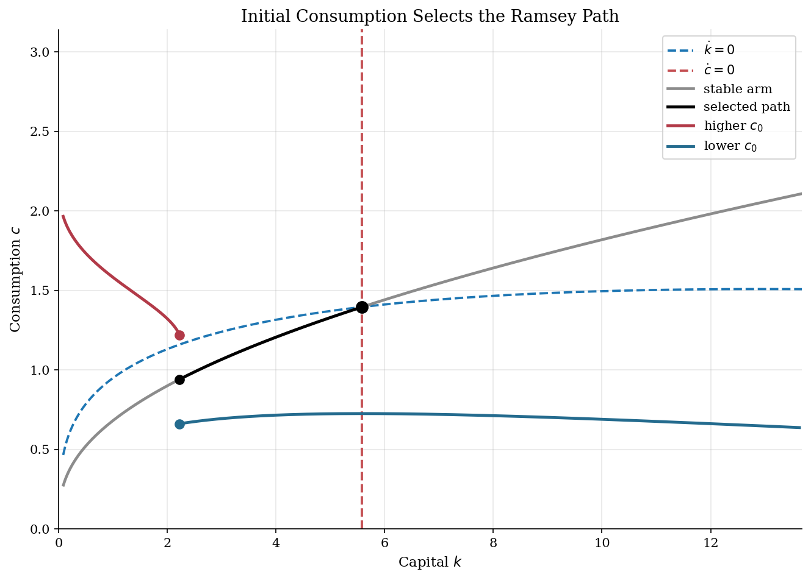

# Ramsey Consumption Choice and Saddle Paths

## Overview

An economy begins with inherited capital. A Ramsey planner chooses consumption today and lets investment carry capital forward. The wrong choice either runs capital down or delays consumption too long.

The object is the phase diagram in $(k,c)$. Capital is the state. Consumption is the control. Nullclines show where each variable stops moving. The stable arm is the curve of choices that converges to the saddle steady state.

The computation traces that arm. The code linearizes the ODE at the steady state, uses the stable eigenvector, and integrates backward. Forward paths then show which initial consumption choices miss the boundary condition.

## Equations

The planner solves

$$
\max_{\{c(t)\}_{t \geq 0}}
\int_0^\infty e^{-\rho t}\frac{c(t)^{1-\sigma}}{1-\sigma} dt
\quad\text{s.t.}\quad
\dot{k}(t)=Ak(t)^\alpha-\delta k(t)-c(t).
$$

The Euler equation and the resource law form the two-dimensional system

$$
\dot{k}=f(k)-\delta k-c,
\qquad
\frac{\dot{c}}{c}=\frac{f'(k)-\delta-\rho}{\sigma},
\qquad
f(k)=Ak^\alpha .
$$

The capital nullcline is

$$
\dot{k}=0
\quad\Longleftrightarrow\quad
c=f(k)-\delta k .
$$

The consumption nullcline is

$$
\dot{c}=0
\quad\Longleftrightarrow\quad
f'(k)=\rho+\delta
\quad\Longleftrightarrow\quad
k=k^{\ast}
=\left(\frac{\alpha A}{\rho+\delta}\right)^{1/(1-\alpha)} .
$$

Steady-state consumption is $c^{\ast}=f(k^{\ast})-\delta k^{\ast}$. The boundary
condition selecting the planner's path is transversality:

$$
\lim_{t\to\infty} e^{-\rho t}u'(c(t))k(t)=0 .
$$

Here $u(c)=\frac{c^{1-\sigma}}{1-\sigma}$ is the CRRA utility function, so $u'(c(t))=c(t)^{-\sigma}$.

## Model Setup

The calibration keeps the mechanics visible. Output is Cobb-Douglas. Preferences are CRRA. There are no shocks, so each arrow shows the same law of motion.

| Parameter | Value | Description |
|-----------|-------|-------------|
| $\alpha$ | 0.30 | Capital share |
| $\delta$ | 0.05 | Depreciation rate |
| $\rho$ | 0.04 | Continuous-time discount rate |
| $\sigma$ | 2.0 | CRRA coefficient and inverse EIS |
| $A$ | 1.0 | Total factor productivity |
| $k^{\ast}$ | 5.5843 | Ramsey steady-state capital |
| $c^{\ast}$ | 1.3961 | Ramsey steady-state consumption |

## Solution Method

The steady state anchors the stable-arm calculation. The Jacobian of $(\dot{k},\dot{c})$ at $(k^{\ast},c^{\ast})$ is

$$
J=
\begin{bmatrix}
f'(k^{\ast})-\delta & -1 \\
c^{\ast}f''(k^{\ast})/\sigma & 0
\end{bmatrix}.
$$

The eigenvalues are $\lambda_s=-0.0710$ and $\lambda_u=0.1110$. One is negative and one is positive. Nearby paths split into stable and unstable directions. The stable eigenvector has local slope $dc/dk=0.1110$. That line is only local. To draw the nonlinear arm, the code starts near the steady state and integrates backward.

```text
Algorithm: trace the Ramsey stable arm
Inputs: primitives (alpha, delta, rho, sigma, A), bounds for plotted k and c
1. Compute (k*, c*) from f'(k*) = rho + delta and c* = f(k*) - delta k*.
2. Form the Jacobian J of F(k,c) = (dot{k}, dot{c}) at (k*, c*).
3. Let lambda_s < 0 and v_s = (1, m_s) be the stable eigenpair.
4. Start just below and just above (k*, c*) along v_s.
5. Integrate d(k,c)/d tau = -F(k,c) away from the steady state.
6. Stop when a branch leaves the plotted economic region.
7. Sort the branches by k and read c(k) as the selected initial consumption rule.
Output: nullclines, local linear arm, nonlinear stable arm, and sample forward paths.
```

Backward integration is a plotting device. In economic time, points on the arm converge to the steady state. Points above or below it miss transversality.

## Results

The blue curve is the capital nullcline. The red line is the consumption nullcline. Below the blue curve, capital rises. Left of $k^{\ast}$, consumption rises because the marginal product is high. The black curve is the stable arm. For each capital stock shown, it gives the initial consumption that reaches the steady state. The dashed line is the local linear approximation.



Holding initial capital fixed shows the selection problem. A higher consumption choice starts above the stable arm and runs capital down. A lower choice starts below it and builds too much capital. Arrows explain motion, but the stable arm selects the path.



## Takeaway

The phase diagram shows direction. It does not choose initial consumption. The transversality condition selects the stable arm. Local linearization gives the slope near the steady state. Backward integration draws the nonlinear path away from it.

## References

- Ramsey, F. (1928). "A Mathematical Theory of Saving." *Economic Journal*, 38(152).
- Barro, R. and Sala-i-Martin, X. (2004). *Economic Growth*. MIT Press, 2nd edition, Ch. 2.
- **See also.** The same Ramsey model is solved by upwind HJB finite differences in [`optimal-control/hjb-growth/`](../../optimal-control/hjb-growth/) and by saddle-path forward shooting in [`optimal-control/ramsey-growth/`](../../optimal-control/ramsey-growth/).
