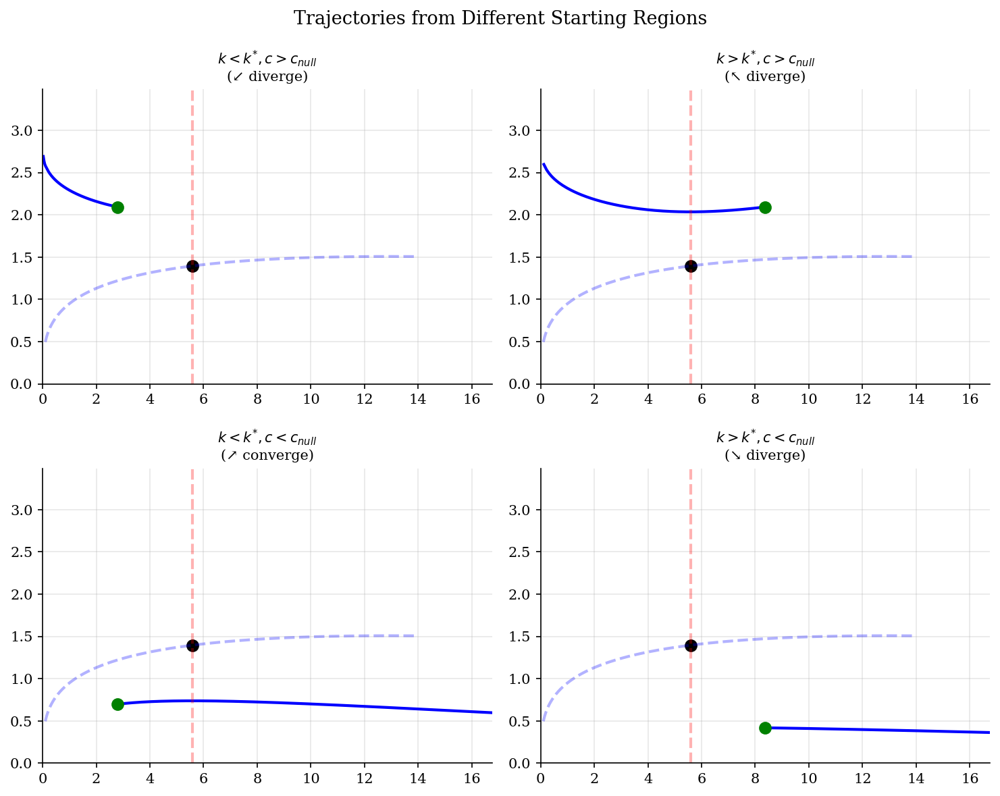

# Ramsey Phase Diagrams and Saddle Paths

> Continuous-time dynamics of consumption and capital with saddle-path stability.

## Overview

Phase diagrams are the primary tool for analyzing continuous-time dynamic economic models. The Ramsey-Cass-Koopmans model has a two-dimensional state space $(k, c)$ with a unique steady state that is a *saddle point* — only one path (the stable manifold) converges to it.

This module visualizes the phase plane: nullclines where $\dot{k} = 0$ and $\dot{c} = 0$, the vector field showing direction of motion, and the saddle path that the economy must follow for an interior optimum.

## Equations

**Capital accumulation:**
$$\dot{k} = f(k) - \delta k - c$$

**Euler equation (consumption):**
$$\dot{c} = \frac{1}{\sigma} \left( f'(k) - \delta - \rho \right) c$$

**Nullclines:**
- $\dot{k} = 0$: $c = f(k) - \delta k$ (hump-shaped in $k$)
- $\dot{c} = 0$: $f'(k) = \delta + \rho$, i.e., $k = k^{*}$ (vertical line)

**Steady state:** $k^{*} = \left(\frac{\alpha A}{\rho + \delta}\right)^{1/(1-\alpha)}$, $c^{*} = f(k^{*}) - \delta k^{*}$

**Transversality condition** selects the saddle path as the unique optimal trajectory.

## Model Setup

| Parameter | Value | Description |
|-----------|-------|-------------|
| $\alpha$ | 0.3 | Capital share |
| $\delta$ | 0.05 | Depreciation rate |
| $\rho$ | 0.04 | Discount rate |
| $\sigma$ | 2.0 | CRRA coefficient |
| $k^{*}$ | 5.5843 | Steady-state capital |
| $c^{*}$ | 1.3961 | Steady-state consumption |

## Solution Method

**Linearization:** The Jacobian at the steady state has eigenvalues $\lambda_1 = -0.0710$ (stable) and $\lambda_2 = 0.1110$ (unstable). This confirms the steady state is a **saddle point**.

**Saddle path:** The stable manifold is traced using the eigenvector associated with $\lambda_1$. Near the steady state, the saddle path slope is approximately 0.1110.

**Integration:** Time paths computed via `scipy.integrate.solve_ivp` (RK45).

## Results

The phase diagram reveals the saddle-point structure of the Ramsey model. Only one consumption level for each initial capital stock places the economy on the stable arm. The vector field shows that off the saddle path, trajectories diverge toward either zero capital or infinite over-accumulation.


*Phase diagram with nullclines, vector field, and saddle path*

Starting from below steady-state capital, the economy invests heavily early on (low consumption) and gradually increases consumption as capital approaches k*. The speed of convergence is governed by the stable eigenvalue of the linearized system.


*Capital and consumption converge to steady state along the saddle path*

Each panel shows a trajectory starting in one of the four quadrants defined by the nullclines. In three of the four regions the path diverges, violating either feasibility or the transversality condition. Only the saddle-path quadrant produces a convergent, economically valid solution.


*Only trajectories starting on the saddle path converge to steady state*

The eigenvalue pair (one negative, one positive) confirms the saddle-point classification. The magnitude of the stable eigenvalue determines the speed of convergence to steady state.

**Steady-State Values and Eigenvalues**

| Quantity    |   Value | Description                     |
|:------------|--------:|:--------------------------------|
| $k^{*}$     |  5.5843 | Steady-state capital            |
| $c^{*}$     |  1.3961 | Steady-state consumption        |
| $y^{*}$     |  1.6753 | Steady-state output             |
| $r^{*}$     |  0.04   | Net interest rate (= rho at ss) |
| $\lambda_1$ | -0.071  | Stable eigenvalue               |
| $\lambda_2$ |  0.111  | Unstable eigenvalue             |

## Takeaway

Phase diagrams reveal the qualitative dynamics of the Ramsey model:

**Key insights:**
- The steady state is a **saddle point**: most trajectories diverge. Only the saddle path (stable manifold) converges — the transversality condition selects it.
- Above the saddle path, agents *over-consume*, depleting capital. Below it, they *over-save*, accumulating capital without bound.
- The $\dot{k}=0$ nullcline is the golden rule line — maximum sustainable consumption. The Ramsey steady state lies *below* the golden rule because agents are impatient ($\rho > 0$).
- The **speed of convergence** depends on $|\lambda_1|$: a half-life of $\ln(2)/|\lambda_1| \approx 9.8$ periods for capital to close half the gap to steady state.

## Reproduce

```bash
python run.py
```

## References

- Ramsey, F. (1928). "A Mathematical Theory of Saving." *Economic Journal*, 38(152).
- Barro, R. and Sala-i-Martin, X. (2004). *Economic Growth*. MIT Press, 2nd edition, Ch. 2.
- Acemoglu, D. (2009). *Introduction to Modern Economic Growth*. Princeton University Press, Ch. 8.
