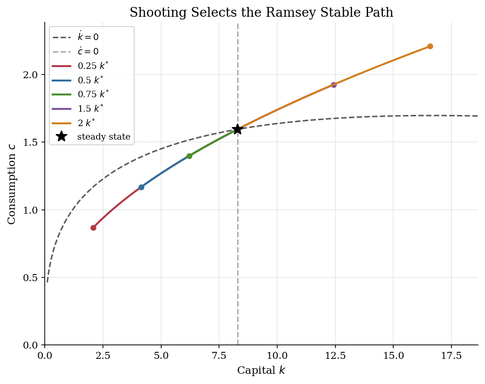
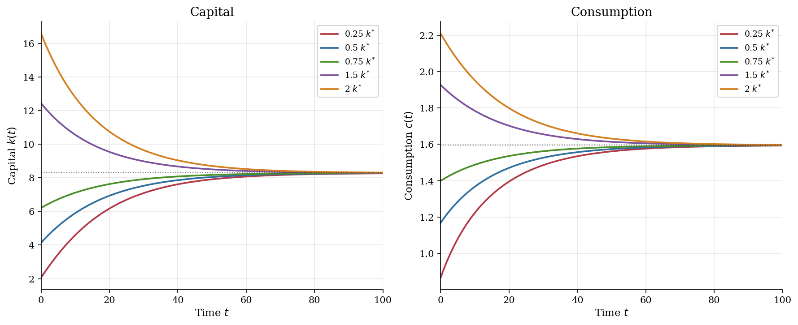
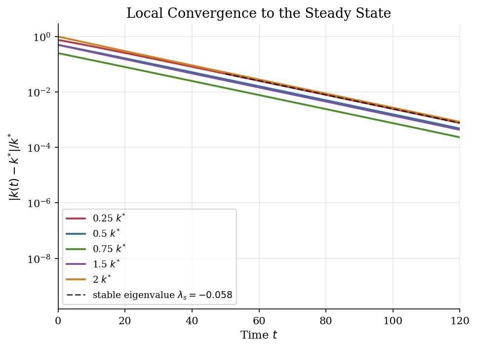

# Ramsey Growth by Shooting

> A continuous-time Ramsey planner picks the one initial consumption level that puts capital on the stable path.

## Overview

The Ramsey-Cass-Koopmans model asks how much output a planner should consume today and how much should be invested for future production. Capital $k(0)$ is inherited from the past, but consumption can jump at date zero. The economic selection problem is therefore sharp: for a given $k_0$, which $c_0$ is consistent with optimal intertemporal saving?

Most initial consumption choices are wrong. If $c_0$ is too high, the economy runs capital down too aggressively and violates feasibility. If it is too low, the planner overaccumulates capital relative to the present-value boundary condition. The shooting method turns that economic restriction into a one-dimensional root search over $c_0$.

This tutorial is the algorithmic companion to the neighboring [Ramsey phase-diagram](../phase-diagrams/) example and the HJB formulation in [HJB growth](../hjb-growth/). The model is the same; the numerical representation is different.

## Equations

The planner chooses a feasible path $\{c(t)\}_{t\geq 0}$:

$$
\max_{\{c(t)\}} \int_0^\infty e^{-\rho t}
\frac{c(t)^{1-\sigma}}{1-\sigma}\,dt
\quad\text{s.t.}\quad
\dot{k}(t)=f(k(t))-\delta k(t)-c(t),
\qquad f(k)=Ak^\alpha .
$$

Here $\rho$ is the continuous-time discount rate, $\delta$ is depreciation,
$\sigma$ is the CRRA coefficient and inverse intertemporal elasticity of
substitution, and $A$ is total factor productivity.

The Euler equation is the Keynes-Ramsey rule

$$
\frac{\dot{c}(t)}{c(t)}=
\frac{f'(k(t))-\delta-\rho}{\sigma}.
$$

Together with the resource law, this gives the two-dimensional system solved by
the code:

$$
\dot{k}=Ak^\alpha-\delta k-c,
\qquad
\dot{c}=\frac{\alpha A k^{\alpha-1}-\delta-\rho}{\sigma}c .
$$

The steady state satisfies

$$
f'(k^{*})=\rho+\delta,
\qquad
k^{*}=\left(\frac{\alpha A}{\rho+\delta}\right)^{1/(1-\alpha)},
\qquad
c^{*}=f(k^{*})-\delta k^{*}.
$$

The finite shooting calculation approximates the infinite-horizon boundary
condition

$$
\lim_{t\to\infty} e^{-\rho t}u'(c(t))k(t)=0
$$

by choosing $c_0$ so that the path is near $(k^{*},c^{*})$ at a long terminal date.

## Model Setup

The calibration is deterministic and deliberately close to textbook growth examples. The terminal date is a numerical device used to approximate the infinite-horizon transversality condition; it is not an economic horizon.

| Object | Value | Role |
|---|---:|---|
| $\alpha$ | 0.33 | Capital share in $Ak^\alpha$ |
| $\delta$ | 0.05 | Depreciation rate |
| $\rho$ | 0.03 | Discount rate |
| $\sigma$ | 2.0 | CRRA coefficient and inverse EIS |
| $A$ | 1.0 | Total factor productivity |
| $T$ | 150 | Terminal date for shooting |
| Initial capital | $0.25k^{*}$ to $2.00k^{*}$ | Predetermined state values |
| $k^{*}$ | 8.2898 | Ramsey steady-state capital |
| $c^{*}$ | 1.5952 | Ramsey steady-state consumption |

## Solution Method

The method solves a boundary value problem by repeated initial value problems. Capital at date zero is fixed. Initial consumption is guessed, the Ramsey ODE is integrated forward, and the terminal capital gap determines whether the guess was too low or too high. Brent bisection then finds the root.

For this model, the terminal residual is monotone in the relevant bracket. Low $c_0$ leaves too much capital at $T$; high $c_0$ exhausts capital before the terminal date or leaves too little capital. The bracket must be wide enough for initial states above $k^{*}$, where the optimal path begins with consumption above net output so that capital decumulates.

```text
Algorithm: finite-horizon shooting for Ramsey growth
Inputs: primitives (alpha, delta, rho, sigma, A), initial capital k0, terminal date T
1. Compute (k*, c*) from f'(k*) = rho + delta and c* = f(k*) - delta k*.
2. Pick a low c0 guess and a high c0 guess with opposite signs of k(T; c0) - k*.
3. For a trial c0, integrate
       dot{k} = f(k) - delta k - c,
       dot{c}/c = [f'(k) - delta - rho] / sigma
   from t = 0 to T, stopping early if feasibility fails.
4. Use bisection/Brent updates on c0 until abs(k(T; c0) - k*) is small.
5. Reintegrate the ODE with the selected c0 to obtain k(t) and c(t).
Output: the saddle-path initial consumption c0(k0) and transition path.
```

The local speed check comes from the Jacobian of $(\dot{k},\dot{c})$ at the steady state. Its eigenvalues are $\lambda_s=-0.0584$ and $\lambda_u=0.0884$, so the local half-life is $\ln(2)/|\lambda_s|=11.9$ time units. On the computed path from $0.25k^{*}$, the fitted late-transition rate is $\hat{\lambda}=-0.0583$.

## Results

The phase diagram shows why shooting is an economic selection rule, not only a numerical trick. The dashed curve is net output, where $\dot{k}=0$; the vertical line is $k^{*}$, where $\dot{c}=0$. Each colored path starts from a different $k_0$ and uses the $c_0$ found by shooting. Below $k^{*}$, consumption starts low enough for investment to build capital. Above $k^{*}$, consumption starts above net output, so capital is deliberately run down.



The time paths make the saving logic easier to read. A capital-poor economy keeps consumption below output and lets capital rise; a capital-rich economy consumes more than current net output and moves down. Consumption is not fixed at a constant saving rate. It moves according to the Euler equation as the marginal product of capital changes along the transition.



The log-scale convergence plot separates nonlinear transition dynamics from the local stable-root approximation. Far from the steady state, the paths bend because the marginal product changes quickly. Once the economy is close to $k^{*}$, the decline in $|k(t)-k^{*}|$ is approximately exponential at the stable eigenvalue.



The table records the jump variable selected by the root search. The consumption ratio is below one when the planner is building capital and above one when the planner is running capital down. The last column is the finite-horizon shooting residual, kept visible so the boundary-condition approximation is auditable.

**Shooting Diagnostics**

|   $k_0/k^{*}$ |   $c_0$ from shooting |   $c_0/[f(k_0)-\delta k_0]$ |   $k(50)/k^{*}$ |   $c(50)/c^{*}$ |   Terminal capital gap |
|--------------:|----------------------:|----------------------------:|----------------:|----------------:|-----------------------:|
|          0.25 |              0.867114 |                       0.742 |          0.9548 |          0.979  |               2.75e-07 |
|          0.5  |              1.16845  |                       0.84  |          0.9714 |          0.9868 |               3.7e-07  |
|          0.75 |              1.39947  |                       0.923 |          0.9862 |          0.9936 |               3.17e-06 |
|          1.5  |              1.92645  |                       1.15  |          1.0259 |          1.0118 |               7.69e-08 |
|          2    |              2.20938  |                       1.302 |          1.0503 |          1.0228 |               4.36e-10 |

## Takeaway

The Ramsey shooting problem is a clean example of how economics and numerics line up. History fixes $k_0$, but optimality selects $c_0$. The root search is finding the initial consumption level that keeps the path feasible and satisfies the transversality condition.

The exercise also shows why saddle-path systems are easy to state but delicate to compute. A small error in $c_0$ sends the economy toward capital exhaustion or overaccumulation. Once the correct path is selected, the model delivers the usual Ramsey logic: invest when capital is scarce, decumulate when capital is abundant, and converge toward the modified golden-rule point $f'(k^{*})=\rho+\delta$.

## References

- Ramsey, F. (1928). "A Mathematical Theory of Saving." *Economic Journal*, 38(152).
- Barro, R. and Sala-i-Martin, X. (2004). *Economic Growth*. MIT Press, 2nd edition, Ch. 2.
- Acemoglu, D. (2009). *Introduction to Modern Economic Growth*. Princeton University Press, Ch. 8.
- Romer, D. (2019). *Advanced Macroeconomics*. McGraw-Hill, 5th edition, Ch. 2.
