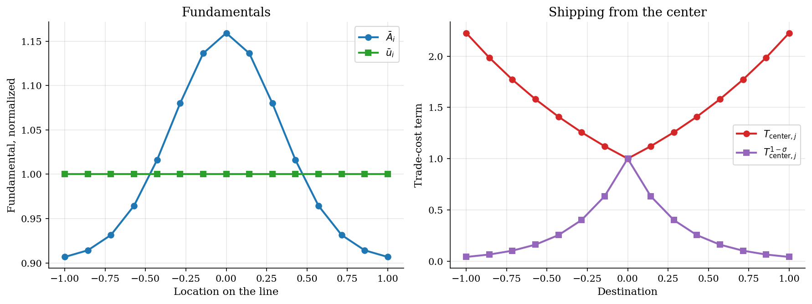
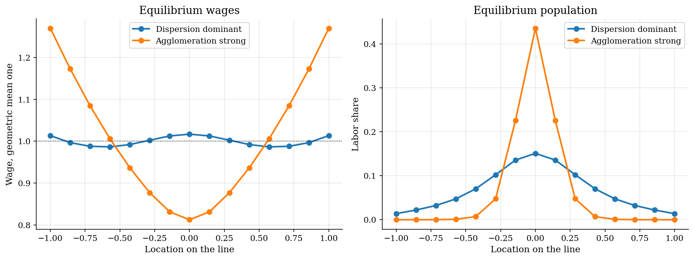
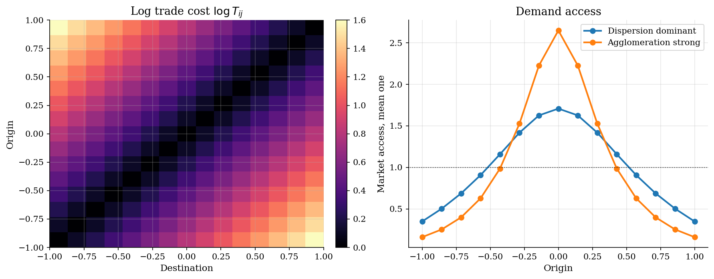
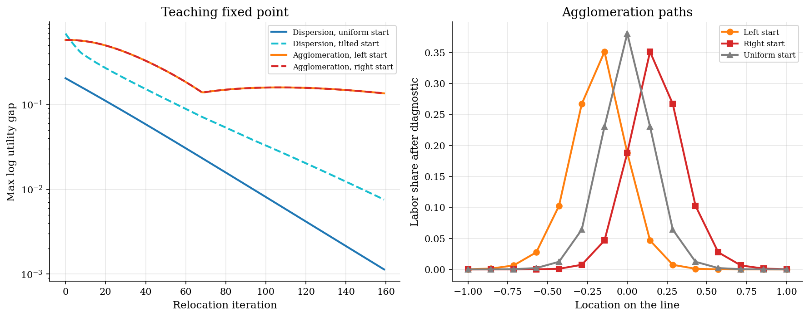

# Allen-Arkolakis Spatial Equilibrium on a Grid

## Overview

Spatial equilibrium models ask where workers live and what workers earn. They also ask how geography changes those outcomes. Allen and Arkolakis start from gravity trade, then add labor mobility.

This tutorial puts 15 locations on a line. The center has a small productivity advantage. Distance raises shipping costs. Workers move until real utility is equalized. Real utility here means the wage multiplied by local amenities and divided by the local price index. Mobility does not equalize nominal wages across locations, only this real utility level.

The tutorial compares a dispersed regime with an agglomerated regime. The comparison shows how spillovers change the spatial allocation.

## Equations

The model has a finite set of locations. I write this set as $i \in \lbrace 1,\ldots,N\rbrace$. I use $j$ when the same set is viewed as destinations.

At location $i$, $L_i$ is labor, $w_i$ is the wage, $A_i$ is productivity, and $u_i$ is the amenity. Trade costs are iceberg costs. Delivering one unit from $i$ to $j$ requires shipping $T_{ij}$ units from origin $i$. By convention $T_{ii} = 1$ within a location and $T_{ij} \geq 1$ otherwise. The same $T_{ij}$ both raises the destination price index and shrinks the revenue origin $i$ collects from $j$.

The paper uses a continuum of locations. This tutorial uses a finite grid. That change turns integrals into sums over $i \in \lbrace 1,\ldots,N\rbrace$.

Productivity and amenities both start from fundamentals. They also respond to local labor:

$$
A_i = \bar A_i L_i^\alpha
$$

$$
u_i = \bar u_i L_i^\beta
$$

$\alpha$ is the productivity spillover. It is positive here. A larger $L_i$ raises $A_i$.

$\beta$ is the congestion parameter. It is negative here. A larger $L_i$ lowers $u_i$.

The two spillovers pull in opposite directions. Their relative strength decides whether the model concentrates labor or spreads it out.

Consumers have Dixit-Stiglitz CES preferences over varieties from every origin. The elasticity of substitution across varieties is $\sigma > 1$. The CES price index at destination $j$ is

$$
P_j^{1-\sigma}
= \sum_i T_{ij}^{1-\sigma} A_i^{\sigma-1} w_i^{1-\sigma}.
$$

The spending share $\pi_{ij}$ is destination $j$'s spending on goods from origin $i$:

$$
\pi_{ij} =
\frac{T_{ij}^{1-\sigma} A_i^{\sigma-1} w_i^{1-\sigma}}
{\sum_k T_{kj}^{1-\sigma} A_k^{\sigma-1} w_k^{1-\sigma}}.
$$

This is the standard Krugman gravity share. CES demand against producers priced at $w_i / A_i$ and shipped at $T_{ij}$ implies destinations spend a larger share on origins that are cheaper or closer.

Each destination $j$ spends its labor income $w_j L_j$ across origins in shares $\pi_{ij}$. Origin $i$'s total revenue is the sum $\sum_j \pi_{ij} w_j L_j$. With labor as the only factor and zero profits under free entry, that revenue equals the local wage bill at $i$:

$$
w_i L_i =
\sum_j \pi_{ij} w_j L_j.
$$

Mobility says workers are indifferent across inhabited locations:

$$
\frac{w_i u_i}{P_i} = V.
$$

Workers compare $w_i u_i / P_i$ across locations and move toward higher values. The common level $V$ is pinned down residually by the labor adding-up constraint below.

$$
\sum_i L_i = 1
$$

$$
N^{-1}\sum_i \log w_i = 0.
$$

The first normalization sets total labor to one. The second normalization sets the geometric mean wage to one, fixing units.

The tutorial solves balanced trade and mobility directly. This matches the finite-location version of equations (11) and (12) in Allen and Arkolakis. On a continuum where iceberg costs depend only on distance, symmetry lets the paper eliminate wages and reduce the two equations to a single nonlinear integral equation in labor density. Allen and Arkolakis call this the Hammerstein reduction. The grid version here keeps the same equilibrium content without the continuum machinery.

## Model Setup

| Symbol | Value | Role |
|--------|-------|------|
| $N$ | 15 | Location count |
| $x_i$ | equally spaced in $[-1,1]$ | Grid position |
| $\sigma$ | 5.0 | Substitution elasticity |
| $T_{ij}$ | $\exp(0.8\lvert x_i-x_j\rvert)$ | Iceberg trade cost |
| $\bar A_i$ | central bump | Productivity fundamental |
| $\bar u_i$ | 1 | Amenity fundamental |
| $\alpha,\beta$ baseline | 0.03, -0.12 | Dispersion regime |
| $\alpha,\beta$ strong agglomeration | 0.12, -0.02 | Agglomeration regime |
| Total labor | 1 | Labor normalization |
| Wage normalization | geometric mean wage one | Wage units |

## Solution Method

The solver works with log wages and labor logits. A softmax maps logits into labor shares. This keeps wages positive, labor positive, and total labor equal to one.

```text
Algorithm: finite-grid spatial equilibrium
Input : T_ij, Abar_i, ubar_i, alpha, beta
Output: w_i, L_i
  choose log wage unknowns omega_i
  choose labor logits z_i
  map z into L by softmax
  compute A_i = Abar_i L_i^alpha
  compute u_i = ubar_i L_i^beta
  compute CES price indexes P_j
  compute trade shares pi_ij
  residual 1: log(w_i L_i) - log(sum_j pi_ij w_j L_j)
  residual 2: log(w_i u_i / P_i) - log(w_1 u_1 / P_1)
  residual 3: mean_i log w_i = 0
  solve residuals = 0
```

The high-agglomeration case uses continuation. Continuation starts at the dispersion root and changes spillover parameters in two steps. This helps the root search. It is not an economic assumption.

## Results

The grid is deliberately small. The center has the only built-in location advantage. Trade costs rise with distance. Distant destinations therefore receive lower weight in price indexes and sales.



The dispersion-dominant center share is 15.1%. The strong-agglomeration largest share is 43.6%. Nominal wages, price indexes, and amenities differ across space. Real utility is still equalized.



The heatmap fixes geography. Purchasing power moves across locations. Central concentration raises demand access for nearby origins. Those origins serve more workers at lower shipping costs.



Allen and Arkolakis define two composite parameters that decide which regime the model lives in. $\gamma_1 = 1 - (\sigma-1)\alpha - \sigma\beta$ collects the dispersion forces. $\gamma_2 = 1 + \sigma\alpha + (\sigma-1)\beta$ collects the agglomeration forces. Equilibrium is unique when $\gamma_2/\gamma_1 < 1$ and can have multiple equilibria when $\gamma_2/\gamma_1 > 1$. The diagnostic table further down prints this ratio for both scenarios. The figure just below shows the multiple-equilibrium case directly.

The relocation iteration is diagnostic only. It solves wages for a provisional population and computes real utility gaps. It then shifts workers toward high-utility locations.

Under dispersion dominance, both starts converge quickly. Under strong agglomeration, left and right starts remain different. Their final labor profiles differ by as much as 0.304. This illustrates non-uniqueness. Stronger spillovers can remove global uniqueness.



The parameter table records the normalizations and spillover regimes. The diagnostic table reports the two residual blocks and concentration.

**Parameter table**

| Symbol                       | Value                                                                                         | Meaning                  |
|:-----------------------------|:----------------------------------------------------------------------------------------------|:-------------------------|
| $N$                          | 15                                                                                            | Location count           |
| $x_i$                        | 15 equally spaced points in [-1, 1]                                                           | Grid position            |
| $\sigma$                     | 5.0                                                                                           | Substitution elasticity  |
| $T_{ij}$                     | $\exp(0.8\lvert x_i-x_j\rvert)$                                                               | Iceberg trade cost       |
| $\bar A_i$                   | central log-productivity bump                                                                 | Productivity fundamental |
| $\bar u_i$                   | 1 for every location                                                                          | Amenity fundamental      |
| $\alpha, \beta$              | Dispersion dominant: alpha=0.03, beta=-0.12, Agglomeration strong: alpha=0.12, beta=-0.02     | Spillover parameters     |
| $\gamma_1, \gamma_2$         | Dispersion dominant: gamma1=1.48, gamma2=0.67, Agglomeration strong: gamma1=0.62, gamma2=1.52 | Stability terms          |
| $\sum_i L_i$                 | 1                                                                                             | Labor normalization      |
| $\frac{1}{N}\sum_i \log w_i$ | 0                                                                                             | Wage normalization       |

**Equilibrium diagnostics by scenario**

| Scenario             |   alpha |   beta |   gamma2/gamma1 |   Max trade residual |   Max utility residual |   Common utility |   HHI |   Largest share | Solver    |
|:---------------------|--------:|-------:|----------------:|---------------------:|-----------------------:|-----------------:|------:|----------------:|:----------|
| Dispersion dominant  |    0.03 |  -0.12 |            0.45 |             7.11e-15 |               3.33e-16 |           1.8638 | 0.099 |           0.151 | converged |
| Agglomeration strong |    0.12 |  -0.02 |            2.45 |             3.38e-12 |               3.05e-16 |           1.2623 | 0.297 |           0.436 | converged |

The policy experiment lowers the trade-cost slope from 0.80 to 0.60. This represents lower transport costs. Lower transport costs raise welfare in both regimes through better access. Population also moves, and the direction depends on the spillover regime.

**Lower trade-cost counterfactual**

| Scenario             | kappa change   | Welfare change   |   Policy welfare |   HHI change |   Policy HHI | Center share change   | Policy center share   |
|:---------------------|:---------------|:-----------------|-----------------:|-------------:|-------------:|:----------------------|:----------------------|
| Dispersion dominant  | 0.80 to 0.60   | 5.38%            |           1.9641 |       -0.006 |        0.093 | -1.0 pp               | 14.1%                 |
| Agglomeration strong | 0.80 to 0.60   | 2.88%            |           1.2986 |       -0.052 |        0.244 | -7.4 pp               | 36.1%                 |

## Takeaway

For policy, the model tracks welfare, concentration, and geographic redistribution. Lower trade costs improve access and raise real utility. They can also move activity across space.

Agglomeration can raise productivity, but it can also create congestion and concentration risk. Strong dispersion makes outcomes more predictable. Strong agglomeration makes history and initial conditions more important.

Transport policy should be judged by welfare, concentration, and redistribution together. A higher common utility number is not the whole policy answer. It does not say which locations gain population. It does not measure concentration risk.

## References

- Allen, T. and Arkolakis, C. (2014). *Trade and the Topography of the Spatial Economy*. Quarterly Journal of Economics 129(3), 1085-1140. https://doi.org/10.1093/qje/qju016.
- Allen, T. and Arkolakis, C. (2013). *Trade and the Topography of the Spatial Economy*. NBER Working Paper 19181. https://www.nber.org/papers/w19181.
- Redding, S. J. and Rossi-Hansberg, E. (2017). *Quantitative Spatial Economics*. Annual Review of Economics 9, 21-58.
