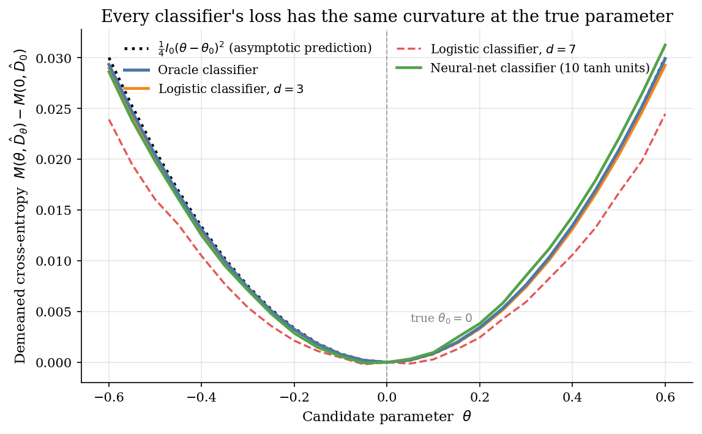
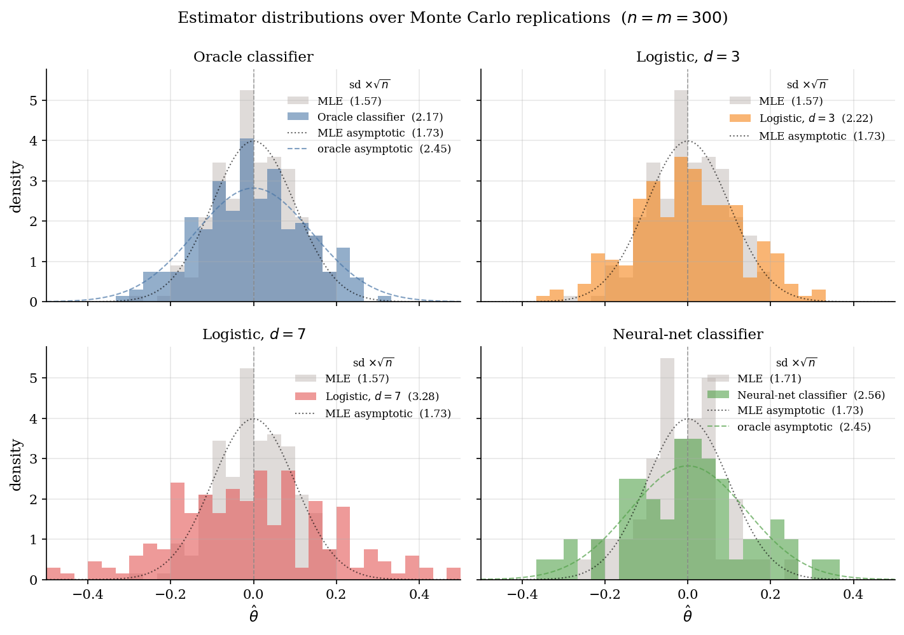
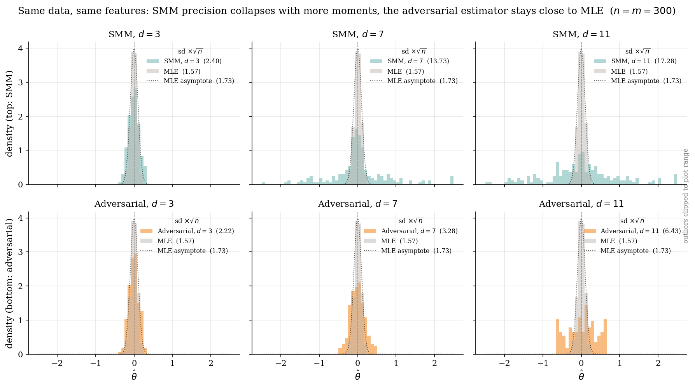

# Adversarial Structural Estimation

## Overview

Structural estimation matches data to a model that is easier to simulate than to write down as a likelihood. The simulated method of moments does this by matching a vector of empirical moments to simulated ones. The catch is moment choice. A poorly chosen pair can outperform a long list; adding moments often hurts precision rather than improving it.

Adversarial estimation moves the moment-choice step inside the algorithm. The analyst trains a binary classifier, called the discriminator, to separate real observations from observations simulated under a candidate parameter. The estimator is the parameter that the best-trained discriminator finds hardest to spot. The class of classifiers replaces the list of moments.

Two choices of classifier recover estimators the reader has seen. A logistic regression on the first $d$ power features of $x$ asymptotically matches optimally-weighted SMM with the first $d$ power moments. A small neural network asymptotically matches maximum likelihood, without writing down the likelihood and without picking moments by hand.

The illustration uses the smallest model that supports the comparison. The real data are $n$ i.i.d. draws from the standard logistic distribution. The single unknown is the location $\theta_0$, set to zero. Maximum likelihood is available in closed form as the efficiency benchmark. The headline exhibit puts SMM and the adversarial estimator side by side as the moment count grows from three to eleven.

## Equations

The setup has three objects.

- The real sample $\lbrace X_i \rbrace_{i=1}^{n}$, drawn i.i.d. from an unknown distribution $P_0$.
- A parametric structural model $\lbrace P_\theta : \theta \in \Theta \rbrace$ that can be simulated. The model need not admit a closed-form density.
- A class of candidate discriminators $\mathcal D_n$. Each $D \in \mathcal D_n$ maps an observation $x$ to a number $D(x) \in [0, 1]$, read as the predicted probability that $x$ is a real observation rather than a simulated one.

Simulated observations come from a fixed shock vector and a structural transform. Draw $\tilde X_i \sim \tilde P_0$ once for $i = 1, \dots, m$. At any candidate $\theta$,

$$
X_{i,\theta} = T_\theta(\tilde X_i).
$$

The same shocks are reused at every candidate $\theta$. This is the standard common-random-numbers trick; it keeps the outer objective a smooth function of $\theta$ rather than a step function that re-randomizes with each new draw.

The estimator is the min-max

$$
\hat\theta = \arg\min_{\theta \in \Theta}\, \max_{D \in \mathcal D_n}\, M(\theta, D),
$$

with the cross-entropy

$$
M(\theta, D) = \underbrace{\frac{1}{n}\sum_{i=1}^{n} \log D(X_i)}_{\text{score on real data}} + \underbrace{\frac{1}{m}\sum_{i=1}^{m} \log(1 - D(X_{i,\theta}))}_{\text{score on simulated data}}.
$$

Read $M$ as the log-likelihood of a classification problem in which real points carry label $1$ and simulated points carry label $0$. The inner step trains the discriminator. The outer step picks the structural $\theta$ at which the best-trained discriminator does worst. This is the Goodfellow et al. (2014) GAN objective, with the simulator $T_\theta$ in the role of the generator.

The population inner maximum has a known form. When both densities exist, it is attained pointwise by the Bayes-optimal classifier

$$
D^{\ast}_\theta(x) = \frac{p_0(x)}{p_0(x) + p_\theta(x)}.
$$

At $\theta = \theta_0$ the two densities coincide, $D^{\ast}_\theta \equiv 1/2$, and $M$ is at its worst. Minimizing the inner maximum over $\theta$ therefore drives the simulated distribution toward the real one.

### Method 1: Oracle discriminator

Plug the closed-form ratio into $D^{\ast}_\theta$. For the standard logistic location family the density is $p_\theta(x) = \Lambda(x - \theta)\, \Lambda(-(x - \theta))$ with $\Lambda(z) = (1 + e^{-z})^{-1}$. The oracle simplifies to

$$
D^{\ast}_\theta(x) = \Lambda\left(-\theta - 2 \log(1 + e^{-x}) + 2 \log(1 + e^{-(x - \theta)})\right).
$$

Substituting $D^{\ast}_\theta$ into $M$ and minimizing over $\theta$ recovers maximum likelihood in the limit $m / n \to \infty$. The oracle is a sanity benchmark, not a usable estimator. Needing both densities defeats the simulation-based motivation.

### Method 2: Logistic discriminator with polynomial features

Restrict $\mathcal D_n$ to logistic regressions on the first $d$ powers of $x$:

$$
D_\lambda(x) = \Lambda(\lambda_0 + \lambda_1 x + \lambda_2 x^2 + \dots + \lambda_d x^d), \qquad \lambda \in \mathbb{R}^{d+1}.
$$

The inner step is a convex logistic regression. Its first-order conditions in $\lambda$ are GMM moment conditions in disguise, equating residual-weighted feature averages on the real and simulated samples:

$$
\frac{1}{n}\sum_{i=1}^{n} (1 - D_\lambda(X_i)) X_i^{k} = \frac{1}{m}\sum_{i=1}^{m} D_\lambda(X_{i,\theta}) X_{i,\theta}^{k}, \qquad k = 0, 1, \dots, d.
$$

At the min-max solution the resulting $\hat\theta$ is asymptotically equivalent to optimally-weighted SMM with the first $d$ power moments $(\mathbb{E}[X], \mathbb{E}[X^2], \dots, \mathbb{E}[X^d])$. The trained discriminator weights $\lambda$ play the role of the SMM weighting matrix $\hat\Sigma^{-1}$, but they are learned by gradient descent rather than computed from a noisy covariance estimate.

### Method 3: Shallow neural-network discriminator

Replace $\mathcal D_n$ by a one-hidden-layer network with $H$ tanh units:

$$
D_\eta(x) = \Lambda(b_{\mathrm{out}} + c^{\top} \tanh(W x + b)), \qquad \eta = (W, b, c, b_{\mathrm{out}}).
$$

With enough hidden units the class $\mathcal D_n$ can approximate the oracle $D^{\ast}_\theta$ uniformly on a compact set. The Kaji-Manresa-Pouliot result then says the adversarial estimator inherits the MLE asymptotic distribution, up to a finite-simulation correction:

$$
\sqrt{n}(\hat\theta - \theta_0) \Rightarrow \mathcal{N}\left(0, \frac{1 + n/m}{I_0}\right),
$$

where $I_0$ is the Fisher information of the structural model at $\theta_0$. The factor $1 + n/m$ is the price of learning the discriminator from a finite simulation sample. With $n = m$ the adversarial standard error is $\sqrt{2}$ times the MLE one.

## Model Setup

| Symbol | Meaning | Value |
|---|---|---:|
| $P_0$ | True distribution | Standard logistic |
| $\theta_0$ | True location | 0.0 |
| $n$ | Real sample size | 300 |
| $m$ | Simulated sample size | 300 |
| $T_\theta(\tilde x)$ | Structural simulator | $\theta + \tilde x$ |
| $\tilde P_0$ | Base shock distribution | Standard logistic |
| $R$ | Monte Carlo replications, cheap estimators | 200 |
| $R_{\text{net}}$ | Monte Carlo replications, neural-net discriminator | 60 |
| Outer grid | $\theta$ candidates | 25 points in $[-0.6,0.6]$ |
| $d$ | Polynomial degrees for logistic discriminator | $\lbrace 3, 7, 11 \rbrace$ |
| $H$ | Hidden tanh units in MLP | 10 |
| $\lambda_{L_2}$ | Weight decay on input and output layers | 1e-03 |
| Inner solver | scipy L-BFGS-B on JAX gradients | maxiter=60 (MLP), 200 (logistic) |
| $I_0$ | Fisher information for logistic location | $1/3$ |
| Asymptotic sd of MLE | $1/\sqrt{I_0}$ | 1.732 |
| Asymptotic sd of adversarial | $\sqrt{(1+n/m)/I_0}$ | 2.449 |

## Solution Method

Every estimator below has the same two-level structure. The inner step fits the best discriminator at a fixed $\theta$. The outer step minimizes the trained discriminator's cross-entropy $M(\theta, \hat D_\theta)$ over $\theta$. After the inner fit, $M(\theta, \hat D_\theta)$ is a function of $\theta$ alone.

The outer step uses a grid with a parabolic refinement. Twenty-five $\theta$ values are evenly spaced in the search interval. At each value the inner discriminator is retrained from scratch. The grid argmin is then refined by fitting a parabola through it and its two neighbours; this gives a sub-grid estimate without an extra inner fit. Three implementation choices keep the outer surface smooth and reproducible: the shocks $\tilde X$ are drawn once and reused at every $\theta$, the discriminator is initialized from the same starting point at every $\theta$, and a small weight decay damps sensitivity to that starting point when the inner fit is non-convex.

### Method 1: Oracle discriminator

The oracle ratio $D^{\ast}_\theta = p_0 / (p_0 + p_\theta)$ is closed form for the logistic location model. There is no inner fit. $M(\theta, D^{\ast}_\theta)$ is evaluated directly at every grid point.

```
Algorithm: oracle adversarial estimator

Inputs:  real sample X, common shocks tilde X, structural map T_theta
Output:  theta_hat

  for each theta on the outer grid:
      X_theta := theta + tilde X
      D := closed-form ratio  p_0(x) / (p_0(x) + p_theta(x))
      M(theta) := mean log D(X) + mean log(1 - D(X_theta))
  theta_hat := argmin of M over the grid (parabolic refinement)
```

The oracle is the upper bound on what any data-driven discriminator can achieve. Its standard error is the MLE standard error inflated by the simulation factor $1 + n/m$. The failure mode is conceptual: needing both densities defeats the simulation-based motivation. The oracle is reported as a sanity check, not as a usable estimator.

### Method 2: Logistic discriminator with polynomial features

The discriminator is a logistic regression on the first $d$ powers of $x$. Real points carry label $1$, simulated points carry label $0$. The inner problem is a strictly convex log-likelihood. It converges in a few L-BFGS steps.

```
Algorithm: logistic adversarial estimator with degree d

Inputs:  real sample X, common shocks tilde X, structural map T_theta, degree d
Output:  theta_hat

  for each theta on the outer grid:
      X_theta := theta + tilde X
      build design matrix Phi with columns  1, x, x^2, ..., x^d
      labels: 1 for real points, 0 for simulated points
      fit lambda by maximizing the logistic log-likelihood  M(theta, D_lambda)
      M(theta) := M(theta, D_lambda_hat)
  theta_hat := argmin of M over the grid
```

This estimator matches optimally-weighted SMM with the first $d$ power moments. Its failure mode is inherited from that match. Higher power moments like $X^7$ and $X^{11}$ are noisy in finite samples, so the corresponding directions of the optimal weighting matrix are noisy too. The adversarial framing softens this problem but does not remove it; the standard error grows with $d$, just more slowly than for plain SMM.

### Method 3: Shallow neural-network discriminator

The discriminator is a one-hidden-layer network with $H$ tanh units and a sigmoid output. The inner problem is non-convex but small. L-BFGS on JAX-computed gradients handles it in tens of milliseconds. A small ridge penalty on the input and output weights limits the freedom of the network in finite samples.

```
Algorithm: neural-net adversarial estimator

Inputs:  real sample X, common shocks tilde X, structural map T_theta,
         hidden width H, common initialization eta_0, weight decay lambda_L2
Output:  theta_hat

  for each theta on the outer grid:
      X_theta := theta + tilde X
      labels: 1 for real points, 0 for simulated points
      fit eta = (W, b, c, b_out) by maximizing
          M(theta, D_eta) - lambda_L2 * (||W||^2 + ||c||^2)
        via L-BFGS starting from eta_0
      M(theta) := mean log D_eta(X) + mean log(1 - D_eta(X_theta))
  theta_hat := argmin of M over the grid
```

The failure modes are familiar from neural training. The inner objective is non-convex, so a re-run with a different starting point can land on a different local optimum. Using the same starting point at every outer $\theta$ removes that source of non-monotonicity in $M(\theta, \hat D_\theta)$. The refit cost dominates runtime, so both the hidden width $H$ and the maximum number of L-BFGS iterations are kept small.

## Results

The first diagnostic is the curvature of $M(\theta, \hat D_\theta)$ around $\theta_0$. A second-order expansion of the cross-entropy around the symmetric point $D = 1/2$ gives a quadratic with coefficient $I_0 / 4$, where $I_0$ is the Fisher information of the structural model. The factor of one-quarter is the price of measuring information through classification accuracy instead of the log-likelihood directly. All three discriminators trace that target closely. Their implied estimators therefore inherit Fisher curvature, which is exactly the condition for asymptotic efficiency.

Each colored line is the Monte Carlo average of $M(\theta, \hat D_\theta)$, demeaned at $\theta = 0$. The dotted black line is the analytical prediction $I_0 (\theta - \theta_0)^2 / 4$. Agreement near the truth is what asymptotic efficiency requires. Level offsets away from the truth do not affect the estimator, because the outer step uses only the location of the minimum.



The second diagnostic compares the sampling distributions of the estimators. Each adversarial estimator sits next to maximum likelihood on the same simulated data. Any difference between the two histograms is due to the discriminator, not to the data. The oracle adversarial estimator overlaps the maximum-likelihood distribution almost exactly. The logistic and neural discriminators sit next to it with a slightly wider spread. That extra spread is the cost of training the discriminator on a finite simulation sample.

Each panel overlays the maximum-likelihood histogram in grey with one adversarial estimator in color. The vertical line marks the true location $\theta_0 = 0$. The dashed black curve is the asymptotic Gaussian prediction $\mathcal{N}(0,\, (1 + n/m)/(n\, I_0))$ from Corollary 4 of the paper. Standard deviations in the legend are on the rate scale $\sqrt{n} \cdot \mathrm{sd}(\hat\theta)$, matching the asymptotic numbers in the model setup table.



Bias is reported on the natural scale. Standard deviations are reported on the rate scale $\sqrt{n} \cdot \mathrm{sd}(\hat\theta)$. Asymptotic values use $\sqrt{1/I_0}$ for maximum likelihood and $\sqrt{(1 + n/m) / I_0}$ for the adversarial estimator. All Monte Carlo numbers are slightly below the asymptotic prediction at this sample size, which is the usual finite-sample behavior.

**Bias and standard errors across estimators**

| Estimator            |    Bias |   Monte Carlo sd $\times \sqrt{n}$ | Asymptotic sd $\times \sqrt{n}$   |   RMSE $\times \sqrt{n}$ |
|:---------------------|--------:|-----------------------------------:|:----------------------------------|-------------------------:|
| MLE (reference)      |  0.0019 |                              1.572 | 1.732                             |                    1.568 |
| Oracle adversarial   | -0.0032 |                              2.173 | 2.449                             |                    2.168 |
| Logistic disc., d=3  | -0.0021 |                              2.222 | -                                 |                    2.217 |
| Logistic disc., d=7  | -0.0045 |                              3.276 | -                                 |                    3.269 |
| Logistic disc., d=11 |  0.0187 |                              6.434 | -                                 |                    6.426 |
| Neural net disc.     | -0.004  |                              2.562 | 2.449                             |                    2.541 |

The headline exhibit reruns the same data through plain simulated method of moments. Three power moments give an SMM estimator that is competitive with maximum likelihood in this design. Adding four more moments multiplies the SMM standard error by roughly six. The reason is that higher power moments are noisy in finite samples and the optimal weight matrix amplifies that noise. Eleven moments are essentially useless: the SMM distribution spreads across the full $\theta$ search interval. The adversarial estimator on the same polynomial features barely moves over the same range of $d$. The discriminator reweights the features so that information from each moment is used in proportion to its precision.

The top row is optimally-weighted simulated method of moments matching the first $d$ power moments. The bottom row is the adversarial estimator with a logistic discriminator on the same $d$ polynomial features. All six panels share a horizontal axis spanning the full $\theta$ search interval. The SMM panels visibly fan out as $d$ grows while the adversarial panels stay near the truth. Standard deviations in the legend are on the rate scale $\sqrt{n} \cdot \mathrm{sd}(\hat\theta)$, with maximum likelihood overlaid as the efficient benchmark.



Both estimators see the same polynomial features but use them differently. SMM matches each feature as a moment in its own right. The adversarial estimator lets the discriminator combine the features adaptively. That adaptive combination is what protects it from the precision loss that breaks SMM at $d = 7$ and $d = 11$.

**SMM versus adversarial bias and standard errors as moment count grows**

| Estimator            | Moments d   |    Bias |   sd $\times \sqrt{n}$ |   RMSE $\times \sqrt{n}$ |
|:---------------------|:------------|--------:|-----------------------:|-------------------------:|
| MLE (reference)      | -           |  0.0019 |                  1.572 |                    1.568 |
| SMM                  | 3           | -0.0018 |                  2.402 |                    2.396 |
| Adversarial logistic | 3           | -0.0021 |                  2.222 |                    2.217 |
| SMM                  | 7           |  0.0035 |                 13.728 |                   13.694 |
| Adversarial logistic | 7           | -0.0045 |                  3.276 |                    3.269 |
| SMM                  | 11          | -0.0061 |                 17.278 |                   17.235 |
| Adversarial logistic | 11          |  0.0187 |                  6.434 |                    6.426 |

A nonparametric bootstrap gives a practical recipe for inference. Both the real and the common-shock samples are resampled with replacement. The discriminator class is held fixed and the adversarial estimator is recomputed on every resample. For the focal logistic-$d = 7$ discriminator the bootstrap standard error closely tracks the Monte Carlo standard error across the 200 simulated experiments. In a real application the Monte Carlo number would not be available, so the bootstrap is the inference tool the analyst would actually use.

The bootstrap uses $B = 200$ joint resamples of the real and shock vectors with replacement. The asymptotic value is the oracle prediction. Both the Monte Carlo and the bootstrap numbers are slightly larger because the data-driven discriminator is less efficient than the oracle.

**Bootstrap, Monte Carlo, and asymptotic standard errors for adversarial logistic d=7**

| Source                              |   sd $\times \sqrt{n}$ |
|:------------------------------------|-----------------------:|
| Asymptotic (Theorem 3, paper)       |                  2.449 |
| Monte Carlo across 200 replications |                  3.276 |
| Bootstrap with B=200                |                  3.526 |

## Takeaway

Adversarial estimation moves moment selection from the analyst into the algorithm. A logistic discriminator on $d$ powers gives an estimator asymptotically equivalent to optimally-weighted SMM with $d$ moments; it inherits SMM's fragility at large $d$ but loses far less precision than the plain version. A small neural discriminator approaches maximum-likelihood efficiency without writing down the likelihood. The price is an inner optimization at every outer step, paid in compute rather than analyst judgment.

## References

- [Kaji, T., Manresa, E., and Pouliot, G. (2023). An Adversarial Approach to Structural Estimation. *Econometrica*, 91(6), 2041-2063.](https://doi.org/10.3982/ECTA18707)
- [Goodfellow, I., Pouget-Abadie, J., Mirza, M., Xu, B., Warde-Farley, D., Ozair, S., Courville, A., and Bengio, Y. (2014). Generative Adversarial Nets. *NeurIPS*.](https://papers.nips.cc/paper/5423-generative-adversarial-nets)
- [McFadden, D. (1989). A Method of Simulated Moments for Estimation of Discrete Response Models without Numerical Integration. *Econometrica*, 57(5), 995-1026.](https://doi.org/10.2307/1913621)
- [Athey, S., Imbens, G., Metzger, J., and Munro, E. (2024). Using Wasserstein Generative Adversarial Networks for the Design of Monte Carlo Simulations. *Journal of Econometrics*, 240(2), 105076.](https://doi.org/10.1016/j.jeconom.2020.09.013)
