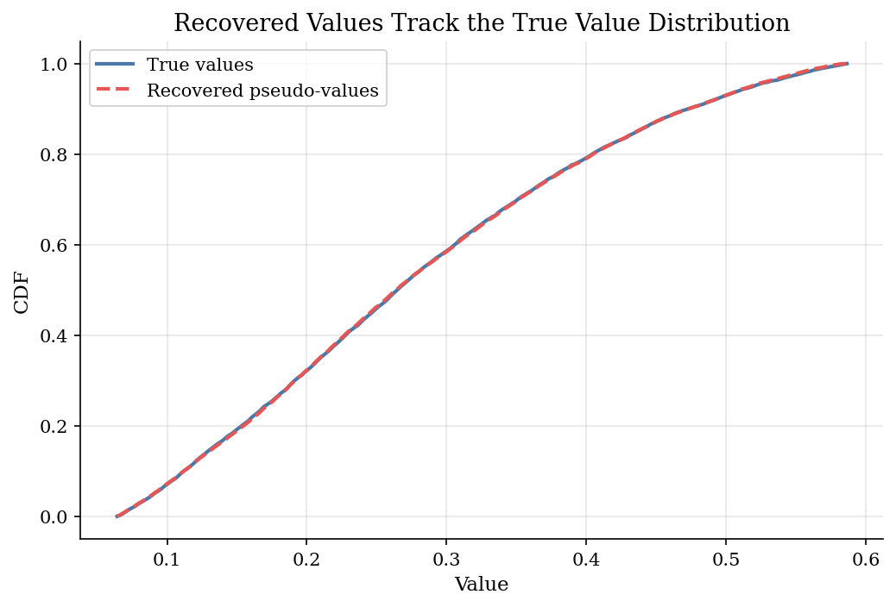
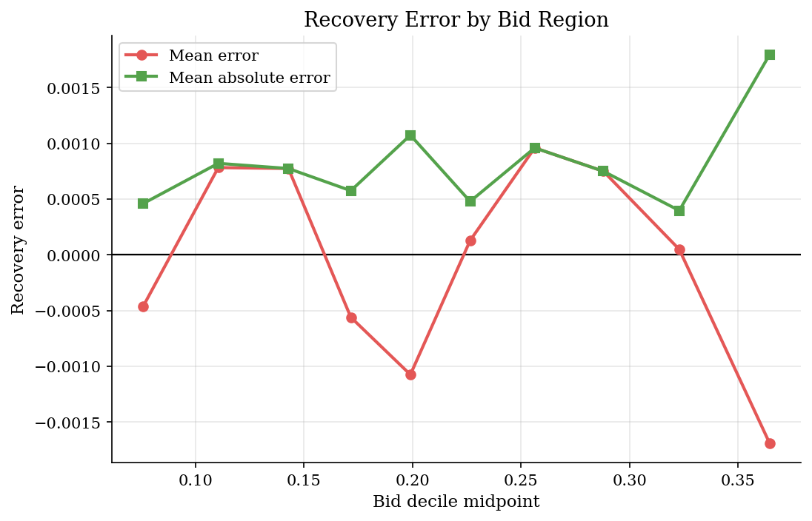

# Recovering Auction Values from First-Price Bids

## Overview

We observe bids from repeated first-price auctions.

We do not observe the private values that bidders place on the object.

In a first-price auction, the winner pays its own bid. A bidder therefore shades below value because a higher bid raises the payment exactly when the bidder wins.

The tutorial uses equilibrium structure to undo that shading. It estimates the bid distribution, applies the GPV inversion, and checks recovered pseudo-values against simulated truth.

## Equations

There are $n$ risk-neutral bidders. Values are independent private values
$v_i \sim F_v$ with density $f_v$. Each bidder submits a sealed bid. The highest
bid wins, and the winner pays its own bid.

In a symmetric monotone Bayesian Nash equilibrium, type $v$ submits

$$
b=s(v).
$$

To derive the equilibrium condition, let a bidder with true value $v$ deviate
by bidding $s(x)$, as if its type were $x$.

Because $s(\cdot)$ is increasing, the bid $s(x)$ beats a rival exactly when the
rival's value is below $x$. With $n-1$ rivals,

$$
\Pr(\text{win}\mid x)=F_v(x)^{n-1}.
$$

If the bidder wins, surplus is $v-s(x)$. Expected payoff from the deviation is

$$
\pi(v,x) = (v-s(x))F_v(x)^{n-1}.
$$

Differentiate with respect to $x$:

$$
\frac{\partial \pi(v,x)}{\partial x} =
(v-s(x))(n-1)F_v(x)^{n-2}f_v(x) - s'(x)F_v(x)^{n-1}.
$$

In equilibrium, the best deviation for type $v$ is $x=v$. The first-order
condition is therefore

$$
s'(v)F_v(v) = (n-1)(v-s(v))f_v(v).
$$

Solving for $v$ gives the value behind an equilibrium bid:

$$
v = s(v) + \frac{s'(v)F_v(v)}{(n-1)f_v(v)}.
$$

The econometrician observes bids, not values. Let $G$ and $g$ be the CDF and
density of bids. Monotonicity gives

$$
G(b)=F_v(v),
\qquad
g(b)=\frac{f_v(v)}{s'(v)}.
$$

Substitute these bid objects into the value formula. For $b_i=s(v_i)$, the GPV
inversion is

$$
\hat v_i = b_i + \frac{\hat G(b_i)}{(n-1)\hat g(b_i)}.
$$

The density estimate is least stable near the bid support boundaries, so the
exercise trims low and high bid quantiles before evaluating recovery.

## Model Setup

| Object | Value | Role |
|---|---:|---|
| Auctions | 3,000 | Independent repetitions |
| Bidders per auction | 4 | Fixed competition level in the inversion |
| Value distribution | Beta(2,5) on [0,1] | Known truth for simulation only |
| Auction format | First-price sealed bid | Winner pays own bid |
| Reserve price | None | Lower support starts at zero |
| Observed by estimator | Bids and bidder count | Values are hidden during recovery |
| Boundary trim | 5% in each tail | Avoids unstable density estimates |

## Solution Method

Let $N$ be the number of observed bids. The estimator uses empirical ranks for $\hat G$ and a kernel density estimate for $\hat g$.

```text
Input: bids {b_i}_{i=1}^N, bidder count n, trim q
Simulation object: F_v and monotone s(v)
Output: pseudo-values {\hat v_i}

1. Draw v_i ~ F_v and set b_i = s(v_i).
2. Hide {v_i}; keep only {b_i} and n.
3. Estimate \hat G(b_i) = rank(b_i) / N.
4. Estimate \hat g(b_i) from a KDE on {b_i}.
5. Keep I_q = {i: Q_q <= b_i <= Q_{1-q}, \hat g(b_i) > 0}.
6. For i in I_q, set
      \hat v_i = b_i + \hat G(b_i) / [(n-1) \hat g(b_i)].
7. Compare {\hat v_i: i in I_q} with the hidden {v_i: i in I_q}.
```

The rank step is where monotonicity enters. A high bid has the same rank as the high value that generated it.

## Results

The bid distribution is shifted left of the value distribution. That gap is bid shading. A bid is therefore not a direct measure of willingness to pay.


After the inversion, the recovered pseudo-value CDF is close to the true value CDF over the trimmed support. The match is not exact because the bid density is estimated nonparametrically.



Errors are smallest in the middle of the bid support and larger near the remaining boundaries. That pattern is why empirical GPV applications usually pay close attention to trimming, bandwidths, and boundary correction.



**True and Recovered Value Distributions**

| Series                  |   Mean |   Std. dev. |   P10 |   Median |   P90 |
|:------------------------|-------:|------------:|------:|---------:|------:|
| True values             |   0.28 |       0.132 | 0.112 |    0.265 | 0.473 |
| Recovered pseudo-values |   0.28 |       0.131 | 0.112 |    0.264 | 0.473 |

**Recovery Diagnostics**

|   Auctions |   Bidders |   Observed bids |   Kept bids |   Trimmed share |   RMSE |   MAE |   Correlation |
|-----------:|----------:|----------------:|------------:|----------------:|-------:|------:|--------------:|
|       3000 |         4 |           12000 |       10800 |             0.1 |  0.001 | 0.001 |             1 |

## Takeaway

Observed first-price bids mix values with strategic shading. Under symmetric IPV assumptions and monotone bidding, the equilibrium first-order condition turns the bid CDF and density into pseudo-values.

The exercise also shows the cost of the method. Recovery depends on a density estimate, so the edges of the bid support are fragile. Trimming is not cosmetic; it is part of making the structural inversion usable.

## References

- [Perrigne, I. and Vuong, Q. (2019). Econometrics of Auctions and Nonlinear Pricing. *Annual Review of Economics*, 11, 27-54.](https://doi.org/10.1146/annurev-economics-080218-025702)
- [Guerre, E., Perrigne, I., and Vuong, Q. (2000). Optimal Nonparametric Estimation of First-Price Auctions. *Econometrica*, 68(3), 525-574.](https://doi.org/10.1111/1468-0262.00123)
- [Gentry, M., Komarova, T., and Schiraldi, P. (2023). Preferences and Performance in Simultaneous First-Price Auctions: A Structural Analysis. *Review of Economic Studies*, 90(2), 852-878.](https://doi.org/10.1093/restud/rdac030)
- [Hickman, B. R., Hubbard, T. P., and Saglam, Y. (2012). Structural Econometric Methods in Auctions: A Guide to the Literature. *Journal of Econometric Methods*, 1(1), 67-106.](https://doi.org/10.1515/2156-6674.1019)
- [Krishna, V. (2009). *Auction Theory*, 2nd ed. Academic Press.](https://shop.elsevier.com/books/auction-theory/krishna/978-0-12-374507-1)
