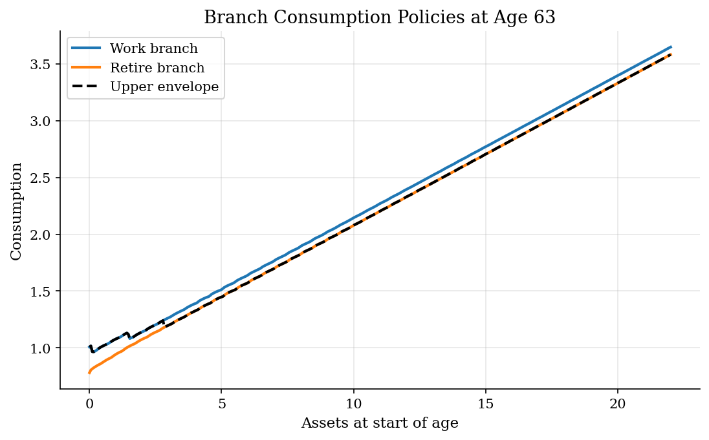
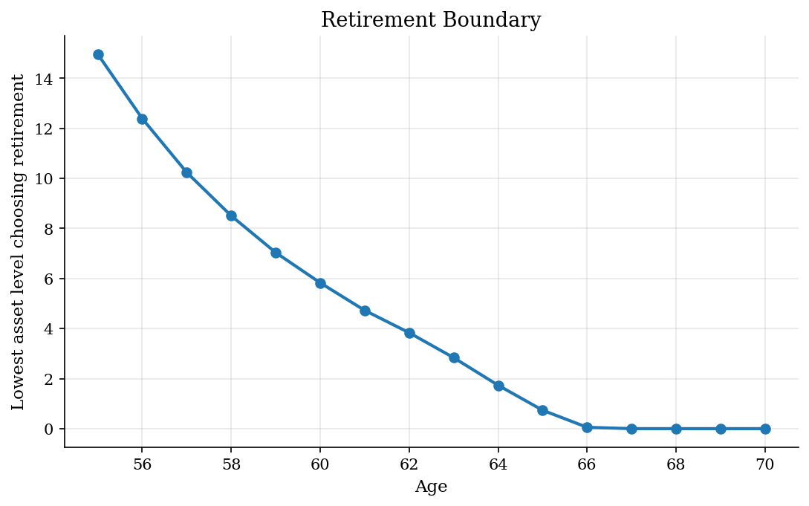
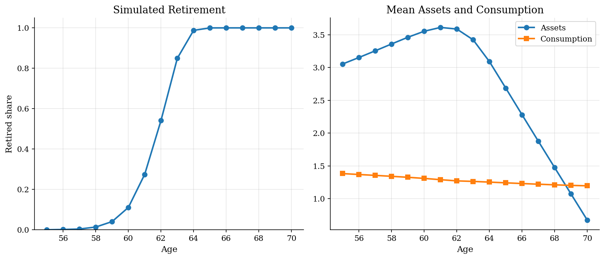
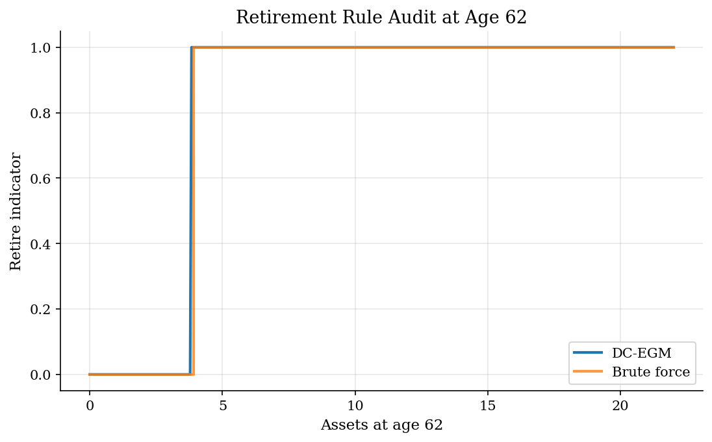

# Retirement and Saving by Discrete-Continuous EGM

## Overview

An older worker chooses whether to keep working or retire. The same household also chooses how much to save. Retirement is discrete and absorbing. Saving is continuous.

The economic object is the retirement boundary: at each age, which asset levels make the household leave work? The saving policy matters because assets insure retirement consumption.

A plain grid search treats every current asset and every next asset as a nested maximization. DC-EGM avoids that inner search. It solves the continuous saving problem separately for work and retirement, then keeps the upper envelope of the choice-specific value functions.

## Equations

At age $t$, the household enters with assets $a_t$ and retirement status
$m_t \in \lbrace 0,1 \rbrace$. Status $m_t=0$ means still active, and $m_t=1$ means already
retired. An active household can choose work or retire:

$$
d_t \in D(m_t), \qquad
D(0)=\lbrace \mathrm{work},\mathrm{retire} \rbrace, \qquad
D(1)=\lbrace \mathrm{retire} \rbrace.
$$

The next retirement status is absorbing:

$$
m'(\mathrm{work})=0, \qquad m'(\mathrm{retire})=1.
$$

Preferences are CRRA, and the terminal value is a bequest value:

$$
u(c)=\frac{c^{1-\gamma}-1}{1-\gamma}, \qquad
u'(c)=c^{-\gamma}, \qquad
V_T^m(a)=\omega_B u(a+\bar b).
$$

Let calendar age be $\alpha_t=55+t$. The branch income and nonconsumption
utility terms are

$$
\begin{aligned}
y_t(\mathrm{work}) &=
1.42-0.012(\alpha_t-55)
\quad -0.006\max \lbrace \alpha_t-62,0 \rbrace^2,\\
y_t(\mathrm{retire}) &= \bar y^R,\\
\psi_t(\mathrm{work}) &=
{}-\left[0.16+0.024(\alpha_t-55)
\quad +0.010\max \lbrace \alpha_t-62,0 \rbrace^2\right],\\
\psi_t(\mathrm{retire}) &= \chi_R.
\end{aligned}
$$

The budget constraint is

$$
c_t + a_{t+1} = R a_t + y_t(d_t),
\qquad a_{t+1} \geq \underline a .
$$

Resources are split between current consumption and next assets. Throughout the branch problems below, $a^{+}$ denotes the same next-period assets as $a_{t+1}$ in the budget constraint, written without a time subscript to mark it as the free variable of the branch maximization.

For any branch $d$, define the branch value

$$
V_t^d(a) =
\max_{a^{+} \geq \underline a}
\left[
\underbrace{u(Ra+y_t(d)-a^{+})}_{\text{utility from consumption}} +
\underbrace{\psi_t(d)}_{\text{work cost or retirement amenity}} +
\underbrace{\beta V_{t+1}^{m'(d)}(a^{+})}_{\text{continuation value under next status}}
\right].
$$

This branch Bellman equation solves work and retirement as separate
continuous-saving problems.

The branch objects are

$$
\begin{aligned}
c_t^d(a,a^{+}) &= R a + y_t(d) - a^{+}, \\
\widetilde V_t^d(a,a^{+}) &=
u(c_t^d(a,a^{+}))+\psi_t(d)+\beta V_{t+1}^{m'(d)}(a^{+}).
\end{aligned}
$$

The branch maximization is over feasible next assets with positive
consumption, so infeasible choices are discarded.

The active and retired value functions are then

$$
V_t^1(a) =
V_t^{\mathrm{retire}}(a),
\qquad
V_t^0(a)=
\max \lbrace V_t^{\mathrm{work}}(a), V_t^{\mathrm{retire}}(a) \rbrace.
$$

The upper envelope chooses retirement where the retirement branch value exceeds
the work branch value.

This upper envelope is the central DC-EGM object. It preserves the discrete
retirement kink instead of forcing the value function to be globally concave.

On a fixed branch, the continuous saving problem has the Euler equation

$$
u'(c_t^d(a^{+})) =
\beta R
\frac{\partial V_{t+1}^{m'(d)}(a^{+})}{\partial a^{+}}.
$$

Write $a_i^{+}$ for a candidate next-period asset point on the exogenous grid.
Write $\mu_{t+1}^{m'(d)}(a_i^{+})$ for the next-period marginal value evaluated
at that candidate asset.

$$
\mu_{t+1}^{m'(d)}(a_i^{+})
=
\frac{\partial V_{t+1}^{m'(d)}(a_i^{+})}{\partial a^{+}}.
$$

EGM works backward from next assets: choose a grid point for tomorrow's assets,
compute the marginal value of arriving there, then invert marginal utility to
recover today's consumption.

$$
c_{t,i}^d =
(\beta R \mu_{t+1}^{m'(d)}(a_i^{+}))^{-1/\gamma}.
$$

The endogenous current asset attached to that next-asset point is

$$
a_{t,i}^{\mathrm{endo},d} =
\frac{c_{t,i}^d + a_i^{+} - y_t(d)}{R}.
$$

Each branch produces its own endogenous grid and value curve:

Here $a^{+} = a_i^{+}$ is fixed at each grid point, so $\widetilde V_t^d(a_{t,i}^{\mathrm{endo},d})$ is shorthand for $\widetilde V_t^d(a_{t,i}^{\mathrm{endo},d}, a_i^{+})$.

$$
\widetilde V_t^d(a_{t,i}^{\mathrm{endo},d}) =
u(c_{t,i}^d)+\psi_t(d)+\beta V_{t+1}^{m'(d)}(a_i^{+}).
$$

After sorting and dropping repeated endogenous assets, DC-EGM interpolates the
branch curve back to the common current-asset grid:

$$
g_t^d(a)=\mathrm{interp}\left(a;\,
a_{t,i}^{\mathrm{endo},d}, a_i^{+}\right),
\qquad
V_t^d(a)=\mathrm{interp}\left(a;\,
a_{t,i}^{\mathrm{endo},d}, \widetilde V_t^d(a_{t,i}^{\mathrm{endo},d})\right).
$$

For current assets below the first endogenous grid point, the borrowing
constraint binds:

$$
g_t^d(a)=\underline a,\qquad
c_t^d(a)=R a+y_t(d)-\underline a.
$$

In the constraint-binding region, $c_t^d(a)$ abbreviates $c_t^d(a,\underline a)$ with $a^{+}=\underline a$; elsewhere, $c_t^d(a)$ abbreviates $c_t^d(a,g_t^d(a))$ with $a^{+}$ at the optimal next asset.

The final active policies copy the winning branch:

$$
\begin{aligned}
d_t^{\ast}(a) &=
\arg\max_{d \in \lbrace \mathrm{work},\mathrm{retire} \rbrace} V_t^d(a),\\
g_t^0(a) &= g_t^{d_t^{\ast}(a)}(a),\\
c_t^0(a) &= c_t^{d_t^{\ast}(a)}(a).
\end{aligned}
$$

## Model Setup

| Symbol | Calibration | Meaning |
|---|---:|---|
| $t$ | ages 55-70 | Finite-horizon retirement window |
| $a_t$ | grid on [0.0, 22.0] | Assets at the start of age $t$ |
| $m_t$ | $0$ active, $1$ retired | Absorbing retirement status |
| $d_t$ | $\mathrm{work}$ or $\mathrm{retire}$ | Discrete labor-supply choice |
| $c_t$ | residual from budget | Consumption after choosing next assets |
| $a_i^{+}$ | 420 points | Exogenous next-asset grid used by DC-EGM |
| $a^{\mathrm{endo},d}_{t,i}$ | branch-specific | Current asset implied by Euler inversion on branch $d$ |
| $\beta$ | 0.96 | Discount factor |
| $R=1+r$ | 1.02 | Gross asset return |
| $\gamma$ | 2.0 | CRRA curvature |
| $y_t(\mathrm{retire})$ | 0.78 | Pension income after retirement |
| $\psi_t(\mathrm{retire})$ | 0.00 | Retirement amenity relative to work cost |
| $\omega_B$ | 1.15 | Terminal bequest weight |
| $\bar b$ | 1.0 | Bequest utility floor |
| $\underline a$ | 0.0 | Borrowing limit on next assets |
| Brute-force audit grid | 150 assets | Smaller benchmark grid for exhaustive search |
| Synthetic panel | 8,000 households | Simulated with initial assets centered at 2.8 |

## Solution Method

The continuous decision is solved on a next-asset grid. The discrete choice is
handled after each branch has produced its own value function.

For each branch $d$, DC-EGM constructs points

$$
(a_{t,i}^{\mathrm{endo},d}, c_{t,i}^d, a_i^{+}, \widetilde V_t^d(a_{t,i}^{\mathrm{endo},d})).
$$

Interpolation converts those branch-specific points into functions on the
common current-asset grid. The active policy is then

$$
d_t^{\ast}(a)=
\mathrm{work} \quad \text{if } V_t^{\mathrm{work}}(a) \geq V_t^{\mathrm{retire}}(a),
\quad \text{and } \mathrm{retire} \text{ otherwise}.
$$

The selected consumption and saving policies are copied from the winning branch.

```text
Algorithm: DC-EGM for retirement and saving
Input:
    current asset grid A = {a_j}_{j=1}^J
    next asset grid A^+ = {a_i^+}_{i=1}^J
    ages t = 0,...,T-1
    primitives beta, R, gamma, y_t(d), psi_t(d), borrowing limit a_min

Initialize:
    for every asset a in A:
        V_T^0(a) = V_T^1(a) = omega_B * u(a + b_bar)

Subroutine SOLVE_BRANCH(t, d, next_status):
    y = y_t(d)
    psi = psi_t(d)
    compute mu_i = d V_{t+1}^{next_status}(a_i^+) / d a^+
        at every next-asset grid point a_i^+
    clip mu_i to a small positive value if a numerical derivative is nonpositive

    for each grid point a_i^+ in A^+:
        c_i = (beta * R * mu_i)^(-1 / gamma)
        a_i_endo = (c_i + a_i^+ - y) / R
        V_i_endo = u(c_i) + psi + beta * V_{t+1}^{next_status}(a_i^+)

    sort rows by a_i_endo
    repair monotonicity by replacing a_i_endo with its running maximum
    drop repeated a_i_endo values created by the monotonicity repair

    interpolate a_i^+ on a_i_endo to get the branch saving rule g_t^d(a)
    interpolate V_i_endo on a_i_endo to get the branch value V_t^d(a)

    for current assets a below the first endogenous point:
        set g_t^d(a) = a_min
        set c_t^d(a) = R * a + y - a_min
        set V_t^d(a) = u(c_t^d(a)) + psi
                         + beta * V_{t+1}^{next_status}(a_min)

    for all other current assets a:
        set c_t^d(a) = R * a + y - g_t^d(a)

    clip g_t^d(a) to the feasible asset grid
    return V_t^d(a), c_t^d(a), g_t^d(a)

Backward recursion:
for t = T-1, T-2, ..., 0:
    # already retired: only the retirement branch is feasible
    V_retired, c_retired, g_retired = SOLVE_BRANCH(t, retire, 1)
    store V_t^1(a) = V_retired(a), c_t^1(a) = c_retired(a),
          g_t^1(a) = g_retired(a)

    # active household: solve both feasible branches before the discrete choice
    V_work, c_work, g_work = SOLVE_BRANCH(t, work, 0)
    V_retire, c_retire, g_retire = SOLVE_BRANCH(t, retire, 1)

    for each current asset a in A:
        retirement_gap(a) = V_retire(a) - V_work(a)
        if retirement_gap(a) >= 0:
            choose retire
            V_t^0(a) = V_retire(a)
            c_t^0(a) = c_retire(a)
            g_t^0(a) = g_retire(a)
        else:
            choose work
            V_t^0(a) = V_work(a)
            c_t^0(a) = c_work(a)
            g_t^0(a) = g_work(a)

Simulation after solving:
    draw initial assets for each household
    for each age:
        interpolate the active retirement gap at the household asset
        convert the gap into a smooth retirement probability
        once retired, keep status retired forever
        interpolate the selected saving and consumption policies
        record age, status, assets, next assets, and consumption
```

The brute-force audit solves the same model on a smaller asset grid by checking
every feasible next asset at every current asset. It is slower and coarser, but
it provides a direct benchmark for the branch policies and the retirement
boundary.

## Results

The work and retirement branches solve ordinary continuous saving problems. The selected active policy follows the branch with the larger value. The switch point is where the discrete choice creates a kink.



The threshold falls with age as work becomes less attractive and the horizon for earning labor income shrinks. At high ages, even lower-asset households prefer the retired branch.



The simulated panel translates the policy functions into life-cycle moments. Retirement rises gradually because households start with different assets and the simulation smooths the deterministic boundary with small taste shocks.



The brute-force rule uses a smaller grid and searches over all feasible next assets. The comparison checks whether the upper envelope chooses the same retirement region.



The policy gaps are measured after interpolating the DC-EGM policy onto the smaller brute-force grid. Agreement is the share of audit-grid assets with the same retire/work decision.

**DC-EGM versus brute-force audit**

|   Age |   Largest consumption-policy gap |   Largest next-asset-policy gap |   Retirement decision agreement |
|------:|---------------------------------:|--------------------------------:|--------------------------------:|
|    58 |                           0.1694 |                          0.6817 |                          0.98   |
|    62 |                           0.1471 |                          0.4089 |                          0.9933 |
|    66 |                           0.1276 |                          0.3149 |                          0.9933 |
|    70 |                           0.1259 |                          0.1259 |                          1      |

The runtime comparison is deliberately uneven: DC-EGM uses the larger main grid, while brute force uses the smaller audit grid. The point is the order of the computational bottleneck.

**Simulation and runtime moments**

| Moment                        |    Value |
|:------------------------------|---------:|
| Mean simulated retirement age |  62.21   |
| Share retired by age 62       |   0.5416 |
| Share retired by age 67       |   1      |
| Mean assets at age 55         |   3.0556 |
| Mean assets at age 70         |   0.6717 |
| DC-EGM runtime seconds        |   0.0033 |
| Brute-force runtime seconds   |   0.0485 |
| Brute-force asset points      | 150      |
| DC-EGM asset points           | 420      |

## Takeaway

DC-EGM is useful when a structural labor model combines a discrete margin with continuous saving. Each branch remains an Euler-equation problem, so EGM avoids the inner root search or grid search. The discrete retirement option then enters through the upper envelope. That envelope is the economic policy boundary and the numerical source of the kink.

## References

- [Iskhakov, F., Jorgensen, T. H., Rust, J., and Schjerning, B. (2017). The Endogenous Grid Method for Discrete-Continuous Dynamic Choice Models with or without Taste Shocks. *Quantitative Economics*, 8(2), 317-365.](https://doi.org/10.3982/QE643)
- [Carroll, C. D. (2006). The Method of Endogenous Gridpoints for Solving Dynamic Stochastic Optimization Problems. *Economics Letters*, 91(3), 312-320.](https://doi.org/10.1016/j.econlet.2005.09.013)
