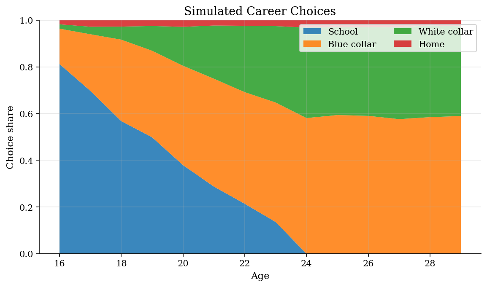
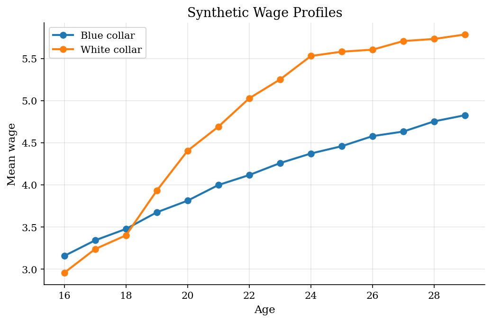
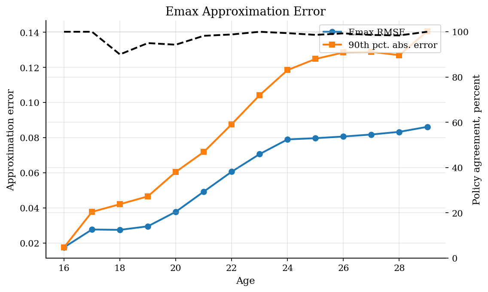

# Keane-Wolpin Career Choice by Emax Approximation

## Overview

A young worker chooses whether to stay in school, work blue collar, work white collar, or stay home. Schooling raises later white-collar wages. Work builds occupation-specific experience. The relevant state is the stock of human capital accumulated before the current age.

The economic object is the life-cycle policy: when does the worker leave school, which occupation does she enter, and how does early experience shape later wages?

The computational object is the Emax function. Exact backward induction is straightforward in this small version, but the number of states grows quickly. The Keane-Wolpin approximation computes exact Emax values at sampled states and predicts the rest with a regression.

## Equations

At age $t$, the state is

$$
s_t = (E_t, X^b_t, X^w_t),
$$

where $E_t$ is completed schooling and $X^b_t$, $X^w_t$ are occupation-specific
experience stocks. The action set is

$$
d_t \in D(s_t,t)
\subseteq \lbrace \mathrm{school}, \mathrm{blue}, \mathrm{white}, \mathrm{home} \rbrace.
$$

The state records accumulated human capital before the current choice.

Schooling is feasible only before the schooling cap and before the maximum
school age; blue-collar work, white-collar work, and home are always feasible.

The transition is deterministic conditional on the choice:

$$
\begin{aligned}
g(s,\mathrm{school}) &= (\min \lbrace E+1,\bar E \rbrace, X^b, X^w),\\
g(s,\mathrm{blue}) &= (E, X^b+1, X^w),\\
g(s,\mathrm{white}) &= (E, X^b, X^w+1),\\
g(s,\mathrm{home}) &= (E, X^b, X^w).
\end{aligned}
$$

Here $\bar E$ is the maximum completed schooling.

School raises completed education, work raises occupation-specific experience,
and home leaves measured human capital unchanged.

Let age be $\alpha_t=16+t$ and college years be $C(E)=\max \lbrace E-12,0 \rbrace$.
The wage offers and deterministic flow payoffs used by the recursion are

$$
\begin{aligned}
\log w_b(s) &=
0.46 + 0.050E + 0.175\sqrt{X^b+1}
\quad -0.010X^b + 0.012X^w,\\
\log w_w(s) &=
{}-0.10 + 0.108E + 0.065\sqrt{X^w+1}
\quad +0.055C(E)-0.006X^w+0.006X^b,\\
u_{\mathrm{school}}(s,t) &=
1.05 + 0.12\max \lbrace 18-\alpha_t,0 \rbrace
\quad -0.08C(E)-0.05\max \lbrace \alpha_t-19,0 \rbrace,\\
u_{\mathrm{blue}}(s,t) &=
\log w_b(s)+0.18-0.010\max \lbrace \alpha_t-24,0 \rbrace,\\
u_{\mathrm{white}}(s,t) &=
\log w_w(s)-0.16\mathbb{1}\lbrace X^w=0 \text{ and } E<13 \rbrace,\\
u_{\mathrm{home}}(s,t) &=
1.04-0.018\max \lbrace \alpha_t-20,0 \rbrace +0.020(X^b+X^w).
\end{aligned}
$$

The terminal value prices the best post-horizon use of accumulated human
capital:

$$
\mathbb{E}_T(s)=4\max \lbrace
u_{\mathrm{blue}}(s,T-1),
u_{\mathrm{white}}(s,T-1),
u_{\mathrm{home}}(s,T-1)
\rbrace.
$$

The deterministic part of the choice-specific value is

$$
v_t(d,s) =
\underbrace{u_d(s,t)}_{\text{current school payoff, wage payoff, or home payoff}} +
\underbrace{\beta \mathbb{E}_{t+1}(g(s,d))}_{\text{discounted continuation value}}.
$$

Current payoffs and continuation values are the two objects backward induction
needs.

With Type-I extreme value taste shocks of scale $\sigma_\epsilon$, the Emax
function is

$$
\mathbb{E}_t(s) =
\underbrace{\sigma_\epsilon
\log \sum_{d \in D(s,t)} \exp(v_t(d,s)/\sigma_\epsilon)}_{\text{expected max over feasible discrete choices}} +
\underbrace{\sigma_\epsilon \gamma_E}_{\text{mean of the extreme-value shock}}.
$$

The log-sum-exp term integrates over the Type-I extreme-value taste shocks.
Here $\gamma_E$ is Euler's constant.

The same objects imply logit conditional choice probabilities:

$$
P_t(d \mid s)=
\frac{\exp(v_t(d,s)/\sigma_\epsilon)}
{\sum_{j \in D(s,t)} \exp(v_t(j,s)/\sigma_\epsilon)}.
$$

The exact recursion evaluates this expression at every reachable state. The
Keane-Wolpin approximation evaluates it only on a sampled set
$S_t^{sample}=\lbrace s_{t,1},\dots,s_{t,M_t} \rbrace$, then fits the regression

$$
Y_{t,i} = \mathbb{E}_t(s_{t,i}), \qquad
Y_{t,i} = \phi(s_{t,i},t)' b_t + \eta_{t,i}.
$$

Sampled exact Emax values become the training targets for the continuation-value
approximation.

In this tutorial the basis vector is

$$
\phi(s,t)=
(1, E, X^b, X^w, X^b+X^w, E^2, (X^b)^2, (X^w)^2,
E X^b, E X^w, X^b X^w, t),
$$

written above in raw state units for readability. In code each input is
first normalized to a comparable scale before the polynomial terms are
formed: schooling as $(E-E_0)/(\bar E-E_0)$, each experience stock divided
by the horizon, and age divided by the maximum age. The fitted coefficient
vector $\widehat b_t$ therefore lives in normalized units, so evaluating the
surface requires applying the same normalization to any new state.

The fitted continuation surface is

$$
\widehat{\mathbb{E}}_t(s)=\phi(s,t)'\widehat b_t.
$$

This is the computational shortcut: unsampled states inherit continuation
values from the fitted Emax surface rather than from fresh exact integrations.

## Model Setup

| Symbol | Calibration | Meaning |
|---|---:|---|
| $t$ | ages 16-29 | Finite-horizon decision age |
| $s_t=(E_t,X^b_t,X^w_t)$ | starts at $(10,0,0)$ | Schooling, blue-collar experience, white-collar experience |
| $D(s,t)$ | $\lbrace \mathrm{school},\mathrm{blue},\mathrm{white},\mathrm{home} \rbrace$ subject to feasibility | Discrete choice set |
| $g(s,d)$ | deterministic | Human-capital transition after choice $d$ |
| $\beta$ | 0.94 | Discount factor in the Emax recursion |
| $\sigma_\epsilon$ | 0.22 | Type-I extreme value scale for choice shocks |
| $\gamma_E$ | 0.5772 | Euler's constant in the Emax formula |
| $\sigma_w$ | 0.18 | Log wage shock used in simulated wage paths |
| $\bar E$ | 18 years | Maximum completed schooling in the state grid |
| Max school age | 23 | Last age at which school is feasible |
| Terminal multiplier | 4.0 | Weight on post-horizon human capital value |
| $\phi(s,t)$ | 12 polynomial terms | Basis for the sampled Emax regression |
| $M_t$ | up to 260 sampled states | Exact Emax evaluations used to fit $\widehat b_t$ |
| $\lambda$ | $10^{-6}$ | Ridge penalty in the sampled Emax regression |
| $N_s$ | 2,310 pre-terminal states | Reachable state count in the exact benchmark |
| Synthetic panel | 6,000 workers | Simulated from the approximate conditional choice probabilities |

## Solution Method

Reachable states are generated forward from the initial state:

$$
S_0=\lbrace (E_0,0,0) \rbrace,\qquad
S_{t+1}=\lbrace g(s,d): s \in S_t,\ d \in D(s,t) \rbrace.
$$

The exact benchmark is the finite-horizon recursion

$$
v_t(d,s)=u_d(s,t)+\beta \mathbb{E}_{t+1}(g(s,d)),
\qquad
\mathbb{E}_t(s)=\sigma_\epsilon \log \sum_{d\in D(s,t)}
\exp(v_t(d,s)/\sigma_\epsilon)+\sigma_\epsilon\gamma_E.
$$

The exact recursion stores both the Emax value and the deterministic
choice-specific values $v_t(d,s)$ at every reachable state.

The approximate solver keeps the same recursion but estimates
$\mathbb{E}_t(s)$ from sampled states. At each age, stack the sampled targets
in $Y_t$ and the basis functions in $\Phi_t$. The regression step is

$$
\widehat b_t=(\Phi_t'\Phi_t+\lambda I)^{-1}\Phi_t'Y_t,
\qquad
\widehat{\mathbb{E}}_t(s)=\phi(s,t)'\widehat b_t.
$$

For unsampled states, $\widehat{\mathbb{E}}_t(s)$ replaces a fresh exact Emax
integration. The small ridge term $\lambda$ only stabilizes the least-squares
fit when an early age has few reachable states.

```text
Algorithm: sampled Emax approximation
Input:
    horizon T, initial state s_0 = (E_0, 0, 0)
    feasible actions D(s,t), transition g(s,d), flow payoffs u_d(s,t)
    discount factor beta, taste-shock scale sigma_e, basis phi(s,t)
    sample cap M and ridge penalty lambda

Build reachable state sets:
    S_0 = {s_0}
    for t = 0, 1, ..., T-1:
        initialize S_{t+1} as empty
        for each state s in S_t:
            for each feasible action d in D(s,t):
                add g(s,d) to S_{t+1}

Terminal values:
    for each state s in S_T:
        E_T(s) = terminal_multiplier
                 * max{u_blue(s,T-1), u_white(s,T-1), u_home(s,T-1)}

Exact benchmark:
    for t = T-1, T-2, ..., 0:
        for each state s in S_t:
            for each feasible action d in D(s,t):
                s_next = g(s,d)
                Q_t(d,s) = u_d(s,t) + beta * E_{t+1}(s_next)
            E_t(s) = sigma_e * log sum_{d in D(s,t)}
                     exp(Q_t(d,s) / sigma_e) + sigma_e * EulerGamma
            store Q_t(d,s) for policy comparisons

Approximate Emax recursion:
    set Ehat_T(s) = E_T(s) for every terminal state
    for t = T-1, T-2, ..., 0:
        if |S_t| <= M:
            use every state in S_t as the sample
        else:
            draw M states without replacement from S_t

        for each sampled state s_i:
            for each feasible action d in D(s_i,t):
                s_next = g(s_i,d)
                Q_i(d) = u_d(s_i,t) + beta * Ehat_{t+1}(s_next)
            Y_i = sigma_e * log sum_{d in D(s_i,t)}
                  exp(Q_i(d) / sigma_e) + sigma_e * EulerGamma

        form Phi_t with row i equal to phi(s_i,t)'
        solve b_hat_t = (Phi_t' Phi_t + lambda I)^{-1} Phi_t' Y_t

        for each reachable state s in S_t:
            Ehat_t(s) = phi(s,t)' b_hat_t
            for each feasible action d in D(s,t):
                s_next = g(s,d)
                Qhat_t(d,s) = u_d(s,t) + beta * Ehat_{t+1}(s_next)
            store Qhat_t(d,s)
            store P_t(d | s) as the softmax of Qhat_t(d,s) / sigma_e

Diagnostics:
    for each age t:
        compare E_t(s) and Ehat_t(s) on every state in S_t
        compute MAE, RMSE, RMSE divided by the exact Emax standard deviation,
        upper-tail absolute errors, and deterministic argmax agreement

Simulation:
    start every worker at s_0
    for each worker and age:
        read the stored approximate values Qhat_t(d,s)
        convert them into probabilities P_t(d | s)
        draw a discrete action from those probabilities
        if the action is blue or white, draw the transitory wage shock
        record age, state, action, schooling, experience, wage, and probability
        update the state to g(s,d)
```

The approximation is deliberately auditable here. The exact solve is still run,
so the page can report whether the fitted Emax surface changes continuation
values or policies in this calibration.

## Results

Schooling is concentrated at early ages, when its option value is high. As the horizon shortens, workers move into blue- and white-collar jobs. White-collar work rises after schooling has accumulated.



The synthetic wage profiles separate the two human-capital margins. Blue-collar wages pay earlier experience. White-collar wages are more education intensive and rise after workers leave school.



The exact solve provides a benchmark. Absolute Emax RMSE grows with age because later ages have more states and exceed the sample cap. Relative to the exact Emax standard deviation at each age, the normalized error is largest at young ages, where the Emax surface has little spread. Policy agreement is the share of states where exact and approximate deterministic argmax choices match. In this run, the largest age-specific normalized RMSE is 12.3% of the exact Emax standard deviation, and the lowest policy agreement is 90.0%. That is acceptable for a teaching approximation, not a universal tolerance: in estimation, the relevant test is whether simulated moments and the likelihood are stable when the sample size or basis is enlarged.



The table reports exact-vs-approximate Emax errors on every reachable state, not only on the sampled states used in the regression. The normalized RMSE divides by the exact Emax standard deviation at that age, so it is a scale check rather than a new objective.

**Emax approximation diagnostics by age**

|   Age |   States |   Mean abs. Emax error |   Emax RMSE |   RMSE / exact Emax sd |   90th pct. abs. error |   Max abs. error |   Policy agreement |
|------:|---------:|-----------------------:|------------:|-----------------------:|-----------------------:|-----------------:|-------------------:|
|    16 |        1 |                 0.0175 |      0.0175 |               nan      |                 0.0175 |           0.0175 |             1      |
|    17 |        4 |                 0.0254 |      0.0277 |                 0.123  |                 0.0377 |           0.0405 |             1      |
|    18 |       10 |                 0.0225 |      0.0275 |                 0.0797 |                 0.0421 |           0.0461 |             0.9    |
|    19 |       20 |                 0.0235 |      0.0295 |                 0.0645 |                 0.0466 |           0.0652 |             0.95   |
|    20 |       35 |                 0.0318 |      0.0378 |                 0.0661 |                 0.0605 |           0.0848 |             0.9429 |
|    21 |       56 |                 0.0436 |      0.0492 |                 0.071  |                 0.0718 |           0.0985 |             0.9821 |
|    22 |       84 |                 0.0541 |      0.0606 |                 0.0732 |                 0.0876 |           0.1125 |             0.9881 |
|    23 |      120 |                 0.0631 |      0.0706 |                 0.0727 |                 0.1042 |           0.1329 |             1      |
|    24 |      165 |                 0.0699 |      0.079  |                 0.0707 |                 0.1185 |           0.1499 |             0.9939 |
|    25 |      219 |                 0.0696 |      0.0797 |                 0.0665 |                 0.1248 |           0.1654 |             0.9863 |
|    26 |      282 |                 0.0697 |      0.0806 |                 0.0662 |                 0.1285 |           0.1811 |             0.9929 |
|    27 |      354 |                 0.07   |      0.0818 |                 0.0687 |                 0.1288 |           0.1946 |             0.9859 |
|    28 |      435 |                 0.0703 |      0.0833 |                 0.0738 |                 0.127  |           0.2054 |             0.9839 |
|    29 |      525 |                 0.0715 |      0.0862 |                 0.0831 |                 0.1406 |           0.2196 |             1      |

The Emax regression uses at most the sample cap at each age. Early ages have fewer states than the cap, so every state is sampled and the regression fit is near-exact. Later ages exceed the cap, so only a subset is sampled and the in-sample fit error grows.

**Sampled regression fit by age**

|   Age |   States |   Sampled states |   Regression RMSE on sampled states |   Sampled target sd |
|------:|---------:|-----------------:|------------------------------------:|--------------------:|
|    16 |        1 |                1 |                              0      |              0      |
|    17 |        4 |                4 |                              0      |              0.2284 |
|    18 |       10 |               10 |                              0.0006 |              0.3425 |
|    19 |       20 |               20 |                              0.0029 |              0.4523 |
|    20 |       35 |               35 |                              0.0032 |              0.5632 |
|    21 |       56 |               56 |                              0.0033 |              0.685  |
|    22 |       84 |               84 |                              0.0037 |              0.8182 |
|    23 |      120 |              120 |                              0.0042 |              0.9605 |
|    24 |      165 |              165 |                              0.0055 |              1.1071 |
|    25 |      219 |              219 |                              0.0057 |              1.1891 |
|    26 |      282 |              260 |                              0.0059 |              1.1872 |
|    27 |      354 |              260 |                              0.0063 |              1.2173 |
|    28 |      435 |              260 |                              0.0069 |              1.1188 |
|    29 |      525 |              260 |                              0.087  |              1.0517 |

These are moments from the simulated panel, not estimates from real data. They make the dynamic policy visible in familiar labor outcomes.

**Synthetic life-cycle moments**

| Moment                                     |   Value |
|:-------------------------------------------|--------:|
| Mean final schooling                       | 13.5915 |
| Share with at least 12 years               |  0.9098 |
| Share with at least 16 years               |  0.0798 |
| Mean blue experience at last observed age  |  5.9145 |
| Mean white experience at last observed age |  3.1485 |
| Mean years spent in school during model    |  3.5915 |
| Approximation runtime seconds              |  0.1134 |
| Exact runtime seconds                      |  0.1394 |

## Takeaway

Finite-horizon structural labor models are conceptually simple but expensive because schooling and experience create many continuation states. The Keane-Wolpin approximation keeps the dynamic logic intact while replacing most exact Emax evaluations with a fitted continuation-value surface. The tradeoff is visible: the method saves computation, but approximation error is largest where early human-capital choices have the most future consequences.

## References

- [Keane, M. P. and Wolpin, K. I. (1997). The Career Decisions of Young Men. *Journal of Political Economy*, 105(3), 473-522.](https://doi.org/10.1086/262080)
- [Keane, M. P. and Wolpin, K. I. (1994). The Solution and Estimation of Discrete Choice Dynamic Programming Models by Simulation and Interpolation: Monte Carlo Evidence. *Review of Economics and Statistics*, 76(4), 648-672.](https://doi.org/10.2307/2109768)
