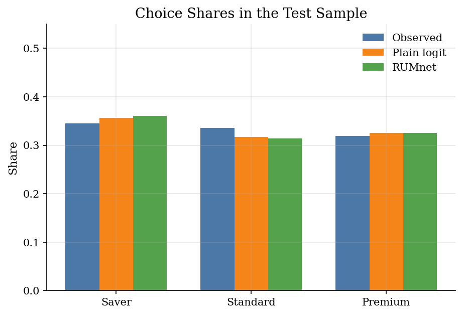
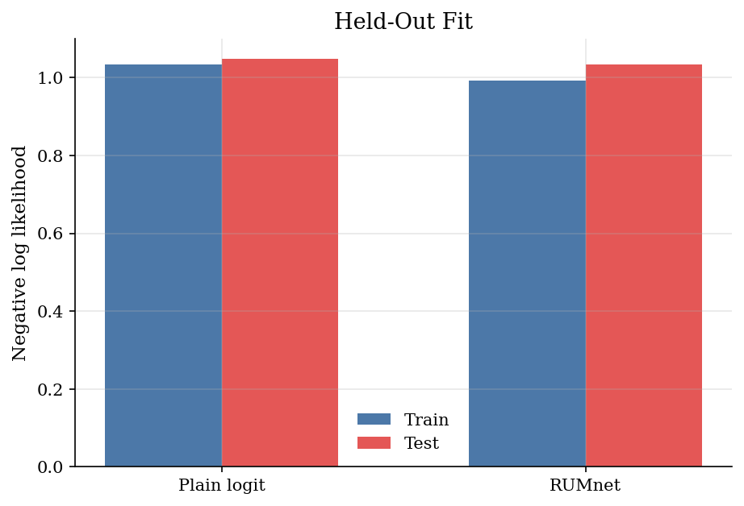
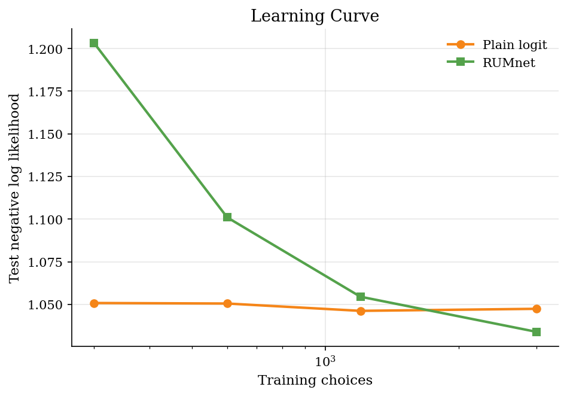
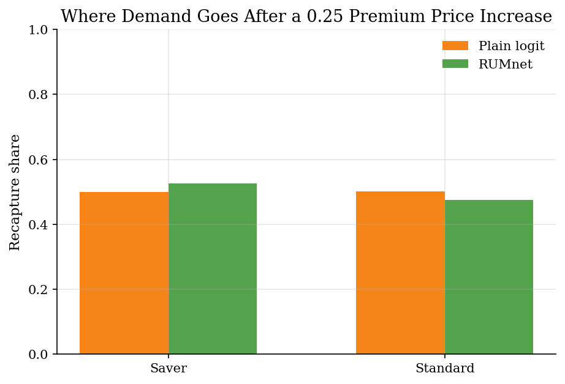
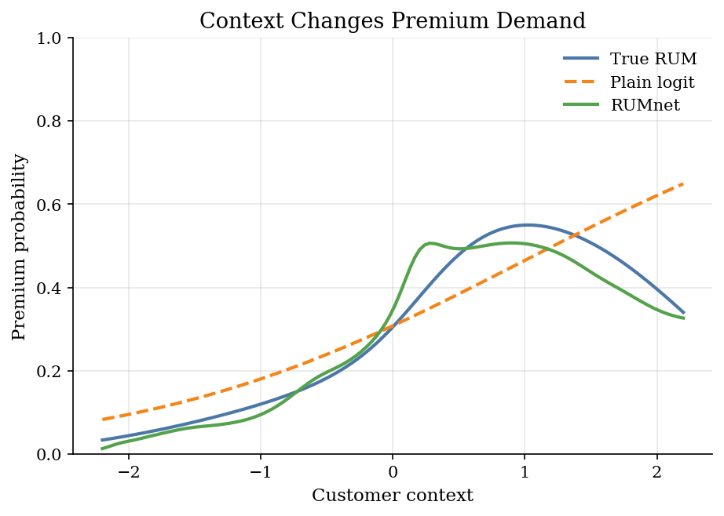

# Choice Prediction with RUMnets

> A neural utility model predicts choices while staying inside random utility maximization.

## Overview

A retailer observes which product a customer buys. It also observes the product prices, product qualities, and a customer context variable.

A plain logit puts those objects into a linear utility index. That is easy to estimate, but it can miss nonlinear taste patterns. A flexible neural predictor can fit those patterns, but it may no longer look like an economic choice model.

RUMnets keep the random-utility discipline. The utility function is flexible, but choice probabilities still come from maximizing utility with random tastes. This tutorial uses a small synthetic example to show the idea.

## Equations

Consumer $i$ chooses one product $j \in \mathcal{J}$. Product $j$ has price
$p_{ij}$ and quality $q_{ij}$. The customer has observed context $z_i$ and an
unobserved taste draw $\eta_i$.

The baseline is a plain logit with linear utility in a small feature vector

$$
x^{L}_{ij}=(p_{ij}, q_{ij}, p_{ij}z_i, q_{ij}z_i).
$$

With product intercepts $a^L_j$ and slopes $b^L$, baseline utility is

$$
v^L_{ij}=a^L_j+x^{L}_{ij} b^L.
$$

The baseline choice probability is

$$
P^L_{ij}
=
\frac{\exp(v^L_{ij})}
{\sum_{k\in\mathcal{J}}\exp(v^L_{ik})}.
$$

The logit estimate minimizes the average negative log likelihood

$$
Q_L(a^L,b^L)
=
\frac{-1}{N}\sum_{i=1}^{N}\log P^L_{i y_i}.
$$

The data-generating model is still random utility, but the systematic utility is
not linear. The simulation uses

$$
U_{ij}=v^0_{ij}+\varepsilon_{ij},
\qquad
\varepsilon_{ij}\sim \text{Type I EV}.
$$

One convenient way to write the nonlinear part is

$$
v^0_{ij}
=
\delta_j+\alpha_i p_{ij}+\beta_i q_{ij}
{}+m_j(z_i)+\ell_j(q_{ij},z_i)+s_j(z_i)+r_{ij}(\eta_i).
$$

The random price and quality tastes are

$$
\alpha_i=-(1.05+0.22\tanh(z_i)+0.12\eta_i+0.08\eta_i\tanh(z_i)),
$$

$$
\beta_i
=
0.78+0.30\tanh(1.10z_i+0.45\eta_i).
$$

The context term is product-specific:

$$
m(z_i)
=
(-0.35\tanh(1.20z_i)+0.10(z_i^2-1),
0.10\tanh(1.20z_i)-0.08(z_i^2-1),
0.55\tanh(1.20z_i)-0.28(z_i^2-1)).
$$

The quality-context complementarity is

$$
\ell_j(q_{ij},z_i)
=
\kappa_j\tanh(1.15(q_{ij}-1.25)z_i),
\qquad
\kappa=(-0.15,0.20,0.62).
$$

The extra nonlinear product shifter is

$$
s(z_i)
=
(0,0.12\tanh(1.80z_i)^2,0.35\tanh(1.50z_i)^2).
$$

The latent-taste interaction is

$$
r_{ij}(\eta_i)
=
0.18\eta_i\tanh(q_{ij}z_i).
$$

This is the misspecification: plain logit can use $p_{ij}z_i$ and $q_{ij}z_i$,
but it cannot represent the saturation and hump shapes exactly.

The RUMnet keeps the same random-utility structure but replaces the linear
index with a neural utility. For fixed latent draw $\eta_r$, define

$$
\tilde x_{ijr}
=
(p_{ij},q_{ij},z_i,p_{ij}z_i,q_{ij}z_i,z_i^2,q_{ij}z_i^2,
\eta_r,p_{ij}\eta_r,q_{ij}\eta_r,z_i\eta_r,q_{ij}z_i\eta_r).
$$

The one-hidden-layer utility is

$$
h_{ijr}(\theta)
=
\tanh(W'\tilde x_{ijr}+d),
$$

$$
v_{\theta}(i,j,r)
=
a_j+b_p p_{ij}+b_q q_{ij}+b_{pz}p_{ij}z_i+b_{qz}q_{ij}z_i+c'h_{ijr}(\theta).
$$

Conditional on draw $r$, the RUM probability is

$$
P_{ijr}(\theta)
=
\frac{\exp(v_{\theta}(i,j,r))}
{\sum_{k\in\mathcal{J}}\exp(v_{\theta}(i,k,r))}.
$$

The simulated RUMnet probability averages over the fixed draws:

$$
\widehat P_{ij}(\theta)
=
\frac{1}{R}\sum_{r=1}^{R}P_{ijr}(\theta).
$$

The estimated RUMnet minimizes the penalized simulated likelihood

$$
Q_R(\theta)
=
\frac{-1}{N}\sum_{i=1}^{N}\log \max\{\widehat P_{i y_i}(\theta),10^{-12}\}
{}+\lambda\frac{\theta_{\mathrm{net}}'\theta_{\mathrm{net}}}{d_{\mathrm{net}}}.
$$

## Model Setup

| Object | Value | Role |
|---|---:|---|
| Products | 3 | Saver, Standard, and Premium alternatives |
| Training choices | 3,000 | Used for estimation |
| Test choices | 1,500 | Held out for evaluation |
| Product variables | price, quality | Observed attributes in each choice set |
| Customer context | one scalar $z_i$ | Shifts the value of product quality |
| Latent taste draws | 9 | Fixed normal quantiles in the RUMnet likelihood |
| Hidden units | 6 | Size of the neural utility layer |
| RUMnet penalty $\lambda$ | 0.012 | Shrinks the neural weights in small samples |
| Learning-curve sizes | 300, 600, 1,200, 3,000 | Training samples used in the learning curve |
| Price shock | +0.25 on Premium | Used to compare substitution predictions |

## Solution Method

The estimation uses common latent draws. The draws are fixed normal quantiles,
so the simulated likelihood is a smooth function of $\theta$ rather than a new
Monte Carlo objective at every optimizer step.

The first step estimates the plain logit. With
$\theta_L=(a^L_2,a^L_3,b^L)$ and $a^L_1=0$ for normalization, the optimizer
solves

$$
\hat\theta_L=\arg\min_{\theta_L} Q_L(\theta_L).
$$

The RUMnet starts near that estimate:

$$
a_j^{(0)}=\hat a^L_j,\qquad
(b_p^{(0)},b_q^{(0)},b_{pz}^{(0)},b_{qz}^{(0)})=\hat b^L.
$$

The neural weights start as small random numbers and the hidden biases start at
zero. This makes the first RUMnet probabilities close to the fitted logit
probabilities, then lets the neural part bend the utility surface.

For any trial $\theta$, the code forms $\tilde x_{ijr}$ for all consumers,
products, and latent draws. It then evaluates $h_{ijr}(\theta)$,
$v_{\theta}(i,j,r)$, $P_{ijr}(\theta)$, and finally $\widehat P_{ij}(\theta)$.
The same fixed draws are used for every trial $\theta$.

After estimation, the Premium price counterfactual recomputes fitted shares
after adding $\Delta p$ to Premium. If $s_j$ is the baseline fitted share and
$s_j^{+}$ is the fitted share after the price increase, the recapture rate for
receiving product $m$ is

$$
D_{m,\mathrm{Premium}}
=
\frac{s_m^{+}-s_m}{s_{\mathrm{Premium}}-s_{\mathrm{Premium}}^{+}}.
$$

```text
Input: choices y_i, prices p_ij, qualities q_ij, contexts z_i, latent draws eta_r
Output: fitted choice probabilities and substitution predictions

1. Estimate theta_L by minimizing Q_L(theta_L).
2. Copy theta_L into the linear part of the RUMnet initialization.
3. For each trial theta, evaluate neural utilities for every (i,j,r).
4. Convert draw-specific utilities into probabilities P_ijr(theta).
5. Average over r to get simulated probabilities P_hat_ij(theta).
6. Minimize Q_R(theta), then evaluate test fit and price-shock recapture.
```

The learning curve repeats this estimation on growing prefixes of the same
training sample. This shows the tradeoff: the RUMnet has more approximation
power, but it needs enough data for that flexibility to help out of sample.

## Results

Both models match average product shares closely. Share fit is the easy diagnostic. The harder question is whether the model captures held-out choice probabilities and substitution after a price change.



The RUMnet improves the held-out likelihood in this synthetic design. It has enough flexibility to pick up the nonlinear context pattern, but it still scores choices through random-utility probabilities.



The learning curve shows why the flexible model is not free. With little data, the RUMnet overfits the nonlinear utility surface. With the full sample, the nonlinear structure is learned well enough to beat the misspecified logit on the test set.



A Premium price increase moves demand to the other products. The two models need not allocate that lost demand in the same way because they imply different utility distances between products and consumers.



The context curve shows the main difference. The true data-generating process makes Premium demand change nonlinearly with customer context. The small RUMnet tracks more of that curve than the linear logit baseline.



The likelihood table separates in-sample fit from held-out prediction.

**Fit Comparison**

| Model       |   Train NLL |   Test NLL |   Test accuracy |
|:------------|------------:|-----------:|----------------:|
| Plain logit |      1.0334 |     1.0474 |           0.452 |
| RUMnet      |      0.9917 |     1.0339 |           0.464 |

The share table checks that the fitted probabilities aggregate to observed product shares.

**Test Share Fit**

| Product   |   Observed share |   Plain logit |   RUMnet |
|:----------|-----------------:|--------------:|---------:|
| Saver     |           0.3447 |        0.3568 |   0.3605 |
| Standard  |           0.336  |        0.3171 |   0.3138 |
| Premium   |           0.3193 |        0.326  |   0.3257 |

The recapture table reports where the lost Premium demand goes after the price increase.

**Premium Price Shock**

| Model       | Product   |   Base share |   After shock |   Recapture |
|:------------|:----------|-------------:|--------------:|------------:|
| Plain logit | Saver     |       0.3568 |        0.3813 |      0.4989 |
| Plain logit | Standard  |       0.3171 |        0.3417 |      0.5011 |
| Plain logit | Premium   |       0.326  |        0.277  |     -1      |
| RUMnet      | Saver     |       0.3605 |        0.3896 |      0.5251 |
| RUMnet      | Standard  |       0.3138 |        0.3401 |      0.4749 |
| RUMnet      | Premium   |       0.3257 |        0.2704 |     -1      |

The learning-curve table reports held-out fit after estimating both models on growing samples.

**Learning Curve**

|   Training choices | Model       |   Test NLL |   Test accuracy |
|-------------------:|:------------|-----------:|----------------:|
|                300 | Plain logit |     1.0508 |          0.456  |
|                300 | RUMnet      |     1.2033 |          0.41   |
|                600 | Plain logit |     1.0505 |          0.456  |
|                600 | RUMnet      |     1.101  |          0.4367 |
|               1200 | Plain logit |     1.0462 |          0.4527 |
|               1200 | RUMnet      |     1.0545 |          0.4513 |
|               3000 | Plain logit |     1.0474 |          0.452  |
|               3000 | RUMnet      |     1.0339 |          0.464  |

## Takeaway

RUMnets are useful when the utility index needs more flexibility than a linear logit. The neural part changes the shape of utility, but the probability formula still comes from random utility maximization. Fixed latent draws make the estimator a standard sample-average likelihood.

## References

- [Aouad, A. and Desir, A. (2023). Representing Random Utility Choice Models with Neural Networks. arXiv:2207.12877.](https://arxiv.org/abs/2207.12877)
- [Train, K. (2009). *Discrete Choice Methods with Simulation* (2nd ed.). Cambridge University Press.](https://eml.berkeley.edu/books/choice2.html)
- [McFadden, D. (1974). Conditional Logit Analysis of Qualitative Choice Behavior. In *Frontiers in Econometrics*. Academic Press.](https://eml.berkeley.edu/reprints/mcfadden/zarembka.pdf)
