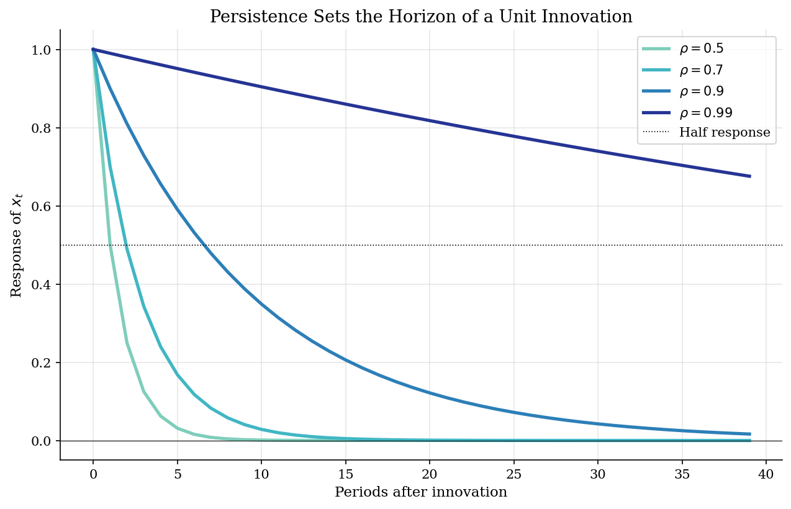
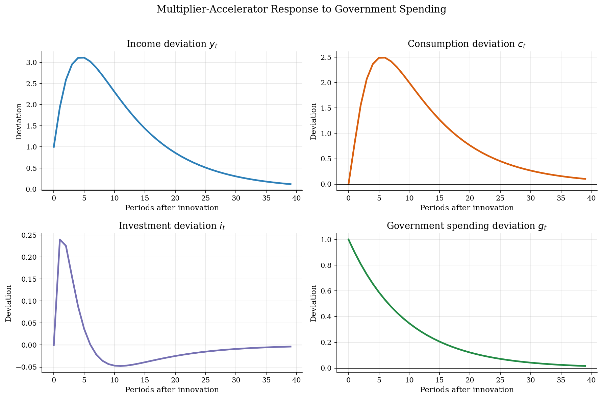
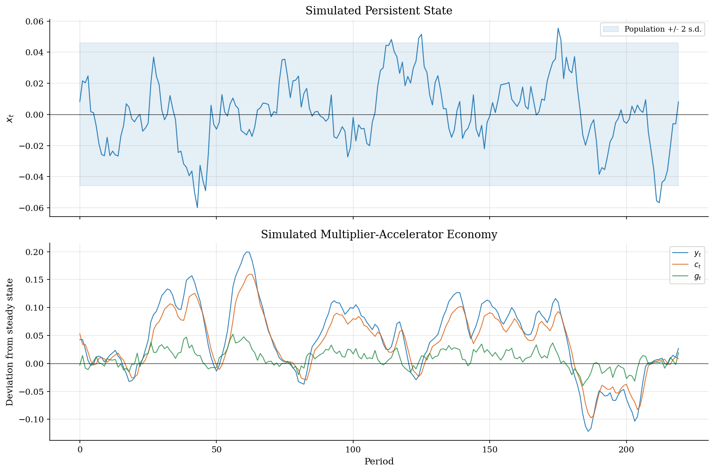
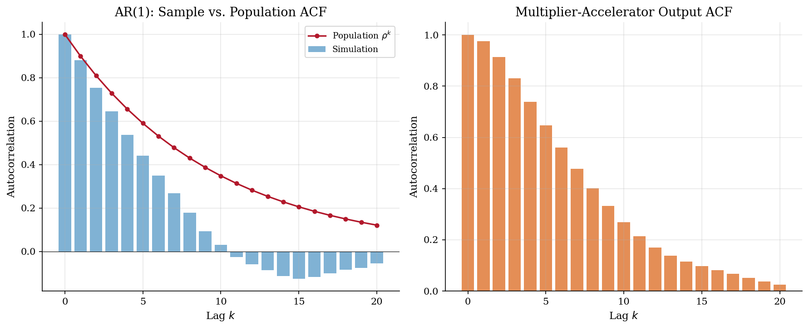

# Fiscal-Shock Persistence and Income Dynamics

> How AR(1) propagation and a multiplier-accelerator block turn a spending innovation into an income path.

## Overview

Suppose a fiscal authority raises spending during a downturn. The economic question is how long that impulse moves income.

The object is a spending innovation with AR(1) persistence. It enters Samuelson's multiplier-accelerator model. Consumption depends on lagged income. Investment responds to consumption growth.

The computation propagates one innovation and simulated shocks. Impulse responses, autocorrelations, and a spectrum show how persistence changes timing.

## Equations

Let $x_t$ denote the fiscal shock state. The shock follows an AR(1) law.

$$
x_t = \rho x_{t-1} + \varepsilon_t, \qquad
\varepsilon_t \sim N(0,\sigma^2), \qquad |\rho|<1.
$$

The coefficient $\rho$ tells us how much of today's state becomes tomorrow's
state. A high value makes the shock persist.

In the multiplier-accelerator economy, income is the sum of three components.

$$
C_t = \beta Y_{t-1},
\qquad
G_t = \rho_g G_{t-1} + (1-\rho_g)\bar G + \varepsilon_t,
$$

$$
I_t = \alpha(C_t-C_{t-1}),
\qquad
Y_t = C_t + I_t + G_t.
$$

The steady state is $\bar Y=\bar G/(1-\beta)$, $\bar C=\beta \bar Y$, and
$\bar I=0$. Lowercase variables are deviations from that steady state. The
impulse response uses the recursion below.

$$
y_t = \beta(1+\alpha)y_{t-1}-\alpha\beta y_{t-2}+g_t,
\qquad
g_t=\rho_g g_{t-1}+\varepsilon_t.
$$

## Model Setup

**AR(1) shock process**

| Parameter | Value | Role |
|---|---:|---|
| $\rho$ | 0.90 | Share of the shock state carried into the next period |
| $\sigma$ | 0.01 | Standard deviation of new innovations |
| $T_{sim}$ | 220 | Simulated periods after burn-in |

**Multiplier-accelerator economy**

| Parameter | Value | Role |
|---|---:|---|
| $\alpha$ | 0.30 | Accelerator response of investment to consumption growth |
| $\beta$ | 0.80 | Marginal propensity to consume out of lagged income |
| $\rho_g$ | 0.90 | Carryover of government-spending deviations |
| $\bar G$ | 1.00 | Steady-state government spending |
| $\bar Y$ | 5.00 | Implied steady-state income |
| $\bar C$ | 4.00 | Implied steady-state consumption |

## Solution Method

A shock path determines every variable because the model is backward-looking. No expectations fixed point is solved here.

The AR(1) population objects are closed form.

$$E[x_t]=0, \qquad \mathrm{Var}(x_t)=\frac{\sigma^2}{1-\rho^2}=0.000526, \qquad \mathrm{Corr}(x_t,x_{t-k})=\rho^k.$$

The AR(1) half-life is $\log(0.5)/\log(\rho)=6.6$ periods. The income roots are 0.346, 0.694. The largest modulus is 0.694, so internal propagation is stable.

```text
Procedure: propagate a fiscal innovation through an AR(1) state
Inputs: rho, sigma, alpha, beta, rho_g, horizon T, shock sequence eps_t
Outputs: AR path x_t and multiplier-accelerator paths y_t, c_t, i_t, g_t

1. Set eps_0 = 1 for an impulse response.
2. For a simulation, draw eps_t from N(0, sigma^2) after burn-in.
3. Update x_t = rho x_{t-1} + eps_t and g_t = rho_g g_{t-1} + eps_t.
4. Set c_t = beta y_{t-1}, i_t = alpha(c_t - c_{t-1}), and y_t = c_t + i_t + g_t.
5. Record impulse responses, autocorrelations, and the AR(1) spectrum.
```

## Results

A unit shock follows the exact path $\rho^h$. Raising $\rho$ from 0.5 to 0.9 lengthens the half-life from one to seven periods.



Government spending decays after the innovation. Income adds lagged consumption and accelerator investment to that path.



The simulated AR(1) path stays near its analytic two-standard-deviation band. Income and consumption move together with a lag.



The AR(1) autocorrelation matches $\rho^k$ apart from simulation noise. Income inherits serial correlation from spending and lagged consumption.



High persistence loads variance at low frequencies. A larger $\rho$ therefore changes timing and volatility.


Holding $\sigma$ fixed, a higher $\rho$ raises variance and extends the half-life.

**AR(1) Analytical Benchmarks**

| Object                      | $\rho=0.5$   | $\rho=0.9$   | $\rho=0.99$   |
|:----------------------------|:-------------|:-------------|:--------------|
| Persistence ($\rho$)        | 0.50         | 0.90         | 0.99          |
| Unconditional variance      | 0.000133     | 0.000526     | 0.005025      |
| Half-life (periods)         | 1.0          | 6.6          | 69.0          |
| First-order autocorrelation | 0.50         | 0.90         | 0.99          |
| Spectral peak               | Frequency 0  | Frequency 0  | Frequency 0   |

## Takeaway

An AR(1) coefficient is an economic timing assumption. With $\rho=0.9$, a shock has half of its initial effect after 6.6 periods. With $\rho=0.99$, the half-life is 69.0 periods.

The multiplier-accelerator model maps that state into income. Government spending supplies the disturbance. Lagged consumption and accelerator investment shape the income path.

## References

- Hamilton, J. (1994). *Time Series Analysis*. Princeton University Press.
- Samuelson, P. (1939). Interactions between the Multiplier Analysis and the Principle of Acceleration. *Review of Economics and Statistics*, 21(2), 75-78.
- Ljungqvist, L. and Sargent, T. (2018). *Recursive Macroeconomic Theory*. MIT Press, 4th edition, Ch. 2.
