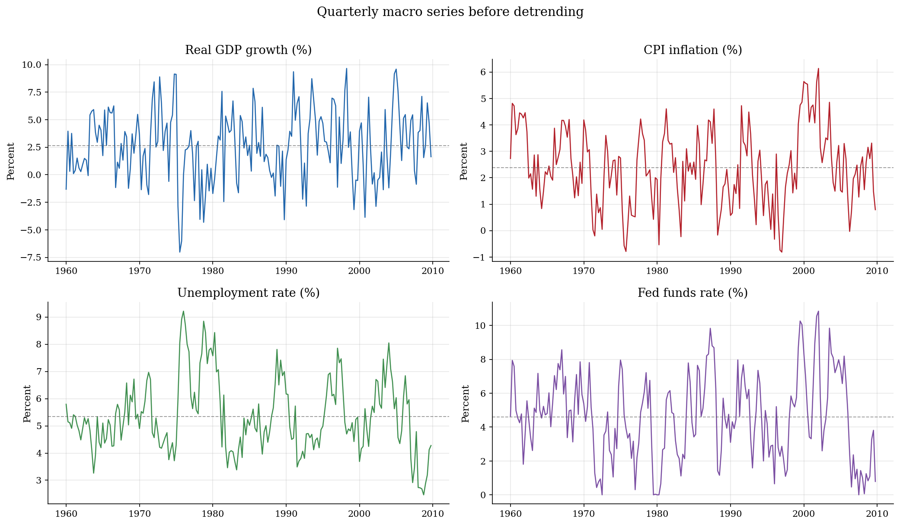
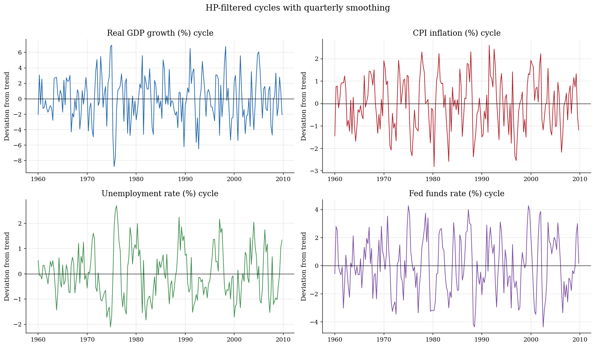
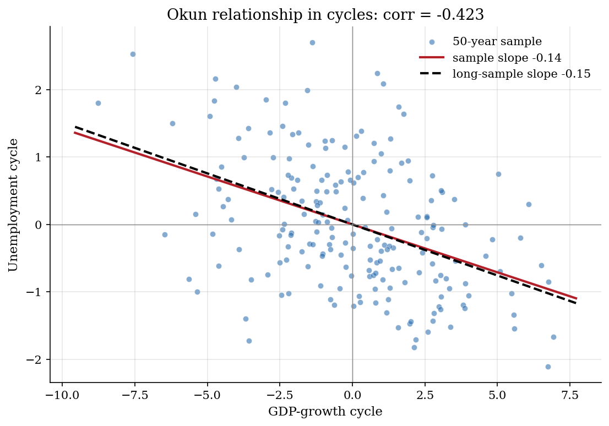
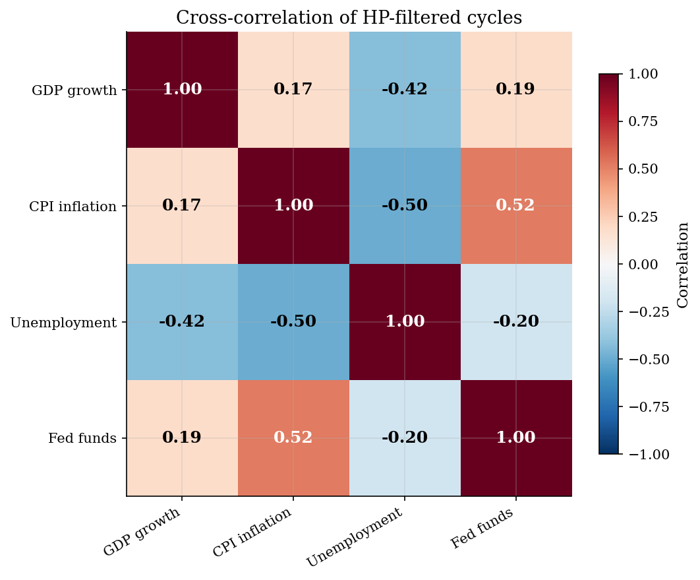

# Business-Cycle Moments from a FRED-Style Macro Panel

> HP filtering and moment measurement for a quarterly macro panel.

## Overview

Macroeconomic models are often judged by business-cycle moments. The researcher starts with quarterly output growth, inflation, unemployment, and a policy rate.

The object here is a small FRED-style panel. It is simulated so the page can run without an API key or a changing data release.

The computational need is detrending. HP filtering puts each series into a cycle. Sample moments then summarize volatility, comovement, persistence, and an Okun slope.

## Equations

Let

$$
y_t = (g_t,\pi_t,u_t,i_t)'
$$

collect GDP growth, CPI inflation, unemployment, and the federal funds rate,
all measured in percentage points. The synthetic data are generated from a
stationary vector process

$$
s_t = \rho \odot s_{t-1} + \sqrt{1-\rho^2}\odot \varepsilon_t,
\qquad
\varepsilon_t \sim N(0,C),
\qquad
y_t=\mu+\sigma\odot s_t.
$$

Here $\odot$ is element-by-element multiplication. The correlation matrix $C$
sets the contemporaneous macro relationships in the example. The parameter
$\rho_j$ controls how slowly each series adjusts after an innovation.

For each observed series $y_{j,t}$, the HP filter chooses a trend $\tau_{j,t}$
by solving

$$
\min_{\tau_j}
\sum_{t=1}^{T} (y_{j,t}-\tau_{j,t})^2 + \lambda\sum_{t=2}^{T-1}
[(\tau_{j,t+1}-\tau_{j,t})-(\tau_{j,t}-\tau_{j,t-1})]^2.
$$

The cycle is $c_{j,t}=y_{j,t}-\tau_{j,t}$. The reported moments are

$$
\sigma_j=\mathrm{sd}(c_{j,t}),\qquad
r_{j,g}=\mathrm{corr}(c_{j,t},c_{g,t}),\qquad
a_j=\mathrm{corr}(c_{j,t},c_{j,t-1}).
$$

The Okun diagnostic is the finite-sample regression

$$
c_{u,t}=\alpha_O+\beta_O c_{g,t}+e_t,
$$

where $c_{g,t}$ is the GDP-growth cycle and $c_{u,t}$ is the unemployment
cycle.

## Model Setup

**Quarterly sample**

| Object | Value | Role |
|---|---:|---|
| $T$ | 200 | Main sample, 50 years of quarters |
| $T_B$ | 5000 | Long simulation used only as a benchmark |
| $\lambda$ | 1600 | HP smoothing parameter for quarterly data |

**Series-level primitives**

| Series | Mean | Std. dev. | Persistence | Economic role |
|---|---:|---:|---:|---|
| GDP growth | 2.5 | 3.0 | 0.30 | Output-growth cycle |
| CPI inflation | 2.0 | 1.5 | 0.70 | Price-pressure cycle |
| Unemployment | 5.5 | 1.5 | 0.85 | Labor-market slack |
| Fed funds | 4.0 | 3.0 | 0.80 | Short-rate policy indicator |

**Innovation correlation matrix $C$**

| | GDP | CPI | Unemployment | Fed funds |
|---|---:|---:|---:|---:|
| GDP | 1.00 | 0.20 | -0.60 | 0.30 |
| CPI | 0.20 | 1.00 | -0.30 | 0.50 |
| Unemployment | -0.60 | -0.30 | 1.00 | -0.20 |
| Fed funds | 0.30 | 0.50 | -0.20 | 1.00 |

## Solution Method

The HP filter solves one sparse linear system for each series. It chooses a trend that tracks the data and smooths trend growth.

The residual from that trend is the cycle. The moment table then reports standard deviations, GDP correlations, autocorrelations, and the Okun slope.

The long simulation repeats the same calculation on many quarters. It gives a benchmark for sampling variation in the 50-year panel.

```text
Algorithm: HP-filtered business-cycle moments
Inputs: quarterly panel y_t, HP parameter lambda, benchmark horizon T_B
Outputs: cycles c_t, moment table M, Okun slope beta_O

1. Simulate the four-variable macro vector y_t from the calibrated process.
2. For each series j:
      solve (I + lambda K'K) tau_j = y_j
      set c_j = y_j - tau_j
3. Compute volatility, relative volatility, GDP correlation, and lag-1
   autocorrelation from the cycles c_j.
4. Regress the unemployment cycle on the GDP-growth cycle to estimate beta_O.
5. Repeat steps 1-4 with T_B quarters and use those moments only as a
   long-sample benchmark for the finite 50-year run.
```

Signs matter by series. A positive GDP-growth cycle means output growth is above trend. A positive unemployment cycle means slack is above trend.

## Results

The raw panel is the starting object: rates and growth rates in observed units. GDP growth moves quickly, while unemployment and the policy rate move slowly.



The HP cycles put each series on its own detrended scale. These cycles are the inputs for the moment table.



Output above trend is associated with unemployment below trend. The dashed line shows the long simulation benchmark, not a historical U.S. estimate. The 50-year sample correlation is -0.423; the long-sample benchmark is -0.450.



The correlation matrix checks the full cycle panel. The signs match the calibration. Unemployment is countercyclical. Inflation and the policy rate are procyclical.



The table reports the finite sample and benchmark moments. Benchmark columns use the same process, so they show sampling variation rather than validation with real data.

**Business-cycle moments from HP-filtered quarterly cycles**

| Variable      |   Volatility (%) |   Rel. volatility |   Corr. with GDP |   Long-sample corr. |   Autocorr. |   Long-sample autocorr. |
|:--------------|-----------------:|------------------:|-----------------:|--------------------:|------------:|------------------------:|
| GDP growth    |            2.896 |             1     |            1     |               1     |       0.282 |                   0.223 |
| CPI inflation |            1.159 |             0.4   |            0.174 |               0.171 |       0.483 |                   0.529 |
| Unemployment  |            0.975 |             0.337 |           -0.423 |              -0.45  |       0.649 |                   0.638 |
| Fed funds     |            2.007 |             0.693 |            0.187 |               0.222 |       0.599 |                   0.622 |

## Takeaway

Business-cycle moments are constructed before they are matched.

In this run, GDP growth and unemployment move against each other. The Okun slope is -0.142. Unemployment is the most persistent cycle.

Sampling and filtering keep the 50-year sample from matching the long simulation exactly.

## References

- Federal Reserve Bank of St. Louis. FRED, Federal Reserve Economic Data.
- Hodrick, R. and Prescott, E. (1997). "Postwar U.S. Business Cycles: An Empirical Investigation." *Journal of Money, Credit and Banking*, 29(1), 1-16.
- Stock, J. and Watson, M. (1999). "Business Cycle Fluctuations in U.S. Macroeconomic Time Series." *Handbook of Macroeconomics*, Vol. 1A, Ch. 1.
- Okun, A. (1962). "Potential GNP: Its Measurement and Significance." *Proceedings of the Business and Economic Statistics Section*, ASA.
