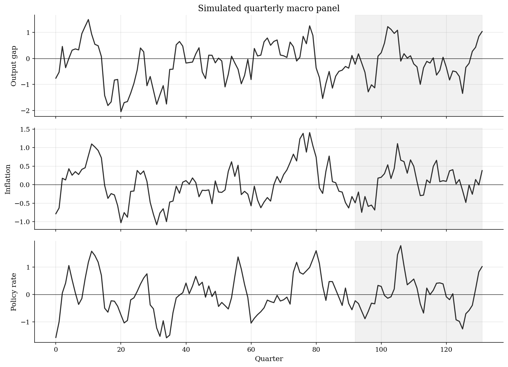
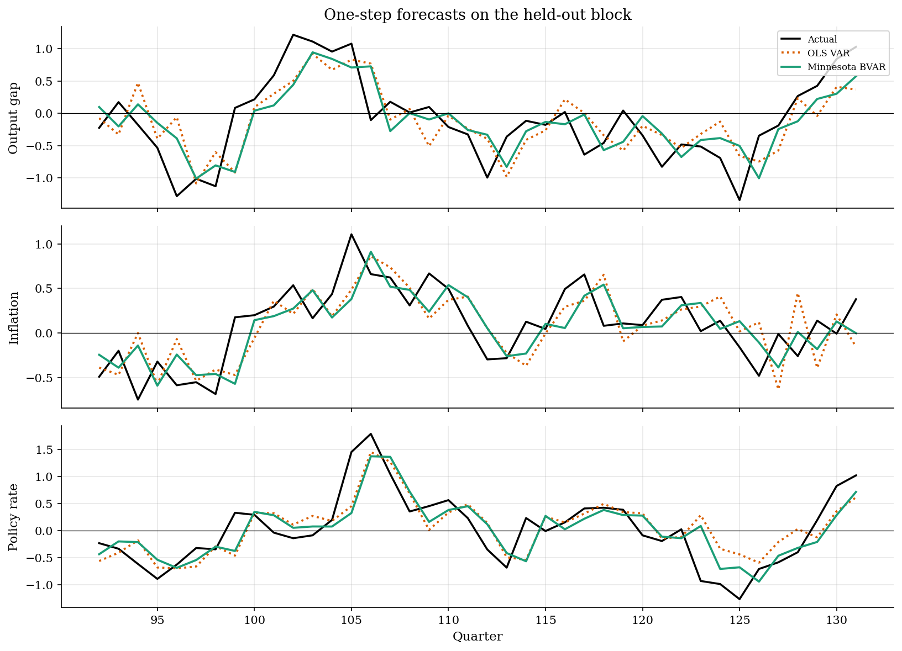
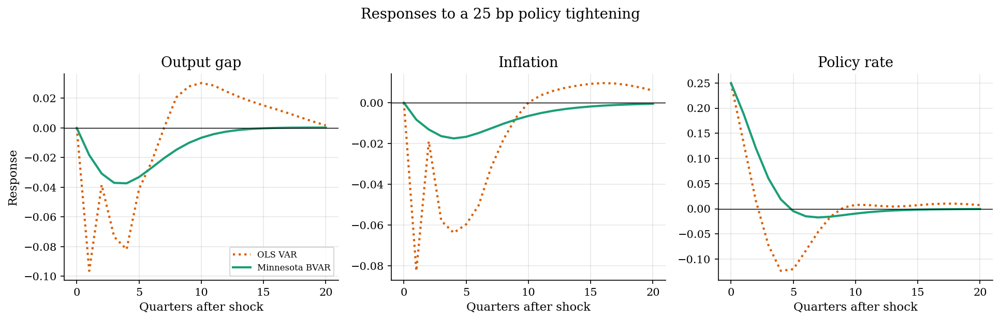
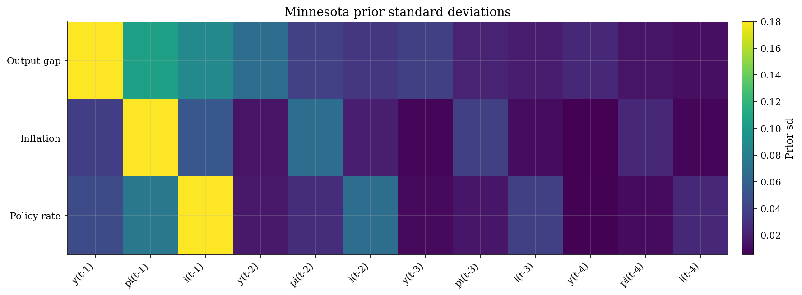
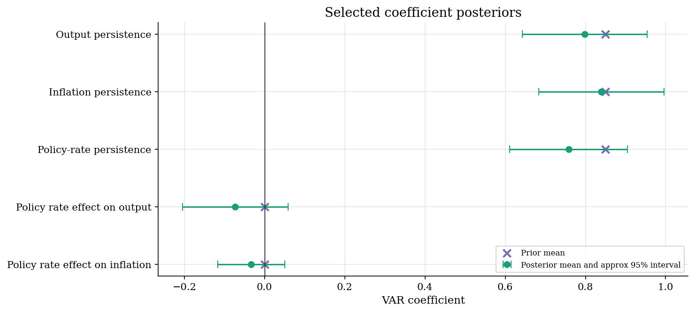

# Monetary Policy SVARs with Minnesota Priors

## Overview

A quarterly macro VAR tries to summarize the joint dynamics of output, inflation, and the policy rate. The object of interest is a monetary policy shock: an unexpected policy tightening after current output and inflation have been accounted for.

The problem is that even a small VAR can be noisy in a short macro sample. Four lags of three variables already give each equation thirteen coefficients including the intercept. Unrestricted OLS can fit accidental lag patterns and then produce unstable forecasts or impulse responses.

The Minnesota prior is ridge-like shrinkage for dynamic systems. It puts prior mass on persistent own first lags, pulls most other coefficients toward zero, and tightens the prior for cross-variable and distant-lag effects. The shrinkage is soft, so the data can still move coefficients away from the prior when the sample is informative.

## Equations

Let $y_t=(x_t,\pi_t,i_t)'$ collect the output gap, inflation, and the policy
rate. The reduced-form VAR is

$$
y_t = c + A_1 y_{t-1} + A_2 y_{t-2} + \cdots + A_p y_{t-p} + u_t,
\qquad u_t \sim N(0,\Sigma_u).
$$

Stack the observations equation by equation. Let $X$ contain an intercept and
the $p$ lagged values of $y_t$. For equation $i$,

$$
y_i = X\beta_i + e_i,
\qquad
e_i \sim N(0,\sigma_i^2 I_T).
$$

Conditional on the residual scale $\sigma_i^2$, the Gaussian likelihood is

$$
p(y_i \mid \beta_i,\sigma_i^2)
\propto
\exp\left[-\frac{1}{2\sigma_i^2}(y_i-X\beta_i)'(y_i-X\beta_i)
\right].
$$

The Minnesota prior is Gaussian:

$$
\beta_i \sim N(b_i^0,V_i^0).
$$

For variable $j$ and lag $\ell$, the prior mean is persistent only for the own
first lag:

$$
b_{i,j,\ell}^0 =
\begin{cases}
\rho_0, & i=j \ \mathrm{and}\ \ell=1,\\
0, & \mathrm{otherwise}.
\end{cases}
$$

The prior variance is larger for own lags and smaller for cross lags and distant
lags:

$$
v_{i,j,\ell}
= \left(\frac{\lambda}{\ell^d}\right)^2
\left(\frac{\sigma_i}{\sigma_j}\right)^2
\theta_{ij}^2,
\qquad
\theta_{ij}=1 \ \mathrm{for}\ i=j,\quad
\theta_{ij}=\theta \ \mathrm{for}\ i\ne j.
$$

This tutorial plugs in $\hat\sigma_i^2$ from OLS residuals. Conditional on that
plug-in scale, conjugacy gives a Gaussian posterior:

$$
V_i^{-1}
=
\frac{X'X}{\hat\sigma_i^2} + (V_i^0)^{-1}.
$$

$$
b_i
=
V_i\left(
\frac{X'y_i}{\hat\sigma_i^2} + (V_i^0)^{-1}b_i^0
\right).
$$

Coefficient uncertainty comes from the posterior covariance:

$$
\mathrm{sd}(\beta_{im}\mid y_i)
=
\sqrt{(V_i)_{mm}},
\qquad
\beta_{im}\approx b_{im}\pm 1.96\sqrt{(V_i)_{mm}}.
$$

Recursive SVAR identification factors the BVAR reduced-form covariance as

$$
\Sigma_u = PP',
\qquad
u_t=P\varepsilon_t,\qquad
E[\varepsilon_t\varepsilon_t']=I.
$$

This factorization is not unique. A recursive SVAR chooses the lower-triangular
Cholesky factor $P$ after fixing an ordering. With ordering output gap,
inflation, policy rate,

$$
\begin{bmatrix}
u_{y,t}\\
u_{\pi,t}\\
u_{i,t}
\end{bmatrix}
=
\begin{bmatrix}
p_{11} & 0 & 0\\
p_{21} & p_{22} & 0\\
p_{31} & p_{32} & p_{33}
\end{bmatrix}
\begin{bmatrix}
\varepsilon_{y,t}\\
\varepsilon_{\pi,t}\\
\varepsilon_{i,t}
\end{bmatrix}.
$$

The policy shock is the third structural innovation. It has zero impact effect
on output and inflation because the third column of $P$ is zero in those rows.
It can still affect output and inflation after one or more quarters through the
lag matrices. The policy rate can react on impact to output and inflation shocks
through $p_{31}$ and $p_{32}$.

The plotted shock is scaled to move the policy rate by $\tau=0.25$ on impact:

$$
q
=
\tau \frac{P e_3}{e_3'P e_3}.
$$

Impulse responses then propagate the scaled impact vector through the posterior
mean VAR dynamics:

$$
\psi_0=q,
\qquad
\psi_h=A_1\psi_{h-1}+A_2\psi_{h-2}+\cdots+A_p\psi_{h-p}.
$$

## Model Setup

| Object | Value | Role |
|---|---:|---|
| Variables | 3 | Output gap, inflation, and policy rate |
| Simulated quarters | 132 | Short macro panel after burn-in |
| VAR lag order $p$ | 4 | Quarterly dynamics with one year of lags |
| Training observations | 88 | Sample used to estimate each VAR |
| Test observations | 40 | Held-out quarters for one-step forecasts |
| Coefficients per equation | 13 | Intercept plus lagged variables |
| Structural ordering | y, pi, i | Policy shock ordered last |
| Policy shock scale | 0.25 | Impact rise in the policy rate |

## Solution Method

The tutorial estimates the same reduced-form VAR in two ways. OLS treats all lag coefficients as free. The Minnesota BVAR treats the OLS residual scales as fixed, then computes the Gaussian posterior for each equation. That makes this an empirical-Bayes shrinkage estimator: posterior means and posterior covariance matrices are available without running an MCMC sampler.

```text
Procedure: Minnesota-prior monetary policy SVAR
Inputs: quarterly series y_t, lag order p, prior hyperparameters
Output: posterior coefficients, forecasts, and policy-shock impulse responses

1. Build X from an intercept and p lags of output, inflation, and the rate.
2. Fit the unrestricted OLS VAR and estimate residual scales sigma_i.
3. Construct the Minnesota prior mean b_i^0 and diagonal covariance V_i^0.
4. For each equation i:
   precision_i <- X'X / sigma_i^2 + inv(V_i^0)
   covariance_i <- inv(precision_i)
   mean_i <- covariance_i * (X'y_i / sigma_i^2 + inv(V_i^0) b_i^0)
5. Report selected posterior means and 1.96 posterior-sd intervals.
6. Estimate the BVAR residual covariance and take its Cholesky factor P.
7. Pick the third structural shock because policy is ordered last.
8. Scale that shock to raise the policy rate by 25 bp on impact.
9. Use posterior mean VAR coefficients to propagate the impulse responses.
```

## Results

The shaded region is the held-out forecast block. The data are stationary deviations from a macro steady state, so the policy rate should be read as a rate gap rather than a literal nominal level.



The Minnesota BVAR has an overall test RMSE of 0.391, compared with 0.434 for the unrestricted OLS VAR. The gain comes from accepting small bias in exchange for lower coefficient variance.



The policy shock is ordered last, so output and inflation do not jump on impact. That zero-impact pattern is the recursive identifying restriction, not a coefficient estimate. The BVAR response is smoother than the OLS response. In this run, output reaches -0.037 and inflation reaches -0.018 after the tightening.



The heatmap shows the prior before seeing the VAR coefficients. Own first lags have the loosest priors. Cross-variable lags and later lags are pulled more tightly toward zero.



The coefficient posterior plot shows where the data move important VAR slopes relative to the Minnesota prior. The intervals condition on the OLS plug-in residual scales, so they are empirical-Bayes coefficient intervals rather than full posterior draws over all hyperparameters.



The RMSE table reports one-step forecast errors on quarters not used for estimation. Values below one in the ratio column favor the Minnesota BVAR.

**Forecast RMSE comparison**

| Variable      |   OLS VAR RMSE |   Minnesota BVAR RMSE |   BVAR / OLS |
|:--------------|---------------:|----------------------:|-------------:|
| Output gap    |          0.486 |                 0.449 |        0.924 |
| Inflation     |          0.376 |                 0.319 |        0.849 |
| Policy rate   |          0.434 |                 0.395 |        0.909 |
| All variables |          0.434 |                 0.391 |        0.901 |

These hyperparameters encode the economic belief that macro variables are persistent, but that distant and cross-variable lags should need strong evidence before receiving large coefficients.

**Minnesota prior hyperparameters**

| Hyperparameter           |   Value | Role                                                             |
|:-------------------------|--------:|:-----------------------------------------------------------------|
| Own first-lag mean       |    0.85 | Pulls each variable toward persistent own-lag dynamics           |
| Overall tightness        |    0.18 | Controls how strongly coefficients are shrunk toward prior means |
| Cross-variable tightness |    0.35 | Shrinks lags of other variables more tightly than own lags       |
| Lag decay                |    1.4  | Makes distant lags less important a priori                       |
| Intercept prior sd       |    3    | Leaves equation intercepts weakly regularized                    |

The posterior table reports the same selected slopes as the interval plot. Own first lags measure persistence, while the policy-rate slopes in the output and inflation equations summarize the first dynamic transmission channel.

**Selected coefficient posterior summaries**

| Coefficient                     | Equation    | Regressor   |   Prior mean |   Posterior mean |   Posterior sd | Approx 95% interval   |
|:--------------------------------|:------------|:------------|-------------:|-----------------:|---------------:|:----------------------|
| Output persistence              | Output gap  | y(t-1)      |         0.85 |            0.799 |          0.079 | [0.643, 0.954]        |
| Inflation persistence           | Inflation   | pi(t-1)     |         0.85 |            0.84  |          0.08  | [0.683, 0.996]        |
| Policy-rate persistence         | Policy rate | i(t-1)      |         0.85 |            0.758 |          0.075 | [0.611, 0.905]        |
| Policy rate effect on output    | Output gap  | i(t-1)      |         0    |           -0.073 |          0.067 | [-0.205, 0.059]       |
| Policy rate effect on inflation | Inflation   | i(t-1)      |         0    |           -0.033 |          0.043 | [-0.117, 0.051]       |

The identification table separates estimated VAR objects from the extra restrictions used to name a residual innovation as a monetary policy shock.

**Recursive shock-identification assumptions**

| Object                  | Meaning                                 | Assumption                                              |
|:------------------------|:----------------------------------------|:--------------------------------------------------------|
| Reduced-form innovation | Forecast error $u_t$ from the VAR       | Estimated covariance can be non-diagonal                |
| Structural shock        | Orthogonal shock $\varepsilon_t$        | Unit variance and no cross-shock correlation            |
| Recursive ordering      | Output gap, inflation, then policy rate | Policy can react within quarter to output and inflation |
| Policy shock            | Third Cholesky innovation               | No impact effect on output or inflation                 |
| Shock scale             | Impact rise in policy rate              | Normalized to 0.25 rate points                          |

The impulse-response table summarizes the BVAR response to a policy shock scaled to raise the policy rate by 25 basis points on impact.

**Selected BVAR policy-shock responses**

| Variable    |   Impact |   After 4 quarters |   After 8 quarters |   Selected response | Response type   |   Quarter |
|:------------|---------:|-------------------:|-------------------:|--------------------:|:----------------|----------:|
| Output gap  |     0    |             -0.037 |             -0.015 |              -0.037 | Trough          |         4 |
| Inflation   |     0    |             -0.018 |             -0.01  |              -0.018 | Trough          |         4 |
| Policy rate |     0.25 |              0.019 |             -0.016 |               0.25  | Peak            |         0 |

## Takeaway

The Minnesota prior does not replace the VAR with a theory model. It regularizes the reduced form toward simple own-lag dynamics while still letting the data estimate monetary-policy transmission. The posterior coefficient intervals show which slopes are pulled close to the prior and which remain informed by the sample. The policy-shock responses also depend on the recursive ordering, so they should be read as conditional responses under that timing assumption. In a short macro sample, the shrinkage lowers the coefficient norm to 0.70 of the OLS norm and gives smoother policy-shock responses. The stability radius falls from 0.88 under OLS to 0.76 under the Minnesota BVAR.

## References

- Doan, Thomas, Robert Litterman, and Christopher Sims (1984). "Forecasting and Conditional Projection Using Realistic Prior Distributions." Econometric Reviews, 3(1), 1-100.
- Litterman, Robert B. (1986). "Forecasting with Bayesian Vector Autoregressions: Five Years of Experience." Journal of Business & Economic Statistics, 4(1), 25-38.
- Banbura, Marta, Domenico Giannone, and Lucrezia Reichlin (2010). "Large Bayesian Vector Auto Regressions." Journal of Applied Econometrics, 25(1), 71-92.
