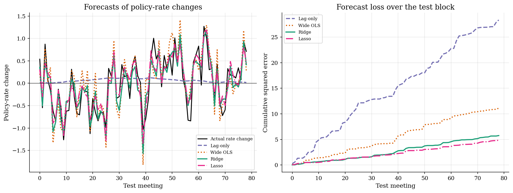
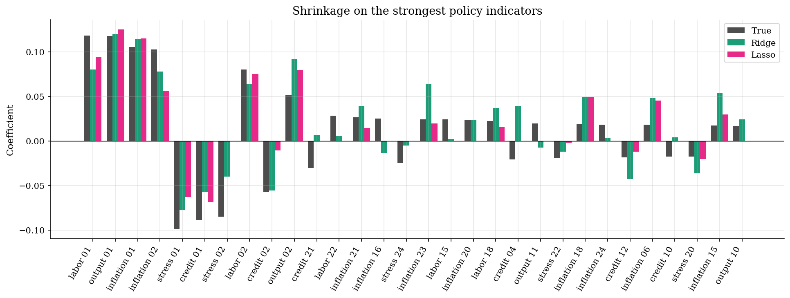
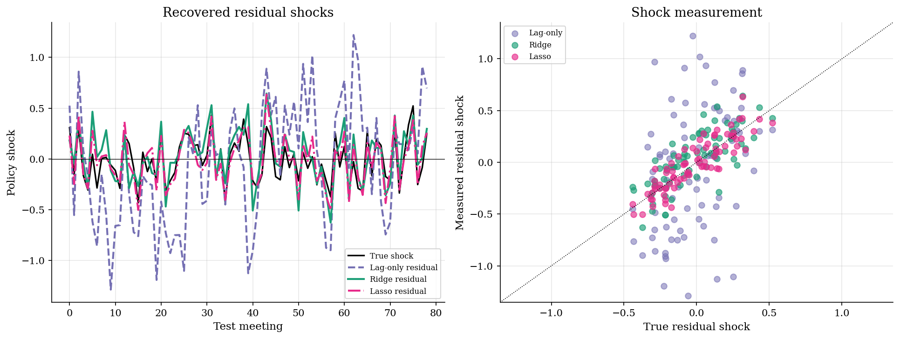
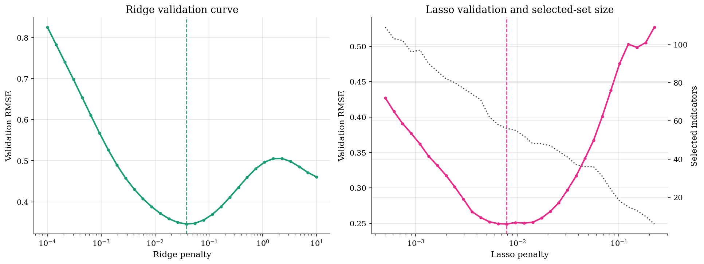

# Policy Forecasting with Ridge, Lasso, and Sparsity

> Measure monetary policy shocks after forecasting the systematic policy-rate change.

## Overview

A central bank moves the policy rate after reading a large flow of economic text. Inflation, labor, credit, output, and financial-stress language all contain signals. Each individual indicator is noisy.

The economic object is the policy shock: the part of the rate change not predicted by the information set available at the meeting. A better forecast changes the measured shock series.

The example simulates many correlated policy-concept indicators. A few signals are strong, but many weak signals also matter. That distinction is useful because a sparse selected model is not the same statement as a sparse economy.

## Equations

Let $r_t$ be the policy-rate level and let $\Delta r_t$ be the rate change at
meeting $t$. The information set contains a lagged policy rate and a vector
$x_t$ of standardized policy-concept indicators.

$$
\Delta r_t = \phi r_{t-1} + x_t'\beta + u_t.
$$

The systematic policy component is

$$
m_t = \phi r_{t-1} + x_t'\beta,
$$

and the policy shock is the residual

$$
u_t = \Delta r_t - m_t.
$$

The forecast uses a linear rule $f_t=b_0+z_t'b$, where
$z_t=(r_{t-1},x_t')'$. Ridge estimates the coefficients by

$$
\hat b_{\mathrm{ridge}}
=
\arg\min_b
\frac{1}{n}\sum_{t=1}^n (\Delta r_t-b_0-z_t'b)^2
+\lambda\sum_{j=1}^p b_j^2.
$$

Lasso replaces the quadratic penalty with an absolute-value penalty.

$$
\hat b_{\mathrm{lasso}}
=
\arg\min_b
\frac{1}{n}\sum_{t=1}^n (\Delta r_t-b_0-z_t'b)^2
+\lambda\sum_{j=1}^p |b_j|.
$$

The tuning parameter $\lambda$ is chosen on a blocked validation sample. Ridge
keeps many small correlated signals. Lasso can set coefficients exactly to
zero, so it produces a compressed selected set.

## Model Setup

| Object | Value | Role |
|---|---:|---|
| Policy meetings | 260 | Synthetic rate-setting observations |
| Policy-concept groups | 5 | Inflation, labor, credit, output, and financial stress |
| Indicators per group | 24 | Noisy text-like signals per concept |
| Total indicators | 120 | Wide predictor block used by ridge and lasso |
| Training meetings | 125 | First block used to tune penalties |
| Validation meetings | 55 | Middle block used to choose $\lambda$ |
| Test meetings | 79 | Final block used for reported forecast losses |
| True shock sd | 0.20 | Innovation in the policy rule |
| Ridge $\lambda$ | 0.0381 | Validation-selected shrinkage |
| Lasso $\lambda$ | 0.0079 | Validation-selected sparsity |

## Solution Method

The forecast exercise uses time blocks rather than random folds. The validation block comes after the training block, and the test block comes last. This keeps the tuning exercise close to a real policy-forecasting problem.

Ridge has a closed-form penalized least-squares solution after centering and scaling the regressors. Lasso uses cyclic coordinate descent. The intercept is never penalized.

```text
Procedure: policy-shock measurement with shrinkage forecasts
Inputs: rate changes Delta r_t, lagged rate r_{t-1}, indicators x_t
Output: forecasts f_t and measured shocks e_t = Delta r_t - f_t

1. Split meetings into training, validation, and test blocks.
2. Fit the lag-only benchmark on the training-plus-validation block.
3. For each ridge penalty lambda:
       fit ridge on the training block and record validation RMSE.
4. For each lasso penalty lambda:
       fit lasso on the training block and record validation RMSE.
5. Refit ridge and lasso on training-plus-validation data using selected lambdas.
6. On the test block, compare forecast RMSE and residual-shock correlation.
```

## Results

The forecast plot compares measured policy movements on the held-out meetings. Ridge lowers RMSE from 0.599 for the lag-only benchmark to 0.270. Wide OLS has more freedom but pays for estimating many noisy coefficients.



The coefficient plot sorts indicators by the true signal size. Ridge shrinks many correlated predictors toward zero without selecting a small subset. Lasso selects 56 indicators, so it compresses the rule more aggressively.



Policy shocks are residuals from the forecast rule. When the systematic component is forecast better, the residual series lines up more closely with the true shock. The ridge residual-shock correlation is 0.773.



The validation curves show the tuning tradeoff. Low penalties fit many noisy coefficients. High penalties can underfit. For lasso, the selected-set size falls as the penalty rises.



The forecast table reports test-block loss and residual-shock recovery. Relative RMSE divides each model's RMSE by the lag-only benchmark.

**Forecast and shock-measurement comparison**

| Model    | Penalty   |   Test RMSE |   Relative RMSE |   Corr. with true systematic policy |   Shock correlation |   Selected indicators |
|:---------|:----------|------------:|----------------:|------------------------------------:|--------------------:|----------------------:|
| Lag-only | not tuned |      0.5989 |          1      |                              0.031  |              0.3654 |                     0 |
| Wide OLS | 0         |      0.3748 |          0.6258 |                              0.886  |              0.5995 |                   120 |
| Ridge    | 0.0381    |      0.2699 |          0.4506 |                              0.9523 |              0.7728 |                   120 |
| Lasso    | 0.0079    |      0.2476 |          0.4134 |                              0.9781 |              0.8826 |                    56 |

The selection table separates statistical selection from economic sparsity. The true rule contains many small nonzero indicators, so missed dense signal matters even when the selected model forecasts well.

**Coefficient and selection summary**

| Statistic                                |   Value |
|:-----------------------------------------|--------:|
| True nonzero policy indicators           | 120     |
| Lasso-selected policy indicators         |  56     |
| False inclusions by lasso                |   0     |
| True indicators missed by lasso          |  64     |
| Dense-signal share missed by lasso       |   0.51  |
| Ridge coefficient correlation with truth |   0.644 |
| Lasso coefficient correlation with truth |   0.74  |

## Takeaway

Ridge is useful when many weak correlated predictors contain real information. Lasso is useful when the researcher wants selection and compression. In this run, lasso misses about 51.0% of the weak dense signal while still producing a compact forecasting rule. Sparsity is therefore a modeling restriction, not an economic conclusion by itself.
