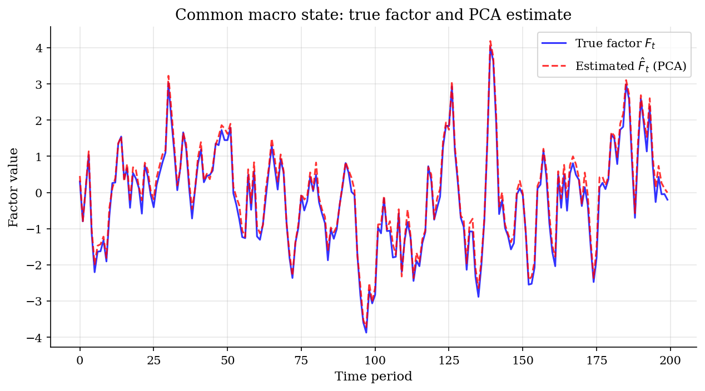
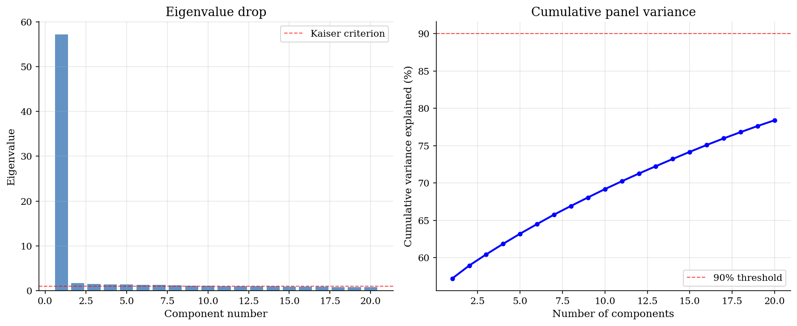
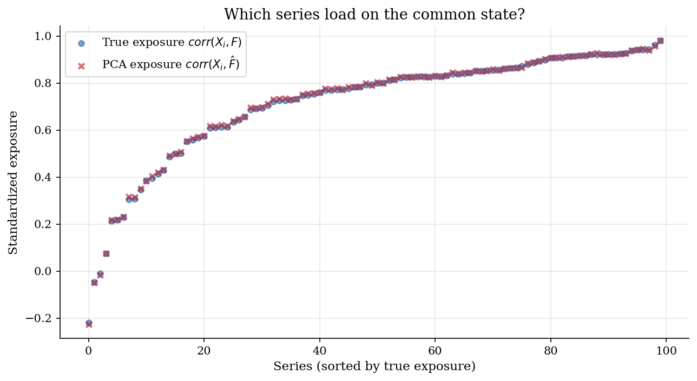
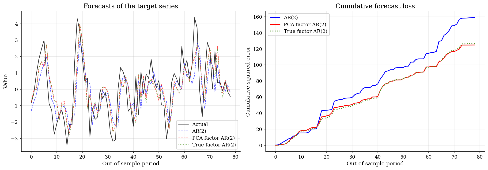

# Macro Forecasting with Stock-Watson Diffusion Indexes

> Estimating a common business-cycle factor for macro forecasting.

## Overview

A forecaster wants next month's industrial production. The data are monthly indicators such as employment and prices. Each series is noisy, but they move together over the business cycle.

The object is a common macro factor. It is the shared state behind many observed indicators.

The panel has 100 series and 200 months. A forecast regression cannot use every series directly. PCA estimates the factor, then a small AR forecast adds it to own lags.

## Equations

Let $X_t=(X_{1t},\ldots,X_{Nt})'$ collect the macro panel at date $t$. The
static factor model writes each indicator as common movement plus series noise:

$$X_{it}=\lambda_i'F_t+e_{it}, \qquad i=1,\ldots,N,\quad t=1,\ldots,T.$$

Here $F_t\in\mathbb{R}^r$ is the common macro factor. The loading
$\lambda_i\in\mathbb{R}^r$ measures exposure. The error $e_{it}$ is
series-specific noise. In this simulated panel, $r=1$ and

$$F_t=\rho_F F_{t-1}+\eta_t,\qquad \eta_t\sim N(0,1), \qquad \lambda_i\sim N(1,0.5^2), \qquad e_{it}\sim N(0,\sigma_{e,i}^2).$$

Each series is standardized before PCA:

$$Z_{it}=\frac{X_{it}-\bar X_i}{s_i}.$$

PCA uses the eigenvectors with the largest eigenvalues of $T^{-1}Z'Z$. The
estimated factor projects each date's standardized panel onto those directions:

$$\hat F_t=(Z_t'v_1,\ldots,Z_t'v_r)'.$$

Factors are identified only up to scale, sign, and rotation. The plots align
signs and compare standardized factors. The forecast regression adds the
estimated factor to own lags of a target series:

$$y_{t+h} =\alpha+\sum_{\ell=1}^{p}\beta_\ell y_{t-\ell+1} +\gamma'\hat F_t+\varepsilon_{t+h}.$$

The AR benchmark sets $\gamma=0$. A true-factor benchmark replaces $\hat F_t$
with the simulated $F_t$.

## Model Setup

| Parameter | Value | Description |
|-----------|-------|-------------|
| $N$ | 100 | Number of series (cross-section) |
| $T$ | 200 | Number of time periods |
| $r$ | 1 | True number of factors |
| $\rho_F$ | 0.8 | Factor AR(1) persistence |
| $\lambda_i$ | $\sim N(1, 0.25)$ | Factor loadings |
| $\sigma_{e,i}$ | $\sim U(0.5, 1.5)$ | Idiosyncratic std. deviations |
| AR lags ($p$) | 2 | Lags in forecasting equation |
| Horizon ($h$) | 1 | Forecast horizon |
| Initial training share | 60% | Expanding-window forecast start |
| Target series | $X_{1t}$ | Representative observed macro variable |

## Solution Method

The computation has two steps. First, PCA estimates one common state from the standardized panel. Second, expanding-window regressions compare forecasts with and without that state.

The wide panel supplies repeated signals about the same business-cycle movement. The leading component averages through series-specific noise.

```text
Algorithm: Stock-Watson diffusion-index forecast
Inputs: panel X_it, target y_t, number of factors r, AR lag order p,
        forecast horizon h, initial training share q
Outputs: estimated factors Fhat_t, AR RMSE, PCA-factor RMSE, true-factor RMSE

1. Standardize each series: Z_it = (X_it - mean_i) / sd_i.
2. Form the cross-sectional covariance matrix S = T^{-1} Z'Z.
3. Extract the r largest eigenvectors v_1,...,v_r of S.
4. Set Fhat_t = (Z_t'v_1,...,Z_t'v_r) for each date t.
5. For each expanding-window forecast origin tau:
      fit AR(p): y_{t+h} on 1, y_t,...,y_{t-p+1}
      fit factor AR(p): add Fhat_t to the same regression
      fit true-factor AR(p): replace Fhat_t with the simulated F_t
      record each h-step forecast error
6. Compare RMSEs and cumulative squared errors over the evaluation window.
```

## Results

The first plot checks whether PCA measured the simulated state. Sign and scale are arbitrary, so the series are aligned before plotting. The estimate tracks the latent AR(1) factor closely. The sample correlation is 0.9970.



The scree plot checks factor count. PC1 explains 57.2% of standardized variance. Later components look small in this controlled one-factor panel.



The exposure plot shows which indicators carry the common state. The PCA exposure ranking almost matches the true ranking. The correlation is 0.9999.



The forecast plot compares one-step predictions. AR(2) uses only the target's own lags. The Stock-Watson regression adds the estimated factor. RMSE falls from 1.753 to 1.262. The true-factor forecast has RMSE 1.273.



The eigenvalue table repeats the scree evidence. The large first eigenvalue is the simulated common factor. The remaining entries mostly reflect series-specific variation.

**Top five eigenvalues and variance explained**

| Component   |   Eigenvalue |   Var. Explained (%) |   Cumulative (%) |
|:------------|-------------:|---------------------:|-----------------:|
| PC1         |       57.198 |                57.2  |            57.2  |
| PC2         |        1.727 |                 1.73 |            58.93 |
| PC3         |        1.5   |                 1.5  |            60.43 |
| PC4         |        1.414 |                 1.41 |            61.84 |
| PC5         |        1.357 |                 1.36 |            63.2  |

The forecast table reports the same loss comparison. The estimated factor and true factor both beat AR(2). The close ordering should not be overinterpreted.

**Out-of-sample forecast comparison**

| Model             |   RMSE |   Relative RMSE |
|:------------------|-------:|----------------:|
| AR(2)             | 1.753  |          1      |
| PCA factor AR(2)  | 1.2621 |          0.72   |
| True factor AR(2) | 1.2732 |          0.7263 |

## Takeaway

Stock-Watson diffusion indexes let a forecaster use many macro indicators without estimating one coefficient per series. In this run, PCA recovers the common state almost exactly. The factor forecast lowers one-step RMSE by 28.0% relative to AR(2). The practical lesson is simple: estimate the shared state first, then forecast with a small regression.

## References

- Stock, J. and Watson, M. (2002). "Forecasting Using Principal Components from a Large Number of Predictors." *Journal of the American Statistical Association*, 97(460), 1167-1179.
